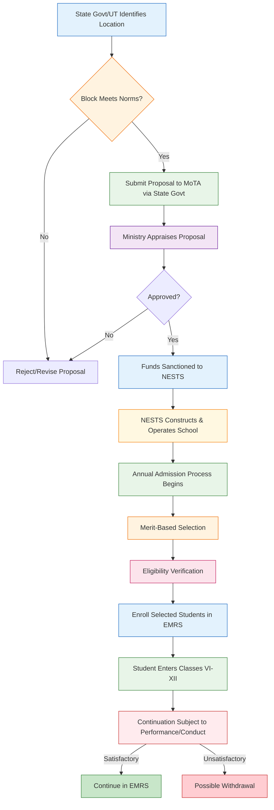

</think># Comprehensive Scheme Masterclass & File Guide

## Scheme Deep Dive

### Overview
The Eklavya Model Residential Schools (EMRS) scheme is a central sector initiative under the Ministry of Tribal Affairs, Government of India, designed to provide quality education to Scheduled Tribe (ST) students in remote tribal areas. Implemented by the National Education Society for Tribal Students (NESTS), the scheme offers fully residential schooling from Class VI to XII with 100% financial assistance from the Government of India covering all recurring and non-recurring expenses.

### Objectives
- To provide quality upper primary, secondary and senior secondary level education to ST students  
- To ensure access to education in remote tribal areas  
- To promote holistic development including academic, physical and cultural growth  
- To preserve and promote tribal art, culture, language and heritage  
- To bridge the educational gap between tribal and non-tribal populations  
- To provide free education including lodging, boarding, uniforms, and textbooks  
- To ensure student-teacher ratio conducive to effective learning  
- To prepare students for higher education and professional careers  

### Eligibility Matrix
| Criterion | Requirement | Details |
|---------|-------------|---------|
| **Beneficiary Category** | Scheduled Tribe (ST) students | Must belong to a Scheduled Tribe as per the Constitution of India |
| **Academic Level** | Classes VI to XII | Admission is for students entering or continuing in grades 6 through 12 |
| **Geographic Targeting** | Blocks with ≥50% ST population and ≥20,000 tribal persons | Schools are established only in identified tribal blocks meeting these demographic norms |
| **Priority Groups** | PVTGs, displaced families, LWE-affected | Admission prioritizes students from Particularly Vulnerable Tribal Groups (PVTGs), displaced families, and those affected by left-wing extremism |
| **Selection Basis** | Merit and seat availability | Admission is primarily merit-based, subject to availability of seats in the respective EMRS |
| **Continuation Criteria** | Satisfactory academic performance and conduct | Continued enrollment depends on maintaining academic standards and proper conduct |

> **Key Caveats**  
> - Admission is subject to availability of seats and fulfillment of eligibility criteria  
> - Continuation in the school is subject to satisfactory academic performance and conduct  
> - The scheme is subject to periodic review and modification by the Ministry of Tribal Affairs  
> - EMRS are established only in identified tribal blocks meeting population norms  

### Benefits & Financial Support
| Benefit Category | Details | Coverage |
|------------------|---------|----------|
| **Tuition & Academics** | Free education following CBSE curriculum | 100% covered by Government of India |
| **Residential Facilities** | Lodging and boarding | Fully funded; includes accommodation and meals |
| **Essential Supplies** | School uniforms, textbooks, stationery | Provided at no cost to students |
| **Health & Wellness** | Medical care | Regular health check-ups and medical attention provided |
| **Holistic Development** | Co-curricular activities, sports, life skills training, cultural exposure | Integrated into school program to promote all-round development |
| **Infrastructure** | School buildings, classrooms, labs, libraries | Funded through central government sanctions to NESTS |
| **Human Resources** | Staff salaries, teacher training | Fully covered under recurring expenses |

**Financial Mechanism**:  
The central government bears the full cost of setting up and operating EMRS. Funds are released directly to the National Education Society for Tribal Students (NESTS), which manages the schools. This covers both:
- **Non-recurring expenses**: Infrastructure development (construction, furniture, equipment)  
- **Recurring expenses**: Staff salaries, student maintenance, educational resources, operational costs  

### Application Process Flow

**Application Portal & Sources**:  
- Official Portal: [https://tribal.nic.in/emrs](https://tribal.nic.in/emrs)  
- Ministry of Tribal Affairs: [https://tribal.nic.in](https://tribal.nic.in)  
- National Education Society for Tribal Students (NESTS): [https://nests.tribal.gov.in](https://nests.tribal.gov.in)  

**Required Documents for Admission**:  
1. Proof of Scheduled Tribe status  
2. Birth certificate or age proof  
3. Previous academic records  
4. Domicile certificate  
5. Income certificate (if applicable)  
6. Passport-sized photographs  
7. Medical fitness certificate  

**Timeline Notes**:  
- Admissions are conducted annually, typically before the start of the academic session  
- Exact dates vary by state and are notified by the respective EMRS or state tribal welfare department  
- No fixed national deadline; applicants must monitor state-specific notifications  

---

## Consultant's Field Guide to Generated Files

### 1. SCHEME_MASTER_DATABASE.md
**Real-time Usage:** Keep this open in a background tab during all client calls. When a client asks "What is the turnover limit?" or "Who administers this?", CTRL+F in this document to give an immediate, authoritative answer without checking the portal.

### 2. PITCH_AND_SALES_SCRIPTS.md
**Real-time Usage:** Open this file 5 minutes before your first Discovery Call with a lead. Read the "Problem Framing" out loud to hook them, then use the Qualification Checklist to interrogate their eligibility live on the phone. Keep the Objection Handlers table visible so you can immediately counter when they say "We're too small for this."

### 3. APPLICATION_PLAYBOOK.md
**Real-time Usage:** Print this out or pin it to your desktop once the client signs the retainer. Check off each box in "Stage 1" before moving to "Stage 2". Use the "Client Communication Template" to copy-paste directly into your email when chasing them for pending documents.

### 4. CLIENT_ONBOARDING_AND_CRM.md
**Real-time Usage:** Fill this out during or immediately after the onboarding call. Use the Needs Assessment to record their exact pain points. Update the "Compliance Status" table as they email you documents to maintain a single source of truth for what's missing.

### 5. LIVE_CASE_TRACKER.md
**Real-time Usage:** Review this document every morning during your standup. Update the "Stage" column daily. If a case hits "Stage 07 - Under review", use the Escalation Path notes here to know exactly who to call at the government department today.

### 6. FEE_AND_REVENUE_MODEL.md
**Real-time Usage:** Use this file when drafting the proposal. Look at the client's turnover, map them to the pricing tier in the table, and quote that exact Retainer and Success Fee. Use the monthly projection table to update your personal sales pipeline forecast for the quarter.

### 7. CLIENT_PROPOSAL_TEMPLATE.md
**Real-time Usage:** Copy this entire file, paste it into an email or PDF generator, replace the [PLACEHOLDER] tags with the client's actual details gathered from the CRM, and send it immediately after a successful discovery call.

### 8. COMPLIANCE_AND_LEGAL_PACK.md
**Real-time Usage:** Attach sections 8A and 8B as PDFs to the proposal email. Refuse to start Step 1 of the Application Playbook until the client signs these. Use the Disclaimers to protect yourself legally if the client is rejected by the government agency.