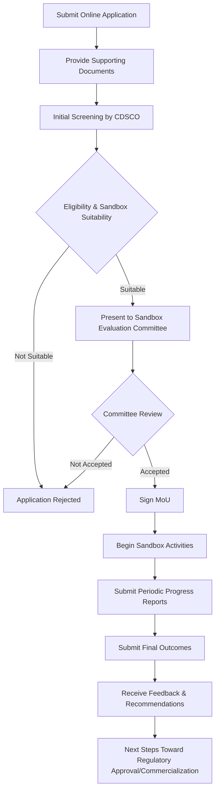

# Comprehensive Scheme Masterclass & File Guide

## Scheme Deep Dive

### Scheme Overview
The **MedTech Regulatory Sandbox (CDSCO)** is an incubation-type scheme implemented by the **Central Drugs Standard Control Organisation (CDSCO)**, under the Directorate General of Health Services, Ministry of Health & Family Welfare, Government of India. It operates on a **pan-India** geographic scope and accepts applications on a **rolling basis** throughout the year based on availability and evaluation cycles. The scheme was last updated in 2025.

### Objectives
The scheme aims to:
- Provide a regulatory sandbox environment for testing and validation of innovative medical technologies
- Reduce the time and cost associated with regulatory approvals for MedTech startups and innovators
- Foster collaboration between industry, academia, and regulatory bodies for healthcare innovation
- Ensure patient safety and product efficacy while enabling faster market access for novel medical devices
- Support the development of indigenous medical technologies aligned with national healthcare priorities
- Create a feedback mechanism for improving regulatory frameworks based on real-world sandbox outcomes

### Eligibility Matrix
| Eligibility Criteria | Details |
|----------------------|---------|
| **Applicant Type** | Indian startups, MSMEs, and innovators developing medical devices, in-vitro diagnostics, digital health solutions, or other MedTech products |
| **Legal Status** | Must be a legally registered entity in India |
| **Innovation Requirement** | Must possess a clear innovation or technological solution with potential for healthcare impact |
| **Readiness Level** | Must demonstrate readiness for prototype testing or clinical validation |
| **Preference Criteria** | Solutions addressing unmet medical needs or aligned with national health programs may receive preference |
| **Target Beneficiaries** | Startups, MSMEs, innovators, medical device manufacturers |

> **Note**: Participation does not guarantee market approval or regulatory clearance. All costs related to product development, testing, trials, and prototyping are borne by the participant. Intellectual property rights remain with the innovator.

### Benefits & Financial Support
| Benefit Category | Details |
|------------------|---------|
| **Financial Support** | **No direct financial grants or funding** are provided. Support is primarily non-financial. Any financial aspects related to product development, testing, or clinical trials must be borne by the applicant or sourced externally. |
| **Regulatory Guidance** | Participants receive regulatory guidance and hand-holding from CDSCO experts |
| **Review Pathways** | Access to accelerated review pathways |
| **Procedural Relaxation** | Waiver or relaxation of certain procedural requirements during the sandbox phase |
| **Testing Environment** | Opportunity to test products in real-world or simulated environments |
| **Clinical Trial Support** | Support for clinical trial design and approval |
| **Infrastructure Access** | Facilitation of connections with testing labs and hospitals |
| **Documentation Assistance** | Assistance in preparing documentation for final market authorization |
| **Non-Financial Benefits** | Mentorship, technical support, and networking with regulators and industry experts |

### Required Documents
Applicants must submit the following documents:
1. Covering letter indicating type of application
2. Application in Form-40 with date, signature, and seal/stamp of Indian agent or manufacturer
3. Name and address of authorized agent in India (with valid wholesale license)
4. Names and address of manufacturer and factory premises
5. Name of the drug(s) or medical device to be registered
6. Number of sites involved in manufacturing
7. Original Power of Attorney
8. TR-6 Challan of fees paid
9. Copy of import permission for new drug(s) in Form-45 or Form-45A
10. Copy of valid wholesale or manufacturing license of the Indian agent
11. Company's authorization letter for bearer
12. Schedule D(I) and Schedule D(II) with undertaking
13. Notarized copy of Plant Master File (PMF)
14. Notarized copy of Drug Master File (DMF)
15. Original notarized copy of manufacturing license, FSC, GMP, COPP (for finished products)

### Application Process Flowchart

### Key Caveats
> - Participation in the sandbox does **not guarantee** market approval or regulatory clearance  
> - Sandbox testing is limited to **predefined scope and duration** as agreed in the MoU  
> - All costs related to product development, testing, trials, and prototyping are **borne by the participant**  
> - Intellectual property rights remain with the innovator; CDSCO does **not claim ownership**  
> - Sandbox outcomes are **advisory** and do **not replace** formal regulatory submission requirements  
> - Confidentiality of submitted data is maintained, but **aggregated learnings** may be used for policy improvement  

### Contact Details
- **Email**: biological@cdsco.nic.in  
- **Toll-free no.**: 1800111454  
- **Application Portal**: https://cdsco.gov.in (Implied from scheme description and CDSCO's role as implementing agency)  

---

## Consultant's Field Guide to Generated Files

### 1. SCHEME_MASTER_DATABASE.md
**Real-time Usage:** Keep this open in a background tab during all client calls. When a client asks "What is the turnover limit?" or "Who administers this?", CTRL+F in this document to give an immediate, authoritative answer without checking the portal.

### 2. PITCH_AND_SALES_SCRIPTS.md
**Real-time Usage:** Open this file 5 minutes before your first Discovery Call with a lead. Read the "Problem Framing" out loud to hook them, then use the Qualification Checklist to interrogate their eligibility live on the phone. Keep the Objection Handlers table visible so you can immediately counter when they say "We're too small for this."

### 3. APPLICATION_PLAYBOOK.md
**Real-time Usage:** Print this out or pin it to your desktop once the client signs the retainer. Check off each box in "Stage 1" before moving to "Stage 2". Use the "Client Communication Template" to copy-paste directly into your email when chasing them for pending documents.

### 4. CLIENT_ONBOARDING_AND_CRM.md
**Real-time Usage:** Fill this out during or immediately after the onboarding call. Use the Needs Assessment to record their exact pain points. Update the "Compliance Status" table as they email you documents to maintain a single source of truth for what's missing.

### 5. LIVE_CASE_TRACKER.md
**Real-time Usage:** Review this document every morning during your standup. Update the "Stage" column daily. If a case hits "Stage 07 - Under review", use the Escalation Path notes here to know exactly who to call at the government department today.

### 6. FEE_AND_REVENUE_MODEL.md
**Real-time Usage:** Use this file when drafting the proposal. Look at the client's turnover, map them to the pricing tier in the table, and quote that exact Retainer and Success Fee. Use the monthly projection table to update your personal sales pipeline forecast for the quarter.

### 7. CLIENT_PROPOSAL_TEMPLATE.md
**Real-time Usage:** Copy this entire file, paste it into an email or PDF generator, replace the [PLACEHOLDER] tags with the client's actual details gathered from the CRM, and send it immediately after a successful discovery call.

### 8. COMPLIANCE_AND_LEGAL_PACK.md
**Real-time Usage:** Attach sections 8A and 8B as PDFs to the proposal email. Refuse to start Step 1 of the Application Playbook until the client signs these. Use the Disclaimers to protect yourself legally if the client is rejected by the government agency.