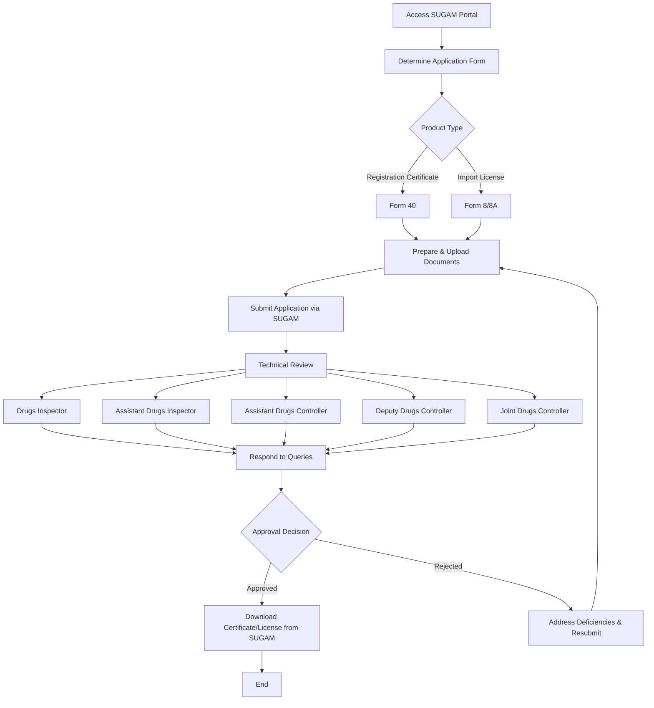

# Comprehensive Scheme Masterclass & File Guide

## Scheme Deep Dive

### Overview
The Central Drugs Standard Control Organisation (CDSCO) Fast Track scheme is a recognition-type initiative under the Ministry of Health and Family Welfare, Government of India. It operates on a pan-India geographic scope with rolling basis applications accepted year-round via the SUGAM portal (https://sugam.cdsco.in), with no fixed annual deadline. The scheme does not provide direct financial support such as grants, loans, or subsidies. Instead, it offers procedural and regulatory benefits through accelerated processing pathways.

### Objectives
- Expedite approval processes for new drugs, biologics, and medical devices  
- Ensure uniform implementation of the Drugs and Cosmetics Act, 1940 and associated rules  
- Enhance transparency, accountability, and efficiency in regulatory services  
- Facilitate faster market access for essential and innovative medical products  
- Strengthen coordination between central and state drug control organizations  
- Promote adoption of digital systems like SUGAM for seamless submission and tracking  
- Ensure safety, efficacy, and quality of medical products manufactured, imported, and distributed in India  

### Eligibility Matrix
| **Eligible Entities** | **Requirements** | **Notes** |
|------------------------|------------------|-----------|
| Manufacturers | Must comply with Drugs and Cosmetics Act, 1940 and Rules 1945; submit required documentation via SUGAM portal; adhere to GMP, GDP; provide valid wholesale/manufacturing licenses, product details, stability data, and undertakings as per CDSCO guidelines | Startups and MSMEs may avail relaxations in experience and turnover criteria under relevant government policies |
| Importers | Same as manufacturers; must hold valid import permissions and licenses | |
| Exporters | Same as manufacturers; must comply with export regulations and provide necessary documentation | |
| Authorized Agents | Must have valid authorization from manufacturer; hold appropriate licenses | |
| Startups | Eligible for relaxations in experience and turnover criteria under DPIIT recognition | Must be DPIIT-recognized |
| MSMEs | Eligible for relaxations in experience and turnover criteria; EMD exemption available under GeM GTC for tender-related services | Must be registered as MSME |

### Benefits & Financial Support
| **Benefit Category** | **Details** | **Financial Implication** |
|----------------------|-------------|----------------------------|
| Faster Processing | Reduced timelines for scrutiny and approval of registration certificates, import licenses, and market authorizations via digital SUGAM portal | No direct cost; time savings translate to earlier market entry |
| Enhanced Transparency | Online tracking and status updates on SUGAM portal | No cost; improves applicant experience |
| Export-Oriented Permissions | Facilitation of export-oriented permissions and no-objection certificates | No direct fee; supports international market access |
| Innovation Support | Accelerated pathways for biologics and medical devices; alignment with international regulatory standards | No cost; encourages R&D investment |
| Guidance Access | Access to guidance documents, public notices, and stakeholder consultation mechanisms | Free; available on CDSCO website |
| Pharmacovigilance Integration | Integration with national pharmacovigilance and quality control systems | No cost; enhances post-market safety monitoring |
| Fee-Based Services | Applicants bear costs for procedural services (e.g., application fees for registration and import licensing) | Fees processed via TR-6 challans under '0210 - Medical and Public Health'; amounts: 1500 USD per site or equivalent INR; 1000 USD per drug or equivalent INR |
| No Direct Financial Support | Scheme does not provide grants, loans, subsidies, corpus fund, or per-entity financial allocation | All financial transactions are applicant-borne |

> **Warning**: The fast track process does not compromise on safety, efficacy, or quality standards. Approval is contingent upon meeting all regulatory requirements under the Drugs and Cosmetics Act, 1940 and Rules 1945. Deficiencies may lead to rejection or requests for compliance.

### Application Process

#### Detailed Steps:
1. **Portal Access**: Visit https://sugam.cdsco.in for online submission  
2. **Form Selection**: Choose Form 40 for Registration Certificate or Form 8/8A for Import License based on product type  
3. **Document Preparation**: Upload covering letter, application form, power of attorney, TR-6 challan of fees paid, import permissions, wholesale/manufacturing licenses, authorization letters, product specifications, stability data, and labels  
4. **Submission**: Submit application through SUGAM portal  
5. **Technical Review**: Sequential review by Drugs Inspector → Assistant Drugs Inspector → Assistant Drugs Controller → Deputy Drugs Controller → Joint Drugs Controller  
6. **Query Response**: Address any queries raised during review  
7. **Final Approval**: Receive approval from Drug Controller General of India (Registration Certificate) or Joint Drugs Controller (Import License)  
8. **Certificate Retrieval**: Download approved certificate or license from SUGAM portal upon approval  

#### Required Documents:
1. Covering Letter indicating type of application  
2. Application in Form-40 (Registration Certificate) or Form 8/8A (Import License)  
3. Original Power of Attorney  
4. TR-6 Challan of fees paid (1500 USD per site or equivalent INR; 1000 USD per drug or equivalent INR)  
5. Copy of Import permission for new drug (Form-45 or Form-45A)  
6. Copy of Valid Wholesale License (20B/21C) or Manufacturing License of Indian agent  
7. Company’s authorization letter for bearer  
8. Schedule D (I) and (II) Undertaking  
9. Notarised copy of Plant Master File (PMF)  
10. Notarised copy of Drug Master File (DMF)  
11. Original Notarised Copy of Manufacturing Licence, FSC, GMP, COPP (for finished products)  
12. Attested/Appostilled copy of Product Registration Certificate (e.g., CFDA, EDQM)  
13. Original label/specimen label complying with Rule 96, indicating subject drug with pharmacopoeial specification, importer name & address, and Import License number  

#### Key Contacts:
- Email: dci@nic.in, enforcecell.div@cdsco.nic.in  
- Toll-free no.: 1800111454  

#### Key Caveats:
- Applications subject to strict scrutiny; deficiencies may lead to rejection or compliance requests  
- Approval contingent on meeting all regulatory requirements under Drugs and Cosmetics Act, 1940 and Rules 1945  
- Fast track process maintains safety, efficacy, and quality standards  
- EMD exemption available for MSMEs and DPIIT-recognized startups under GeM GTC for tender-related services  
- Guidelines for similar biologics and medical devices subject to periodic revision; applicants must refer to latest versions  
- Post-approval changes require separate submission via SUGAM portal  

#### Supporting Evidence:
- Application Portal: https://sugam.cdsco.in  
- CDSCO Homepage: https://cdsco.gov.in  
- Last Updated: 2026  
- Confidence: High  

---

## Consultant's Field Guide to Generated Files

### 1. SCHEME_MASTER_DATABASE.md
**Real-time Usage:** Keep this open in a background tab during all client calls. When a client asks "What is the turnover limit?" or "Who administers this?", CTRL+F in this document to give an immediate, authoritative answer without checking the portal.

### 2. PITCH_AND_SALES_SCRIPTS.md
**Real-time Usage:** Open this file 5 minutes before your first Discovery Call with a lead. Read the "Problem Framing" out loud to hook them, then use the Qualification Checklist to interrogate their eligibility live on the phone. Keep the Objection Handlers table visible so you can immediately counter when they say "We're too small for this."

### 3. APPLICATION_PLAYBOOK.md
**Real-time Usage:** Print this out or pin it to your desktop once the client signs the retainer. Check off each box in "Stage 1" before moving to "Stage 2". Use the "Client Communication Template" to copy-paste directly into your email when chasing them for pending documents.

### 4. CLIENT_ONBOARDING_AND_CRM.md
**Real-time Usage:** Fill this out during or immediately after the onboarding call. Use the Needs Assessment to record their exact pain points. Update the "Compliance Status" table as they email you documents to maintain a single source of truth for what's missing.

### 5. LIVE_CASE_TRACKER.md
**Real-time Usage:** Review this document every morning during your standup. Update the "Stage" column daily. If a case hits "Stage 07 - Under review", use the Escalation Path notes here to know exactly who to call at the government department today.

### 6. FEE_AND_REVENUE_MODEL.md
**Real-time Usage:** Use this file when drafting the proposal. Look at the client's turnover, map them to the pricing tier in the table, and quote that exact Retainer and Success Fee. Use the monthly projection table to update your personal sales pipeline forecast for the quarter.

### 7. CLIENT_PROPOSAL_TEMPLATE.md
**Real-time Usage:** Copy this entire file, paste it into an email or PDF generator, replace the [PLACEHOLDER] tags with the client's actual details gathered from the CRM, and send it immediately after a successful discovery call.

### 8. COMPLIANCE_AND_LEGAL_PACK.md
**Real-time Usage:** Attach sections 8A and 8B as PDFs to the proposal email. Refuse to start Step 1 of the Application Playbook until the client signs these. Use the Disclaimers to protect yourself legally if the client is rejected by the government agency.