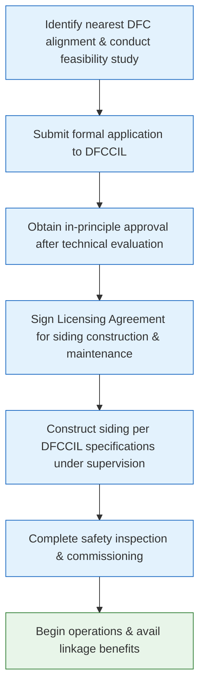

</think># Comprehensive Scheme Masterclass & File Guide

## Scheme Deep Dive

### Overview
The Dedicated Freight Corridor (DFC) Industry Linkage scheme is a government initiative administered by the Dedicated Freight Corridor Corporation of India Limited (DFCCIL) to enhance last-mile connectivity between industrial clusters and the Dedicated Freight Corridor network. The scheme aims to reduce logistics costs, improve supply chain efficiency, and promote a modal shift from road to rail for sustainable freight transport across India.

**Implementing Agency:** Dedicated Freight Corridor Corporation of India Limited (DFCCIL)  
**Application Portal:** [https://dfccil.com](https://dfccil.com)  
**Geographic Scope:** Pan-India  
**Status / Deadlines:** Rolling basis — applications accepted throughout the year subject to technical feasibility and network capacity  
**Scheme Type:** Other (Infrastructure Linkage Support)  
**Confidence Level:** Medium  

### Objectives
The scheme pursues the following strategic objectives:
- Develop last-mile connectivity from industrial clusters to Dedicated Freight Corridors
- Reduce logistics cost and transit time for freight movement
- Enhance competitiveness of Indian industries through efficient rail connectivity
- Promote shift from road to rail for sustainable freight transport
- Develop industrial nodes and logistics parks along DFC routes
- Improve supply chain efficiency for domestic and EXIM cargo

### Eligibility Matrix
| Eligibility Criterion | Details | Source |
|----------------------|--------|--------|
| **Entity Type** | Industries, manufacturing units, logistics providers, and MSMEs | Key Facts |
| **Location** | Located near or planning to locate along the Dedicated Freight Corridor network | Key Facts |
| **Registration** | Valid industrial registration required | Key Facts |
| **Technical Compliance** | Must comply with DFCCIL's technical and safety standards for siding connections | Key Facts |
| **Land Availability** | Must have land ownership or lease documents for siding alignment | Required Documents |
| **Traffic Projections** | Project report with traffic projections and commodity details required | Required Documents |

### Benefits & Financial Support
| Benefit Category | Specific Benefits | Details | Source |
|------------------|-------------------|---------|--------|
| **Financial Assistance** | Capital cost support for siding construction | DFCCIL provides financial support for construction of private sidings connecting industries to DFC network; typically covers a portion of capital cost based on traffic volume and commitment; disbursed in milestones linked to construction progress and operational readiness | Key Facts |
| **Operational Priority** | Path allocation on DFC | Priority path allocation on Dedicated Freight Corridor network | Key Facts |
| **Cost Efficiency** | Reduced freight charges | Access to reduced freight charges on DFC network | Key Facts |
| **Asset Availability** | Wagon availability | Assured wagon availability for linked industries | Key Facts |
| **Logistics Integration** | End-to-end solution | End-to-end logistics solution via DFC linkage | Key Facts |
| **Environmental Impact** | Reduced carbon footprint | Lower emissions due to shift from road to rail | Key Facts |
| **Supply Chain** | Improved reliability | Enhanced supply chain reliability and predictability | Key Facts |

> **Warning:** Financial support is subject to traffic volume commitment and periodic review. Failure to meet minimum traffic thresholds may result in review or withdrawal of financial support. All constructions must comply with Indian Railways and DFCCIL technical specifications.

### Application Process Flowchart

### Required Documents Checklist
| Document | Purpose | Notes |
|---------|--------|-------|
| Certificate of Incorporation / Registration | Proof of legal entity status | Must be valid and current |
| Land ownership or lease documents | For siding alignment agreement | Critical for establishing right-of-way |
| Project report with traffic projections | To justify linkage need | Must include commodity details and volume forecasts |
| No Objection Certificate (NOC) | From relevant authorities | Local, state, or railway authorities as applicable |
| Detailed engineering drawings | Of proposed siding | Must conform to DFCCIL specifications |
| Environmental & safety compliance documents | Statutory clearances | Includes pollution control, fire safety, etc. |
| Authorization letter | From authorized signatory | For application submission and correspondence |

### Consultants Must Communicate to Clients**
> - The application is evaluated on technical feasibility and network capacity, not just eligibility
> - Financial support is disbursed in construction milestones, not as a lump sum
> - Ongoing compliance with DFCCIL safety and operational standards is mandatory post-commissioning
> - Traffic volume commitments are binding and subject to periodic audit
> - The Licensing Agreement includes maintenance obligations for the siding infrastructure
> - Portal: [https://dfccil.com](https://dfccil.com) is the authoritative source for updates and submission

---

## Consultant's Field Guide to Generated Files

### 1. SCHEME_MASTER_DATABASE.md
**Real-time Usage:** Keep this open in a background tab during all client calls. When a client asks "What is the turnover limit?" or "Who administers this?", CTRL+F in this document to give an immediate, authoritative answer without checking the portal.

### 2. PITCH_AND_SALES_SCRIPTS.md
**Real-time Usage:** Open this file 5 minutes before your first Discovery Call with a lead. Read the "Problem Framing" out loud to hook them, then use the Qualification Checklist to interrogate their eligibility live on the phone. Keep the Objection Handlers table visible so you can immediately counter when they say "We're too small for this."

### 3. APPLICATION_PLAYBOOK.md
**Real-time Usage:** Print this out or pin it to your desktop once the client signs the retainer. Check off each box in "Stage 1" before moving to "Stage 2". Use the "Client Communication Template" to copy-paste directly into your email when chasing them for pending documents.

### 4. CLIENT_ONBOARDING_AND_CRM.md
**Real-time Usage:** Fill this out during or immediately after the onboarding call. Use the Needs Assessment to record their exact pain points. Update the "Compliance Status" table as they email you documents to maintain a single source of truth for what's missing.

### 5. LIVE_CASE_TRACKER.md
**Real-time Usage:** Review this document every morning during your standup. Update the "Stage" column daily. If a case hits "Stage 07 - Under review", use the Escalation Path notes here to know exactly who to call at the government department today.

### 6. FEE_AND_REVENUE_MODEL.md
**Real-time Usage:** Use this file when drafting the proposal. Look at the client's turnover, map them to the pricing tier in the table, and quote that exact Retainer and Success Fee. Use the monthly projection table to update your personal sales pipeline forecast for the quarter.

### 7. CLIENT_PROPOSAL_TEMPLATE.md
**Real-time Usage:** Copy this entire file, paste it into an email or PDF generator, replace the [PLACEHOLDER] tags with the client's actual details gathered from the CRM, and send it immediately after a successful discovery call.

### 8. COMPLIANCE_AND_LEGAL_PACK.md
**Real-time Usage:** Attach sections 8A and 8B as PDFs to the proposal email. Refuse to start Step 1 of the Application Playbook until the client signs these. Use the Disclaimers to protect yourself legally if the client is rejected by the government agency.