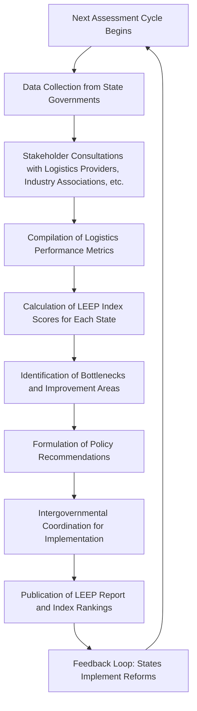

</think># Comprehensive Scheme Masterclass & File Guide

## Scheme Deep Dive

### Overview
LEEP – Logistics Ease Across Different States is a policy and coordination framework implemented by the Department for Promotion of Industry and Internal Trade (DPIIT), Ministry of Commerce and Industry, Government of India. It operates on a pan-India geographic scope and functions as a performance assessment and policy coordination tool rather than a beneficiary-oriented financial scheme. The scheme does not provide direct financial support to entities but focuses on systemic improvements in logistics efficiency through governance, infrastructure planning, and regulatory harmonization.

### Objectives
The primary objectives of LEEP are:
- Reduce logistics costs and improve efficiency across states
- Identify and address bottlenecks in the logistics value chain
- Enhance coordination between central and state agencies
- Promote digitalization and seamless movement of goods
- Strengthen infrastructure planning and multimodal integration
- Benchmark state-level logistics performance through the LEEP index

### Eligibility Matrix
LEEP does not have traditional beneficiary eligibility criteria as it is not a direct subsidy or grant scheme. Instead, it involves participation from various stakeholders engaged in logistics and supply chain operations across India.stakeholder Group and supply chain operations. The following table outlines the eligible participant categories based on the evidence:

| **Eligible Participant Category** | **Description** | **Role in Scheme** |
|-----------------------------------|-----------------|--------------------|
| State Governments                 | All state governments across India | Primary data providers and implementation partners; responsible for state-level logistics performance and cooperation |
| Logistics Service Providers       | Entities engaged in transportation, warehousing, freight forwarding, and related logistics services | Key stakeholders consulted during assessments; provide ground-level insights on bottlenecks and efficiency |
| Industry Associations             | National and sector-specific associations representing manufacturing, retail, e-commerce, and trade bodies | Participate in stakeholder consultations; represent industry interests and challenges |
| Other Stakeholders                | Includes port authorities, customs officials, highway agencies, rail operators, and logistics parks | Contribute to data collection and systemic improvement initiatives |

> **Important Note**: Individual MSMEs, private companies, or logistics providers do not apply for or receive direct benefits under LEEP. Their engagement is indirect through representation by industry associations or participation in state-level consultations.

### Target Beneficiaries
While LEEP does not deliver direct financial benefits, its outcomes are intended to benefit the following groups through improved systemic logistics performance:
- **MSMEs**: Experience reduced transit times and lower logistics costs due to streamlined inter-state movement
- **Logistics Providers**: Gain from enhanced infrastructure utilization, better route planning, and reduced procedural delays
- **State Governments**: Use LEEP index rankings to identify performance gaps and prioritize infrastructure investments
- **Industry Stakeholders**: Benefit from increased competitiveness in inter-state and international trade due to efficient supply chains

### Financial Support
LEEP does not provide direct financial support, subsidies, grants, or monetary assistance to any entity. It is exclusively a policy and coordination framework. All activities under LEEP—such as data collection, index formulation, stakeholder consultations, and performance assessments—are funded and administered by the implementing agency (DPIIT) as part of its ongoing logistics performance monitoring mandate.

> **Critical Caveat**: Consultants must not advise clients to expect direct financial payouts, subsidies, or reimbursements under LEEP. Any perceived benefit is indirect and systemic, resulting from improved logistics efficiency at the state or national level.

### Benefits
Although no direct financial support is provided, participation in or alignment with LEEP objectives yields the following systemic and indirect benefits:
- **Improved logistics efficiency**: Reduced transit times and lower operational costs due to harmonized regulations and better infrastructure
- **Reduced transit times and costs**: Streamlined movement of goods across state borders through minimized checkpoints and procedural delays
- **Enhanced supply chain reliability**: Greater predictability in delivery schedules due to improved coordination and digital tracking
- **Better infrastructure utilization**: Optimal use of existing logistics assets (e.g., highways, ports, warehouses) through integrated planning
- **Data-driven policy insights**: States and central agencies use LEEP index data to formulate evidence-based logistics policies
- **Increased competitiveness**: Businesses engaged in inter-state and international trade gain advantage from faster, more reliable supply chains

### Application Process
LEEP does not feature a traditional application process for beneficiaries. There is no portal for entities to apply, no forms to submit, and no eligibility screening for direct benefits. Instead, the scheme operates through ongoing intergovernmental coordination, periodic data collection from states, stakeholder consultations, and the periodic assessment of logistics performance via the LEEP index.

The following Mermaid flowchart illustrates the operational process of LEEP:

**Key Characteristics of the Process**:
- **Rolling Basis**: Assessments and updates are conducted periodically as part of ongoing logistics performance monitoring (no fixed annual deadline)
- **Data Sources**: Primary data collected from state governments on logistics infrastructure, procedures, and performance indicators
- **Stakeholder Input**: Regular consultations with logistics service providers, industry bodies, and other supply chain actors
- **Output**: LEEP Index—a comparative benchmarking tool that ranks states based on logistics efficiency
- **Implementation**: Outcomes depend on state-level adoption of recommended reforms; central agency facilitates coordination but does not enforce compliance

> **Warning**: Since LEEP has no application portal, beneficiary-oriented documentation, or financial disbursement mechanism, consultants should not direct clients to apply for funding under this scheme. Any engagement should focus on advising clients how to benefit indirectly from systemic improvements or how to participate in stakeholder consultations as industry representatives.

### Key Sources
- Implementing Agency: Department for Promotion of Industry and Internal Trade (DPIIT), Ministry of Commerce and Industry  
- Scheme Status: Rolling basis — assessments and updates conducted periodically  
- Geographic Scope: Pan-India  
- Financial Support: None (policy/framework only)  
- Benefit Mechanism: Indirect via improved logistics efficiency  
- Official Reference: LEEP Index reports and DPIIT logistics division publications  

---

## Consultant's Field Guide to Generated Files

### 1. SCHEME_MASTER_DATABASE.md
**Real-time Usage:** Keep this open in a background tab during all client calls. When a client asks "What is the turnover limit?" or "Who administers this?", CTRL+F in this document to give an immediate, authoritative answer without checking the portal.

### 2. PITCH_AND_SALES_SCRIPTS.md
**Real-time Usage:** Open this file 5 minutes before your first Discovery Call with a lead. Read the "Problem Framing" out loud to hook them, then use the Qualification Checklist to interrogate their eligibility live on the phone. Keep the Objection Handlers table visible so you can immediately counter when they say "We're too small for this."

### 3. APPLICATION_PLAYBOOK.md
**Real-time Usage:** Print this out or pin it to your desktop once the client signs the retainer. Check off each box in "Stage 1" before moving to "Stage 2". Use the "Client Communication Template" to copy-paste directly into your email when chasing them for pending documents.

### 4. CLIENT_ONBOARDING_AND_CRM.md
**Real-time Usage:** Fill this out during or immediately after the onboarding call. Use the Needs Assessment to record their exact pain points. Update the "Compliance Status" table as they email you documents to maintain a single source of truth for what's missing.

### 5. LIVE_CASE_TRACKER.md
**Real-time Usage:** Review this document every morning during your standup. Update the "Stage" column daily. If a case hits "Stage 07 - Under review", use the Escalation Path notes here to know exactly who to call at the government department today.

### 6. FEE_AND_REVENUE_MODEL.md
**Real-time Usage:** Use this file when drafting the proposal. Look at the client's turnover, map them to the pricing tier in the table, and quote that exact Retainer and Success Fee. Use the monthly projection table to update your personal sales pipeline forecast for the quarter.

### 7. CLIENT_PROPOSAL_TEMPLATE.md
**Real-time Usage:** Copy this entire file, paste it into an email or PDF generator, replace the [PLACEHOLDER] tags with the client's actual details gathered from the CRM, and send it immediately after a successful discovery call.

### 8. COMPLIANCE_AND_LEGAL_PACK.md
**Real-time Usage:** Attach sections 8A and 8B as PDFs to the proposal email. Refuse to start Step 1 of the Application Playbook until the client signs these. Use the Disclaimers to protect yourself legally if the client is rejected by the government agency.