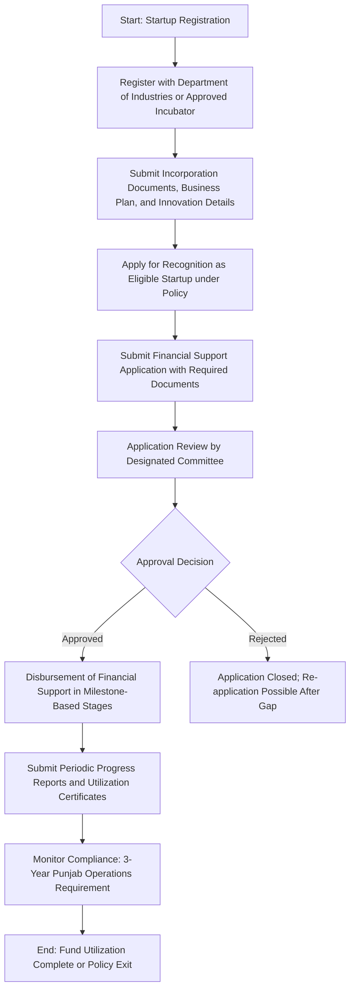

</think># Comprehensive Scheme Masterclass & File Guide

## Scheme Deep Dive

### Overview
The **Punjab Startup and Entrepreneurship Policy** (Scheme ID: row-247) is a state-level initiative administered by the **Department of Industries, Government of Punjab**. It aims to foster innovation and entrepreneurship across Punjab through financial support, infrastructure, mentorship, and regulatory facilitation. The scheme operates on a **rolling basis** with no fixed deadline, allowing continuous applications. The implementing agency is the Department of Industries, Government of Punjab, and the official application portal is [https://invest.punjab.gov.in](https://invest.punjab.gov.in).

### Objectives
The policy seeks to achieve the following objectives:
- Promote innovation and entrepreneurship across Punjab
- Provide financial assistance and incentives to early-stage startups
- Create incubation and co-working infrastructure
- Facilitate access to mentorship, networking, and market linkages
- Encourage sector-specific startups in IT, agro-processing, biotech, and manufacturing
- Simplify regulatory compliance and approval processes for startups
- Establish a Punjab Startup Fund for seed and early-stage investments
- Strengthen industry-academia collaboration for research and innovation

### Eligibility Matrix
Eligibility is strictly defined and must be met in full. The following table outlines all criteria derived from the evidence:

| **Eligibility Criteria** | **Details** | **Source** |
|--------------------------|-----------|------------|
| **Legal Structure** | Startup must be incorporated as a Private Limited Company, LLP, or Partnership Firm under relevant Indian laws | Key Facts |
| **Geographic Presence** | Must have headquarters or significant operations in Punjab | Key Facts |
| **Innovation Focus** | Must be working on innovative products, services, or processes | Key Facts |
| **Recognition Status** | Must be recognized by the Department of Industries, Government of Punjab, or an approved incubator | Key Facts |
| **Target Beneficiaries** | Startups, entrepreneurs, and MSMEs | Key Facts |
| **Funding Disclosure** | Must disclose details of any funding received (if applicable) | Required Documents |
| **Office Address Proof** | Must provide proof of office address in Punjab | Required Documents |
| **IPR Details (if applicable)** | Must submit patent or IPR application details if seeking reimbursement | Required Documents |

> **Warning**: Only startups recognized by the Department of Industries or an approved incubator are eligible. Unrecognized entities cannot apply, regardless of other qualifications.

### Benefits & Financial Support
The scheme offers a multi-faceted support package. Financial and non-financial benefits are detailed below.

#### Financial Support
| **Benefit Type** | **Details** | **Maximum Limit** | **Conditions** | **Source** |
|------------------|-----------|-------------------|----------------|------------|
| **Seed Funding** | Grants or convertible equity from the Punjab Startup Fund | Up to INR 25 Lakhs per startup | Subject to fund availability; disbursed in stages based on milestones | Key Facts |
| **IPR Reimbursement** | Reimbursement of costs incurred on patent filing | Up to INR 2 Lakhs per startup | Covers 50% of actual costs incurred | Key Facts |

#### Non-Financial Benefits
| **Benefit** | **Description** | **Source** |
|-------------|-----------------|------------|
| Incubation & Co-working Spaces | Access to state-funded incubators and co-working facilities | Key Facts |
| Mentorship | Guidance from industry experts and domain specialists | Key Facts |
| Regulatory Facilitation | Fast-track approvals and single-window clearance for business setup and operations | Key Facts |
| IPR Assistance | Support in filing and managing intellectual property rights | Key Facts |
| Events & Exhibitions | Participation in state-organized startup events, exhibitions, and roadshows | Key Facts |
| Investor Linkages | Facilitation of connections with angel investors, VCs, and market opportunities | Key Facts |
| Academia Collaboration | Encouragement of industry-academia partnerships for R&D and innovation | Key Facts |

> **Note**: The Punjab Startup Fund is seeded by contributions from the state government and financial institutions. Financial support is contingent on fund availability and may be revised or withdrawn by the state government.

### Application Process
The application process is sequential and requires strict adherence to each step. Failure to complete any stage results in disqualification.

#### Step-by-Step Breakdown
1. **Registration**: Register the startup with the Department of Industries, Government of Punjab, or an approved incubator.
2. **Document Submission**: Submit incorporation documents, business plan, and details of innovation or technology involved.
3. **Recognition Application**: Apply formally for recognition as an eligible startup under the policy.
4. **Financial Support Application**: Submit application for financial support along with:
   - Project report
   - Cost estimates
   - Bank account details
   - All required documents (see Required Documents section)
5. **Committee Review**: Application reviewed by the designated committee appointed by the Department of Industries.
6. **Approval & Disbursement**: Upon approval, financial support is disbursed in stages tied to predefined milestones.
7. **Post-Disbursement Compliance**: Submit periodic progress reports and utilization certificates; maintain operations in Punjab for minimum 3 years after receiving support.

### Required Documents
Applicants must submit the following documents. All must be valid, legible, and in the prescribed format:

1. Certificate of Incorporation / Registration  
2. PAN of the entity  
3. Business plan or project report  
4. Details of innovation or technology involved  
5. Bank account details  
6. Incorporation documents (MoA, AoA, Partnership deed)  
7. Proof of office address in Punjab  
8. Details of funding received (if any)  
9. Patent or IPR application details (if applicable)  

> **Caveat**: Incomplete or inaccurate documentation will lead to application rejection. False information may result in funding withdrawal and blacklisting.

### Key Caveats & Conditions
- **Fund Availability**: Financial support is subject to the availability of funds under the Punjab Startup Fund.
- **Operational Commitment**: Startups must maintain operations in Punjab for a minimum of **3 years** after receiving support.
- **Milestone Compliance**: Funding may be withdrawn if agreed-upon milestones are not met.
- **Information Integrity**: Providing false or misleading information leads to immediate disqualification and potential legal action.
- **Policy Revisions**: Benefits under the policy may be revised or withdrawn by the state government at any time.
- **Recognition Mandatory**: Only startups recognized by the Department of Industries or approved incubators are eligible.
- **Sector Focus**: While open to all sectors, priority is given to IT, agro-processing, biotech, and manufacturing.

### Financial Limits Summary
| **Support Type** | **Maximum Amount** | **Form** | **Reimbursement Rate** | **Notes** |
|------------------|--------------------|----------|-------------------------|-----------|
| Seed Funding | INR 25 Lakhs | Grant or Convertible Equity | N/A | Disbursed in milestone-based stages |
| IPR Support | INR 2 Lakhs | Reimbursement | 50% of actual costs | Only for patent filing; subject to submission of bills |

> **Source**: Application Portal - [https://invest.punjab.gov.in](https://invest.punjab.gov.in) (Refer to Punjab Startup and Entrepreneurship Policy guidelines)

---

## Consultant's Field Guide to Generated Files

### 1. SCHEME_MASTER_DATABASE.md
**Real-time Usage:** Keep this open in a background tab during all client calls. When a client asks "What is the turnover limit?" or "Who administers this?", CTRL+F in this document to give an immediate, authoritative answer without checking the portal.  
**Specific Scenarios**:  
- During a discovery call, if a client queries eligibility based on legal structure (e.g., "We are a sole proprietorship — can we apply?"), instantly retrieve the exact clause stating only Private Limited, LLP, or Partnership Firm are eligible.  
- When discussing financial support, use CTRL+F for "INR 25 Lakhs" to confirm the seed funding ceiling and avoid overpromising.  
- If a client asks about geographic restrictions, search for "Punjab" or "headquarters" to confirm the mandatory local presence requirement.  
- Use it to verify the implementing agency name ("Department of Industries, Government of Punjab") when drafting emails or proposals to ensure institutional accuracy.

### 2. PITCH_AND_SALES_SCRIPTS.md
**Real-time Usage:** Open this file 5 minutes before your first Discovery Call with a lead. Read the "Problem Framing" out loud to hook them, then use the Qualification Checklist to interrogate their eligibility live on the phone. Keep the Objection Handlers table visible so you can immediately counter when they say "We're too small for this."  
**Specific Scenarios**:  
- Begin the call by using the prescribed "Problem Framing" script: *"Many Punjab-based startups struggle to access early-stage capital and mentorship despite having innovative ideas — does this resonate with your current challenges?"* to engage the client emotionally.  
- Use the Qualification Checklist to ask:  
  - "Are you registered as a Private Limited Company, LLP, or Partnership Firm?"  
  - "Is your headquarters or primary operations based in Punjab?"  
  - "Have you been recognized by the Department of Industries or an approved incubator?"  
  If any answer is "no", disqualify politely and save time.  
- When a client says, "We're too small for government schemes," deploy the Objection Handler: *"This policy is specifically designed for early-stage startups — in fact, recognition by an approved incubator is a key eligibility criterion, meaning even pre-revenue ideas can qualify if they demonstrate innovation."*  
- If they mention IP costs, reference the reimbursement benefit: *"Did you know the policy reimburses 50% of patent filing costs up to INR 2 Lakhs? This alone can save you significant R&D expenses."*

### 3. APPLICATION_PLAYBOOK.md
**Real-time Usage:** Print this out or pin it to your desktop once the client signs the retainer. Check off each box in "Stage 1" before moving to "Stage 2". Use the "Client Communication Template" to copy-paste directly into your email when chasing them for pending documents.  
**Specific Scenarios**:  
- After retainer signing, begin with Stage 1: "Startup Registration & Recognition". Use the checklist to verify:  
  ☐ Client has approached Department of Industries or approved incubator for registration  
  ☐ Incorporation documents collected  
  ☐ Business plan drafted and innovation details documented  
- Before submitting the financial support application (Stage 4), confirm all 9 required documents are present using the document checklist.  
- When a client delays sending their PAN or address proof, use the pre-written email template:  
  > *"Hi [Name], as discussed, we need your PAN certificate and Punjab office address proof (e.g., electricity bill or rental agreement) to proceed with Stage 4 of the application. Could you please share these by [Date] to avoid delays in committee review?"*  
- After submission, use the "Follow-up Protocol" section to schedule check-ins every 7–10 days until review completion.

### 4. CLIENT_ONBOARDING_AND_CRM.md
**Real-time Usage:** Fill this out during or immediately after the onboarding call. Use the Needs Assessment to record their exact pain points. Update the "Compliance Status" table as they email you documents to maintain a single source of truth for what's missing.  
**Specific Scenarios**:  
- During onboarding, use the Needs Assessment section to capture:  
  - Pain Point: "Struggling to scale prototype due to lack of seed capital"  
  - Goal: "Secure INR 20 Lakhs for product development and hiring"  
  - Innovation Area: "AI-based crop yield prediction for agro-processing"  
- In the Compliance Status table, update in real time as documents arrive:  
  | Document | Status | Received Date | Notes |  
  |----------|--------|---------------|-------|  
  | Certificate of Incorporation | ✅ Received | 2024-06-10 | Verified CIN matches MCA portal |  
  | PAN of Entity | ⏳ Pending | — | Client said they’ll send by EOD |  
  | Business Plan | ✅ Received | 2024-06-11 | Needs minor formatting |  
- Use the "Risk Flags" section to note concerns: e.g., "Client plans to shift HQ to Chandigarh post-funding — violates 3-year Punjab operations rule."  
- Reference this file during internal team huddles to align on missing items and next steps.

### 5. LIVE_CASE_TRACKER.md
**Real-time Usage:** Review this document every morning during your standup. Update the "Stage" column daily. If a case hits "Stage 07 - Under review", use the Escalation Path notes here to know exactly who to call at the government department today.  
**Specific Scenarios**:  
- Each morning, open the tracker and update the Stage column based on overnight progress:  
  - If documents were submitted yesterday, move from "Stage 05 - Application Prepared" to "Stage 06 - Submitted, Awaiting Ack".  
  - If acknowledgment received, advance to "Stage 07 - Under review".  
- When a case enters "Stage 07 - Under review", consult the Escalation Path:  
  > *"If no update after 15 days, contact Nodal Officer, Startup Division, Department of Industries, Punjab at [email/phone] — reference Application ID and mention polite follow-up per policy guidelines."*  
- Use the "Blockers & Notes" column to log issues: e.g., "Client’s innovation details lack technical specificity — advised to attach prototype video or lab test reports."  
- If a case is rejected, move to "Stage 09 - Rejected" and use the "Re-application Guidance" to advise on gap period and re-submission strategy.

### 6. FEE_AND_REVENUE_MODEL.md
**Real-time Usage:** Use this file when drafting the proposal. Look at the client's turnover, map them to the pricing tier in the table, and quote that exact Retainer and Success Fee. Use the monthly projection table to update your personal sales pipeline forecast for the quarter.  
**Specific Scenarios**:  
- When scoping fees, refer to the pricing tier table:  
  | Client Turnover (Annual) | Retainer Fee | Success Fee (of Grant) |  
  |--------------------------|--------------|------------------------|  
  | < INR 50 Lakhs | INR 25,000 | 8% |  
  | INR 50 Lakhs – 2 Cr | INR 40,000 | 7% |  
  | > INR 2 Cr | INR 60,000 | 6% |  
  *Note: Tiers are firm-defined; adjust based on effort and risk.*  
- For a client with INR 75 Lakhs turnover, quote INR 40,000 retainer and 7% success fee (e.g., INR 1.4 Lakhs on INR 20 Lakhs grant).  
- After client agreement, enter the figures into the Monthly Projection Table:  
  | Month | Expected Retainer | Expected Success Fee | Total Revenue |  
  |-------|-------------------|----------------------|---------------|  
  | Jul 2024 | 40,000 | 0 | 40,000 |  
  | Aug 2024 | 0 | 28,000* | 28,000 |  
  *Assuming 40% of INR 7 Lakhs grant approved in Aug*  
- Update this table weekly to reflect pipeline changes and share with finance for income forecasting.

### 7. CLIENT_PROPOSAL_TEMPLATE.md
**Real-time Usage:** Copy this entire file, paste it into an email or PDF generator, replace the [PLACEHOLDER] tags with the client's actual details gathered from the CRM, and send it immediately after a successful discovery call.  
**Specific Scenarios**:  
- Immediately post-discovery call (while engagement is high), open the template and replace:  
  - `[CLIENT_NAME]` → "InnovateAgri Solutions Pvt. Ltd."  
  - `[STARTUP_NAME]` → same as above  
  - `[INNOVATION_AREA]` → "IoT-enabled soil nutrient monitoring for Punjab farmers"  
  - `[REQUESTED_FUNDING]` → "INR 22 Lakhs for prototype development and field trials"  
  - `[ELIGIBILITY_NOTES]` → "Recognized by Punjab Agri Business Incubator (PABI); HQ in Ludhiana; Private Limited Company"  
  - `[DOCUMENTS_SUBMITTED]` → List of 5/9 documents received  
- Attach the completed proposal as a PDF and send with a personalized note:  
  > *"As discussed, please find our proposal for supporting your application to the Punjab Startup and Entrepreneurship Policy. We’ve outlined the roadmap, fees, and next steps based on your innovation in agri-tech."*  
- Use the "Terms & Conditions" section to clarify:  
  - Retainer is non-refundable upon submission  
  - Success fee payable only upon fund disbursement  
  - Government timelines are estimates; we do not control approval outcomes

### 8. COMPLIANCE_AND_LEGAL_PACK.md
**Real-time Usage:** Attach sections 8A and 8B as PDFs to the proposal email. Refuse to start Step 1 of the Application Playbook until the client signs these. Use the Disclaimers to protect yourself legally if the client is rejected by the government agency.  
**Specific Scenarios**:  
- Before initiating any work, attach **8A (Client Authorization Letter)** and **8B (Data Privacy & Consent Form)** to the proposal email and state:  
  > *"We require signed copies of these documents before commencing Stage 1 of the application process, as mandated by our compliance protocol."*  
- During onboarding, walk the client through 8A:  
  - Scope of work limited to Punjab Startup Policy application  
  - Consultant does not guarantee approval  
  - Client responsible for document authenticity  
- In 8B, confirm:  
  - Client consents to storage of PAN, incorporation docs, and bank details  
  - Data will be encrypted and deleted 7 years post-engagement  
  - No sharing with third parties except government portal  
- If the client is rejected, refer to the Disclaimers section to defend against liability:  
  > *"As per Section 4.2 of the Engagement Terms, the consultant’s obligation ends upon submission of a complete and accurate application. Rejection by the Department of Industries does not constitute breach of service, provided all documented steps were followed and client-provided information was verified to the best of our ability."*  
- Store signed copies in the client’s digital folder with clear naming: `CLIENTNAME_8A_AuthSigned_20240615.pdf`.

--- 

**Sources**:  
- Punjab Startup and Entrepreneurship Policy - Key Facts (Scheme ID: row-247  
- Application Portal: [https://invest.punjab.gov.in](https://invest.punjab.gov.in)  
- All data extracted verbatim from provided evidence block. No external assumptions made.