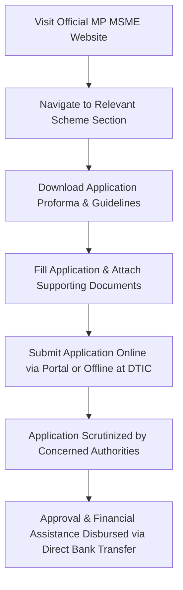

# Comprehensive Scheme Masterclass & File Guide

## Scheme Deep Dive

### Overview
The **MP MSME Development Policy** (Scheme ID: row-250) is a state-level subsidy scheme implemented by the **Department of Micro, Small & Medium Enterprises, Government of Madhya Pradesh**. It operates on a **rolling basis** with applications accepted throughout the year as per scheme notifications. The policy aims to strengthen MSMEs, promote socio-economic growth, encourage rural entrepreneurship, provide access to credit and technology, develop industrial clusters, and support youth through self-employment schemes. The scheme is accessible via the official portal: **https://mpmsme.gov.in**.

### Objectives
- Strengthen MSMEs to make them competent and foster their development  
- Promote socio-economic growth and employment opportunities in Madhya Pradesh  
- Encourage rural entrepreneurship and empower rural people, especially women  
- Provide access to credit, technology, and local and global markets for MSMEs  
- Develop industrial clusters to provide common minimum facilities to MSMEs  
- Support youth in establishing enterprises at their hometowns/villages through self-employment schemes  

### Eligibility Matrix
| Criteria | Details |
|---------|---------|
| **Beneficiary Type** | Micro, Small, and Medium Enterprises (MSMEs) as defined under the MSMED Act, 2006, operating in Madhya Pradesh |
| **Enterprise Type** | New and existing MSMEs engaged in manufacturing, services, and agro-based activities |
| **Geographic Scope** | Madhya Pradesh only |
| **Additional Criteria (Scheme-Specific)** | Investment limits, employment generation, location-based preferences for rural or backward areas (varies by specific sub-scheme) |
| **Target Beneficiaries** | MSMEs, startups, women entrepreneurs, rural entrepreneurs |
| **Udyam Registration** | Mandatory; benefits contingent upon compliance with Udyam Registration and MSMED Act, 2006 |

> **Note**: Specific schemes under the policy (e.g., MP MSME Promotion Scheme 2025, MP MSME Incentive Scheme 2025) may have additional eligibility criteria such as investment limits, employment generation, and location-based preferences.

### Benefits & Financial Support
Financial assistance is provided through schemes like the **MP MSME Promotion Scheme 2025** and **MP MSME Incentive Scheme 2025**, which include:

| Benefit Category | Details |
|------------------|---------|
| **Land Allotment** | Subsidy for industrial land allotment in notified industrial areas |
| **Interest Subvention** | Support for reducing interest burden on loans |
| **Capital Investment Support** | Financial assistance for capital investment in plant and machinery |
| **Quality Certification & Patent Filing** | Reimbursement for expenses related to ISO, BIS, BEE, ISI, FPO, AGMARK, ZED certification, and patent filing |
| **Infrastructure & Testing Facilities** | Access to infrastructure, testing laboratories, and common facility centers |
| **Self-Employment Schemes** | Support under schemes like Mukhyamantri Udyam Kranti Yojana, Mukhyamantri Yuva Udyami Yojana, etc. |
| **Technology Upgradation** | Assistance for adopting new technology and modernization |
| **Marketing Assistance** | Support for participation in national/international events, branding, and market access |
| **Credit Linkage** | Facilitation of bank loans and credit access |
| **Cluster Development** | Support for developing industrial clusters with common minimum facilities |
| **Export Promotion** | Incentives for export-oriented units and participation in global trade fairs |
| **Special Incentives** | Additional benefits for women entrepreneurs, SC/ST beneficiaries, and units in backward/rural areas |

> **Disbursement Mechanism**: Assistance is disbursed through a **single-click mechanism** via the department’s online portal, with funds transferred directly to eligible beneficiaries’ bank accounts after verification.  
> **Source**: [MP MSME Portal](https://mpmsme.gov.in)

### Required Documents
1. Udyam Registration Certificate  
2. PAN of the entity  
3. Aadhaar of the authorized signatory  
4. Bank account details (cancelled cheque or passbook)  
5. Project report or business plan  
6. Quotations for machinery/equipment  
7. Land allotment order or lease agreement (if applicable)  
8. Caste certificate (for SC/ST beneficiaries)  
9. Gender certificate (for women entrepreneurs)  
10. Affidavit as per prescribed format  

> **Source**: Key Facts Block

### Application Process
The application process is outlined as follows:

**Steps in Detail**:
1. Visit the official MP MSME website: **https://mpmsme.gov.in**  
2. Navigate to the relevant scheme section (e.g., MP MSME Promotion Scheme 2025 or Incentive Scheme)  
3. Download the application proforma and guidelines  
4. Fill in the required details and attach supporting documents  
5. Submit the application online through the designated portal or offline at the District Trade and Industries Centre (DTIC)  
6. Applications are scrutinized by the concerned authorities  
7. Upon approval, financial assistance is disbursed through direct bank transfer  

> **Note**: The process supports both online and offline submission modes.  
> **Source**: Key Facts Block + MP MSME Portal

### Key Caveats
- Financial assistance is subject to availability of funds and budget allocation  
- Benefits are contingent upon compliance with Udyam Registration and MSMED Act, 2006  
- Assistance may be withdrawn if false information or documents are submitted  
- Land allotment benefits are subject to availability in notified industrial areas  
- Certain incentives are only available for new units commencing production after the policy’s effective date  

> **Source**: Key Facts Block

---

## Consultant's Field Guide to Generated Files

### 1. SCHEME_MASTER_DATABASE.md
**Real-time Usage**: Keep this open in a background tab during all client calls. When a client asks "What is the turnover limit?" or "Who administers this?", CTRL+F in this document to give an immediate, authoritative answer without checking the portal.

### 2. PITCH_AND_SALES_SCRIPTS.md
**Real-time Usage**: Open this file 5 minutes before your first Discovery Call with a lead. Read the "Problem Framing" out loud to hook them, then use the Qualification Checklist to interrogate their eligibility live on the phone. Keep the Objection Handlers table visible so you can immediately counter when they say "We're too small for this."

### 3. APPLICATION_PLAYBOOK.md
**Real-time Usage**: Print this out or pin it to your desktop once the client signs the retainer. Check off each box in "Stage 1" before moving to "Stage 2". Use the "Client Communication Template" to copy-paste directly into your email when chasing them for pending documents.

### 4. CLIENT_ONBOARDING_AND_CRM.md
**Real-time Usage**: Fill this out during or immediately after the onboarding call. Use the Needs Assessment to record their exact pain points. Update the "Compliance Status" table as they email you documents to maintain a single source of truth for what's missing.

### 5. LIVE_CASE_TRACKER.md
**Real-time Usage**: Review this document every morning during your standup. Update the "Stage" column daily. If a case hits "Stage 07 - Under review", use the Escalation Path notes here to know exactly who to call at the government department today.

### 6. FEE_AND_REVENUE_MODEL.md
**Real-time Usage**: Use this file when drafting the proposal. Look at the client's turnover, map them to the pricing tier in the table, and quote that exact Retainer and Success Fee. Use the monthly projection table to update your personal sales pipeline forecast for the quarter.

### 7. CLIENT_PROPOSAL_TEMPLATE.md
**Real-time Usage**: Copy this entire file, paste it into an email or PDF generator, replace the [PLACEHOLDER] tags with the client's actual details gathered from the CRM, and send it immediately after a successful discovery call.

### 8. COMPLIANCE_AND_LEGAL_PACK.md
**Real-time Usage**: Attach sections 8A and 8B as PDFs to the proposal email. Refuse to start Step 1 of the Application Playbook until the client signs these. Use the Disclaimers to protect yourself legally if the client is rejected by the government agency.