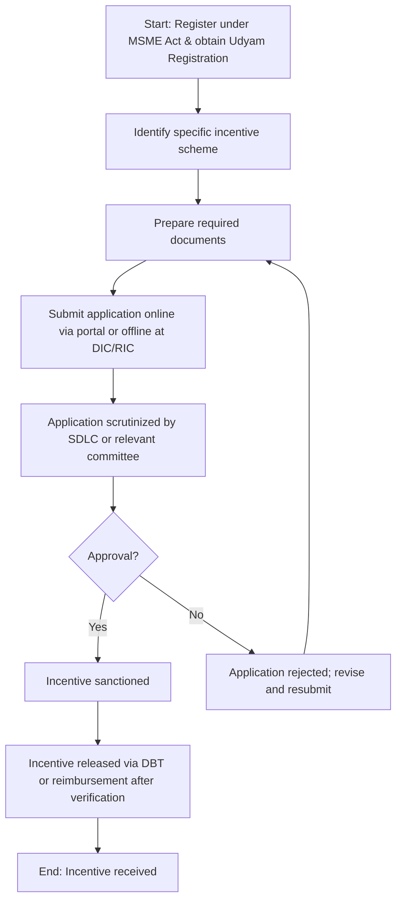

# Comprehensive Scheme Masterclass & File Guide

## Scheme Deep Dive

### Scheme Overview
**Scheme Name:** MSME Development Policy Odisha  
**Scheme ID:** row-252  
**Ministry / Category:** State Level (Odisha)  
**Scheme Type:** subsidy  
**Geographic Scope:** Odisha only  
**Implementing Agency:** Micro, Small & Medium Enterprises Department, Government of Odisha  
**Application Portal:** https://msme.odisha.gov.in  
**Status / Deadlines:** Rolling basis — applications are accepted throughout the year as per the Operational Guidelines and notifications issued from time to time.  
**Last Updated:** 2023  
**Confidence:** high  

### Objectives
- Encourage new manufacturing capacity based on improved competitiveness  
- Provide a conducive eco-system for promotion and growth of MSMEs in potential sectors  
- Provide opportunities to local entrepreneurial talent  
- Maximize avenues of employment generation for the youth  
- Facilitate MSMEs in accessing domestic and export markets  
- Make concerted efforts for revival of sick enterprises  
- Make focussed efforts for sustainable, inclusive & balanced growth  

### Eligibility Matrix
| **Incentive Type** | **Eligible Enterprises** | **Assistance Rate** | **Upper Limit** | **Additional Notes** |
|--------------------|--------------------------|---------------------|-----------------|----------------------|
| **Capital Investment Subsidy** | New Micro & Small Enterprises (General) | @25% of capital investment in Plant & Machinery | Rs.1 crore | Subject to upper limit |
| | New Micro & Small Enterprises owned by SC/ST | @33% of capital investment in Plant & Machinery | Rs.1.5 crore | Higher limit for SC/ST |
| | New Micro & Small Enterprises owned by Women | @30% of capital investment in Plant & Machinery | Rs.1.25 crore | Higher limit for women |
| **Seed Capital Assistance** | New Micro & Small Enterprises (for project report preparation & pre-operative expenses) | Up to Rs.10 lakh per unit | Rs.10 lakh | For project report preparation and other pre-operative expenses |
| **Project Report Subsidy** | New Micro Enterprises | 50% of cost of project report | Max Rs.25,000 | Covers 50% of cost, max Rs.25,000 |
| **Reimbursement of Audit Cost for Water Conservation** | New MSMEs undertaking water conservation measures | 50% of audit cost | Max Rs.10,000 | 50% of cost, max Rs.10,000 |
| **Assistance for raising capital through SME Exchange** | New Small & Medium Enterprises | 50% of listing expenses | Max Rs.2 lakh | 50% of listing expenses, max Rs.2 lakh |
| **Trade Mark Assistance** | New MSMEs (Domestic registration) | 50% of fees | Max Rs.10,000 | 50% of fees for domestic registration, max Rs.10,000 |
| | New MSMEs (International registration) | 50% of fees | Max Rs.50,000 | 50% for international, max Rs.50,000 |
| **Reimbursement of Training Expenditure** | New MSMEs (per person) | 50% of cost | Max Rs.5,000 per person | 50% of cost, max Rs.5,000 per person |
| **Awards to MSME Enterprises/Entrepreneurs** | MSME Enterprises/Entrepreneurs | Cash prizes | Up to Rs.1 lakh | Cash prizes up to Rs.1 lakh |

### Benefits & Financial Support
| **Benefit Type** | **Details** | **Financial Value** | **Non-Financial Components** |
|------------------|-------------|---------------------|------------------------------|
| **Capital Investment Subsidy** | @25% of capital investment in Plant & Machinery for new Micro & Small Enterprises | Up to Rs.1 crore (general), higher for SC/ST/women | - |
| **Seed Capital Assistance** | Up to Rs.10 lakh per unit for project report preparation and pre-operative expenses | Rs.10 lakh | - |
| **Project Report Subsidy** | 50% of cost, max Rs.25,000 | Max Rs.25,000 | - |
| **Reimbursement of Audit Cost for Water Conservation** | 50% of cost, max Rs.10,000 | Max Rs.10,000 | - |
| **Assistance for raising capital through SME Exchange** | 50% of listing expenses, max Rs.2 lakh | Max Rs.2 lakh | - |
| **Trade Mark Assistance** | 50% of fees for domestic registration (max Rs.10,000); 50% for international (max Rs.50,000) | Domestic: Max Rs.10,000; International: Max Rs.50,000 | - |
| **Reimbursement of Training Expenditure** | 50% of cost, max Rs.5,000 per person | Max Rs.5,000 per person | - |
| **Awards to MSME Enterprises/Entrepreneurs** | Cash prizes up to Rs.1 lakh | Up to Rs.1 lakh | - |
| **Non-financial benefits** | Infrastructure development via MSME parks, cluster development, credit flow facilitation, marketing assistance through MSME e-Bazaar portal, export promotion support, raw material supply through OSIC/NSIC, technology up-gradation awareness | - | Infrastructure development via MSME parks, cluster development, credit flow facilitation, marketing assistance through MSME e-Bazaar portal, export promotion support, raw material supply through OSIC/NSIC, technology up-gradation awareness |

### Target Beneficiaries
- MSME  
- Startups  
- Women entrepreneurs  
- SC/ST  

### Required Documents
1. Udyam Registration Certificate  
2. Project Report  
3. Quotations for Plant & Machinery  
4. Bank Sanction Letter for Loan (if applicable)  
5. Proof of Payment for Capital Investment  
6. Certificate of Commencement of Production  
7. Partnership Deed / Certificate of Incorporation  
8. PAN Card of the Enterprise  
9. Aadhaar of Proprietor/Partner/Director  
10. Factory License / Trade License  
11. Site Plan / Layout Plan  
12. Pollution Clearance Certificate (if applicable)  
13. Caste Certificate (for SC/ST beneficiaries)  
14. Gender Certificate (for women beneficiaries)  

### Application Process
1. Enterprises must first register under the MSME Act and obtain Udyam Registration.  
2. Identify the specific incentive scheme under the Odisha MSME Development Policy, 2016 (e.g., Capital Investment Subsidy, Seed Capital Assistance).  
3. Prepare the required documents including project reports, quotations, bank sanction letters, and proof of investment.  
4. Submit the application online through the MSME Department's designated portal or offline at the District Industries Centre (DIC) or Regional Industries Centre (RIC).  
5. The application is scrutinized by the State Directorate Level Committee (SDLC) or relevant committee based on investment size.  
6. Upon approval, the incentive is sanctioned and released through direct benefit transfer or reimbursement after verification of expenditure and installation.  

### Key Caveats
> **Warning:** Incentives are not available if similar incentives are availed under any other State or Central Government policies  
> **Warning:** Enterprises must file claims complete in all respects within 2 years of commencement of production to remain eligible (as amended in 2023)  
> **Warning:** One-time relaxation allows MSMEs that commenced production but missed the deadline to file claims by 30.06.2023 to become eligible  
> **Warning:** Government may consider condonation of delay beyond 2 years due to force majeure on case-to-case basis via Empowered Committee recommendation  
> **Warning:** Capital Investment Subsidy upper limits vary: Rs.1 crore (general), Rs.1.5 crore (SC/ST), Rs.1.25 crore (women)  
> **Warning:** Assistance is subject to availability of funds and approval by the respective Level Committee (DLC/SDLC/SLC)  

### Contact Details
- **Email:** secy-msme.od@od.gov.in  
- **Phone:** 0674-2391384  

### Mermaid.js Flowchart: Application Process

### Sources
- Application Portal: https://msme.odisha.gov.in  
- Key Facts Source: Scheme Key Facts block  
- Supporting Evidence: Crawled web pages and downloaded PDFs (including policy documents and notifications)  

---

## Consultant's Field Guide to Generated Files

### 1. SCHEME_MASTER_DATABASE.md
**Real-time Usage:** Keep this open in a background tab during all client calls. When a client asks "What is the turnover limit?" or "Who administers this?", CTRL+F in this document to give an immediate, authoritative answer without checking the portal.  

### 2. PITCH_AND_SALES_SCRIPTS.md
**Real-time Usage:** Open this file 5 minutes before your first Discovery Call with a lead. Read the "Problem Framing" out loud to hook them, then use the Qualification Checklist to interrogate their eligibility live on the phone. Keep the Objection Handlers table visible so you can immediately counter when they say "We're too small for this."  

### 3. APPLICATION_PLAYBOOK.md
**Real-time Usage:** Print this out or pin it to your desktop once the client signs the retainer. Check off each box in "Stage 1" before moving to "Stage 2". Use the "Client Communication Template" to copy-paste directly into your email when chasing them for pending documents.  

### 4. CLIENT_ONBOARDING_AND_CRM.md
**Real-time Usage:** Fill this out during or immediately after the onboarding call. Use the Needs Assessment to record their exact pain points. Update the "Compliance Status" table as they email you documents to maintain a single source of truth for what's missing.  

### 5. LIVE_CASE_TRACKER.md
**Real-time Usage:** Review this document every morning during your standup. Update the "Stage" column daily. If a case hits "Stage 07 - Under review", use the Escalation Path notes here to know exactly who to call at the government department today.  

### 6. FEE_AND_REVENUE_MODEL.md
**Real-time Usage:** Use this file when drafting the proposal. Look at the client's turnover, map them to the pricing tier in the table, and quote that exact Retainer and Success Fee. Use the monthly projection table to update your personal sales pipeline forecast for the quarter.  

### 7. CLIENT_PROPOSAL_TEMPLATE.md
**Real-time Usage:** Copy this entire file, paste it into an email or PDF generator, replace the [PLACEHOLDER] tags with the client's actual details gathered from the CRM, and send it immediately after a successful discovery call.  

### 8. COMPLIANCE_AND_LEGAL_PACK.md
**Real-time Usage:** Attach sections 8A and 8B as PDFs to the proposal email. Refuse to start Step 1 of the Application Playbook until the client signs these. Use the Disclaimers to protect yourself legally if the client is rejected by the government agency.  

---