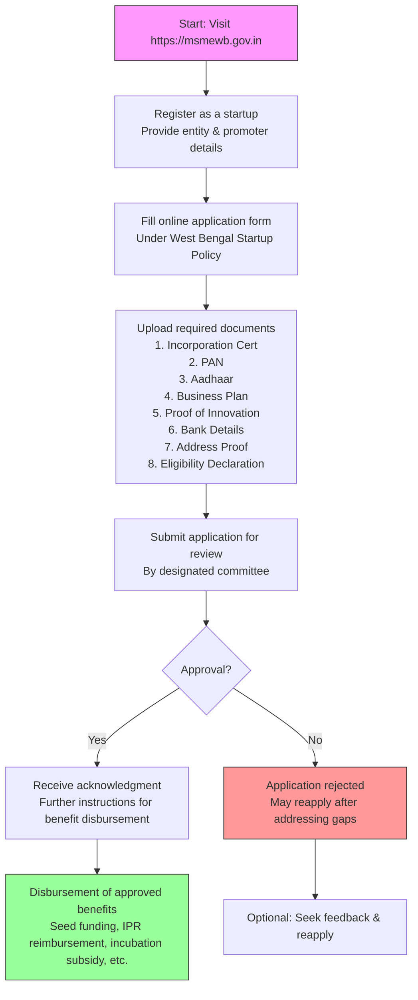

</think># Comprehensive Scheme Masterclass & File Guide

## Scheme Deep Dive

### Overview
The **West Bengal Startup Policy** is a state-level initiative administered by the **Department of MSME & Textiles, Government of West Bengal**. Designed to foster innovation and entrepreneurship within the state, the policy provides a comprehensive suite of financial and non-financial benefits to eligible startups. Applications are accepted on a **rolling basis** throughout the year via the official portal: [https://msmewb.gov.in](https://msmewb.gov.in).

### Objectives
The policy aims to:
- Promote innovation and entrepreneurship in West Bengal  
- Provide financial and non-financial support to startups  
- Create incubation and co-working infrastructure  
- Facilitate access to funding and investment  
- Simplify regulatory compliance for startups  
- Encourage sector-specific innovation (e.g., IT, biotech, agri)  
- Develop skilled manpower for the startup ecosystem  
- Establish West Bengal as a preferred startup destination  

### Eligibility Matrix
| Criteria | Requirement | Source |
|--------|-------------|--------|
| **Entity Type** | Private Limited Company, Limited Liability Partnership (LLP), or Partnership Firm | Key Facts |
| **Registration/Operations** | Incorporated in West Bengal **OR** at least 50% of operations based in the state | Key Facts |
| **Innovation Focus** | Working on innovative products, services, or processes with scalability and employment generation potential | Key Facts |
| **Promoter Profile** | Preference for women-led, SC/ST, or differently-abled entrepreneur-led startups | Key Facts |
| **Compliance** | Declaration of compliance with eligibility criteria required | Key Facts |

> **Warning**: Misrepresentation of facts may lead to rejection and blacklisting. Benefits are subject to fund availability and approval by the state-level committee. Startups must maintain operational presence in West Bengal to continue availing benefits.

### Benefits & Financial Support
| Benefit Type | Details | Maximum Amount | Notes |
|--------------|---------|----------------|-------|
| **Seed Funding** | For prototype development and product commercialization | Up to INR 25 lakhs | May require matching contribution from the startup |
| **Domestic Patent Reimbursement** | For filing patents within India | Up to INR 2 lakhs | Reimbursement-based |
| **International Patent Reimbursement** | For filing patents outside India | Up to INR 10 lakhs | Reimbursement-based |
| **Incubation Support** | Subsidy on seat rent in government-recognized incubators | Not specified | Subject to availability |
| **Government Procurement** | Priority access to government tenders | Not specified | Fast-track clearance for licenses and approvals |
| **Mentorship & Networking** | Access to industry experts, investor networks, startup fairs, roadshows | Not specified | Includes international market access support |

> **Key Takeaway**: The policy offers a blended model of direct grants (seed funding), reimbursements (IPR), and ecosystem support (incubation, mentorship, market access). Startups can potentially access over INR 37 lakhs in direct financial support if availing all applicable benefits.

### Required Documents
1. Certificate of Incorporation / Registration  
2. PAN of the entity  
3. Aadhaar of promoters/directors  
4. Business plan or project report  
5. Proof of innovation (prototype details, IPR documents, etc.)  
6. Bank account details of the entity  
7. Address proof of the startup's principal place of business  
8. Declaration of compliance with eligibility criteria  

### Application Process Flowchart

> **Note**: The process is rolling with no fixed deadlines. Applicants should ensure all documents are complete and accurate to avoid delays or rejection.

---

## Consultant's Field Guide to Generated Files

### 1. SCHEME_MASTER_DATABASE.md
**Real-time Usage:** Keep this open in a background tab during all client calls. When a client asks "What is the turnover limit?" or "Who administers this?", CTRL+F in this document to give an immediate, authoritative answer without checking the portal.

### 2. PITCH_AND_SALES_SCRIPTS.md
**Real-time Usage:** Open this file 5 minutes before your first Discovery Call with a lead. Read the "Problem Framing" out loud to hook them, then use the Qualification Checklist to interrogate their eligibility live on the phone. Keep the Objection Handlers table visible so you can immediately counter when they say "We're too small for this."

### 3. APPLICATION_PLAYBOOK.md
**Real-time Usage:** Print this out or pin it to your desktop once the client signs the retainer. Check off each box in "Stage 1" before moving to "Stage 2". Use the "Client Communication Template" to copy-paste directly into your email when chasing them for pending documents.

### 4. CLIENT_ONBOARDING_AND_CRM.md
**Real-time Usage:** Fill this out during or immediately after the onboarding call. Use the Needs Assessment to record their exact pain points. Update the "Compliance Status" table as they email you documents to maintain a single source of truth for what's missing.

### 5. LIVE_CASE_TRACKER.md
**Real-time Usage:** Review this document every morning during your standup. Update the "Stage" column daily. If a case hits "Stage 07 - Under review", use the Escalation Path notes here to know exactly who to call at the government department today.

### 6. FEE_AND_REVENUE_MODEL.md
**Real-time Usage:** Use this file when drafting the proposal. Look at the client's turnover, map them to the pricing tier in the table, and quote that exact Retainer and Success Fee. Use the monthly projection table to update your personal sales pipeline forecast for the quarter.

### 7. CLIENT_PROPOSAL_TEMPLATE.md
**Real-time Usage:** Copy this entire file, paste it into an email or PDF generator, replace the [PLACEHOLDER] tags with the client's actual details gathered from the CRM, and send it immediately after a successful discovery call.

### 8. COMPLIANCE_AND_LEGAL_PACK.md
**Real-time Usage:** Attach sections 8A and 8B as PDFs to the proposal email. Refuse to start Step 1 of the Application Playbook until the client signs these. Use the Disclaimers to protect yourself legally if the client is rejected by the government agency.