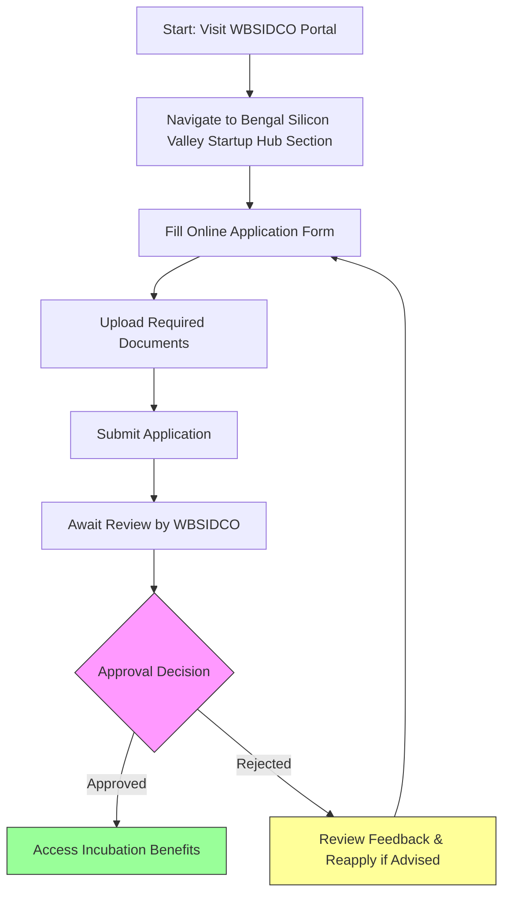

</think># Comprehensive Scheme Masterclass & File Guide

## Scheme Deep Dive

### Scheme Overview
The **Bengal Silicon Valley Startup Hub** is a state-level incubation scheme implemented by the **West Bengal Small Industries Development Corporation Limited (WBSIDCO)** under the Government of West Bengal. Designed to foster innovation and entrepreneurship, the scheme provides non-financial support to technology-driven startups through access to incubation infrastructure, mentorship, networking, and shared services. It operates on a **rolling basis** with no fixed deadline, allowing continuous applications via the official portal: [https://wbsidco.gov.in](https://wbsidco.gov.in).

### Objectives
The scheme aims to:
- Provide incubation facilities and infrastructure support to startups  
- Offer mentorship and guidance from industry experts  
- Facilitate networking and collaboration among entrepreneurs  
- Promote innovation and technology-driven ventures in West Bengal  
- Enhance the startup ecosystem through access to shared resources and services  

### Eligibility Matrix
| Criteria | Requirement | Source |
|--------|-------------|--------|
| **Geographic Scope** | Startups must be registered in West Bengal only | Key Facts |
| **Entity Type** | Startups (technology-based or innovative ideas) | Key Facts |
| **Registration Status** | Legally incorporated entity | Required Documents |
| **Founder Details** | Complete information on founders and team members | Required Documents |
| **Innovation Focus** | Must have innovative ideas or technology-based solutions | Eligibility |

> **Note**: There is no specified turnover limit, employment threshold, or sector restriction beyond being technology/innovation-focused. However, continued support is subject to periodic performance evaluation and infrastructure availability.

### Benefits & Financial Support
| Benefit Category | Specific Offerings | Details |
|------------------|--------------------|---------|
| **Infrastructure** | Incubation facilities, shared office spaces | Access to physical workspace and basic amenities |
| **Mentorship** | Guidance from industry experts | Regular advisory sessions and technical support |
| **Networking** | Collaboration opportunities | Peer learning, investor connects, ecosystem events |
| **Support Services** | Administrative, legal, accounting assistance | Shared back-end services to reduce operational burden |
| **Financial Support** | Not specified as direct funding | Scheme provides non-financial support only; no grants, loans, or equity investments mentioned |

> **Important Caveat**:  
> > Benefits are subject to the availability of infrastructure and resources. Continued participation may depend on periodic performance evaluations conducted by WBSIDCO.

### Required Documents
| Document | Purpose | Notes |
|--------|--------|-------|
| Certificate of Incorporation / Registration | Legal entity validation | Must reflect West Bengal registration |
| Project proposal or business plan | Innovation and viability assessment | Should outline technology focus, market potential, and scalability |
| PAN of the entity | Tax compliance verification | Mandatory for all applicants |
| Proof of registration in West Bengal | Geographic eligibility confirmation | e.g., GST registration, utility bill, or official address proof |
| Details of founders and team | Team capability evaluation | Includes qualifications, roles, and relevant experience |

### Application Process Flowchart

> **Process Notes**:  
> - Applications are accepted on a **rolling basis** with no cut-off dates.  
> - All submissions must be made via the official portal: [https://wbsidco.gov.in](https://wbsidco.gov.in).  
> - Incomplete applications (missing documents) will not be processed.  
> - No application fee is mentioned in the evidence.

---

## Consultant's Field Guide to Generated Files

### 1. SCHEME_MASTER_DATABASE.md
**Real-time Usage:** Keep this open in a background tab during all client calls. When a client asks "What is the turnover limit?" or "Who administers this?", CTRL+F in this document to give an immediate, authoritative answer without checking the portal.

### 2. PITCH_AND_SALES_SCRIPTS.md
**Real-time Usage:** Open this file 5 minutes before your first Discovery Call with a lead. Read the "Problem Framing" out loud to hook them, then use the Qualification Checklist to interrogate their eligibility live on the phone. Keep the Objection Handlers table visible so you can immediately counter when they say "We're too small for this."

### 3. APPLICATION_PLAYBOOK.md
**Real-time Usage:** Print this out or pin it to your desktop once the client signs the retainer. Check off each box in "Stage 1" before moving to "Stage 2". Use the "Client Communication Template" to copy-paste directly into your email when chasing them for pending documents.

### 4. CLIENT_ONBOARDING_AND_CRM.md
**Real-time Usage:** Fill this out during or immediately after the onboarding call. Use the Needs Assessment to record their exact pain points. Update the "Compliance Status" table as they email you documents to maintain a single source of truth for what's missing.

### 5. LIVE_CASE_TRACKER.md
**Real-time Usage:** Review this document every morning during your morning meeting. Update the "Stage" column daily. If a case hits "Stage 07 - Under review", use the Escalation during your standup. Update the "Stage" column daily. If a case hits "Stage 07 - Under review", use the Escalation Path notes here to know exactly who to call at the government department today.

### 6. FEE_AND_REVENUE_MODEL.md
**Real-time Usage:** Use this file when drafting the proposal. Look at the client's turnover, map them to the pricing tier in the table, and quote that exact Retainer and Success Fee. Use the monthly projection table to update your personal sales pipeline forecast for the quarter.

### 7. CLIENT_PROPOSAL_TEMPLATE.md
**Real-time Usage:** Copy this entire file, paste it into an email or PDF generator, replace the [PLACEHOLDER] tags with the client's actual details gathered from the CRM, and send it immediately after a successful discovery call.

### 8. COMPLIANCE_AND_LEGAL_PACK.md
**Real-time Usage:** Attach sections 8A and 8B as PDFs to the proposal email. Refuse to start Step 1 of the Application Playbook until the client signs these. Use the Disclaimers to protect yourself legally if the client is rejected by the government agency.