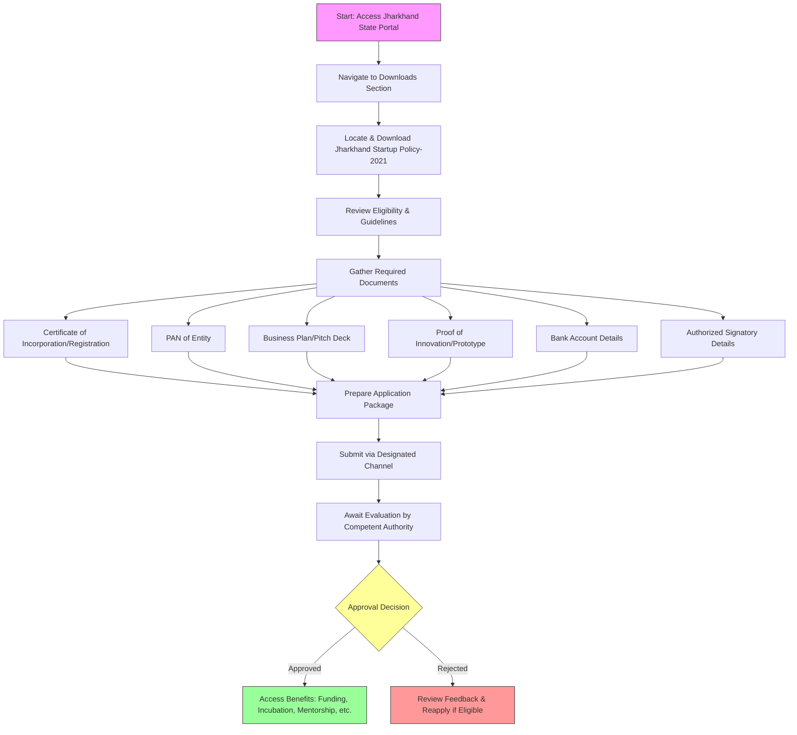

# Comprehensive Scheme Masterclass & File Guide

## Scheme Deep Dive

### Overview
The **Jharkhand Startup Policy-2021** is a state-level initiative launched by the **Department of Information Technology & e-Governance, Government of Jharkhand** to foster innovation and entrepreneurship within the state. Last updated in December 2021, the policy aims to create a supportive ecosystem for startups through policy interventions, infrastructure development, and access to resources. It targets startups registered in Jharkhand or those willing to establish operations in the state, focusing on innovative, scalable ideas with employment generation potential.

### Objectives
The policy outlines the following core objectives:
- Promote innovation and entrepreneurship in the state
- Create a supportive ecosystem for startups through policy and infrastructure
- Encourage sector-specific startup development
- Facilitate access to funding and mentorship
- Strengthen industry-academia collaboration
- Simplify regulatory processes for startups
- Enhance visibility and market access for Jharkhand-based startups

### Eligibility Matrix
| Criteria | Details |
|--------|--------|
| **Geographic Scope** | Startups must be registered in Jharkhand or willing to establish operations in the state |
| **Entity Type** | Startups (as defined under the policy) |
| **Innovation Requirement** | Working on innovative ideas, products, or services |
| **Scalability Potential** | Ideas must have potential for scalability |
| **Employment Generation** | Must contribute to employment generation |
| **Registration Status** | Valid Certificate of Incorporation/Registration required |
| **Operational Presence** | Must maintain registration and operational presence in Jharkhand to avail continued support |

> **Key Caveat**: Benefits are subject to availability of funds and policy provisions. Startup must maintain registration and operational presence in Jharkhand to avail continued support. Policy period and benefits may be subject to revision or withdrawal by the state government.

### Benefits & Financial Support
| Benefit Category | Specific Benefits | Details from Evidence |
|------------------|-------------------|------------------------|
| **Financial Assistance** | Seed funding, grants, and incentives | Policy outlines provisions but specific quantum and disbursement mechanisms are not detailed in available evidence |
| **Infrastructure Support** | Access to incubation centers | Explicitly mentioned as a benefit |
| **Guidance & Development** | Mentorship, networking opportunities | Explicitly mentioned as a benefit |
| **Market Access** | Participation in startup events, facilitation in regulatory clearances | Explicitly mentioned as a benefit |
| **Product Development** | Support for prototype development and market validation | Explicitly mentioned as a benefit |
| **Ecosystem Enablement** | Industry-academia collaboration facilitation | Listed under objectives |

> **Important Note**: While financial support is provisioned, the exact amounts, eligibility thresholds for funding, and disbursement timelines are not specified in the crawled evidence or policy document metadata. Applicants must refer to the full Jharkhand Startup Policy-2021 document for detailed financial mechanics.

### Required Documents
Applicants must submit the following documents:
1. Certificate of Incorporation / Registration
2. PAN of the entity
3. Business plan or pitch deck
4. Proof of innovation or prototype
5. Bank account details
6. Authorized signatory details

### Application Process
The application process involves the following steps:
1. Visit the Jharkhand Startup Policy-2021 document via the Downloads section on the Jharkhand State Portal
2. Review eligibility and guidelines
3. Prepare required documents as per policy
4. Submit application through the designated channel (specific portal not mentioned in evidence)
5. Await evaluation and approval by the competent authority

### Key Sources
- **Policy Document**: Jharkhand Startup Policy-2021 (Available in Downloads section of Jharkhand State Portal)
- **Application Portal**: Jharkhand State Portal - https://jharkhand.gov.in
- **Specific Policy Access Path**: https://jharkhand.gov.in/Home/DocumentList?doctype=45c48cce2e2d7fbdea1afc51c7c6ad26&subdoctype=02e74f10e0327ad868d138f2b4fdd6f0 (Downloads section showing policy document)
- **Implementing Agency**: Department of Information Technology & e-Governance, Government of Jharkhand
- **Last Updated**: December 2021 (as per document metadata in Downloads section)

> **Critical Advisory**: The specific application submission portal or online form is not explicitly detailed in the crawled evidence. Applicants are advised to:
> 1. Regularly check the Jharkhand State Portal Downloads section for updates
> 2. Contact the Department of Information Technology & e-Governance directly for current application channels
> 3. Monitor official notifications for any changes to the application process
> 4. Ensure all documents are prepared per policy requirements before initiating application

## Consultant's Field Guide to Generated Files

### 1. SCHEME_MASTER_DATABASE.md
**Real-time Usage:** Keep this open in a background tab during all client calls. When a client asks "What is the turnover limit?" or "Who administers this?", CTRL+F in this document to give an immediate, authoritative answer without checking the portal.

### 2. PITCH_AND_SALES_SCRIPTS.md
**Real-time Usage:** Open this file 5 minutes before your first Discovery Call with a lead. Read the "Problem Framing" out loud to hook them, then use the Qualification Checklist to interrogate their eligibility live on the phone. Keep the Objection Handlers table visible so you can immediately counter when they say "We're too small for this."

### 3. APPLICATION_PLAYBOOK.md
**Real-time Usage:** Print this out or pin it to your desktop once the client signs the retainer. Check off each box in "Stage 1" before moving to "Stage 2". Use the "Client Communication Template" to copy-paste directly into your email when chasing them for pending documents.

### 4. CLIENT_ONBOARDING_AND_CRM.md
**Real-time Usage:** Fill this out during or immediately after the onboarding call. Use the Needs Assessment to record their exact pain points. Update the "Compliance Status" table as they email you documents to maintain a single source of truth for what's missing.

### 5. LIVE_CASE_TRACKER.md
**Real-time Usage:** Review this document every morning during your standup. Update the "Stage" column daily. If a case hits "Stage 07 - Under review", use the Escalation Path notes here to know exactly who to call at the government department today.

### 6. FEE_AND_REVENUE_MODEL.md
**Real-time Usage:** Use this file when drafting the proposal. Look at the client's turnover, map them to the pricing tier in the table, and quote that exact Retainer and Success Fee. Use the monthly projection table to update your personal sales pipeline forecast for the quarter.

### 7. CLIENT_PROPOSAL_TEMPLATE.md
**Real-time Usage:** Copy this entire file, paste it into an email or PDF generator, replace the [PLACEHOLDER] tags with the client's actual details gathered from the CRM, and send it immediately after a successful discovery call.

### 8. COMPLIANCE_AND_LEGAL_PACK.md
**Real-time Usage:** Attach sections 8A and 8B as PDFs to the proposal email. Refuse to start Step 1 of the Application Playbook until the client signs these. Use the Disclaimers to protect yourself legally if the client is rejected by the government agency.