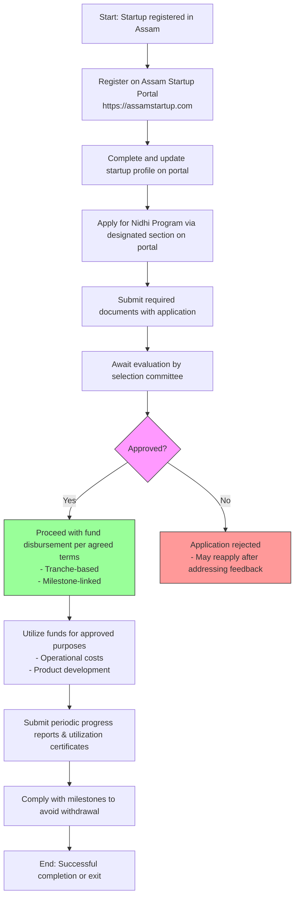

</think># Comprehensive Scheme Masterclass & File Guide

## Scheme Deep Dive

### Overview
The **Assam Startup – Nidhi Program** is a state-level grant scheme administered by **Assam Startup**, under the Department of Industries and Commerce, Government of Assam. It provides seed funding to early-stage startups registered in Assam to support initial operational and product development costs. The program operates on a **rolling basis** with no fixed deadline, allowing applications to be submitted at any time through the official portal: [https://assamstartup.com](https://assamstartup.com).

### Objectives
- To provide financial support to early-stage startups in Assam  
- To promote innovation and entrepreneurship within the state  
- To assist startups in overcoming initial funding challenges  
- To strengthen the Assam startup ecosystem through seed funding  

### Eligibility Matrix
| Criteria | Requirement | Source |
|--------|-------------|--------|
| Geographic Scope | Startup must be registered in Assam only | Key Facts |
| Legal Entity Type | Must be registered under Companies Act, LLP Act, or as a partnership firm | Key Facts |
| Recognition | Must be recognized by the Assam Startup portal | Key Facts |
| Stage of Development | Early stage of development | Key Facts |
| Innovation Potential | Must demonstrate innovative potential | Key Facts |
| Target Beneficiary | Startups | Key Facts |

> **Note**: The scheme does not specify turnover limits, employment thresholds, or sector restrictions in the provided evidence. Eligibility is primarily based on registration, recognition, stage, and innovation.

### Benefits & Financial Support
| Benefit Type | Details | Source |
|-------------|---------|--------|
| Financial Support | Seed funding provided as a grant; exact quantum and disbursement mechanism determined by startup's stage, needs, and evaluation by selection committee | Key Facts |
| Disbursement Mechanism | Funds disbursed in tranches linked to milestones | Key Facts |
| Non-Financial Benefits | Mentorship, networking opportunities, access to incubation support through Assam Startup ecosystem | Key Facts |
| Usage of Funds | To cover initial operational and product development costs | Key Facts |

> **Important**: The grant amount is not fixed and varies per applicant based on evaluation. There is no publicly stated minimum or maximum funding limit in the evidence.

### Application Process (Mermaid Flowchart)

### Required Documents
1. Certificate of Incorporation / Registration  
2. PAN of the entity  
3. Aadhaar of directors/partners  
4. Bank account details  
5. Business plan or pitch deck  
6. Details of any existing funding or revenue  
7. Declaration of compliance with eligibility criteria  

### Key Caveats
> - Funding is subject to availability of budget and approval by the selection committee  
> - Startups must utilize the funds strictly for the purposes outlined in their approved business plan  
> - Beneficiaries may be required to provide periodic progress reports and utilization certificates  
> - The grant may be withdrawn if milestones are not met or if misuse of funds is detected  

> **Warning**: There is no fixed deadline (rolling basis), but budget availability may affect approval chances. Early application is advised.

### Implementation & Oversight
- **Implementing Agency**: Assam Startup, under the Department of Industries and Commerce, Government of Assam  
- **Application Portal**: [https://assamstartup.com](https://assamstartup.com)  
- **Status**: Active, rolling basis  
- **Scheme Type**: Grant  
- **Scheme ID**: row-256  
- **Confidence Level**: Medium (based on evidence completeness)  

---

## Consultant's Field Guide to Generated Files

### 1. SCHEME_MASTER_DATABASE.md
**Real-time Usage:** Keep this open in a background tab during all client calls. When a client asks "What is the turnover limit?" or "Who administers this?", CTRL+F in this document to give an immediate, authoritative answer without checking the portal.  
*Example Use Case*: During a discovery call, a founder asks, "Is this only for tech startups?" You search "sector" in SCHEME_MASTER_DATABASE.md and find no sector restrictions mentioned, so you confirm eligibility is open to all innovative startups in Assam regardless of sector.

### 2. PITCH_AND_SALES_SCRIPTS.md
**Real-time Usage:** Open this file 5 minutes before your first Discovery Call with a lead. Read the "Problem Framing" out loud to hook them, then use the Qualification Checklist to interrogate their eligibility live on the phone. Keep the Objection Handlers table visible so you can immediately counter when they say "We're too small for this."  
*Example Use Case*: A client says, "We’re just a two-person team with no revenue yet." You refer to the Objection Handlers table and respond: "The Nidhi Program specifically targets early-stage startups — many recipients are pre-revenue. In fact, having a clear business plan and innovation potential matters more than current turnover."

### 3. APPLICATION_PLAYBOOK.md
**Real-time Usage:** Print this out or pin it to your desktop once the client signs the retainer. Check off each box in "Stage 1" before moving to "Stage 2". Use the "Client Communication Template" to copy-paste directly into your email when chasing them for pending documents.  
*Example Use Case*: After signing the retainer, you begin Stage 1: Portal Registration. You check off "Verify Assam registration", "Create portal account", and "Complete startup profile" as the client submits each item. When the client delays sending their pitch deck, you use the pre-written email template to politely follow up: "Hi [Name], just a gentle nudge to upload your pitch deck to the portal — this is required before we can submit your Nidhi Program application."

### 4. CLIENT_ONBOARDING_AND_CRM.md
**Real-time Usage:** Fill this out during or immediately after the onboarding call. Use the Needs Assessment to record their exact pain points. Update the "Compliance Status" table as they email you documents to maintain a single source of truth for what's missing.  
*Example Use Case*: During onboarding, you log in the Needs Assessment: "Client struggles with prototyping costs and lacks mentor access." As they send documents, you update the Compliance Status table: PAN — ✅, Aadhaar — ⏳ (pending), Bank Details — ✅, Business Plan — ⏳. This tells you exactly what to chase next.

### 5. LIVE_CASE_TRACKER.md
**Real-time Usage:** Review this document every morning during your standup. Update the "Stage" column daily. If a case hits "Stage 07 - Under review", use the Escalation Path notes here to know exactly who to call at the government department today.  
*Example Use Case*: At your morning standup, you see a case moved to "Stage 07 - Under review". You consult the Escalation Path and call the Assam Startup Nodal Officer (contact listed in the tracker) to politely inquire about timelines, showing proactive case management.

### 6. FEE_AND_REVENUE_MODEL.md
**Real-time Usage:** Use this file when drafting the proposal. Look at the client's turnover, map them to the pricing tier in the table, and quote that exact Retainer and Success Fee. Use the monthly projection table to update your personal sales pipeline forecast for the quarter.  
*Example Use Case*: A client has ₹8 lakhs annual turnover. You refer to the pricing tier table and see they fall into the "₹5L–₹15L" bracket, so you quote a ₹75,000 retainer and 8% success fee. You then update your Q3 forecast in the projection table, adding this deal to your expected revenue.

### 7. CLIENT_PROPOSAL_TEMPLATE.md
**Real-time Usage:** Copy this entire file, paste it into an email or PDF generator, replace the [PLACEHOLDER] tags with the client's actual details gathered from the CRM, and send it immediately after a successful discovery call.  
*Example Use Case*: After a positive discovery call where the client confirmed eligibility and agreed to proceed, you open CLIENT_PROPOSAL_TEMPLATE.md, replace [CLIENT_NAME], [TURNOVER], [DOCUMENTS_NEEDED], etc., generate a PDF, and send it within the hour with the subject: "Proposal: Assam Startup Nidhi Program Application Support."

### 8. COMPLIANCE_AND_LEGAL_PACK.md
**Real-time Usage:** Attach sections 8A and 8B as PDFs to the proposal email. Refuse to start Step 1 of the Application Playbook until the client signs these. Use the Disclaimers to protect yourself legally if the client is rejected by the government agency.  
*Example Use Case*: You attach the signed NDA and Service Agreement (from 8A and 8B) to the proposal email and write: "Per our engagement terms, we cannot begin work until these are signed. Please review and return at your earliest convenience." If the client is later rejected due to missing milestones, you reference the disclaimer: "Our service ends upon submission; fund approval is solely at the discretion of Assam Startup."