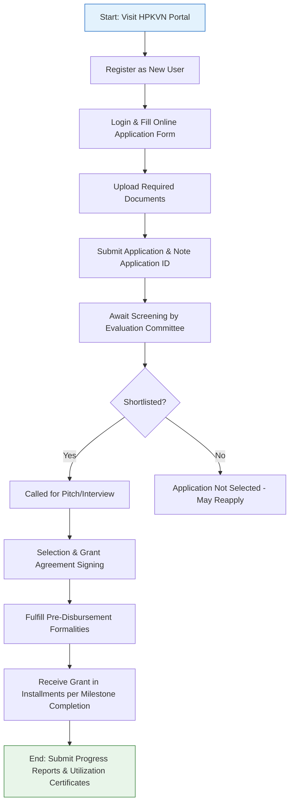

</think># Comprehensive Scheme Masterclass & File Guide

## Scheme Deep Dive

### Overview
The **HP Startup Yojana & HIMSTART** is a state-level grant scheme implemented by the **Himachal Pradesh Kaushal Vikas Nigam (HPKVN)** under the Department of Technical Education, Vocational & Industrial Training, Government of Himachal Pradesh. It is designed to promote innovation and entrepreneurship within the state by providing financial and non-financial support to early-stage startups. The scheme operates on a **rolling basis** with applications accepted throughout the year, subject to fund availability.

### Objectives
The scheme aims to:
- Promote innovation and entrepreneurship in Himachal Pradesh  
- Provide financial assistance to early-stage startups  
- Offer incubation and mentorship support to innovators  
- Strengthen the startup ecosystem through infrastructure and networking  
- Facilitate market access and industry linkages for startups  
- Facilitate technology-driven solutions and social entrepreneurship  
- Encourage participation from women, SC/ST, and differently-abled entrepreneurs  
- Create employment opportunities through startup promotion  

### Eligibility Matrix
| Criteria | Requirement | Source |
|--------|-------------|--------|
| **Applicant Residency** | Must be a resident of Himachal Pradesh | Key Facts |
| **Entity Type** | Private Limited Company, LLP, Partnership Firm, or Proprietorship under Indian laws | Key Facts |
| **Entity Age** | Incorporated not more than 5 years ago | Key Facts |
| **Innovation Focus** | Working on an innovative product, service, or process with scalability and employment generation potential | Key Facts |
| **Preferred Sectors** | Agriculture, tourism, handicrafts, renewable energy, IT | Key Facts |
| **Priority Beneficiaries** | Women, SC/ST, and differently-abled entrepreneurs encouraged to apply | Key Facts |
| **Prior Funding** | Must not have received similar grant from any central or state government scheme for the same purpose | Key Facts (Caveats) |
| **Fund Utilization** | Funds must be used strictly for approved project within stipulated timeline | Key Facts (Caveats) |

> **Warning**: Misrepresentation of facts or misuse of funds may lead to recovery of grant and blacklisting. The scheme may be revised, suspended, or terminated without prior notice.

### Benefits & Financial Support
| Support Type | Details | Source |
|-------------|---------|--------|
| **Grant Amount** | One-time grant of up to **INR 10 lakhs** | Key Facts |
| **Disbursement** | Released in tranches based on milestone achievement and progress review | Key Facts |
| **Repayment/Obligation** | No equity dilution or repayment obligation (pure grant) | Key Facts |
| **Disbursement Method** | Funds released directly to startup's bank account after due diligence and approval by screening committee | Key Facts |
| **Usage Areas** | Product development, prototype creation, market testing, initial operational expenses | Key Facts |
| **Incubation Support** | Access to incubation centers, shared infrastructure, utilities | Key Facts |
| **Mentorship** | Mentorship from industry experts, technical assistance | Key Facts |
| **IPR Facilitation** | Support for intellectual property rights registration and protection | Key Facts |
| **Networking** | Participation in investor meets, pitch events; networking with investors, industry partners, government bodies | Key Facts |
| **Training & Workshops** | Access to training programs, workshops, and skill development initiatives | Key Facts |
| **Regulatory Assistance** | Help in regulatory compliance and approvals | Key Facts |

### Application Process Flowchart

### Required Documents
1. Certificate of Incorporation / Registration  
2. PAN Card of the startup  
3. Aadhaar Card of all founders/directors  
4. Project report or business plan  
5. Details of innovation and technology used  
6. Prototype details or proof of concept (if available)  
7. Bank account details of the startup  
8. Address proof of the startup or founders  
9. Declaration of compliance with eligibility criteria  

### Contact Details & Portal
- **Application Portal**: [https://hpkvn.nic.in](https://hpkvn.nic.in)  
- **Email**: info@hpkvn.nic.in  
- **Phone**: 0177-2621588, 2621589  
- **Implementing Agency**: Himachal Pradesh Kaushal Vikas Nigam (HPKVN)  

### Key Caveats
> - Grant is subject to availability of funds and approval by the screening committee  
> - Startup must not have received similar grant from any other central or state government scheme for the same purpose  
> - Funds must be utilized strictly for the approved project within the stipulated timeline  
> - Beneficiaries may be required to submit periodic progress reports and utilization certificates  
> - Misrepresentation of facts or misuse of funds may lead to recovery of grant and blacklisting  
> - The scheme may be revised, suspended, or terminated by the government without prior notice  

---

## Consultant's Field Guide to Generated Files

### 1. SCHEME_MASTER_DATABASE.md
**Real-time Usage:** Keep this open in a background tab during all client calls. When a client asks "What is the turnover limit?" or "Who administers this?", CTRL+F in this document to give an immediate, authoritative answer without checking the portal.

### 2. PITCH_AND_SALES_SCRIPTS.md
**Real-time Usage:** Open this file 5 minutes before your first Discovery Call with a lead. Read the "Problem Framing" out loud to hook them, then use the Qualification Checklist to interrogate their eligibility live on the phone. Keep the Objection Handlers table visible so you can immediately counter when they say "We're too small for this."

### 3. APPLICATION_PLAYBOOK.md
**Real-time Usage:** Print this out or pin it to your desktop once the client signs the retainer. Check off each box in "Stage 1" before moving to "Stage 2". Use the "Client Communication Template" to copy-paste directly into your email when chasing them for pending documents.

### 4. CLIENT_ONBOARDING_AND_CRM.md
**Real-time Usage:** Fill this out during or immediately after the onboarding call. Use the Needs Assessment to record their exact pain points. Update the "Compliance Status" table as they email you documents to maintain a single source of truth for what's missing.

### 5. LIVE_CASE_TRACKER.md
**Real-time Usage:** Review this document every morning during your standup. Update the "Stage" column daily. If a case hits "Stage 07 - Under review", use the Escalation Path notes here to know exactly who to call at the government department today.

### 6. FEE_AND_REVENUE_MODEL.md
**Real-time Usage:** Use this file when drafting the proposal. Look at the client's turnover, map them to the pricing tier in the table, and quote that exact Retainer and Success Fee. Use the monthly projection table to update your personal sales pipeline forecast for the quarter.

### 7. CLIENT_PROPOSAL_TEMPLATE.md
**Real-time Usage:** Copy this entire file, paste it into an email or PDF generator, replace the [PLACEHOLDER] tags with the client's actual details gathered from the CRM, and send it immediately after a successful discovery call.

### 8. COMPLIANCE_AND_LEGAL_PACK.md
**Real-time Usage:** Attach sections 8A and 8B as PDFs to the proposal email. Refuse to start Step 1 of the Application Playbook until the client signs these. Use the Disclaimers to protect yourself legally if the client is rejected by the government agency.