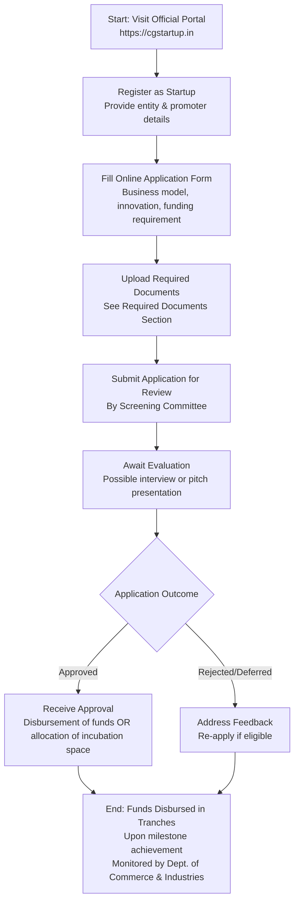

</think># Comprehensive Scheme Masterclass & File Guide

## Scheme Deep Dive

### Overview
The **CG Startup Policy & Nava Raipur Innovation City** (Scheme ID: row-259) is a state-level initiative by the **Department of Commerce and Industries, Government of Chhattisgarh** designed to foster innovation and entrepreneurship within the state. The scheme operates on a **rolling basis** with no fixed deadlines, allowing continuous applications through its dedicated portal: **https://cgstartup.in**. It targets **startups, entrepreneurs, and MSMEs** incorporated in Chhattisgarh or willing to relocate, with emphasis on technology-driven or socially impactful, scalable business models.

### Objectives
The policy aims to:
- Promote innovation and entrepreneurship across Chhattisgarh  
- Develop **Nava Raipur** as a dedicated innovation city for startups  
- Provide financial and infrastructural support to early-stage ventures  
- Create employment opportunities through startup-led growth  
- Establish a conducive regulatory environment for new businesses  
- Encourage sector-specific innovation in areas like **agri-tech, health-tech, and manufacturing**

### Eligibility Matrix
| Criterion | Requirement | Source |
|---------|-------------|--------|
| **Geographic Scope** | Startups incorporated in Chhattisgarh **or willing to relocate** to the state | Key Facts |
| **Entity Type** | Preference for entities registered under **Companies Act, 2013**, or as **LLPs/partnership firms** | Key Facts |
| **Business Model Focus** | Must be working on **technology-driven or socially impactful solutions** | Key Facts |
| **Scalability** | Focus on **innovative, scalable business models** | Key Facts |
| **Turnover/Age Limit** | Must not have exceeded a **specified turnover or age limit** as defined under the policy *(exact thresholds not specified in evidence)* | Key Facts |
| **Target Beneficiaries** | Startups; entrepreneurs; MSME | Key Facts |

> **Note**: While the evidence confirms turnover and age limits exist, the exact numerical thresholds are not specified in the provided facts. Consultants must verify current limits via the portal or official guidelines.

### Benefits & Financial Support
The scheme provides a multi-faceted support package combining financial aid, infrastructure, and ecosystem enablement.

#### Financial Support Structure
| Support Type | Details | Disbursement Mechanism | Source |
|--------------|---------|------------------------|--------|
| **Seed Grants** | Available for early-stage ventures; quantum varies by project stage and nature | Released in **tranches** upon achievement of predefined milestones | Key Facts |
| **Equity-Based Funding** | Provided via designated state-level startup fund; involves **equity dilution** per agreed terms | Managed through state fund; disbursement monitored by implementing agency | Key Facts |
| **Soft Loans** | Offered as part of financial support mix | Disbursed via state-level startup fund; tranche-based upon milestones | Key Facts |

#### Non-Financial Benefits
| Benefit Category | Specific Offerings | Source |
|------------------|--------------------|--------|
| **Incubation Support** | Access to incubation facilities at **Nava Raipur Innovation City** | Key Facts |
| **Infrastructure Access** | Shared infrastructure, prototype development facilities | Key Facts |
| **Mentorship & Networking** | Mentorship, networking opportunities, linkages with investors and industry experts | Key Facts |
| **Regulatory Assistance** | Support in regulatory compliance | Key Facts |
| **Market Access** | Facilitation for participation in **national and international startup events** | Key Facts |
| **IPR Support** | Assistance with **intellectual property rights (IPR) filing** | Key Facts |

> **Blockquote Warning**:  
> > Benefits are **subject to availability of funds** and approval by the state-level screening committee. Startups must maintain a **minimum operational presence in Chhattisgarh** to continue availing benefits. **Misrepresentation of facts** or **failure to meet milestones** may lead to withdrawal of support. Equity-based funding involves **dilution** as per agreed terms.

### Application Process Flowchart
The application follows an 8-step sequential process managed entirely through the online portal.

#### Required Documents Checklist
Applicants must upload the following documents during Step 5 of the process:
1. Certificate of Incorporation / Registration  
2. PAN of the entity  
3. Pitch deck or business description  
4. Bank account details  
5. Details of promoters/directors  
6. Proof of innovation or prototype (if applicable)  
7. Authorization letter from authorized signatory  

> **Key Takeaway**: The process is **entirely online** via **https://cgstartup.in**, with no offline submission option indicated. All communication and document handling occurs through the portal.

---

## Consultant's Field Guide to Generated Files

### 1. SCHEME_MASTER_DATABASE.md
**Real-time Usage:** Keep this open in a background tab during all client calls. When a client asks "What is the turnover limit?" or "Who administers this?", CTRL+F in this document to give an immediate, authoritative answer without checking the portal.

### 2. PITCH_AND_SALES_SCRIPTS.md
**Real-time Usage:** Open this file 5 minutes before your first Discovery Call with a lead. Read the "Problem Framing" out loud to hook them, then use the Qualification Checklist to interrogate their eligibility live on the phone. Keep the Objection Handlers table visible so you can immediately counter when they say "We're too small for this."

### 3. APPLICATION_PLAYBOOK.md
**Real-time Usage:** Print this out or pin it to your desktop once the client signs the retainer. Check off each box in "Stage 1" before moving to "Stage 2". Use the "Client Communication Template" to copy-paste directly into your email when chasing them for pending documents.

### 4. CLIENT_ONBOARDING_AND_CRM.md
**Real-time Usage:** Fill this out during or immediately after the onboarding call. Use the Needs Assessment to record their exact pain points. Update the "Compliance Status" table as they email you documents to maintain a single source of truth for what's missing.

### 5. LIVE_CASE_TRACKER.md
**Real-time Usage:** Review this document every morning during your standup. Update the "Stage" column daily. If a case hits "Stage 07 - Under review", use the Escalation Path notes here to know exactly who to call at the government department today.

### 6. FEE_AND_REVENUE_MODEL.md
**Real-time Usage:** Use this file when drafting the proposal. Look at the client's turnover, map them to the pricing tier in the table, and quote that exact Retainer and Success Fee. Use the monthly projection table to update your personal sales pipeline forecast for the quarter.

### 7. CLIENT_PROPOSAL_TEMPLATE.md
**Real-time Usage:** Copy this entire file, paste it into an email or PDF generator, replace the [PLACEHOLDER] tags with the client's actual details gathered from the CRM, and send it immediately after a successful discovery call.

### 8. COMPLIANCE_AND_LEGAL_PACK.md
**Real-time Usage:** Attach sections 8A and 8B as PDFs to the proposal email. Refuse to start Step 1 of the Application Playbook until the client signs these. Use the Disclaimers to protect yourself legally if the client is rejected by the government agency.