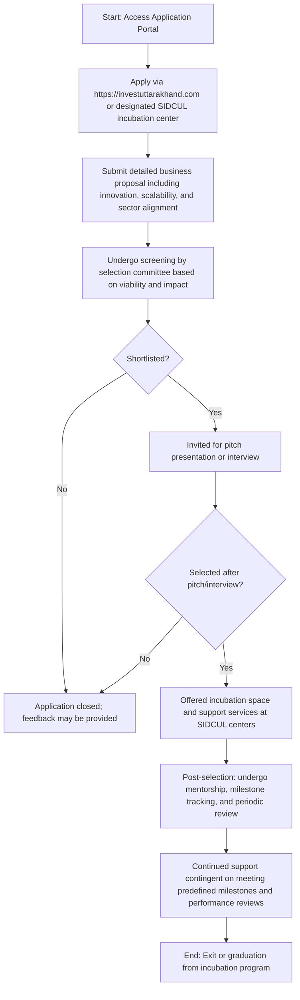

</think># Comprehensive Scheme Masterclass & File Guide

## Scheme Deep Dive

### Overview
The **Uttarakhand Startup Policy & SIDCUL Incubation** scheme (Scheme ID: row-261) is a state-level initiative designed to foster innovation and entrepreneurship in Uttarakhand. Implemented by the **State Infrastructure and Industrial Development Corporation of Uttarakhand Limited (SIDCUL)** in coordination with the **Department of Industries, Government of Uttarakhand**, the scheme provides incubation support, financial assistance, and ecosystem enablement to startups to startups and around the state. The scheme operates on a **startups, entrepreneurs, and MSMEs** operating or willing to operate in Uttarakhand. Applications are accepted on a **rolling basis** throughout the year, subject to availability of incubation seats and funds, via the official portal: [https://investuttarakhand.com](https://investuttarakhand.com).

### Objectives
The scheme aims to:
- Promote innovation and entrepreneurship across key sectors in Uttarakhand  
- Provide incubation support through SIDCUL infrastructure and mentorship  
- Facilitate access to funding, networking, and market linkages for startups  
- Encourage sector-specific startup growth in tourism, agriculture, handicrafts, and IT  
- Strengthen the startup ecosystem via policy interventions and industry-academia collaboration  

### Eligibility Matrix
| Criteria | Requirement | Source |
|--------|-------------|--------|
| Geographic Scope | Startups registered in Uttarakhand **or willing to establish operations in the state** | Key Facts |
| Entity Type | Startups; entrepreneurs; MSME | Key Facts |
| Business Focus | Innovative ideas or scalable business models | Key Facts |
| Priority Sectors | Tourism, agriculture, handicrafts, and IT | Key Facts |
| Preference Criteria | Utilizing SIDCUL infrastructure **or** demonstrating potential for employment generation and regional development | Key Facts |
| Compliance | Declaration of compliance with scheme guidelines (required document) | Key Facts |

> **Note**: While the scheme is open year-round, support is subject to availability of incubation seats and funds. Priority is given to ventures aligned with state-identified thrust sectors.

### Benefits & Financial Support
| Benefit Category | Details | Source |
|------------------|---------|--------|
| Incubation Infrastructure | Access to SIDCUL incubation centers with infrastructure support | Key Facts |
| Mentorship & Guidance | Mentorship from industry experts | Key Facts |
| Networking & Linkages | Networking opportunities; assistance in securing funding; policy facilitation for regulatory approvals | Key Facts |
| Financial Support | Seed funding, grants, or subsidies for prototype development, market testing, and scaling (subject to evaluation and fund availability) | Key Facts |
| Subsidies & Incentives | Subsidies on utilities, infrastructure usage, and sector-specific incentives as per state policy | Key Facts |
| Post-Selection Support | Mentorship, milestone tracking, and periodic review for continued support | Key Facts |

> **Financial Support Caveat**: The exact quantum and disbursement mechanism of financial support (seed funding, grants, subsidies) are **determined on a case-by-case basis** through the incubation and evaluation committee. Support is **discretionary** and based on evaluation by the screening committee. There is **no fixed amount** specified in the evidence.

### Required Documents
Applicants must submit the following documents:
1. Business proposal or pitch deck  
2. Certificate of Incorporation / Registration  
3. PAN of the entity or promoters  
4. Proof of concept or prototype details (if applicable)  
5. Team profiles and CVs of founders  
6. Bank account details  
7. Declaration of compliance with scheme guidelines  

### Application Process
The application process is structured as follows:

> **Key Process Notes**:
> - Applications are accepted on a **rolling basis** throughout the year.
> - Incubation support is **subject to availability of space and resources** at SIDCUL centers.
> - Continued support is **contingent upon meeting predefined milestones and performance reviews**.
> - The selection committee evaluates based on **viability, impact, innovation, scalability, and sector alignment**.

### Key Caveats
> - Incubation support is subject to availability of space and resources at SIDCUL centers  
> - Continued support is contingent upon meeting predefined milestones and performance reviews  
> - Priority is given to startups aligned with state-identified thrust sectors (tourism, agriculture, handicrafts, IT)  
> - Financial support is discretionary and based on evaluation by the screening committee  
> - Exact financial quantum is not fixed and determined case-by-case  

---

## Consultant's Field Guide to Generated Files

### 1. SCHEME_MASTER_DATABASE.md
**Real-time Usage:** Keep this open in a background tab during all client calls. When a client asks "What is the turnover limit?" or "Who administers this?", CTRL+F in this document to give an immediate, authoritative answer without checking the portal.  
*Example Use Case*: During a discovery call, a founder asks, "Is there a minimum revenue requirement to apply?" You instantly search the document for "turnover" or "revenue" and confirm from the eligibility matrix that **no turnover limit is specified**—only registration in Uttarakhand or willingness to establish operations is required.

### 2. PITCH_AND_SALES_SCRIPTS.md
**Real-time Usage:** Open this file 5 minutes before your first Discovery Call with a lead. Read the "Problem Framing" out loud to hook them, then use the Qualification Checklist to interrogate their eligibility live on the phone. Keep the Objection Handlers table visible so you can immediately counter when they say "We're too small for this."  
*Example Use Case*: A client says, "We’re just a two-person team with an idea—do we even qualify?" You refer to the Objection Handlers table and respond: "Actually, the scheme **prefers early-stage ventures**—your team size is not a barrier. What matters is your innovative idea in tourism, agriculture, handicrafts, or IT, and willingness to operate in Uttarakhand. Let’s check if your concept aligns with the priority sectors."

### 3. APPLICATION_PLAYBOOK.md
**Real-time Usage:** Print this out or pin it to your desktop once the client signs the retainer. Check off each box in "Stage 1" before moving to "Stage 2". Use the "Client Communication Template" to copy-paste directly into your email when chasing them for pending documents.  
*Example Use Case*: After signing the retainer, you begin Stage 1: Document Collection. You check off items as the client sends them: ✅ Certificate of Incorporation, ✅ PAN, ⏳ Proof of Concept (pending). When the client delays sending the pitch deck, you use the pre-written email template: *"Hi [Name], just a friendly reminder to share your pitch deck by EOD tomorrow so we can stay on track for the selection committee review. Let me know if you need help refining it!"*

### 4. CLIENT_ONBOARDING_AND_CRM.md
**Real-time Usage:** Fill this out during or immediately after the onboarding call. Use the Needs Assessment to record their exact pain points. Update the "Compliance Status" table as they email you documents to maintain a single source of truth for what's missing.  
*Example Use Case*: During onboarding, you learn the client struggles with market access in Himalayan tourism. You log this under "Pain Points." As documents arrive, you update the Compliance Status table: Bank details → ✅, Pitch Deck → ⏳, Declaration Form → ⏳. This becomes your live dashboard for tracking readiness.

### 5. LIVE_CASE_TRACKER.md
**Real-time Usage:** Review this document every morning during your standup. Update the "Stage" column daily. If a case hits "Stage 07 - Under review", use the Escalation Path notes here to know exactly who to call at the government department today.  
*Example Use Case*: At your 9 AM standup, you see a case moved to "Stage 07 - Under review." You consult the Escalation Path: "Contact Nodal Officer at SIDCUL Incubation Desk (ext. 204) or email incubation@sidcul.uk.gov.in for status update." You make the call before 10 AM to demonstrate proactive case management.

### 6. FEE_AND_REVENUE_MODEL.md
**Real-time Usage:** Use this file when drafting the proposal. Look at the client's turnover, map them to the pricing tier in the table, and quote that exact Retainer and Success Fee. Use the monthly projection table to update your personal sales pipeline forecast for the quarter.  
*Example Use Case*: A client has ₹85 lakhs annual turnover. You refer to the pricing tier table: ₹50L–1Cr → Retainer: ₹1.5L, Success Fee: 8% of granted amount. You quote: ₹1.5L retainer + 8% success fee. Later, you update your Q3 forecast: 3 clients in this tier = ₹4.5L retained revenue potential.

### 7. CLIENT_PROPOSAL_TEMPLATE.md
**Real-time Usage:** Copy this entire file, paste it into an email or PDF generator, replace the [PLACEHOLDER] tags with the client's actual details gathered from the CRM, and send it immediately after a successful discovery call.  
*Example Use Case*: After a positive discovery call with a Dehradun-based agri-tech startup, you open the template, replace:  
- [CLIENT_NAME] → "Himalayan Harvest Solutions"  
- [SCHEME_NAME] → "Uttarakhand Startup Policy & SIDCUL Incubation"  
- [RETAINER_FEE] → "₹1,50,000"  
- [SUCCESS_FEE] → "8% of sanctioned grant amount"  
- [KEY_BENEFITS] → "Access to SIDCUL’s agri-incubation lab, mentorship from IIT Roorkee experts, and subsidy on electricity for prototype testing"  
You generate the PDF and send it within 2 hours while the conversation is fresh.

### 8. COMPLIANCE_AND_LEGAL_PACK.md
**Real-time Usage:** Attach sections 8A and 8B as PDFs to the proposal email. Refuse to start Step 1 of the Application Playbook until the client signs these. Use the Disclaimers to protect yourself legally if the client is rejected by the government agency.  
*Example Use Case*: You attach the signed NDA and liability waiver (from 8A and 8B) to the proposal email. You write: *"Per our engagement terms, we cannot begin document preparation (Step 1 of the Application Playbook) until these compliance forms are signed. This protects both parties and ensures alignment with scheme guidelines."* If the client is later rejected due to weak proof of concept, you cite the disclaimer: *"Our service supports application preparation; approval rests solely with the screening committee."*