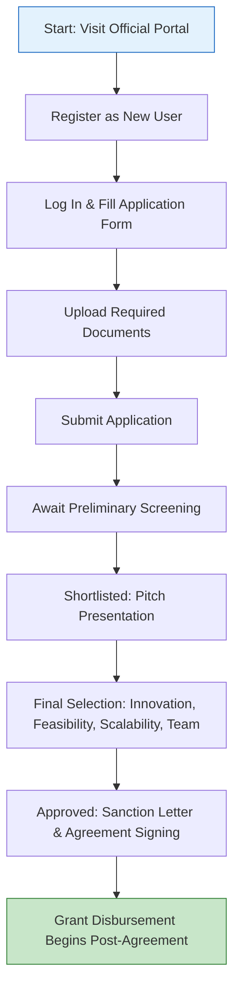

</think># Comprehensive Scheme Masterclass & File Guide

## Scheme Deep Dive

### Scheme Overview
The **StartUp J&K Initiative** (Scheme ID: row-263) is a **state-level grant scheme** administered by the **Department of Information Technology, Government of Jammu and Kashmir**. Launched under the State Innovation and Startup Policy framework, it aims to foster innovation and entrepreneurship specifically within the Union Territory of Jammu and Kashmir. The scheme operates with a total fund size of **INR 50 crores**, offering financial and non-financial support to early-stage startups.

**Application Portal:** https://jkstartupsummit.in  
**Status / Deadlines:** Applications are accepted **twice a year — typically in April and October**. Exact dates are announced on the portal each cycle.  
**Last Updated:** 2024  
**Scheme Type:** Grant (non-equity, non-repayable)  
**Geographic Scope:** Jammu and Kashmir only  

### Objectives
The initiative pursues the following strategic objectives:
- Promote innovation and entrepreneurship among the youth of Jammu and Kashmir  
- Provide financial support to early-stage startups for product development and market entry  
- Establish and strengthen incubation centers across the region  
- Offer mentorship and guidance through industry experts and successful entrepreneurs  
- Facilitate access to funding networks and investor connects  
- Encourage sector-specific innovation in areas like tourism, handicrafts, agriculture, and IT  

### Eligibility Matrix
The following table outlines the complete eligibility criteria extracted from the evidence:

| Criteria Category | Requirement | Details |
|-------------------|-----------|---------|
| **Applicant Status** | Must be a resident of Jammu and Kashmir | All founders/directors must provide proof of residence in J&K |
| **Legal Structure** | Registered entity | Must be a Private Limited Company, LLP, or Partnership Firm under relevant Indian laws |
| **Innovation & Scalability** | Innovative, scalable venture | Must have a clear business model with potential for growth and impact |
| **Funding History** | Prior government funding cap | Must not have received more than **INR 25 lakhs** in funding from other government sources prior to application |
| **Preference Categories** | Priority given to | Ventures led by women, SC/ST, or differently abled individuals |
| **Target Beneficiaries** | Eligible entities | Startups, entrepreneurs, youth residing in Jammu and Kashmir |

> **Key Eligibility Notes:**  
> - The scheme is **exclusively for entities registered and operating within Jammu and Kashmir**.  
> - There is **no sector restriction**, but preference is shown for innovation in tourism, handicrafts, agriculture, and IT.  
> - The **INR 25 lakhs prior funding cap** is a hard limit — exceeding this disqualifies the applicant.  
> - Preference for women, SC/ST, and differently abled founders is **not a disqualifier for others**, but increases selection chances.

### Benefits & Financial Support
The scheme provides a comprehensive package of financial and non-financial support:

#### Financial Support
| Support Type | Amount | Disbursement Mechanism | Conditions |
|--------------|--------|------------------------|------------|
| **One-time Grant** | Up to **INR 10 lakhs** per eligible startup | Disbursed in **tranches based on milestone achievement** | Funds must be used strictly for prototype development, product testing, and initial market traction |
| **Grant Nature** | Non-equity, non-repayable | No equity taken by government | No repayment or dilution required |

#### Non-Financial Benefits
Selected startups receive access to:
- State-recognized incubators  
- Mentorship from industry experts  
- Assistance in patent filing and IPR protection  
- Support for participation in national and international startup events  
- Help in connecting with angel investors and venture capital firms  
- Office space  
- Legal and accounting support  
- Training workshops  

> **Critical Benefit Conditions:**  
> - Grant is **disbursed in stages** only after verification of milestone completion.  
> - Beneficiaries must **participate in at least two mentorship sessions per quarter**.  
> - Funds **cannot be transferred, pledged, or mortgaged** to any third party.  
> - Misuse of funds may lead to **recovery of the grant amount and blacklisting** from future government schemes.  
> - Startups must **maintain regular progress reports and financial statements** throughout the grant period.

### Application Process
The application process is entirely online and consists of eight sequential stages:

#### Detailed Step-by-Step Breakdown:
1. **Visit Portal:** Access the official StartUp J&K portal at **https://jkstartupsummit.in**  
2. **User Registration:** Register as a new user by providing basic details (name, email, phone) and creating a secure login  
3. **Login & Form Completion:** Log in and fill the online application form with:  
   - Startup details (name, registration number, date of incorporation)  
   - Business model description  
   - Financial projections (revenue, cost, break-even)  
   - Use of funds statement  
4. **Document Upload:** Upload all required documents (see section below) in prescribed format (typically PDF/JPEG, under specified size limits)  
5. **Application Submission:** Submit the completed application and await acknowledgment  
6. **Preliminary Screening:** Applications undergo initial eligibility check by the Department of IT  
7. **Pitch Presentation:** Shortlisted applicants are invited to present before a selection committee (virtual or in-person)  
8. **Final Selection:** Based on innovation, feasibility, scalability, and team strength  
9. **Sanction & Agreement:** Approved startups receive a sanction letter and must sign a grant agreement  
10. **Disbursement:** Grant funds released in tranches upon verification of milestone completion  

#### Required Documents Checklist
All documents must be uploaded during the online application process:

| S.No | Document | Details / Notes |
|------|----------|-----------------|
| 1 | Certificate of Incorporation / Registration | Proof of legal registration as Private Limited, LLP, or Partnership Firm |
| 2 | PAN card of the startup | Permanent Account Number in the name of the startup |
| 3 | Aadhaar cards of all founders/directors | Mandatory for all promoters; proof of identity and residence |
| 4 | Detailed pitch deck or business plan | Must include problem statement, solution, market size, business model, financials, team, and use of funds |
| 5 | Bank account details of the startup | Cancelled cheque or bank statement in startup’s name |
| 6 | Proof of residence of founders in Jammu and Kashmir | Aadhaar, voter ID, domicile certificate, or utility bill showing J&K address |
| 7 | Declaration of no prior government funding exceeding INR 25 lakhs | Self-declaration signed by authorized signatory |
| 8 | Authorization letter from authorized signatory | Board resolution or partner authorization for application submission |

> **Document Submission Warnings:**  
> - All documents must be **legible, valid, and current** (e.g., not expired Aadhaar).  
> - The **declaration of prior funding** is a legal attestation — false declaration leads to disqualification and potential legal action.  
> - Missing or unclear documents will result in **application rejection at preliminary screening**.  
> - The portal may specify file format (PDF/JPEG) and size limits (e.g., <5MB per file) — adhere strictly.

#### Contact Details
For queries related to the scheme or application process:
- **Email:** startup@jktit.gov.in  
- **Phone:** 0191-2566080  
- **Portal:** https://jkstartupsummit.in  

> **Important Caveats Summary:**  
> > - The grant is **non-transferable** and **cannot be pledged or mortgaged**.  
> > - Beneficiaries must attend **minimum two mentorship sessions per quarter**.  
> > - Funds must be used **exclusively for approved purposes** (prototype, testing, market traction).  
> > - Regular **progress reports and financial statements** are mandatory.  
> > - Misuse invites **recovery of funds and blacklisting**.  
> > - The scheme runs **biannually** (April/October) — plan applications accordingly.  
> > - Total fund size is **INR 50 crores**, with **max INR 10 lakhs per entity**.  

---

## Consultant's Field Guide to Generated Files

### 1. SCHEME_MASTER_DATABASE.md
**Real-time Usage:** Keep this open in a background tab during all client calls. When a client asks "What is the turnover limit?" or "Who administers this?", CTRL+F in this document to give an immediate, authoritative answer without checking the portal.  
**Pro Tip:** Use Ctrl+F for keywords like "eligibility", "grant amount", "implementing agency", or "deadline" to instantly retrieve scheme specifics during live consultations.

### 2. PITCH_AND_SALES_SCRIPTS.md
**Real-time Usage:** Open this file 5 minutes before your first Discovery Call with a lead. Read the "Problem Framing" out loud to hook them, then use the Qualification Checklist to interrogate their eligibility live on the phone. Keep the Objection Handlers table visible so you can immediately counter when they say "We're too small for this."  
**Pro Tip:** Mirror the client’s language when describing benefits — if they mention "prototype costs", latch onto the grant’s use for prototype development to build rapport.

### 3. APPLICATION_PLAYBOOK.md
**Real-time Usage:** Print this out or pin it to your desktop once the client signs the retainer. Check off each box in "Stage 1" before moving to "Stage 2". Use the "Client Communication Template" to copy-paste directly into your email when chasing them for pending documents.  
**Pro Tip:** Stage 3 (Document Collection) is where most delays occur — use the checklist to send automated reminders every 48 hours for missing items like Aadhaar or pitch deck.

### 4. CLIENT_ONBOARDING_AND_CRM.md
**Real-time Usage:** Fill this out during or immediately after the onboarding call. Use the Needs Assessment to record their exact pain points. Update the "Compliance Status" table as they email you documents to maintain a single source of truth for what's missing.  
**Pro Tip:** Color-code the Compliance Status table: Green = Received, Yellow = Requested, Red = Overdue — this visual cue prevents oversight during busy periods.

### 5. LIVE_CASE_TRACKER.md
**Real-time Usage:** Review this document every morning during your standup. Update the "Stage" column daily. If a case hits "Stage 07 - Under review", use the Escalation Path notes here to know exactly who to call at the government department today.  
**Pro Tip:** When a case enters "Stage 06 - Pitch Presentation", schedule a 30-minute mock pitch session with the client 48 hours prior — this significantly improves selection odds.

### 6. FEE_AND_REVENUE_MODEL.md
**Real-time Usage:** Use this file when drafting the proposal. Look at the client's turnover, map them to the pricing tier in the table, and quote that exact Retainer and Success Fee. Use the monthly projection table to update your personal sales pipeline forecast for the quarter.  
**Pro Tip:** Since the scheme has no turnover eligibility, base your pricing on the client’s funding readiness and document preparedness — not revenue. High-value retainers go to clients needing full end-to-end support.

### 7. CLIENT_PROPOSAL_TEMPLATE.md
**Real-time Usage:** Copy this entire file, paste it into an email or PDF generator, replace the [PLACEHOLDER] tags with the client's actual details gathered from the CRM, and send it immediately after a successful discovery call.  
**Pro Tip:** Always attach the COMPLIANCE_AND_LEGAL_PACK.md (as PDF) with the proposal — it signals professionalism and reduces client hesitation about legal risks.

### 8. COMPLIANCE_AND_LEGAL_PACK.md
**Real-time Usage:** Attach sections 8A and 8B as PDFs to the proposal email. Refuse to start Step 1 of the Application Playbook until the client signs these. Use the Disclaimers to protect yourself legally if the client is rejected by the government agency.  
**Pro Tip:** Highlight the "No Government Equity Taken" clause from the scheme facts in your disclaimer — it alleviates client fears about hidden ownership strings.