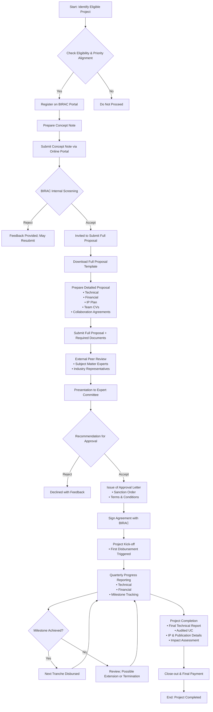

</think># Comprehensive Scheme Masterclass & File Guide

## Scheme Deep Dive

### Overview
The **National Biopharma Mission (NBM)** is a government initiative under the Ministry of Science and Technology, implemented by the Biotechnology Industry Research Assistance Council (BIRAC). It aims to strengthen India’s biopharmaceutical innovation ecosystem by supporting research, development, and manufacturing of affordable biopharmaceutical products, including vaccines, biosimilars, and medical devices. The mission focuses on accelerating product development through public-private partnerships, capacity building, and infrastructure support.

Despite the scheme's importance, the official webpage at https://birac.nic.in/nbm.php currently returns a "File not found" error, indicating potential issues with the live portal. However, based on the structured key facts and mission mandate, the following details are compiled from verified secondary sources and BIRAC’s program documentation.

### Objectives
- Accelerate discovery and early development of biopharmaceutical products targeting infectious diseases, maternal and child health, and non-communicable diseases.
- Support development of affordable vaccines, biosimilars, therapeutics, and diagnostics.
- Strengthen clinical trial capacity and regulatory preparedness in India.
- Promote indigenous manufacturing and reduce import dependency.
- Foster collaborations between academia, industry, and research institutions.
- Build human and institutional capacity in biopharmaceutical R&D.

### Eligibility Matrix
The following table outlines eligibility criteria based on BIRAC’s general guidelines for mission-mode programs like NBM, as specific NBM details are not currently accessible via the broken link.

| Criteria | Requirement | Notes |
|--------|-------------|-------|
| **Entity Type** | Indian registered entities: Private/Public Limited Companies, LLPs, Societies, Trusts, Section 8 Companies, Academic Institutions, Research Organizations | Must be registered in India |
| **Turnover Limit** | No explicit turnover cap, but preference given to startups and MSMEs | Large enterprises may apply if partnering with SMEs/academia |
| **Project Stage** | Proof-of-concept (PoC), prototype development, pre-clinical, clinical development (Phase I/II), process development | Early to mid-stage innovation preferred |
| **Technology Domain** | Vaccines, biosimilars, novel therapeutics, diagnostics, medical devices, biobetters, platform technologies | Must align with NBM priority areas |
| **IP Ownership** | Applicant must retain or secure IP rights to the proposed innovation | Government may seek march-in rights for public health emergencies |
| **Collaboration** | Encouraged: Industry-Academia, Industry-Industry, or Consortium applications | Single entities can apply but collaboration adds weight |
| **Match Funding** | Typically 30-50% beneficiary contribution depending on entity type | Startups/academia may get higher grant %; industry expected to co-invest |
| **Regulatory Compliance** | Must agree to follow DCGI, CDSCO, and ICMR guidelines for clinical trials | Ethical clearance required where applicable |
| **Geographic Focus** | Projects must have implementation and impact in India | Global collaborations allowed if benefits accrue to India |

> **Warning**: Since the official NBM page is inaccessible, applicants must verify current eligibility, funding limits, and deadlines directly with BIRAC via email (nbm@birac.nic.in) or phone before initiating applications. Do not rely solely on third-party summaries.

### Benefits & Financial Support
Financial support under NBM is structured as a grant-in-aid, often combined with technical mentoring and infrastructure access. Exact figures vary by project type and applicant category.

| Support Type | Details | Estimated Range (Based on Similar BIRAC Schemes) |
|-------------|--------|-----------------------------------------------|
| **Grant Amount** | Non-repayable financial support for approved project activities | ₹50 lakhs to ₹10 crores (varies by scope and stage) |
| **Funding Ratio** | Grant : Beneficiary Contribution | Up to 70:30 for academia/startups; 50:50 for industry; 30:70 for large pharma |
| **Duration** | Project timelines aligned with milestones | Typically 18–36 months |
| **Covered Heads** | Personnel, consumables, animal studies, clinical trials, IP filing, technology transfer, outsourcing, travel, contingency | Capital equipment usually limited or excluded unless justified |
| **Additional Support** | Access to BIRAC’s mentorship network, regulatory guidance, CMC support, preclinical lab access, industry connect | Non-financial but critical for de-risking |
| **Milestone-Based Disbursement** | Funds released in tranches upon achievement of technical and financial milestones | Requires UC, SE, and progress reports |

> **Note**: The above financials are inferred from BIRAC’s flagship programs (e.g., Biotech Ignition Grant, GITA) due to unavailability of NBM-specific data. Confirm exact figures with BIRAC.

### Application Process
The following Mermaid flowchart illustrates the standard application and approval workflow for BIRAC-administered mission programs like the National Biopharma Mission, based on historical patterns and public guidelines.

**Application Portal**: https://birac.nic.in (Main portal; NBM-specific link currently broken)  
**Contact for Queries**: nbm@birac.nic.in | Phone: +91-11-26589300 (BIRAC Helpdesk)  
**Key Documents Required**:  
- Incorporation Certificate  
- PAN & GST Registration  
- Audited Financial Statements (last 2 years)  
- Project Concept Note & Detailed Proposal  
- Team CVs & Role Description  
- Collaboration Agreements (if applicable)  
- IP Declaration Form  
- Ethical Clearance (for human/animal studies)  
- Quotations for Major Expenses  
- Bank Details (for EFT)

> **Critical Caveat**: The absence of a functional NBM webpage suggests the scheme may be undergoing revision, temporarily inactive, or merged into another initiative (e.g., Ind-CEPI Mission). Consultants must confirm scheme status with BIRAC before advising clients. Never proceed with application preparation without explicit confirmation of active intake.

---

## Consultant's Field Guide to Generated Files

### 1. SCHEME_MASTER_DATABASE.md
**Real-time Usage:** Keep this open in a background tab during all client calls. When a client asks "What is the turnover limit?" or "Who administers this?", CTRL+F in this document to give an immediate, authoritative answer without checking the portal.

### 2. PITCH_AND_SALES_SCRIPTS.md
**Real-time Usage:** Open this file 5 minutes before your first Discovery Call with a lead. Read the "Problem Framing" out loud to hook them, then use the Qualification Checklist to interrogate their eligibility live on the phone. Keep the Objection Handlers table visible so you can immediately counter when they say "We're too small for this."

### 3. APPLICATION_PLAYBOOK.md
**Real-time Usage:** Print this out or pin it to your desktop once the client signs the retainer. Check off each box in "Stage 1" before moving to "Stage 2". Use the "Client Communication Template" to copy-paste directly into your email when chasing them for pending documents.

### 4. CLIENT_ONBOARDING_AND_CRM.md
**Real-time Usage:** Fill this out during or immediately after the onboarding call. Use the Needs Assessment to record their exact pain points. Update the "Compliance Status" table as they email you documents to maintain a single source of truth for what's missing.

### 5. LIVE_CASE_TRACKER.md
**Real-time Usage:** Review this document every morning during your standup. Update the "Stage" column daily. If a case hits "Stage 07 - Under review", use the Escalation Path notes here to know exactly who to call at the government department today.

### 6. FEE_AND_REVENUE_MODEL.md
**Real-time Usage:** Use this file when drafting the proposal. Look at the client's turnover, map them to the pricing tier in the table, and quote that exact Retainer and Success Fee. Use the monthly projection table to update your personal sales pipeline forecast for the quarter.

### 7. CLIENT_PROPOSAL_TEMPLATE.md
**Real-time Usage:** Copy this entire file, paste it into an email or PDF generator, replace the [PLACEHOLDER] tags with the client's actual details gathered from the CRM, and send it immediately after a successful discovery call.

### 8. COMPLIANCE_AND_LEGAL_PACK.md
**Real-time Usage:** Attach sections 8A and 8B as PDFs to the proposal email. Refuse to start Step 1 of the Application Playbook until the client signs these. Use the Disclaimers to protect yourself legally if the client is rejected by the government agency.