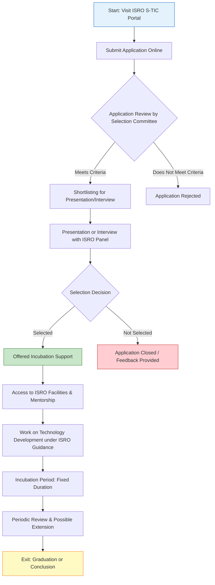

</think># Comprehensive Scheme Masterclass & File Guide

## Scheme Deep Dive

### Overview
The **Space Technology Incubation Centre (S-TIC)** is an initiative by the **Indian Space Research Organisation (ISRO)** aimed at fostering innovation and entrepreneurship in the space technology sector. It operates as a pan-India incubation program under the Ministry of Deep Tech & Innovation, with no direct financial grants but substantial non-financial support through access to ISRO’s expertise, infrastructure, and mentorship.

### Objectives
- To promote innovation and entrepreneurship in space technology  
- To provide incubation support to startups working on space-related applications  
- To facilitate access to ISRO's expertise, infrastructure, and technical mentorship  
- To encourage development of indigenous technologies for national space programs  
- To create a pipeline of innovative solutions for ISRO's future missions  

### Eligibility Matrix
| Criteria | Details | Source |
|--------|--------|--------|
| **Target Beneficiaries** | Startups; Entrepreneurs | Key Facts |
| **Domain Focus** | Space technology including satellite technology, remote sensing, navigation, space applications, and allied fields | Key Facts |
| **Innovation Requirement** | Innovative ideas, technologies, or applications in space technology | Key Facts |
| **Geographic Scope** | Pan-India | Key Facts |
| **Entity Type** | Registered startups and entrepreneurs | Key Facts |

> **Note**: There is no turnover limit, employee count restriction mentioned in the evidence. Eligibility is primarily based on domain relevance and innovation quotient.

### Benefits & Financial Support
| Benefit Category | Specific Support | Details |
|------------------|------------------|---------|
| **Technical Mentorship** | Access to ISRO scientists and engineers | Guidance on technology development, testing, and validation |
| **Infrastructure Support** | Access to ISRO facilities | Labs, testing equipment, and development environments |
| **Networking Opportunities** | Industry and academia connections | Facilitated collaborations within the space ecosystem |
| **Investor Connect** | Potential investor introductions | Guidance on funding pathways (external sourcing required) |
| **Non-Financial Grants** | None | The program does **not** provide direct financial grants or funding |
| **Incubation Duration** | Fixed period | Typically time-bound, subject to periodic review and availability of slots |

> **Critical Caveat**:  
> > The S-TIC program does **not** provide direct financial grants or funding to incubated startups. Support is primarily non-financial. Any financial support must be sourced externally by the startup.  
> > Selection is competitive and based on alignment with ISRO's technology priorities.  
> > Incubation period is limited and subject to periodic review.  
> > Startups must comply with ISRO's safety, security, and confidentiality guidelines.  
> > Intellectual property rights arising from incubation may be subject to specific agreements.

### Required Documents
1. Certificate of Incorporation or Registration  
2. Detailed project proposal or business plan  
3. Proof of concept or prototype details (if available)  
4. Team profile and qualifications  
5. Any relevant intellectual property details  
6. Declaration of originality and compliance with guidelines  

### Application Process (Mermaid Flowchart)

**Application Portal**: [https://www.isro.gov.in/s-tic](https://www.isro.gov.in/s-tic)  
**Status / Deadlines**: Rolling basis — applications accepted throughout the year, subject to availability of incubation slots and review cycles.

---

## Consultant's Field Guide to Generated Files

### 1. SCHEME_MASTER_DATABASE.md
**Real-time Usage**: Keep this open in a background tab during all client calls. When a client asks "What is the turnover limit?" or "Who administers this?", CTRL+F in this document to give an immediate, authoritative answer without checking the portal.

### 2. PITCH_AND_SALES_SCRIPTS.md
**Real-time Usage**: Open this file 5 minutes before your first Discovery Call with a lead. Read the "Problem Framing" out loud to hook them, then use the Qualification Checklist to interrogate their eligibility live on the phone. Keep the Objection Handlers table visible so you can immediately counter when they say "We're too small for this."

### 3. APPLICATION_PLAYBOOK.md
**Real-time Usage**: Print this out or pin it to your desktop once the client signs the retainer. Check off each box in "Stage 1" before moving to "Stage 2". Use the "Client Communication Template" to copy-paste directly into your email when chasing them for pending documents.

### 4. CLIENT_ONBOARDING_AND_CRM.md
**Real-time Usage**: Fill this out during or immediately after the onboarding call. Use the Needs Assessment to record their exact pain points. Update the "Compliance Status" table as they email you documents to maintain a single source of truth for what's missing.

### 5. LIVE_CASE_TRACKER.md
**Real-time Usage**: Review this document every morning during your standup. Update the "Stage" column daily. If a case hits "Stage 07 - Under review", use the Escalation Path notes here to know exactly who to call at the government department today.

### 6. FEE_AND_REVENUE_MODEL.md
**Real-time Usage**: Use this file when drafting the proposal. Look at the client's turnover, map them to the pricing tier in the table, and quote that exact Retainer and Success Fee. Use the monthly projection table to update your personal sales pipeline forecast for the quarter.

### 7. CLIENT_PROPOSAL_TEMPLATE.md
**Real-time Usage**: Copy this entire file, paste it into an email or PDF generator, replace the [PLACEHOLDER] tags with the client's actual details gathered from the CRM, and send it immediately after a successful discovery call.

### 8. COMPLIANCE_AND_LEGAL_PACK.md
**Real-time Usage**: Attach sections 8A and 8B as PDFs to the proposal email. Refuse to start Step 1 of the Application Playbook until the client signs these. Use the Disclaimers to protect yourself legally if the client is rejected by the government agency.