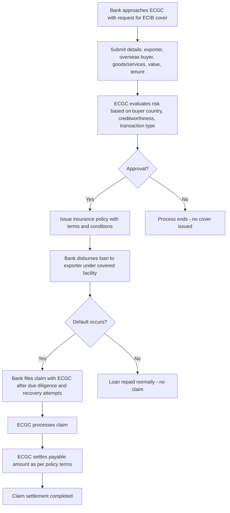

# Comprehensive Scheme Masterclass & File Guide

## Scheme Deep Dive

### Overview
Export Credit Insurance for Banks (ECIB) is a scheme administered by the Export Credit Guarantee Corporation of India Limited (ECGC) under the Ministry of Commerce & Industry, Government of India. It provides insurance cover to banks and financial institutions in India that extend pre-shipment and post-shipment credit to exporters. The scheme aims to mitigate risks of non-payment by overseas buyers, encourage banks to lend more confidently to exporters (especially MSMEs), and support timely realization of export proceeds. The application process is rolling, with no fixed deadlines, and the portal is accessible at https://www.ecgcltd.in.

### Objectives
- Provide credit insurance cover to banks for export-related lending
- Mitigate risks of non-payment by overseas buyers in export transactions
- Encourage banks to extend more credit to exporters, especially MSMEs
- Support pre-shipment and post-shipment export finance
- Strengthen the export credit ecosystem in India
- Promote timely realization of export proceeds
- Reduce financial stress on exporters due to buyer default
- Enhance confidence in cross-border trade financing

### Eligibility Matrix
| **Eligibility Criteria** | **Details** | **Source** |
|--------------------------|-------------|------------|
| **Applicant Entity** | Banks and financial institutions in India | Key Facts |
| **Credit Facility Type** | Pre-shipment and post-shipment credit to exporters | Key Facts |
| **Exporter Requirement** | Indian entity engaged in export of goods or services | Key Facts |
| **Buyer Requirement** | Overseas buyer (non-resident) | Key Facts |
| **Transaction Nature** | Bonafide export transaction as per RBI guidelines | Key Facts |
| **Geographic Scope** | Pan-India | Key Facts |
| **Implementing Agency** | Export Credit Guarantee Corporation of India Limited (ECGC) | Key Facts |

### Benefits & Financial Support
| **Benefit Category** | **Details** | **Financial Support** | **Source** |
|----------------------|-------------|------------------------|------------|
| **Insurance Cover** | Cover up to 90% of the loan amount extended by banks to exporters for pre-shipment and post-shipment finance | 90% of loan amount | Key Facts |
| **Premium Payment** | Paid by the bank | - | Key Facts |
| **Claim Settlement** | Settled in case of buyer default due to insolvency, protracted default, or political events | As per policy terms after exhaustive recovery efforts | Key Facts |
| **Risk Coverage** | Commercial and political risks of non-payment by overseas buyers | - | Key Facts |
| **Impact on Banks** | Enables confident lending to exporters, reduces NPAs in export loan portfolios | - | Key Facts |
| **Impact on Exporters** | Easier access to working capital and term loans at competitive rates | - | Key Facts |
| **Mechanism** | Submission of claim documents by bank to ECGC after exhausting recovery efforts | - | Key Facts |

### Application Process Flowchart

### Required Documents
1. Loan sanction letter
2. Export order or contract
3. Invoice and shipping documents
4. Buyer’s creditworthiness details
5. Bank’s due diligence report
6. Policy application form
7. Details of security offered
8. RBI approval if applicable

### Key Caveats
> - Cover is subject to terms and conditions of the ECIB policy  
> - Claims are payable only after exhaustive recovery efforts by the bank  
> - Political risk cover may have sub-limits or exclusions based on country  
> - Pre-existing debts or rollovers may not be eligible  
> - Fraudulent or misrepresented transactions are excluded  

### Contact Details
- **Email**: info@ecgc.in  
- **Helpline**: 1800-22-7788  
- **Application Portal**: https://www.ecgcltd.in  

---

## Consultant's Field Guide to Generated Files

### 1. SCHEME_MASTER_DATABASE.md
**Real-time Usage:** Keep this open in a background tab during all client calls. When a client asks "What is the turnover limit?" or "Who administers this?", CTRL+F in this document to give an immediate, authoritative answer without checking the portal.

### 2. PITCH_AND_SALES_SCRIPTS.md
**Real-time Usage:** Open this file 5 minutes before your first Discovery Call with a lead. Read the "Problem Framing" out loud to hook them, then use the Qualification Checklist to interrogate their eligibility live on the phone. Keep the Objection Handlers table visible so you can immediately counter when they say "We're too small for this."

### 3. APPLICATION_PLAYBOOK.md
**Real-time Usage:** Print this out or pin it to your desktop once the client signs the retainer. Check off each box in "Stage 1" before moving to "Stage 2". Use the "Client Communication Template" to copy-paste directly into your email when chasing them for pending documents.

### 4. CLIENT_ONBOARDING_AND_CRM.md
**Real-time Usage:** Fill this out during or immediately after the onboarding call. Use the Needs Assessment to record their exact pain points. Update the "Compliance Status" table as they email you documents to maintain a single source of truth for what's missing.

### 5. LIVE_CASE_TRACKER.md
**Real-time Usage:** Review this document every morning during your standup. Update the "Stage" column daily. If a case hits "Stage 07 - Under review", use the Escalation Path notes here to know exactly who to call at the government department today.

### 6. FEE_AND_REVENUE_MODEL.md
**Real-time Usage:** Use this file when drafting the proposal. Look at the client's turnover, map them to the pricing tier in the table, and quote that exact Retainer and Success Fee. Use the monthly projection table to update your personal sales pipeline forecast for the quarter.

### 7. CLIENT_PROPOSAL_TEMPLATE.md
**Real-time Usage:** Copy this entire file, paste it into an email or PDF generator, replace the [PLACEHOLDER] tags with the client's actual details gathered from the CRM, and send it immediately after a successful discovery call.

### 8. COMPLIANCE_AND_LEGAL_PACK.md
**Real-time Usage:** Attach sections 8A and 8B as PDFs to the proposal email. Refuse to start Step 1 of the Application Playbook until the client signs these. Use the Disclaimers to protect yourself legally if the client is rejected by the government agency.