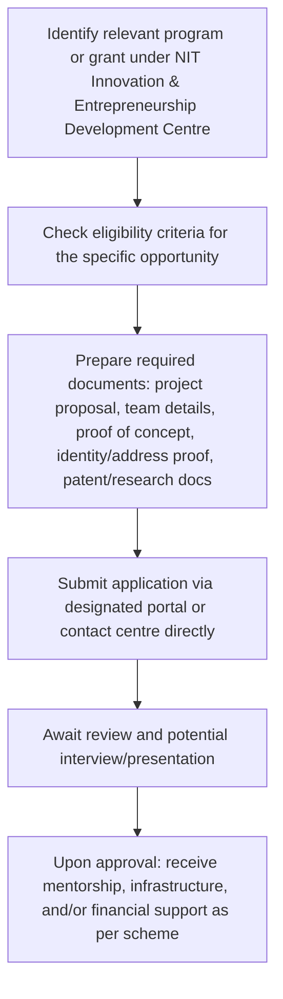

# Comprehensive Scheme Masterclass & File Guide

## Scheme Deep Dive

### Overview
The **NIT Innovation & Entrepreneurship Development Centre** is an incubation and acceleration scheme implemented by the **National Institute of Technology Karnataka (NITK), Surathkal** under the Ministry of Education, Government of India. It operates with a geographic scope limited to Karnataka and focuses on fostering innovation and entrepreneurship among students, faculty, and alumni of NITK Surathkal. The scheme does not have a standardized financial support structure but facilitates access to external funding sources such as DST NIDHI Prayas Grant, CSR grants, and sponsored research projects. Financial support varies by program, with examples like the Rs. 9.3 lakh grant received by Oxyheal Pvt. Ltd. under DST NIDHI Prayas. The application process is program-specific, with some opportunities rolling and others having fixed deadlines as announced. The implementing agency is NITK Surathkal, and the application portal is https://www.nitk.ac.in. The scheme was last updated in 2022 and carries a medium confidence level in data accuracy.

### Objectives
The scheme aims to:
- Promote innovation and entrepreneurship among students and faculty
- Provide mentoring and infrastructure support to startups
- Strengthen industry-institute linkages for technology transfer
- Support commercialization of research outcomes
- Encourage student participation in national innovation programs

### Eligibility Matrix
| Beneficiary Category | Eligibility Criteria | Notes |
|----------------------|----------------------|-------|
| Students | Must be enrolled at NITK Surathkal and engaged in innovative projects or startup ideas | Specific criteria may vary by program |
| Faculty | Must be employed at NITK Surathkal and engaged in innovative projects or startup ideas | Specific criteria may vary by program |
| Alumni | Must be graduates of NITK Surathkal and engaged in innovative projects or startup ideas | Specific criteria may vary by program |
| Startups | Must be founded by NITK Surathkal students, faculty, or alumni and engaged in innovative projects | Specific criteria may vary by program |

> **Important**: Eligibility is not standardized across all programs under the centre. Applicants must check the specific criteria for the grant or program they are applying for.

### Benefits & Financial Support
| Benefit Type | Details | Evidence/Examples |
|--------------|---------|-------------------|
| Incubation Infrastructure | Access to labs, workspace, and facilities at NITK Surathkal | Provided by the centre |
| Mentorship | Guidance from faculty and industry experts | Listed in benefits |
| Networking Opportunities | Connections with peers, investors, and industry | Listed in benefits |
| Patent Filing & Technology Transfer Support | Assistance with IP protection and commercialization | Listed in benefits |
| Government Grant Application Assistance | Help in applying for DST, CSR, and other schemes | Listed in benefits |
| Entrepreneurship Development Programs | Training and workshops on startup skills | Listed in benefits |
| Financial Support | Access to external funding (not guaranteed) | Examples: DST NIDHI Prayas Grant (Rs. 9.3 lakh for Oxyheal Pvt. Ltd.), CSR grants, sponsored research projects |
| Funding Examples | Rs. 9.3 lakh under DST NIDHI Prayas for Oxyheal Pvt. Ltd. | Explicitly mentioned in key facts |
| Other Funding Sources | CSR grants (e.g., Boeing CSR Grants Scholarship received by NITK Students), sponsored research (e.g., ₹1.39 Crore project grant to Prof. Prasanna Belur & Team) | Evidenced in crawled pages |

> **Warning**: Financial support is not guaranteed and depends on external funding availability. Incubation support is subject to periodic review and performance. Some programs may have specific sectoral or technological focus. Intellectual property rights may be governed by institute policies.

### Application Process
The application process varies by specific program or grant under the centre. However, the general steps are as follows:

**Required Documents** (as per key facts):
1. Project proposal or business plan
2. Team member details and qualifications
3. Proof of concept or prototype details
4. Identity and address proof of applicants
5. Any existing patent or research documentation

**Contact Details**:
- Email: dean.ri@nitk.edu.in
- Phone: 0824-2474017
- Mobile: 9480055475

**Application Portal**: https://www.nitk.ac.in  
**Status/Deadlines**: Varies by program; some are rolling basis, others have specific dates as announced  
**Last Updated**: 2022  
**Confidence**: Medium

---

## Consultant's Field Guide to Generated Files

### 1. SCHEME_MASTER_DATABASE.md
**Real-time Usage**: Keep this open in a background tab during all client calls. When a client asks "What is the turnover limit?" or "Who administers this?", CTRL+F in this document to give an immediate, authoritative answer without checking the portal.

### 2. PITCH_AND_SALES_SCRIPTS.md
**Real-time Usage**: Open this file 5 minutes before your first Discovery Call with a lead. Read the "Problem Framing" out loud to hook them, then use the Qualification Checklist to interrogate their eligibility live on the phone. Keep the Objection Handlers table visible so you can immediately counter when they say "We're too small for this."

### 3. APPLICATION_PLAYBOOK.md
**Real-time Usage**: Print this out or pin it to your desktop once the client signs the retainer. Check off each box in "Stage 1" before moving to "Stage 2". Use the "Client Communication Template" to copy-paste directly into your email when chasing them for pending documents.

### 4. CLIENT_ONBOARDING_AND_CRM.md
**Real-time Usage**: Fill this out during or immediately after the onboarding call. Use the Needs Assessment to record their exact pain points. Update the "Compliance Status" table as they email you documents to maintain a single source of truth for what's missing.

### 5. LIVE_CASE_TRACKER.md
**Real-time Usage**: Review this document every morning during your standup. Update the "Stage" column daily. If a case hits "Stage 07 - Under review", use the Escalation Path notes here to know exactly who to call at the government department today.

### 6. FEE_AND_REVENUE_MODEL.md
**Real-time Usage**: Use this file when drafting the proposal. Look at the client's turnover, map them to the pricing tier in the table, and quote that exact Retainer and Success Fee. Use the monthly projection table to update your personal sales pipeline forecast for the quarter.

### 7. CLIENT_PROPOSAL_TEMPLATE.md
**Real-time Usage**: Copy this entire file, paste it into an email or PDF generator, replace the [PLACEHOLDER] tags with the client's actual details gathered from the CRM, and send it immediately after a successful discovery call.

### 8. COMPLIANCE_AND_LEGAL_PACK.md
**Real-time Usage**: Attach sections 8A and 8B as PDFs to the proposal email. Refuse to start Step 1 of the Application Playbook until the client signs these. Use the Disclaimers to protect yourself legally if the client is rejected by the government agency.