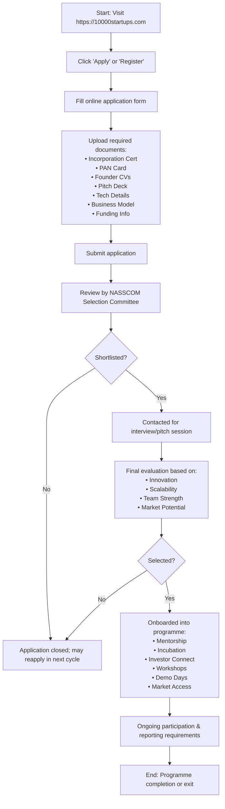

</think># Comprehensive Scheme Masterclass & File Guide

## Scheme Deep Dive

### Overview
The **NASSCOM 10000 Startups Programme** is a pan-India incubation and acceleration initiative implemented by **NASSCOM (National Association of Software and Service Companies)**. Designed to nurture and scale 10,000 technology startups across India, the programme operates on a **rolling basis** with periodic selection cycles throughout the year. It does not provide direct grants or equity funding but facilitates indirect access to capital through investor networks, demo days, and pitch events. The application portal is hosted at **[https://10000startups.com](https://10000startups.com)**.

### Objectives
The programme aims to:
- Nurture and scale 10,000 technology startups in India  
- Provide mentorship and guidance from industry experts  
- Facilitate access to funding through investor connects  
- Offer infrastructure and incubation support  
- Enable market access and industry linkages  
- Promote innovation in emerging technologies such as AI, IoT, and blockchain  
- Build a sustainable and inclusive startup ecosystem  
- Support startups through all stages of growth from idea to scale  

### Eligibility Matrix
| Criteria | Requirement | Source |
|--------|-------------|--------|
| **Startup Stage** | Early-stage (idea, prototype, or early revenue stage); no restriction on year of incorporation but preference given to early traction | Key Facts |
| **Geographic Scope** | Pan-India; incorporated in India | Key Facts |
| **Sector Focus** | Technology-driven startups in software, hardware, AI, IoT, fintech, healthtech, and other emerging technologies | Key Facts |
| **Business Model** | Must have a scalable business model | Key Facts |
| **Founder Commitment** | Led by committed founders | Key Facts |
| **Innovation Level** | Working on innovative products or services | Key Facts |
| **Funding Status** | No restriction; existing funding details to be disclosed | Key Facts |

> **Note**: The programme does not guarantee funding or equity investment. Selection is competitive and based on evaluation by the NASSCOM selection committee.

### Benefits & Financial Support
While the programme does not offer direct financial grants or equity, it provides substantial non-financial and indirect financial support:

| Benefit Category | Specific Offerings | Source |
|------------------|--------------------|--------|
| **Mentorship** | Access to industry leaders and experienced mentors | Key Facts |
| **Network Access** | Connection to NASSCOM’s network of investors, corporates, and potential customers/partners | Key Facts |
| **Incubation Support** | Office infrastructure and incubation facilities (varies by location and partner) | Key Facts |
| **Technical & Business Support** | Workshops, training sessions, and skill-building programmes | Key Facts |
| **Investor Connect** | Facilitation through demo days, pitch events, and investor networking opportunities | Key Facts |
| **Market Access** | Opportunities for global market exposure and industry linkages | Key Facts |
| **Indirect Financial Support** | Access to angel investors, VC funds, and other funding sources via programme-facilitated engagements | Key Facts |

> **Caveat**: Incubation and office support may vary by location and partner. Startups must comply with reporting and participation requirements during the programme.

### Required Documents
Applicants must submit the following documents via the online portal:
1. Certificate of Incorporation / Registration  
2. PAN card of the startup  
3. Founder profiles and CVs  
4. Product description or pitch deck  
5. Details of technology or innovation  
6. Business model and revenue plan (if applicable)  
7. Any existing funding or investment details  

### Application Process
The application process is conducted entirely online through the official portal and involves multiple stages of review:

**Key Notes**:
- Applications are accepted on a **rolling basis** with periodic selection cycles.
- Final selection is based on innovation, scalability, team strength, and market potential.
- Selected startups gain access to mentorship, incubation, investor connects, and demo days.
- The programme focuses primarily on **technology-driven startups**.
- There is **no application fee** mentioned in the evidence.

### Key Caveats
> - The programme does **not guarantee funding or equity investment**.  
> - Selection is **competitive** and based on evaluation by the NASSCOM committee.  
> - Benefits such as incubation and office support **may vary by location and partner**.  
> - Startups must **comply with reporting and participation requirements** during the programme.  
> - The programme focuses **primarily on technology-driven startups**.  

---

## Consultant's Field Guide to Generated Files

### 1. SCHEME_MASTER_DATABASE.md
**Real-time Usage**: Keep this open in a background tab during all client calls. When a client asks "What is the turnover limit?" or "Who administers this?", CTRL+F in this document to give an immediate, authoritative answer without checking the portal.

### 2. PITCH_AND_SALES_SCRIPTS.md
**Real-time Usage**: Open this file 5 minutes before your first Discovery Call with a lead. Read the "Problem Framing" out loud to hook them, then use the Qualification Checklist to interrogate their eligibility live on the phone. Keep the Objection Handlers table visible so you can immediately counter when they say "We're too small for this."

### 3. APPLICATION_PLAYBOOK.md
**Real-time Usage**: Print this out or pin it to your desktop once the client signs the retainer. Check off each box in "Stage 1" before moving to "Stage 2". Use the "Client Communication Template" to copy-paste directly into your email when chasing them for pending documents.

### 4. CLIENT_ONBOARDING_AND_CRM.md
**Real-time Usage**: Fill this out during or immediately after the onboarding call. Use the Needs Assessment to record their exact pain points. Update the "Compliance Status" table as they email you documents to maintain a single source of truth for what's missing.

### 5. LIVE_CASE_TRACKER.md
**Real-time Usage**: Review this document every morning during your standup. Update the "Stage" column daily. If a case hits "Stage 07 - Under review", use the Escalation Path notes here to know exactly who to call at the government department today.

### 6. FEE_AND_REVENUE_MODEL.md
**Real-time Usage**: Use this file when drafting the proposal. Look at the client's turnover, map them to the pricing tier in the table, and quote that exact Retainer and Success Fee. Use the monthly projection table to update your personal sales pipeline forecast for the quarter.

### 7. CLIENT_PROPOSAL_TEMPLATE.md
**Real-time Usage**: Copy this entire file, paste it into an email or PDF generator, replace the [PLACEHOLDER] tags with the client's actual details gathered from the CRM, and send it immediately after a successful discovery call.

### 8. COMPLIANCE_AND_LEGAL_PACK.md
**Real-time Usage**: Attach sections 8A and 8B as PDFs to the proposal email. Refuse to start Step 1 of the Application Playbook until the client signs these. Use the Disclaimers to protect yourself legally if the client is rejected by the government agency.