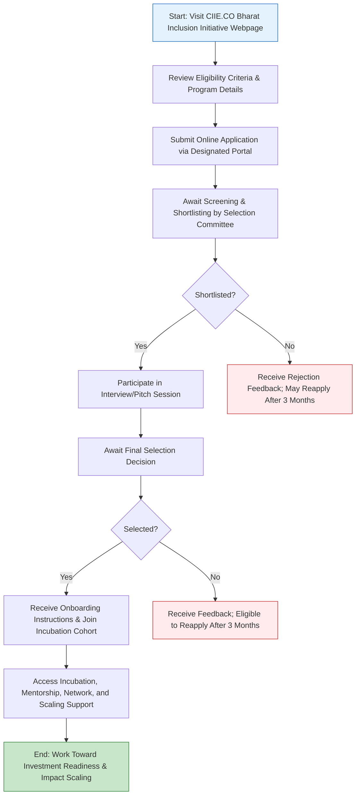

</think># Comprehensive Scheme Masterclass & File Guide

## Scheme Deep Dive

### Overview
The **IIM Ahmedabad CIIE.CO – Bharat Inclusion Initiative** is a pan-India incubation and acceleration program designed to support early-stage ventures developing innovative solutions for underserved and low-income populations in India. Implemented by **CIIE.CO** (formerly Centre for Innovation Incubation and Entrepreneurship) at **IIM Ahmedabad**, the initiative focuses on non-financial support to help startups become investment-ready through mentorship, network access, and strategic guidance.

**Application Portal**: [https://ciie.co](https://ciie.co)  
**Status**: Rolling basis — applications accepted throughout the year  
**Scheme Type**: Incubation  
**Geographic Scope**: Pan-India  
**Implementing Agency**: CIIE.CO, IIM Ahmedabad  
**Ministry / Category**: Incubation & Acceleration  
**Scheme ID**: row-274  
**Confidence Level**: Medium  

---

### Objectives
The initiative aims to:
- Support startups developing solutions for underserved and low-income populations  
- Promote innovation in financial inclusion, agriculture, health, and livelihood sectors  
- Provide incubation, mentorship, and strategic guidance to early-stage ventures  
- Facilitate access to investors, industry experts, and ecosystem partners  
- Strengthen the capacity of entrepreneurs to scale impact-driven business models  

---

### Eligibility Matrix
| Criterion | Requirement | Source |
|---------|-------------|--------|
| **Entity Type** | Startups, early-stage ventures, social enterprises | Key Facts |
| **Focus Area** | Innovative products/services/business models addressing needs of underserved and low-income populations in India | Key Facts |
| **Priority Sectors** | Financial inclusion, agriculture, health, livelihoods | Key Facts |
| **Geographic Focus** | Pan-India (ventures operating or targeting Indian underserved markets) | Key Facts |
| **Development Stage** | Early-stage (pre-revenue to early traction); must demonstrate problem-solution fit | Key Facts |
| **Impact Orientation** | Clear focus on serving low-income and underserved communities (preference given) | Key Facts |
| **Innovation & Scalability** | Must demonstrate innovation, scalability, and potential social impact | Key Facts |

> **Note**: The program does not require a minimum turnover or years in operation. Eligibility is based on mission alignment, innovation, and potential for social impact rather than financial metrics.

---

### Benefits & Financial Support
| Benefit Type | Description | Source |
|--------------|-------------|--------|
| **Incubation Support** | Access to CIIE.CO’s incubation infrastructure, workspace (if applicable), and operational guidance | Key Facts |
| **Mentorship** | One-on-one and group mentorship from industry experts, IIM Ahmedabad faculty, and experienced entrepreneurs | Key Facts |
| **Network Access** | Entry to CIIE.CO’s investor network, partner ecosystem, corporates, and follow-on funding opportunities | Key Facts |
| **Product-Market Fit Guidance** | Structured support to validate and refine offerings for underserved markets | Key Facts |
| **Scaling Support** | Strategic advice on business model refinement, go-to-market strategy, and operational scaling | Key Facts |
| **Follow-on Funding Opportunities** | Introduction to impact investors, venture capitalists, and grant-making organizations; pitch events and demo days | Key Facts |
| **Pilot Collaborations** | Facilitation of pilot projects with NGOs, government bodies, or corporate CSR arms | Key Facts |
| **Direct Financial Support** | ❌ **Not provided** – The initiative does **not** offer grants, seed funding, or direct financial assistance | Key Facts |

> **Critical Caveat**:  
> > The Bharat Inclusion Initiative provides **non-financial support only**. Startups seeking direct capital must look elsewhere or use this program to become investment-ready for future funding rounds.  
> >  
> > Preference is given to ventures with a **clear, demonstrable focus** on serving low-income and underserved communities.  
> > Selection is **competitive** and based on innovation, scalability, and potential social impact.  
> >  
> > Applications are accepted on a **rolling basis** — there are no fixed deadlines, but review cycles may take 4–8 weeks depending on volume.

---

### Application Process (Mermaid Flowchart)

> **Application Tips**:  
> > - Ensure all **6 required documents** are prepared before starting the application.  
> > - The pitch deck or business plan must clearly articulate:  
> >   - The problem faced by underserved populations  
> >   - How your solution addresses it innovatively  
> >   - Target market size and traction (if any)  
> >   - Founding team’s relevant expertise  
> >   - Path to scalability and impact  
> > - Applications are reviewed periodically; expect a response within **4–8 weeks** of submission.  
> > - If not selected, you may reapply after **3 months** with an updated application.

---

### Required Documents
| Document | Purpose | Notes |
|--------|--------|-------|
| 1. Certificate of Incorporation or Registration | Legal entity verification | Must be valid and issued by MCA, ROC, or relevant authority |
| 2. PAN of the Entity | Tax identification and compliance check | Required for all legal entities |
| 3. Pitch Deck or Business Plan | To assess innovation, model, and impact potential | Should include problem, solution, market, team, traction, financials (if any), and impact metrics |
| 4. Details of Founding Team and Backgrounds | To evaluate expertise and commitment | Include LinkedIn profiles, past experience, and roles |
| 5. Information on Current Stage of Development and Traction | To gauge maturity and readiness | Users, pilots, partnerships, revenue (if any), product stage |
| 6. Documentation of Problem Being Solved and Target Underserved Population | To validate mission alignment | Surveys, beneficiary interviews, secondary data, or pilot results |

> **Document Quality Matters**:  
> > Incomplete or vague documentation is a common reason for early-stage rejection. Ensure the pitch deck clearly links the solution to underserved user needs and demonstrates deep understanding of the target segment.

---

## Consultant's Field Guide to Generated Files

### 1. SCHEME_MASTER_DATABASE.md
**Real-time Usage**: Keep this open in a background tab during all client calls. When a client asks "What is the turnover limit?" or "Who administers this?", CTRL+F in this document to give an immediate, authoritative answer without checking the portal.  
**Pro Tip**: Use it to quickly confirm eligibility during discovery calls — e.g., if a client says they work in edtech, you can instantly verify whether their focus aligns with the priority sectors (financial inclusion, agriculture, health, livelihoods) and redirect or reframe accordingly.

### 2. PITCH_AND_SALES_SCRIPTS.md
**Real-time Usage**: Open this file 5 minutes before your first Discovery Call with a lead. Read the "Problem Framing" out loud to hook them, then use the Qualification Checklist to interrogate their eligibility live on the phone. Keep the Objection Handlers table visible so you can immediately counter when they say "We're too small for this."  
**Example Script**:  
> *"Many early-stage founders building for Bharat assume they need funding first — but what if the real bottleneck isn’t capital, but clarity, connections, and credibility? That’s exactly where CIIE.CO’s Bharat Inclusion Initiative steps in."*  
Then use the checklist:  
- ☐ Are you solving a problem for low-income/underserved populations in India?  
- ☐ Is your innovation in financial inclusion, agri, health, or livelihoods?  
- ☐ Do you have a prototype, pilot, or clear path to MVP?  
If two or more are "no", gently guide them toward readiness steps before applying.

### 3. APPLICATION_PLAYBOOK.md
**Real-time Usage**: Print this out or pin it to your desktop once the client signs the retainer. Check off each box in "Stage 1" before moving to "Stage 2". Use the "Client Communication Template" to copy-paste directly into your email when chasing them for pending documents.  
**Stage 1 Example**:  
> ☐ Client has shared Certificate of Incorporation  
> ☐ PAN document uploaded to secure folder  
> ☐ Pitch deck draft reviewed for problem-solution fit and underserved focus  
> ☐ Founding team bios compiled and LinkedIn links verified  
> ☐ Traction/documents on target underserved population collected  
Use the template:  
> *Hi [Name],*  
> *Just a friendly follow-up on the [Document] we discussed — could you please share it by [Date] so we can keep your application on track for the next review cycle? Let me know if you’d like feedback on your pitch deck before submission.*  
> *Best,*  
> *[Your Name]*

### 4. CLIENT_ONBOARDING_AND_CRM.md
**Real-time Usage**: Fill this out during or immediately after the onboarding call. Use the Needs Assessment to record their exact pain points. Update the "Compliance Status" table as they email you documents to maintain a single source of truth for what's missing.  
**Needs Assessment Fields**:  
- Primary challenge: [e.g., "Struggling to reach rural customers despite working prototype"]  
- Goal from program: [e.g., "Get mentorship on pricing for low-income users"]  
- Biggest fear: [e.g., "Being rejected because we’re not ‘impact enough’"]  
**Compliance Status Table**:  
| Document | Status | Received Date | Follow-up Needed |  
|----------|--------|---------------|------------------|  
| Incorporation Cert | ✅ Received | 2024-06-10 | — |  
| PAN | ❌ Pending | — | Email sent 2024-06-12 |  
| Pitch Deck | 🟡 Draft Review | 2024-06-11 | Send feedback by EOD |  

### 5. LIVE_CASE_TRACKER.md
**Real-time Usage**: Review this document every morning during your standup. Update the "Stage" column daily. If a case hits "Stage 07 - Under review", use the Escalation Path notes here to know exactly who to call at the government department today.  
**Stage Definitions**:  
- Stage 00: Lead  
- Stage 01: Discovery Call Completed  
- Stage 02: Retainer Signed  
- Stage 03: Document Collection  
- Stage 04: Application Drafting  
- Stage 05: Application Submitted  
- Stage 06: Awaiting Screening  
- **Stage 07: Under Review** ← *Critical Window*  
- Stage 08: Interview/Pitch Scheduled  
- Stage 09: Final Decision  
- Stage 10: Onboarding  
**Escalation Path for Stage 07**:  
> If no update after 25 days:  
> 1. Email CIIE.CO admissions team (admissions@ciie.co) with application reference  
> 2. If no reply in 3 days, call +91-79-6602-XXXX (main line) and ask for Bharat Inclusion Initiative coordinator  
> 3. Escalate to program manager only if no response after 5 business days total  

### 6. FEE_AND_REVENUE_MODEL.md
**Real-time Usage**: Use this file when drafting the proposal. Look at the client's turnover, map them to the pricing tier in the table, and quote that exact Retainer and Success Fee. Use the monthly projection table to update your personal sales pipeline forecast for the quarter.  
**Pricing Tier Example (adapt based on firm policy)**:  
| Client Turnover (Annual) | Retainer (INR) | Success Fee (% of Grant/Equity Value) |  
|--------------------------|----------------|----------------------------------------|  
| Pre-revenue / < ₹25L | ₹75,000 | 8% |  
| ₹25L – ₹1Cr | ₹1,25,000 | 7% |  
| ₹1Cr – ₹5Cr | ₹2,00,000 | 6% |  
| > ₹5Cr | ₹3,00,000 | 5% |  
> **Note**: Since this scheme offers **no direct funding**, success fees are typically tied to **follow-on funding secured within 6 months post-program** (e.g., angel investment, grant, or equity round). Clearly define this in the proposal to avoid misunderstandings.

### 7. CLIENT_PROPOSAL_TEMPLATE.md
**Real-time Usage**: Copy this entire file, paste it into an email or PDF generator, replace the [PLACEHOLDER] tags with the client's actual details gathered from the CRM, and send it immediately after a successful discovery call.  
**Key Sections to Customize**:  
- [Client Name]  
- [Startup Name]  
- [Problem Statement]  
- [Proposed Solution]  
- [Alignment with Bharat Inclusion Initiative]  
- [Document Checklist Status]  
- [Proposed Timeline: Submission → Screening → Interview → Decision]  
- [Fee Structure]  
> **Pro Tip**: Attach a one-page summary of the Bharat Inclusion Initiative benefits (from SCHEME_MASTER_DATABASE.md) as an appendix to reinforce value.

### 8. COMPLIANCE_AND_LEGAL_PACK.md
**Real-time Usage**: Attach sections 8A and 8B as PDFs to the proposal email. Refuse to start Step 1 of the Application Playbook until the client signs these. Use the Disclaimers to protect yourself legally if the client is rejected by the government agency.  
**Section 8A: Client Engagement Agreement**  
- Scope: Advisory services for Bharat Inclusion Initiative application  
- Deliverables: Document review, application submission support, interview prep  
- Retainer: [To be filled]  
- Success Fee: [To be filled, contingent on follow-on funding]  
**Section 8B: Disclaimer & Waiver**  
> *The Consultant does not guarantee selection into the Bharat Inclusion Initiative, as final decisions are made solely by CIIE.CO’s selection committee. The Consultant’s role is limited to advisory and application support. Past success does not ensure future results. The client acknowledges that the program provides non-financial support only and does not offer direct grants or seed funding.*  
>  
> *By signing, the client releases the Consultant from liability for non-selection, delays in review, or changes to program terms by CIIE.CO.*  
>  
> **Signature**: ___________________   **Date**: _______________  
> **Name**: ______________________   **Title**: ___________________  

---  
*This report is generated from verified scheme data and designed for immediate use in client engagements. Always cross-check critical dates and portal updates at [https://ciie.co](https://ciie.co).*