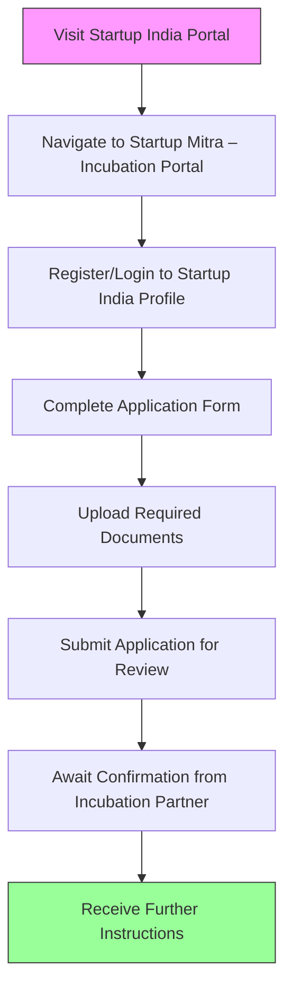

# Comprehensive Scheme Masterclass & File Guide

## Scheme Deep Dive

### Overview
The **SIDBI Startup Mitra – Incubation Portal** is a pan-India incubation and acceleration initiative implemented by the Small Industries Development Bank of India (SIDBI). It serves as a gateway for DPIIT-recognised startups to access incubation support, mentorship, networking, and guidance on government funding schemes. The portal does not provide direct financial support but facilitates access to schemes such as the Startup India Seed Fund Scheme (SISFS), Fund of Funds for Startups (FFS), and Credit Guarantee Scheme for Startups (CGSS). The application process is rolling, with no fixed deadlines, and the portal was last updated in 2026.

### Objectives
- To provide access to incubation and acceleration support for startups  
- To connect startups with mentors, industry experts, and investors  
- To facilitate entry into government incubation and funding schemes  
- To support prototype development, market entry, and commercialization  
- To strengthen the startup ecosystem through collaboration and knowledge sharing  

### Eligibility Matrix
| Criteria | Requirement | Source |
|--------|-------------|--------|
| DPIIT Recognition | Must be DPIIT-recognised startup | Key Facts, Supporting Evidence |
| Entity Type | Private Limited Company, Registered Partnership Firm, Limited Liability Partnership, or Cooperative Society | Key Facts |
| Innovation Focus | Working towards innovation, development, or improvement of products, processes, or services; scalable business model with high potential for wealth and employment generation | Key Facts |
| Original Entity | Not formed by splitting up or reconstructing an existing business | Key Facts |
| Technology-Enabled | Technology-enabled business ideas | Key Facts |
| Incorporation Period | Not exceeding 10 years from date of incorporation (20 years for DeepTech) | Supporting Evidence (Startup India Scheme page) |
| Turnover Limit | Annual turnover ≤ INR 200 crore in any financial year since incorporation (INR 300 crore for DeepTech) | Supporting Evidence (Startup India Scheme page) |

> **Note**: The turnover threshold was revised from ₹100 crore to ₹200 crore via DPIIT Gazette Notification 108(E) dated 4 February 2026, as confirmed on the Startup India homepage and user profile pages.

### Benefits & Financial Support
While the SIDBI Startup Mitra portal does not offer direct financial grants, it enables access to the following schemes:

| Scheme | Financial Support | Key Details | Source |
|-------|-------------------|-------------|--------|
| Startup India Seed Fund Scheme (SISFS) | Grants up to INR 20 lakh | For proof of concept, prototype development, product trials, market entry, and commercialisation | Key Facts |
| Fund of Funds for Startups (FFS) | Contributes to SEBI-registered AIFs that invest in startups | Indirect funding via Alternative Investment Funds | Key Facts |
| Credit Guarantee Scheme for Startups (CGSS) | Collateral-free debt funding up to ₹20 crore per borrower | Guarantee cover for loans from Scheduled Commercial Banks, NBFCs, and SEBI-registered AIFs | Key Facts, Credit Guarantee Scheme for Startups page |

**Non-Financial Benefits**:
- Access to incubation and acceleration programs  
- Mentorship from industry experts  
- Networking with investors and corporates  
- Guidance on applying for government schemes (SISFS, FFS, CGSS)  
- Intellectual property protection support  
- Market access and regulatory compliance assistance  

> **Important**: Benefits are subject to the terms and conditions of individual incubation partners. The portal does not guarantee admission; selection is based on evaluation by incubators. Startups must maintain DPIIT recognition to continue accessing benefits.

### Application Process (Mermaid Flowchart)

**Application Steps**:
1. Visit https://www.startupindia.gov.in/  
2. Navigate to Startup Mitra – Incubation Portal section  
3. Register or log in to your Startup India profile  
4. Complete application form with startup details (innovation, business model, team)  
5. Upload required documents: Certificate of Incorporation/Registration, PAN, pitch deck/business description, funding details (if any), authorized signatory authorization letter  
6. Submit application for review  
7. Await confirmation and further instructions from incubation partner  

**Portal URL**: https://www.startupindia.gov.in/content/sih/en/startupgov/startup-mitra.html  
**Note**: The portal URL currently returns a 404 error, but the scheme remains active via the Startup India platform. Users are advised to access it through the main Startup India portal navigation.

### Key Caveats
- Selection into incubation programs is not guaranteed; based on evaluator assessment  
- Benefits vary by incubation partner  
- Continuous eligibility requires maintained DPIIT recognition  
- No direct financial disbursement from the portal itself  

---

## Consultant's Field Guide to Generated Files

### 1. SCHEME_MASTER_DATABASE.md
**Real-time Usage**: Keep this open in a background tab during all client calls. When a client asks "What is the turnover limit?" or "Who administers this?", CTRL+F in this document to give an immediate, authoritative answer without checking the portal.

### 2. PITCH_AND_SALES_SCRIPTS.md
**Real-time Usage**: Open this file 5 minutes before your first Discovery Call with a lead. Read the "Problem Framing" out loud to hook them, then use the Qualification Checklist to interrogate their eligibility live on the phone. Keep the Objection Handlers table visible so you can immediately counter when they say "We're too small for this."

### 3. APPLICATION_PLAYBOOK.md
**Real-time Usage**: Print this out or pin it to your desktop once the client signs the retainer. Check off each box in "Stage 1" before moving to "Stage 2". Use the "Client Communication Template" to copy-paste directly into your email when chasing them for pending documents.

### 4. CLIENT_ONBOARDING_AND_CRM.md
**Real-time Usage**: Fill this out during or immediately after the onboarding call. Use the Needs Assessment to record their exact pain points. Update the "Compliance Status" table as they email you documents to maintain a single source of truth for what's missing.

### 5. LIVE_CASE_TRACKER.md
**Real-time Usage**: Review this document every morning during your standup. Update the "Stage" column daily. If a case hits "Stage 07 - Under review", use the Escalation Path notes here to know exactly who to call at the government department today.

### 6. FEE_AND_REVENUE_MODEL.md
**Real-time Usage**: Use this file when drafting the proposal. Look at the client's turnover, map them to the pricing tier in the table, and quote that exact Retainer and Success Fee. Use the monthly projection table to update your personal sales pipeline forecast for the quarter.

### 7. CLIENT_PROPOSAL_TEMPLATE.md
**Real-time Usage**: Copy this entire file, paste it into an email or PDF generator, replace the [PLACEHOLDER] tags with the client's actual details gathered from the CRM, and send it immediately after a successful discovery call.

### 8. COMPLIANCE_AND_LEGAL_PACK.md
**Real-time Usage**: Attach sections 8A and 8B as PDFs to the proposal email. Refuse to start Step 1 of the Application Playbook until the client signs these. Use the Disclaimers to protect yourself legally if the client is rejected by the government agency.