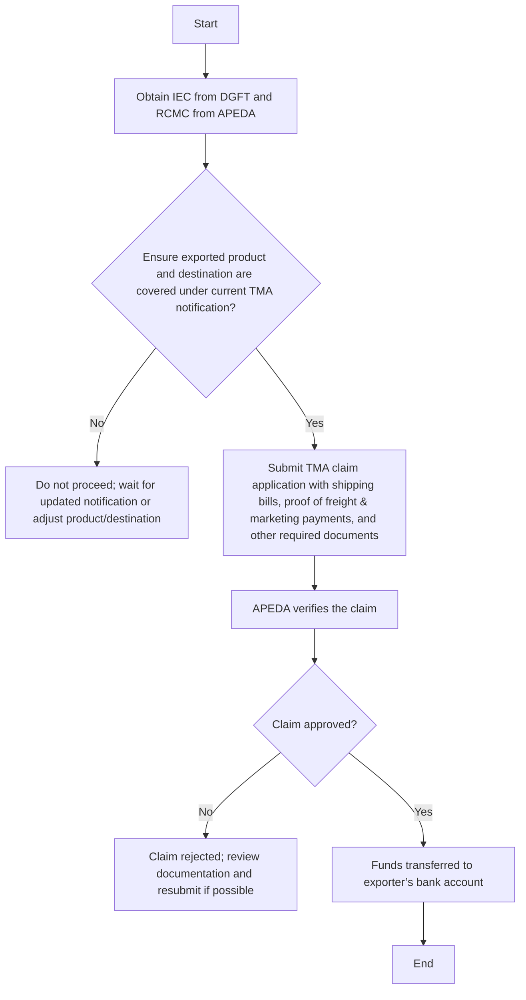

# Comprehensive Scheme Masterclass & File Guide

## Scheme Deep Dive

### Overview
The Transport & Marketing Assistance (TMA) scheme is a subsidy program administered by the Agricultural and Processed Food Products Export Development Authority (APEDA), under the Department of Commerce, Ministry of Commerce and Industry. It provides financial assistance to exporters of APEDA-scheduled products by reimbursing a specified percentage of international freight and marketing costs incurred on eligible exports. The scheme aims to mitigate the disadvantage of higher freight costs faced by Indian exporters and enhance the competitiveness of Indian agricultural and processed food products in international markets.

**Key Details:**
- **Scheme Name:** Transport & Marketing Assistance (TMA)
- **Scheme ID:** row-28
- **Ministry / Category:** Export Promotion
- **Scheme Type:** subsidy
- **Geographic Scope:** Pan-India
- **Implementing Agency:** Agricultural and Processed Food Products Export Development Authority (APEDA), Department of Commerce, Ministry of Commerce and Industry
- **Application Portal:** https://apeda.gov.in/tma
- **Status / Deadlines:** As per notifications issued under Foreign Trade Policy; claims must be submitted within the stipulated time frame post-shipment as specified in the respective TMA notification.
- **Last Updated:** 2024
- **Confidence:** medium

### Objectives
The TMA scheme has the following core objectives:
- To mitigate the disadvantage of higher freight costs faced by Indian exporters
- To enhance the competitiveness of Indian agricultural and processed food products in international markets
- To support marketing and brand promotion activities for export promotion
- To assist exporters in accessing distant markets by reducing logistics cost burden
- To promote exports of APEDA-scheduled products under the Export Promotion Mission (EPM)

### Eligibility Matrix
Eligibility for the TMA scheme is determined by the following criteria, which must all be satisfied:

| Eligibility Criteria | Requirement | Details |
| :--- | :--- | :--- |
| **Exporter Type** | Exporters of APEDA-scheduled products | Only products listed under APEDA's scheduled products are eligible. |
| **Registration** | Valid Registration-cum-Membership Certificate (RCMC) from APEDA | Mandatory for all applicants. |
| **Import Export Code** | Valid Import Export Code (IEC) from DGFT | Required for all export-related schemes. |
| **Product & Destination** | Exported product and destination must be covered under the current TMA notification | Specific product and destination eligibility is defined in periodic notifications issued by DGFT under the Foreign Trade Policy. |
| **Timeliness** | Claims must be submitted within the stipulated time frame post-shipment | As specified in the respective TMA notification. |
| **Documentation** | Complete and correct submission of required documents | Incomplete or incorrect documentation may lead to rejection. |

**Target Beneficiaries:** exporters; MSME; agri-exporters; processed food exporters

### Benefits & Financial Support
The TMA scheme provides financial assistance in the form of reimbursement for a portion of international freight and marketing expenses incurred on eligible exports. The exact reimbursement rate and conditions are specified in notifications issued by the Directorate General of Foreign Trade (DGFT) from time to time under the Foreign Trade Policy.

| Benefit Type | Description | Details |
| :--- | :--- | :--- |
| **Financial Support** | Reimbursement of a specified percentage of international freight and marketing costs | Assistance is disbursed post-shipment upon submission of required documents and verification by APEDA. Rates and conditions are notified by DGFT periodically. |
| **Non-Financial Benefits** | Enhanced market access and brand visibility | Achieved through supported marketing activities under the scheme. |

**Key Financial Notes:**
- The assistance is provided as a subsidy to reduce the cost burden on exporters and improve price competitiveness in global markets.
- Claims are subject to availability of funds and budgetary allocations.
- The scheme is reviewed and revised periodically based on budget and policy.

### Required Documents
Applicants must submit the following documents to claim TMA benefits:

1. Import Export Code (IEC)
2. Registration-cum-Membership Certificate (RCMC) from APEDA
3. Shipping bills
4. Proof of payment of international freight
5. Proof of payment of marketing expenses
6. Bank details for reimbursement
7. Self-declaration form as per TMA guidelines

### Application Process
The application process for the TMA scheme involves the following steps:

**Process Notes:**
- Step 1 (obtaining IEC and RCMC) is a prerequisite and must be completed before applying.
- Step 2 requires checking the latest TMA notification on the DGFT or APEDA portal to confirm eligibility of the specific product and destination.
- Step 3 involves submitting the claim online via the APEDA TMA portal (https://apeda.gov.in/tma) or through designated channels, accompanied by all required documents.
- Step 4: APEDA conducts verification of submitted documents and claim validity.
- Step 5: Upon approval, reimbursement is processed and transferred to the exporter’s registered bank account.
- **Critical Caveat:** Claims must be submitted within the time limit specified in each TMA notification; late submissions are not accepted.

### Important Warnings & Caveats
> **Key Caveats from Evidence:**
> - Only exports to notified countries under the TMA scheme are eligible
> - Assistance is subject to availability of funds and budgetary allocations
> - Claims must be submitted within the time limit specified in each notification
> - The scheme is reviewed and revised periodically based on budget and policy
> - Incomplete or incorrect documentation may lead to rejection of claims
> - The application portal (https://apeda.gov.in/tma) currently returns a "Page not found" error, indicating potential issues with direct access; applicants should verify the correct submission mechanism via APEDA or DGFT official communications.

> **Blockquote on Financial Support:**  
> The scheme provides reimbursement of a specified percentage of international freight and marketing costs incurred on eligible exports, as per the rates and conditions notified by DGFT from time to time under the Foreign Trade Policy. The assistance is disbursed post-shipment upon submission of required documents and verification by APEDA.

> **Blockquote on Eligibility:**  
> Exporters of APEDA-scheduled products who have a valid Registration-cum-Membership Certificate (RCMC) from APEDA and an Import Export Code (IEC) from DGFT are eligible. The scheme applies to exports made to notified countries under the TMA guidelines, with specific product and destination eligibility as per periodic notifications issued by DGFT under the Foreign Trade Policy.

### Sources
- Scheme Key Facts: Structured data extracted from evidence
- Application Portal: https://apeda.gov.in/tma (referenced in key facts; currently non-functional per crawled page)
- Supporting Evidence: Crawled pages and PDF documents from APEDA domain, including notifications, procedures, and scheme details

---

## Consultant's Field Guide to Generated Files

### 1. SCHEME_MASTER_DATABASE.md
**Real-time Usage:** Keep this open in a background tab during all client calls. When a client asks "What is the turnover limit?" or "Who administers this?", CTRL+F in this document to give an immediate, authoritative answer without checking the portal.

### 2. PITCH_AND_SALES_SCRIPTS.md
**Real-time Usage:** Open this file 5 minutes before your first Discovery Call with a lead. Read the "Problem Framing" out loud to hook them, then use the Qualification Checklist to interrogate their eligibility live on the phone. Keep the Objection Handlers table visible so you can immediately counter when they say "We're too small for this."

### 3. APPLICATION_PLAYBOOK.md
**Real-time Usage:** Print this out or pin it to your desktop once the client signs the retainer. Check off each box in "Stage 1" before moving to "Stage 2". Use the "Client Communication Template" to copy-paste directly into your email when chasing them for pending documents.

### 4. CLIENT_ONBOARDING_AND_CRM.md
**Real-time Usage:** Fill this out during or immediately after the onboarding call. Use the Needs Assessment to record their exact pain points. Update the "Compliance Status" table as they email you documents to maintain a single source of truth for what's missing.

### 5. LIVE_CASE_TRACKER.md
**Real-time Usage:** Review this document every morning during your standup. Update the "Stage" column daily. If a case hits "Stage 07 - Under review", use the Escalation Path notes here to know exactly who to call at the government department today.

### 6. FEE_AND_REVENUE_MODEL.md
**Real-time Usage:** Use this file when drafting the proposal. Look at the client's turnover, map them to the pricing tier in the table, and quote that exact Retainer and Success Fee. Use the monthly projection table to update your personal sales pipeline forecast for the quarter.

### 7. CLIENT_PROPOSAL_TEMPLATE.md
**Real-time Usage:** Copy this entire file, paste it into an email or PDF generator, replace the [PLACEHOLDER] tags with the client's actual details gathered from the CRM, and send it immediately after a successful discovery call.

### 8. COMPLIANCE_AND_LEGAL_PACK.md
**Real-time Usage:** Attach sections 8A and 8B as PDFs to the proposal email. Refuse to start Step 1 of the Application Playbook until the client signs these. Use the Disclaimers to protect yourself legally if the client is rejected by the government agency.