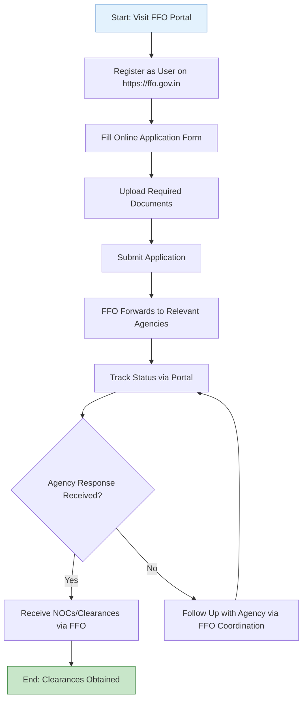

</think># Comprehensive Scheme Masterclass & File Guide

## Scheme Deep Dive

### Overview
The **Film Facilitation Office (FFO) – Single Window Clearance** is a facilitative scheme administered by the **Ministry of Information and Broadcasting, Government of India**. It operates on a **pan-India** geographic scope and provides **no direct financial support** such as grants, loans, or subsidies. Instead, its core function is to streamline the process of obtaining necessary permissions for film shooting across India by acting as a single point of contact and coordinating with multiple central and state government agencies.

The scheme is accessible via the official portal: **[https://ffo.gov.in](https://ffo.gov.in)** and accepts applications on a **rolling basis** throughout the year, based on project requirements.

### Objectives
The primary objectives of the FFO scheme are:
- To provide a **single window clearance system** for film shooting permissions.
- To **coordinate with various central and state government agencies** for issuing No Objection Certificates (NOCs).
- To **reduce the time and effort** required for obtaining multiple clearances.
- To **facilitate smooth filming operations** across India.
- To **promote ease of doing business** in the media and entertainment sector.

### Eligibility Matrix
The following table outlines the eligibility criteria for applicants under the FFO scheme:

| **Eligibility Criteria** | **Details** | **Source** |
|--------------------------|-----------|------------|
| **Applicant Type** | Filmmakers, production houses, or any entity intending to shoot films in India | [Evidence: Eligibility] |
| **Requirement Trigger** | Need for permissions from central or state government authorities for locations, drone usage, road closures, or other regulatory clearances | [Evidence: Eligibility] |
| **Geographic Scope** | Pan-India (applicable across all states and union territories) | [Evidence: Geographic Scope] |
| **Beneficiary Category** | Filmmakers, production houses, media and entertainment professionals | [Evidence: Target Beneficiaries] |
| **Nationality** | Open to both **Indian and foreign film productions** | [Evidence: Benefits] |

> **Note**: There are no turnover limits, employment thresholds, or sector-specific restrictions beyond engagement in film production requiring governmental clearances.

### Benefits & Financial Support
Although the FFO does not provide direct financial assistance, it offers significant operational and procedural benefits:

| **Benefit Category** | **Specific Benefit** | **Description** | **Source** |
|----------------------|----------------------|-----------------|------------|
| **Process Efficiency** | Single Point of Contact | One-stop interface for all film shooting-related permissions | [Evidence: Benefits] |
| **Inter-Agency Coordination** | Liaison with Multiple Authorities | Coordination with Ministry of Defence, Ministry of Home Affairs, Ministry of Civil Aviation, Archaeological Survey of India (ASI), and state governments | [Evidence: Benefits] |
| **Time Savings** | Time-Bound Processing | Applications are processed within defined timelines (subject to agency response) | [Evidence: Benefits] |
| **Procedural Simplicity** | Reduced Complexity | Eliminates need to approach multiple departments separately | [Evidence: Benefits] |
| **Inclusivity** | Support for All Productions | Facilitates clearances for both Indian and foreign film productions | [Evidence: Benefits] |
| **Financial Aspect** | No Direct Monetary Support | FFO does **not** provide grants, loans, subsidies, or any form of financial disbursement | [Evidence: Financial Support] |

> **Warning**: The FFO **does not grant permissions itself**. Final approval rests solely with the respective concerned authorities (e.g., MoD, MHA, ASI, etc.). Processing time is dependent on the response time of individual agencies, and certain clearances (e.g., drone flights, border area shoots) may involve additional restrictions or longer lead times.

### Required Documents
Applicants must submit the following documents via the FFO portal:

| **Document ID** | **Required Document** | **Details / Notes** | **Source** |
|-----------------|------------------------|----------------------|------------|
| 1 | Script or Synopsis | Detailed outline of the film’s storyline or scene-specific description | [Evidence: Required Documents] |
| 2 | Production Details | Includes shooting dates, schedule, and daily call sheets | [Evidence: Required Documents] |
| 3 | Location Details & Maps | Precise geographic coordinates, area maps, and site plans of shooting locations | [Evidence: Required Documents] |
| 4 | Drone/UAV Details (if applicable) | Drone model, flight altitude, duration, pilot certification, and insurance details | [Evidence: Required Documents] |
| 5 | Identification Proof | Government-issued ID of the applicant (e.g., Aadhaar, PAN, Passport) | [Evidence: Required Documents] |
| 6 | Certificate of Incorporation | For production companies; proof of legal registration | [Evidence: Required Documents] |
| 7 | Equipment & Crew Details | List of camera, lighting, sound equipment; crew manifest with roles and IDs | [Evidence: Required Documents] |
| 8 | Agency-Specific Documents | Any additional documents as mandated by specific clearing agencies (e.g., defence clearance forms, ASI heritage site protocols) | [Evidence: Required Documents] |

> **Note**: The exact document requirements may vary based on the type of clearance sought (e.g., drone usage requires DGCA compliance; defence locations need MoD NOC).

### Application Process Flow
The following Mermaid flowchart illustrates the step-by-step application process for obtaining clearances through the FFO:

**Application Portal**: [https://ffo.gov.in](https://ffo.gov.in)  
**Contact Details**:  
- Email: info@ffo.gov.in  
- Phone: +91-11-2338 6445  

> **Key Caveats**:
> - FFO acts only as a **facilitator**; it does not issue clearances.
> - Final approval is granted by the **concerned agency** (e.g., ASI for heritage sites, MoD for defence areas).
> - Processing timelines are **not guaranteed** and depend on external agency responsiveness.
> - Certain activities (e.g., aerial drone filming, shooting near borders) may require **additional clearances** and have **longer lead times**.
> - Applications can be submitted **anytime** (rolling basis), but early submission is advised for time-sensitive projects.

---

## Consultant's Field Guide to Generated Files

### 1. SCHEME_MASTER_DATABASE.md
**Real-time Usage**: Keep this open in a background tab during all client calls. When a client asks "What is the turnover limit?" or "Who administers this?", CTRL+F in this document to give an immediate, authoritative answer without checking the portal.

### 2. PITCH_AND_SALES_SCRIPTS.md
**Real-time Usage**: Open this file 5 minutes before your first Discovery Call with a lead. Read the "Problem Framing" out loud to hook them, then use the Qualification Checklist to interrogate their eligibility live on the phone. Keep the Objection Handlers table visible so you can immediately counter when they say "We're too small for this."

### 3. APPLICATION_PLAYBOOK.md
**Real-time Usage**: Print this out or pin it to your desktop once the client signs the retainer. Check off each box in "Stage 1" before moving to "Stage 2". Use the "Client Communication Template" to copy-paste directly into your email when chasing them for pending documents.

### 4. CLIENT_ONBOARDING_AND_CRM.md
**Real-time Usage**: Fill this out during or immediately after the onboarding call. Use the Needs Assessment to record their exact pain points. Update the "Compliance Status" table as they email you documents to maintain a single source of truth for what's missing.

### 5. LIVE_CASE_TRACKER.md
**Real-time Usage**: Review this document every morning during your standup. Update the "Stage" column daily. If a case hits "Stage 07 - Under review", use the Escalation Path notes here to know exactly who to call at the government department today.

### 6. FEE_AND_REVENUE_MODEL.md
**Real-time Usage**: Use this file when drafting the proposal. Look at the client's turnover, map them to the pricing tier in the table, and quote that exact Retainer and Success Fee. Use the monthly projection table to update your personal sales pipeline forecast for the quarter.

### 7. CLIENT_PROPOSAL_TEMPLATE.md
**Real-time Usage**: Copy this entire file, paste it into an email or PDF generator, replace the [PLACEHOLDER] tags with the client's actual details gathered from the CRM, and send it immediately after a successful discovery call.

### 8. COMPLIANCE_AND_LEGAL_PACK.md
**Real-time Usage**: Attach sections 8A and 8B as PDFs to the proposal email. Refuse to start Step 1 of the Application Playbook until the client signs these. Use the Disclaimers to protect yourself legally if the client is rejected by the government agency.