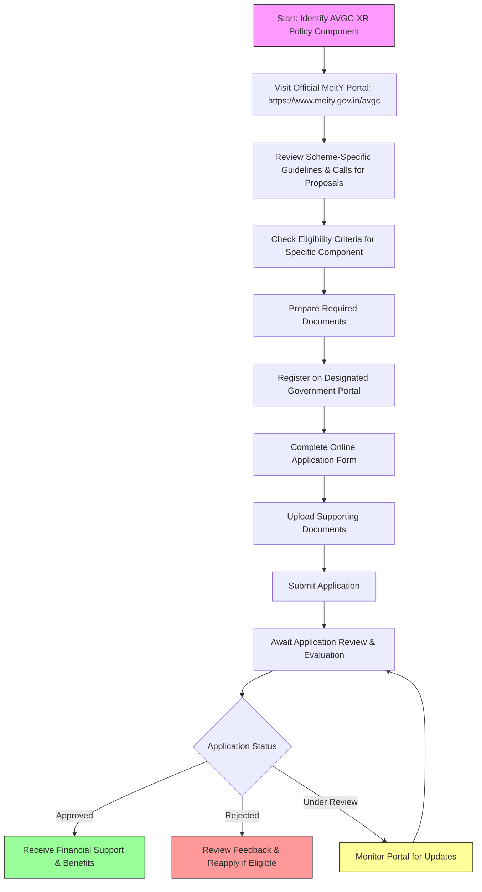

# Comprehensive Scheme Masterclass & File Guide

## Scheme Deep Dive

### Overview
The AVGC-XR Policy (Animation, VFX, Gaming, Comics) is a Pan-India initiative implemented by the Ministry of Electronics and Information Technology (MeitY), Government of India. The scheme aims to promote India as a global destination for AVGC content creation, enhance skill development, support infrastructure development, encourage innovation in emerging technologies like AR/VR/MR, facilitate industry-academia collaboration, provide regulatory support, attract domestic and foreign investment, and strengthen the intellectual property rights framework for creators.

### Objectives
- Promote India as a global destination for AVGC content creation  
- Enhance skill development and capacity building in AVGC-XR sectors  
- Support infrastructure development including studios and technology parks  
- Encourage innovation and R&D in emerging technologies like AR/VR/MR  
- Facilitate industry-academia collaboration and knowledge exchange  
- Provide regulatory and policy support for sustainable sector growth  
- Attract domestic and foreign investment in the AVGC ecosystem  
- Strengthen intellectual property rights framework for creators  

### Eligibility Matrix
| **Beneficiary Type**       | **Eligibility Criteria**                                                                 | **Notes**                                                                 |
|----------------------------|----------------------------------------------------------------------------------------|---------------------------------------------------------------------------|
| Startups                   | Indian entities engaged in animation, VFX, gaming, comics, and XR activities            | Must be registered under Indian Companies Act 2013 or LLP Act 2008        |
| MSMEs                      | Indian entities engaged in animation, VFX, gaming, comics, and XR activities            | Must comply with MSME classification criteria                             |
| Educational Institutions   | Indian institutions engaged in AVGC-XR activities                                       | Includes universities, colleges, and training institutes                  |
| Creative Professionals     | Individuals engaged in animation, VFX, gaming, comics, and XR activities                | Must be Indian nationals or residents                                     |
| Entrepreneurs              | Indian individuals engaged in AVGC-XR activities                                        | Must demonstrate project viability and innovation                         |

> **Note**: Specific eligibility criteria for individual components (grants, incubation, infrastructure support) are defined in respective guidelines and notifications issued by MeitY or its authorized agencies such as the Digital Entertainment and Gaming Hub (DEGH) or approved centres of excellence.

### Benefits & Financial Support
Financial support under the AVGC-XR Policy is delivered through various mechanisms including grants, seed funding, venture capital linkages, and subsidies for infrastructure and technology adoption. Specific quantum and disbursement details are outlined in individual scheme documents and guidelines issued by MeitY or its implementing agencies.

| **Benefit Category**               | **Details**                                                                                                                                 | **Source**                                                                 |
|------------------------------------|---------------------------------------------------------------------------------------------------------------------------------------------|----------------------------------------------------------------------------|
| Financial Support                  | Grants, seed funding, venture capital linkages, subsidies for infrastructure and technology adoption                                        | Scheme Key Facts                                                           |
| Project Development Support        | Financial support for project development                                                                                                   | Scheme Key Facts                                                           |
| Shared Infrastructure Access       | Access to shared infrastructure and technology facilities                                                                                   | Scheme Key Facts                                                           |
| Skill Development Programs         | Skill development and training programs                                                                                                     | Scheme Key Facts                                                           |
| Mentorship & Incubation            | Mentorship and incubation support                                                                                                           | Scheme Key Facts                                                           |
| Market Access & Collaboration      | Assistance with market access and international collaboration                                                                               | Scheme Key Facts                                                           |
| Regulatory Facilitation            | Regulatory and policy support                                                                                                               | Scheme Key Facts                                                           |
| IPR Management Support             | Support for intellectual property rights management                                                                                         | Scheme Key Facts                                                           |
| Global Festival Participation      | Promotion of participation in global festivals                                                                                              | Scheme Key Facts                                                           |
| Co-production Opportunities        | Support for co-production opportunities                                                                                                     | Scheme Key Facts                                                           |
| Funding Mechanisms Access          | Access to funding mechanisms through government-backed funds                                                                                | Scheme Key Facts                                                           |

### Application Process
The application process varies depending on the specific component of the AVGC-XR Policy being accessed (e.g., grants, incubation, infrastructure support). Interested applicants are advised to refer to the official MeitY website or designated portals for scheme-specific guidelines, where detailed calls for proposals, eligibility criteria, and submission procedures are published. Applications are typically submitted online through designated government portals after registration and document upload.

**Application Portal**: https://www.meity.gov.in/avgc  
**Contact Details**: ceo-dibd@digitalindia.gov.in  

### Key Caveats
> - Specific benefits and support mechanisms are subject to individual scheme guidelines and availability of funds  
> - Applicants must comply with the terms and conditions of respective sub-schemes under the AVGC-XR Policy  
> - Financial support is contingent upon project appraisal, feasibility, and adherence to milestones  
> - Intellectual property rights must be clearly defined and owned by the applicant or appropriately licensed  
> - Support may be withdrawn for non-compliance with reporting requirements or policy guidelines  

---

## Consultant's Field Guide to Generated Files

### 1. SCHEME_MASTER_DATABASE.md
**Real-time Usage:** Keep this open in a background tab during all client calls. When a client asks "What is the turnover limit?" or "Who administers this?", CTRL+F in this document to give an immediate, authoritative answer without checking the portal.

### 2. PITCH_AND_SALES_SCRIPTS.md
**Real-time Usage:** Open this file 5 minutes before your first Discovery Call with a lead. Read the "Problem Framing" out loud to hook them, then use the Qualification Checklist to interrogate their eligibility live on the phone. Keep the Objection Handlers table visible so you can immediately counter when they say "We're too small for this."

### 3. APPLICATION_PLAYBOOK.md
**Real-time Usage:** Print this out or pin it to your desktop once the client signs the retainer. Check off each box in "Stage 1" before moving to "Stage 2". Use the "Client Communication Template" to copy-paste directly into your email when chasing them for pending documents.

### 4. CLIENT_ONBOARDING_AND_CRM.md
**Real-time Usage:** Fill this out during or immediately after the onboarding call. Use the Needs Assessment to record their exact pain points. Update the "Compliance Status" table as they email you documents to maintain a single source of truth for what's missing.

### 5. LIVE_CASE_TRACKER.md
**Real-time Usage:** Review this document every morning during your standup. Update the "Stage" column daily. If a case hits "Stage 07 - Under review", use the Escalation Path notes here to know exactly who to call at the government department today.

### 6. FEE_AND_REVENUE_MODEL.md
**Real-time Usage:** Use this file when drafting the proposal. Look at the client's turnover, map them to the pricing tier in the table, and quote that exact Retainer and Success Fee. Use the monthly projection table to update your personal sales pipeline forecast for the quarter.

### 7. CLIENT_PROPOSAL_TEMPLATE.md
**Real-time Usage:** Copy this entire file, paste it into an email or PDF generator, replace the [PLACEHOLDER] tags with the client's actual details gathered from the CRM, and send it immediately after a successful discovery call.

### 8. COMPLIANCE_AND_LEGAL_PACK.md
**Real-time Usage:** Attach sections 8A and 8B as PDFs to the proposal email. Refuse to start Step 1 of the Application Playbook until the client signs these. Use the Disclaimers to protect yourself legally if the client is rejected by the government agency.