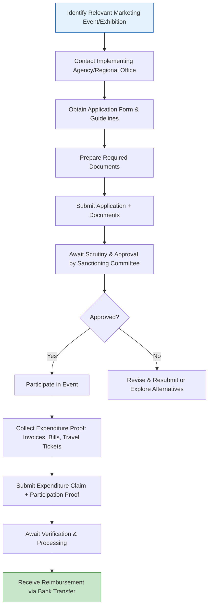

</think># Comprehensive Scheme Masterclass & File Guide

## Scheme Deep Dive

### Overview
The **Marketing Support & Services for Handicrafts** scheme (Scheme ID: row-287) is a **subsidy**-type initiative administered by the **Office of the Development Commissioner (Handicrafts)**, under the **Ministry of Textiles, Government of India**. It operates with **Pan-India** geographic scope and is designed to enhance market access and promote handicraft products through financial assistance for participation in exhibitions, craft bazaars, trade fairs, and related marketing activities. The scheme functions on an **event-specific schedule**, with applications typically invited well in advance of domestic and international exhibitions, craft bazaars, and trade fairs.

### Objectives
The scheme aims to achieve the following objectives:
- Promote handicraft products in domestic and international markets  
- Enhance market access for artisans and handicraft producers  
- Support participation in national and international trade fairs and exhibitions  
- Organize craft bazaars and marketing events to showcase handicrafts  
- Provide financial assistance for marketing and publicity of handicrafts  
- Strengthen export promotion of handicrafts through market development assistance  
- Support branding and quality improvement initiatives for handicraft products  

> **Key Takeaway**: This scheme is not limited to financial reimbursement but encompasses holistic market development, including branding, e-commerce support, and buyer-seller facilitation.

### Eligibility Matrix
The following table outlines the eligibility criteria for various beneficiary types under the scheme:

| **Beneficiary Type**       | **Eligibility Criteria**                                                                 | **Registration Requirement**                                      |
|----------------------------|----------------------------------------------------------------------------------------|-------------------------------------------------------------------|
| Individual Artisans        | Engaged in handicraft production                                                       | Valid recognition as handicraft producer (where applicable)       |
| Self-Help Groups (SHGs)    | Engaged in collective handicraft production                                            | Registration as SHG; handicraft activity proof                    |
| NGOs                       | Involved in handicraft promotion, training, or production                              | Valid registration; handicraft-related mandate                    |
| Cooperatives               | Member-based handicraft production and marketing                                       | Registered cooperative; handicraft focus                          |
| Private Enterprises        | Engaged in manufacturing and marketing of handicrafts                                  | Business registration; handicraft product proof                   |
| Handicraft Exporters       | Exporting handicraft goods                                                             | IEC code; export registration; handicraft product validation      |

> **Note**: All applicants must be actively involved in handicraft activities and possess valid registration or recognition as handicraft producers where applicable. The scheme does not restrict based on turnover or enterprise size.

### Benefits & Financial Support
The scheme provides financial support in the form of **subsidies** for participation in exhibitions and fairs, including reimbursement of specific expenses. The exact quantum varies based on event nature, location, and participant category.

| **Expense Category**       | **Details of Support**                                                                 | **Limits / Conditions**                                                                 |
|----------------------------|--------------------------------------------------------------------------------------|---------------------------------------------------------------------------------------|
| Stall Rent                 | Reimbursement for rent paid for exhibition stall                                     | Up to scheme-specified limits; subject to event approval                              |
| Travel Expenses            | Reimbursement for travel to and from the event venue                                 | Based on actuals; subject to ceilings; requires valid tickets/bills                   |
| Publicity Costs            | Reimbursement for promotional material, catalogs, advertising                        | Up to approved limits; must be pre-sanctioned                                         |
| Organizing Craft Bazaars   | Financial assistance for organizing marketing events                                   | Cost-sharing between agency and beneficiary; proposal-based approval                  |
| Market Development Activities | Support for branding, product promotion, buyer-seller meets                          | As per event-specific norms; may include digital marketing and e-commerce initiatives |
| E-Commerce & Digital Marketing | Assistance for online platform integration, digital campaigns                        | Increasing focus area; subject to available funds and event relevance                 |

> **Critical Caveats**:
> - Financial assistance is **subject to availability of funds** under the scheme  
> - Reimbursement is made **only after submission of valid expenditure documents and participation proof**  
> - Benefits are **limited to approved events and activities** under the scheme  
> - Artisans must ensure **compliance with guidelines for product display and quality**  
> - All claims must be submitted post-event with original invoices, bills, and proof of participation  

### Application Process Flow
The following Mermaid flowchart illustrates the step-by-step application and reimbursement process:

> **Application Portal**: Applicants must contact the **Office of the Development Commissioner (Handicrafts)** or its regional offices for event-specific application forms and guidelines. While no centralized portal is explicitly listed in the evidence, applicants are advised to monitor official announcements via the [Ministry of Textiles website](https://texmin.nic.in) or contact regional handicrafts offices directly.

> **Important**: Applications are **event-driven**. There is no rolling deadline; instead, timelines are tied to specific exhibitions, craft bazaars, and trade fairs. Consultants must advise clients to identify upcoming events early and initiate applications well in advance.

### Required Documents
Applicants must submit the following documents:
1. Completed application form  
2. Proof of identity and address of the applicant  
3. Registration certificate (if applicable) as handicraft producer/artisan  
4. Details of the handicraft products to be showcased (including images, descriptions, HSN codes if applicable)  
5. Quotation or invoice for stall rent and other anticipated expenses (for advance intimation, if applicable)  
6. Bank account details (cancelled cheque or passbook copy) for reimbursement  
7. Any other document as specified by the implementing agency for the specific event  

> **Post-Event Requirement**: After participation, beneficiaries must submit:
> - Original invoices and bills for stall rent, travel, publicity  
> - Proof of participation (e.g., stall allotment letter, photographs, visitor feedback)  
> - Detailed expenditure statement  
> - Bank details for NEFT/RTGS transfer  

---

## Consultant's Field Guide to Generated Files

### 1. SCHEME_MASTER_DATABASE.md
**Real-time Usage**: Keep this open in a background tab during all client calls. When a client asks "What is the turnover limit?" or "Who administers this?", CTRL+F in this document to give an immediate, authoritative answer without checking the portal.  
**Pro Tip**: Use this file to quickly verify eligibility during cold outreach. If a client says “We’re a private handicraft exporter,” search “private enterprises” or “exporters” to confirm eligibility and note the IEC requirement.

### 2. PITCH_AND_SALES_SCRIPTS.md
**Real-time Usage**: Open this file 5 minutes before your first Discovery Call with a lead. Read the "Problem Framing" out loud to hook them, then use the Qualification Checklist to interrogate their eligibility live on the phone. Keep the Objection Handlers table visible so you can immediately counter when they say "We're too small for this."  
**Example Script**:  
> *“Many artisans we work with assume they need to be big exporters to get government support—but this scheme actually helps even individual artisans attend local craft bazaars. Have you participated in any exhibitions in the last 12 months?”*  
If they say no, pivot: *“This scheme can cover up to 80% of your stall rent and travel—would you like to see which upcoming events you qualify for?”*

### 3. APPLICATION_PLAYBOOK.md
**Real-time Usage**: Print this out or pin it to your desktop once the client signs the retainer. Check off each box in "Stage 1" before moving to "Stage 2". Use the "Client Communication Template" to copy-paste directly into your email when chasing them for pending documents.  
**Stage Example**:  
> **Stage 1: Event Identification & Documentation**  
> ☐ Identify target exhibition/craft fair  
> ☐ Confirm event is approved under Marketing Support Scheme  
> ☐ Collect client’s ID, address proof, handicraft registration  
> ☐ Gather product details and images  
> ☐ Obtain preliminary stall rent quote (if available)  
> **Client Email Template**:  
> *Subject: Action Required: Documents Needed for [Event Name] Application*  
> *Hi [Name],*  
> *To proceed with your application for [Event], we need the following:*  
> *1. Scanned copy of your Aadhaar/PAN*  
> *2. Handicraft registration certificate*  
> *3. 3–5 product images with descriptions*  
> *Please reply by [Date] so we can meet the submission deadline.*  
> *Best regards,*  
> *[Your Name]*

### 4. CLIENT_ONBOARDING_AND_CRM.md
**Real-time Usage**: Fill this out during or immediately after the onboarding call. Use the Needs Assessment to record their exact pain points. Update the "Compliance Status" table as they email you documents to maintain a single source of truth for what's missing.  
**Needs Assessment Fields**:  
- Current market reach (local/state/national/international)  
- Past exhibition experience (yes/no, events attended)  
- Biggest challenge: visibility, cost, logistics, branding?  
- Desired outcome: increase sales, find buyers, test new market?  
**Compliance Status Table**:  
| Document | Status (Pending/Received/Verified) | Date Received | Notes |  
|----------|-----------------------------------|---------------|-------|  
| ID Proof | Received | 2024-06-10 | Aadhaar linked |  
| Address Proof | Pending | | |  
| Handicraft Reg Cert | Received | 2024-06-10 | Self-help group regn |  
| Product Details | Pending | | Need images |  
| Bank Details | Pending | | |  

### 5. LIVE_CASE_TRACKER.md
**Real-time Usage**: Review this document every morning during your standup. Update the "Stage" column daily. If a case hits "Stage 07 - Under review", use the Escalation Path notes here to know exactly who to call at the government department today.  
**Stage Definitions**:  
- Stage 00: Lead  
- Stage 01: Discovery Call Done  
- Stage 02: Proposal Sent  
- Stage 03: Retainer Signed  
- Stage 04: Documents Collected  
- Stage 05: Application Submitted  
- Stage 06: Awaiting Approval  
- Stage 07: Under Review (Sanctioning Committee)  
- Stage 08: Approved – Participate in Event  
- Stage 09: Expenditure Claim Submitted  
- Stage 10: Reimbursement Received – Case Closed  
**Escalation Path (Stage 07)**:  
> If under review > 15 days:  
> 1. Contact Regional Office (Handicrafts) – Assistant Director  
> 2. Escalate to Deputy Director, Marketing Division  
> 3. Email: marketing.dc handicrafts@texmin.nic.in (use subject: “Follow-up: Application ID [XXXX] under review >15 days”)  
> 4. CC: Regional Officer, [State] Handicrafts  

### 6. FEE_AND_REVENUE_MODEL.md
**Real-time Usage**: Use this file when drafting the proposal. Look at the client's turnover, map them to the pricing tier in the table, and quote that exact Retainer and Success Fee. Use the monthly projection table to update your personal sales pipeline forecast for the quarter.  
**Pricing Tiers (Based on Client Turnover)**:  
| **Annual Turnover** | **Retainer Fee (INR)** | **Success Fee (% of Reimbursement)** | **Min. Engagement** |  
|---------------------|------------------------|--------------------------------------|---------------------|  
| < ₹10 Lakhs         | ₹8,000                 | 10%                                  | 3 months            |  
| ₹10–50 Lakhs        | ₹15,000                | 12%                                  | 3 months            |  
| ₹50 Lakhs – 2 Cr    | ₹25,000                | 15%                                  | 6 months            |  
| > ₹2 Cr             | ₹40,000                | 18%                                  | 6 months            |  
> **Note**: Success fee is calculated only on the **approved reimbursement amount**. If no funds are disbursed, only the retainer is payable (non-refundable).  
**Monthly Projection Example**:  
| Month | Expected Closures | Avg. Retainer | Projected Revenue |  
|-------|-------------------|---------------|-------------------|  
| Jun   | 3                 | ₹18,000       | ₹54,000           |  
| Jul   | 5                 | ₹22,000       | ₹110,000          |  
| Aug   | 4                 | ₹20,000       | ₹80,000           |  

### 7. CLIENT_PROPOSAL_TEMPLATE.md
**Real-time Usage**: Copy this entire file, paste it into an email or PDF generator, replace the [PLACEHOLDER] tags with the client's actual details gathered from the CRM, and send it immediately after a successful discovery call.  
**Key Sections to Customize**:  
- [Client Name]  
- [Current Challenge: e.g., “Struggling to gain visibility beyond local markets”]  
- [Recommended Event: e.g., “India International Trade Fair (IITF), Delhi – Nov 2024”]  
- [Estimated Support: e.g., “Stall rent: up to ₹1,00,000; Travel: ₹30,000; Publicity: ₹20,000”]  
- [Timeline: e.g., “Application deadline: Oct 15, 2024; Event: Nov 14–27, 2024”]  
- [Our Fee: Retainer ₹XX,XXX + Success Fee X%]  
> **Pro Tip**: Attach the Compliance and Legal Pack (Sections 8A & 8B) as PDFs. Never proceed without signed copies.

### 8. COMPLIANCE_AND_LEGAL_PACK.md
**Real-time Usage**: Attach sections 8A and 8B as PDFs to the proposal email. Refuse to start Step 1 of the Application Playbook until the client signs these. Use the Disclaimers to protect yourself legally if the client is rejected by the government agency.  
**Section 8A: Client Authorization & Declaration**  
> I, [Client Name], hereby authorize [Consultant/Firm Name] to act on my behalf for the purpose of applying to the Marketing Support & Services for Handicrafts scheme. I confirm that all information provided is true and accurate to the best of my knowledge. I understand that financial assistance is subject to fund availability and approval by the sanctioning committee.  
> **Signature**: ___________________  
> **Date**: ___________________  

**Section 8B: Disclaimer & Limitation of Liability**  
> The consultant provides advisory services only and does not guarantee approval, funding, or reimbursement under any government scheme. All decisions rest with the implementing agency. The consultant shall not be liable for delays, rejections, or non-disbursement due to incomplete documentation, ineligibility, or policy changes. Fees are non-refundable unless due to proven negligence by the consultant.  
> **Governing Law**: This agreement shall be governed by the laws of India. Any disputes shall be subject to the jurisdiction of the courts in [City, State].  
> **Consultant Signature**: ___________________  
> **Date**: ___________________  

> **Critical Reminder**: Always retain a signed copy of both sections in the client’s physical and digital file. If the client hesitates to sign, explain: *“This protects both of us—it ensures you’re informed about the process and that we’re compensated for our time if the application doesn’t succeed through no fault of ours.”*