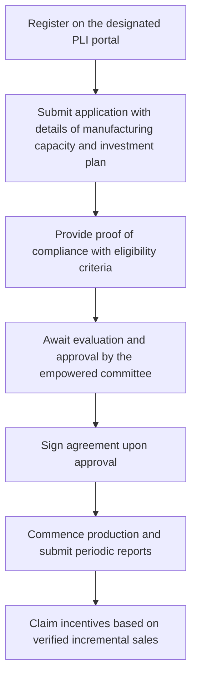

# Comprehensive Scheme Masterclass & File Guide

## Scheme Deep Dive

### Scheme Overview
**Scheme Name:** PLI for Telecom & Networking Products  
**Scheme ID:** row-290  
**Ministry / Category:** Telecom  
**Scheme Type:** subsidy  
**Geographic Scope:** Pan-India  
**Implementing Agency:** Department of Telecommunications, Ministry of Communications  
**Application Portal:** https://dot.gov.in/pli-telecom  
**Status / Deadlines:** Application window typically opens annually with specific deadlines notified via official communications; exact dates vary by year.  
**Last Updated:** 2026  

### Objectives
- Boost domestic manufacturing of telecom and networking products  
- Increase exports of telecom equipment  
- Reduce import dependency in the telecom sector  
- Encourage investment and innovation in telecom  
- Support the vision of Atmanirbhar Bharat  
- Align with National Digital Communications Policy (NDCP) 2018  
- Advance India's 6G ambitions  

### Eligibility Matrix
| Eligibility Criteria | Details |
|----------------------|---------|
| **Manufacturing Activity** | Must be engaged in manufacturing of telecom and networking products in India |
| **Investment Threshold** | Must meet minimum investment thresholds (specific amounts not detailed in evidence) |
| **Incremental Sales** | Must achieve incremental sales of covered products over a base year |
| **Make in India Compliance** | Must comply with Make in India guidelines |
| **Domestic Value Addition** | Must meet domestic value addition requirements |
| **Target Beneficiaries** | MSMEs, startups, large enterprises |
| **Required Documents** | 1. Certificate of Incorporation 2. Details of manufacturing facility 3. Investment plan and capital expenditure details 4. Product specifications and BIS certification (if applicable) 5. GST registration and PAN 6. Undertaking on compliance with Make in India guidelines 7. Base year sales and projected incremental sales details |

### Benefits & Financial Support
| Benefit Type | Details |
|--------------|---------|
| **Financial Incentives** | Percentage of incremental sales of eligible telecom and networking products manufactured in India, disbursed annually based on verified claims |
| **Tax Benefits** | Available under relevant schemes (specific schemes not detailed) |
| **Technology Upgradation** | Support provided |
| **Market Access** | Facilitation of access to global markets through enhanced manufacturing competitiveness |
| **Incentive Basis** | Based on incremental sales of covered products over a base year |

### Application Process Flowchart

### Key Caveats
> - Incentives are contingent on achieving minimum domestic value addition  
> - Claims are subject to audit and verification  
> - Non-compliance may lead to clawback of incentives  
> - Scheme duration and renewal subject to government review  

### Sources
- Application Portal: https://dot.gov.in/pli-telecom  
- Key Facts Source: Scheme Key Facts (extracted structured data)  
- Supporting Evidence: Crawled web pages and downloaded PDFs from dot.gov.in  

---

## Consultant's Field Guide to Generated Files

### 1. SCHEME_MASTER_DATABASE.md
**Real-time Usage:** Keep this open in a background tab during all client calls. When a client asks "What is the turnover limit?" or "Who administers this?", CTRL+F in this document to give an immediate, authoritative answer without checking the portal.

### 2. PITCH_AND_SALES_SCRIPTS.md
**Real-time Usage:** Open this file 5 minutes before your first Discovery Call with a lead. Read the "Problem Framing" out loud to hook them, then use the Qualification Checklist to interrogate their eligibility live on the phone. Keep the Objection Handlers table visible so you can immediately counter when they say "We're too small for this."

### 3. APPLICATION_PLAYBOOK.md
**Real-time Usage:** Print this out or pin it to your desktop once the client signs the retainer. Check off each box in "Stage 1" before moving to "Stage 2". Use the "Client Communication Template" to copy-paste directly into your email when chasing them for pending documents.

### 4. CLIENT_ONBOARDING_AND_CRM.md
**Real-time Usage:** Fill this out during or immediately after the onboarding call. Use the Needs Assessment to record their exact pain points. Update the "Compliance Status" table as they email you documents to maintain a single source of truth for what's missing.

### 5. LIVE_CASE_TRACKER.md
**Real-time Usage:** Review this document every morning during your standup. Update the "Stage" column daily. If a case hits "Stage 07 - Under review", use the Escalation Path notes here to know exactly who to call at the government department today.

### 6. FEE_AND_REVENUE_MODEL.md
**Real-time Usage:** Use this file when drafting the proposal. Look at the client's turnover, map them to the pricing tier in the table, and quote that exact Retainer and Success Fee. Use the monthly projection table to update your personal sales pipeline forecast for the quarter.

### 7. CLIENT_PROPOSAL_TEMPLATE.md
**Real-time Usage:** Copy this entire file, paste it into an email or PDF generator, replace the [PLACEHOLDER] tags with the client's actual details gathered from the CRM, and send it immediately after a successful discovery call.

### 8. COMPLIANCE_AND_LEGAL_PACK.md
**Real-time Usage:** Attach sections 8A and 8B as PDFs to the proposal email. Refuse to start Step 1 of the Application Playbook until the client signs these. Use the Disclaimers to protect yourself legally if the client is rejected by the government agency.