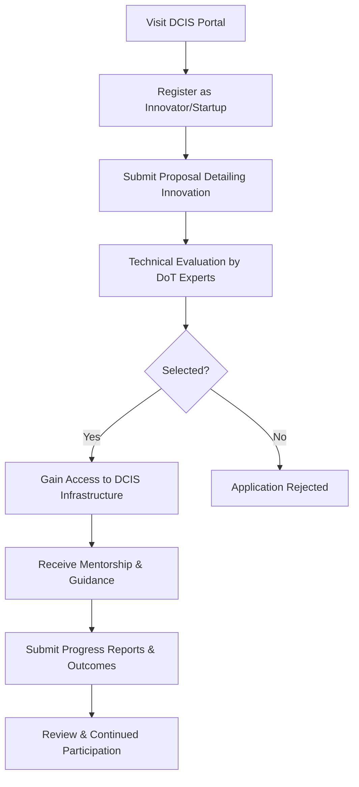

# Comprehensive Scheme Masterclass & File Guide

## Scheme Deep Dive

### Scheme Overview
**Scheme Name:** Digital Communications Innovation Square (DCIS)  
**Scheme ID:** row-291  
**Ministry / Category:** Telecom  
**Scheme Type:** incubation  
**Geographic Scope:** Pan-India  
**Implementing Agency:** Department of Telecommunications, Ministry of Communications  
**Application Portal:** https://dot.gov.in/dcis  
**Status / Deadlines:** Rolling basis — applications accepted throughout the year  
**Last Updated:** 2026  

### Objectives
- Promote indigenous telecom innovation and standardisation  
- Support the vision of Atmanirbhar Bharat and National Digital Communications Policy (NDCP) 2018  
- Advance India's 6G ambitions through research and development  
- Provide a platform for testing and validation of telecom innovations  
- Encourage collaboration between industry, academia, and government  
- Reduce import dependency in telecom equipment and services  

### Eligibility Matrix
| Eligibility Criteria | Details |
|----------------------|---------|
| **Target Beneficiaries** | Startups, MSMEs, innovators |
| **Entity Types** | Startups, MSMEs, innovators, and entities engaged in telecom innovation, standardisation, or development of digital communication solutions |
| **Preference Areas** | Entities working on 5G/6G technologies, indigenous solutions, and those aligned with national telecom priorities |
| **Geographic Scope** | Pan-India |

### Benefits & Financial Support
| Benefit Type | Details |
|--------------|---------|
| **Non-Financial Support** | Access to testing infrastructure, mentorship from industry experts, networking opportunities with investors and telecom operators, visibility through government platforms, support for scaling innovations |
| **Financial Support** | DCIS does not provide direct financial grants or loans. Financial support, if any, is channeled through allied schemes like the Technology Development & Investment Promotion (TDIP) Scheme or Production Linked Incentive (PLI) scheme for telecom and networking products, which offer subsidies or incentives based on investment and sales performance |
| **Key Caveats** | - DCIS does not provide direct funding; financial support must be sought through other schemes - Access to infrastructure is subject to availability and technical evaluation - Continued participation depends on progress and outcomes - Intellectual property rights remain with the innovator, but DoT may retain rights to use results for policy purposes |

### Required Documents
1. Proposal document detailing the innovation  
2. Certificate of Incorporation or Registration  
3. PAN of the entity  
4. Technical specifications and diagrams  
5. Proof of concept or prototype details  
6. Team details and qualifications  

### Application Process Flowchart

> **Important Notes:**  
> - Applications are accepted on a rolling basis throughout the year  
> - The portal URL is https://dot.gov.in/dcis  
> - Contact email for queries: ceo-dibd@digitalindia.gov.in  
> - DCIS focuses on non-financial incubation and validation support  

---

## Consultant's Field Guide to Generated Files

### 1. SCHEME_MASTER_DATABASE.md
**Real-time Usage:** Keep this open in a background tab during all client calls. When a client asks "What is the turnover limit?" or "Who administers this?", CTRL+F in this document to give an immediate, authoritative answer without checking the portal.

### 2. PITCH_AND_SALES_SCRIPTS.md
**Real-time Usage:** Open this file 5 minutes before your first Discovery Call with a lead. Read the "Problem Framing" out loud to hook them, then use the Qualification Checklist to interrogate their eligibility live on the phone. Keep the Objection Handlers table visible so you can immediately counter when they say "We're too small for this."

### 3. APPLICATION_PLAYBOOK.md
**Real-time Usage:** Print this out or pin it to your desktop once the client signs the retainer. Check off each box in "Stage 1" before moving to "Stage 2". Use the "Client Communication Template" to copy-paste directly into your email when chasing them for pending documents.

### 4. CLIENT_ONBOARDING_AND_CRM.md
**Real-time Usage:** Fill this out during or immediately after the onboarding call. Use the Needs Assessment to record their exact pain points. Update the "Compliance Status" table as they email you documents to maintain a single source of truth for what's missing.

### 5. LIVE_CASE_TRACKER.md
**Real-time Usage:** Review this document every morning during your standup. Update the "Stage" column daily. If a case hits "Stage 07 - Under review", use the Escalation Path notes here to know exactly who to call at the government department today.

### 6. FEE_AND_REVENUE_MODEL.md
**Real-time Usage:** Use this file when drafting the proposal. Look at the client's turnover, map them to the pricing tier in the table, and quote that exact Retainer and Success Fee. Use the monthly projection table to update your personal sales pipeline forecast for the quarter.

### 7. CLIENT_PROPOSAL_TEMPLATE.md
**Real-time Usage:** Copy this entire file, paste it into an email or PDF generator, replace the [PLACEHOLDER] tags with the client's actual details gathered from the CRM, and send it immediately after a successful discovery call.

### 8. COMPLIANCE_AND_LEGAL_PACK.md
**Real-time Usage:** Attach sections 8A and 8B as PDFs to the proposal email. Refuse to start Step 1 of the Application Playbook until the client signs these. Use the Disclaimers to protect yourself legally if the client is rejected by the government agency.