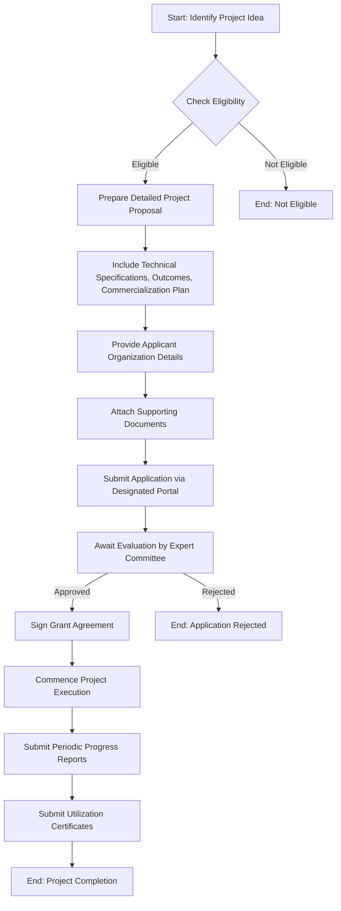

# Comprehensive Scheme Masterclass & File Guide

## Scheme Deep Dive

### Overview
The Telecom Technology Development Fund (TTDF is a grant-based scheme administered by the Department of Telecommunications, Ministry of Communications, Government of India. It aims to promote indigenous research and development in telecom technologies, support innovation in 5G/6G and Innovation Promotion (TTDF) is a grant-based scheme launched by the Department of Telecommunications (DoT), Ministry of Communications, Government of India. It supports telecom technology development projects through financial assistance for research, prototyping, testing, and field trials. The scheme is pan-India in scope and targets startups, MSMEs, academic institutions, and research organizations engaged in telecom innovation.

### Objectives
- Promote indigenous research and development in telecom technologies  
- Support innovation in 5G, 6G, and future telecom standards  
- Reduce import dependence on telecom equipment through domestic manufacturing  
- Strengthen India's participation in global telecom standard-setting bodies  
- Encourage industry-academia collaboration for technology development  
- Provide financial support for proof-of-concept, prototyping, and field trials  
- Facilitate technology transfer and commercialization of telecom innovations  
- Enhance competitiveness of Indian telecom manufacturers in global markets  

### Eligibility Matrix
| Eligible Applicant Type | Requirements | Preference Criteria |
|-------------------------|--------------|---------------------|
| Indian Companies | Registered in India; capable of developing and deploying telecom solutions | Clear commercialization potential; alignment with national telecom priorities (5G/6G, rural connectivity, secure communications) |
| Startups | Registered in India; engaged in telecom technology development | High innovation quotient; scalability potential |
| MSMEs | Registered in India; Udyam registration; telecom technology focus | Cost-effective solutions; employment generation potential |
| Academic Institutions | Recognized by UGC/AICTE; engaged in telecom R&D | Industry collaboration; IP generation potential |
| Research Organizations | DST-recognized; engaged in telecom R&D | National priority alignment; publication/IP output |

### Benefits & Financial Support
| Support Type | Details |
|--------------|---------|
| Financial Support | Grant-based funding covering research, prototyping, testing, and field trials. Quantum determined by project scope, technical merit, and commercialization potential, subject to TTDF corpus availability. |
| Non-Financial Benefits | Access to testing and certification facilities; technical guidance from DoT experts; opportunities for field trials with telecom service providers; assistance in IPR filing; support for participation in international telecom standards forums; recognition for inclusion in government procurement lists; access to pilot deployment opportunities. |

### Application Process (Mermaid Flowchart)

### Key Caveats
> **Warning**: Funding is subject to availability of budget under the Telecom Technology Development Fund. Projects must demonstrate clear alignment with national telecom priorities. Grantees must comply with reporting and audit requirements. Intellectual property developed under the scheme may be subject to government-use rights. Failure to meet project milestones may result in termination of funding.

### Required Documents
1. Certificate of Incorporation / Registration  
2. Audited financial statements of the applicant  
3. Detailed project report with technical specifications  
4. Budget breakdown and utilization plan  
5. Letters of collaboration or MoUs (if applicable)  
6. CVs of key technical personnel  
7. Proof of prior work or prototypes (if any)  
8. Declaration of fund utilization and no-duplication of funding  

### Application Portal URL
https://dot.gov.in/ttdf

### Sources
- Scheme Key Facts (Telecom Technology Development Fund (TTDF))  
- Guidelines | row-292))  
- Application Process details from key facts  
- Benefits and objectives from key facts  
- Eligibility criteria from key facts  
- Required documents from key facts  
- Application portal URL from key facts  

---

## Consultant's Field Guide to Generated Files

### 1. SCHEME_MASTER_DATABASE.md
**Real-time Usage:** Keep this open in a background tab during all client calls. When a client asks "What is the turnover limit?" or "Who administers this?", CTRL+F in this document to give an immediate, authoritative answer without checking the portal.

### 2. PITCH_AND_SALES_SCRIPTS.md
**Real-time Usage:** Open this file 5 minutes before your first Discovery Call with a lead. Read the "Problem Framing" out loud to hook them, then use the Qualification Checklist to interrogate their eligibility live on the phone. Keep the Objection Handlers table visible so you can immediately counter when they say "We're too small for this."

### 3. APPLICATION_PLAYBOOK.md
**Real-time Usage:** Print this out or pin it to your desktop once the client signs the retainer. Check off each box in "Stage 1" before moving to "Stage 2". Use the "Client Communication Template" to copy-paste directly into your email when chasing them for pending documents.

### 4. CLIENT_ONBOARDING_AND_CRM.md
**Real-time Usage:** Fill this out during or immediately after the onboarding call. Use the Needs Assessment to record their exact pain points. Update the "Compliance Status" table as they email you documents to maintain a single source of truth for what's missing.

### 5. LIVE_CASE_TRACKER.md
**Real-time Usage:** Review this document every morning during your standup. Update the "Stage" column daily. If a case hits "Stage 07 - Under review", use the Escalation Path notes here to know exactly who to call at the government department today.

### 6. FEE_AND_REVENUE_MODEL.md
**Real-time Usage:** Use this file when drafting the proposal. Look at the client's turnover, map them to the pricing tier in the table, and quote that exact Retainer and Success Fee. Use the monthly projection table to update your personal sales pipeline forecast for the quarter.

### 7. CLIENT_PROPOSAL_TEMPLATE.md
**Real-time Usage:** Copy this entire file, paste it into an email or PDF generator, replace the [PLACEHOLDER] tags with the client's actual details gathered from the CRM, and send it immediately after a successful discovery call.

### 8. COMPLIANCE_AND_LEGAL_PACK.md
**Real-time Usage:** Attach sections 8A and 8B as PDFs to the proposal email. Refuse to start Step 1 of the Application Playbook until the client signs these. Use the Disclaimers to protect yourself legally if the client is rejected by the government agency.