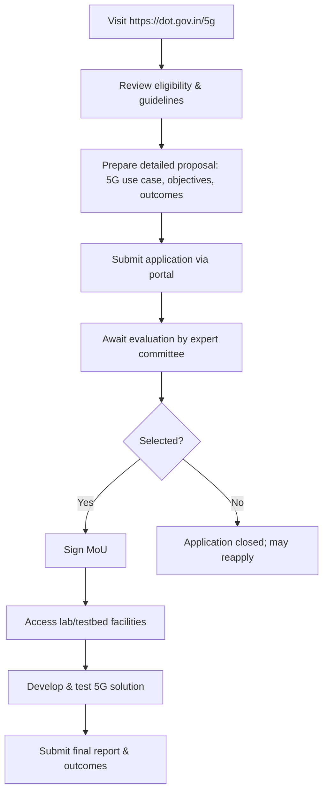

# Comprehensive Scheme Masterclass & File Guide

## Scheme Deep Dive

### Overview
The **5G Use Case Labs & Testbeds Initiative** (Scheme ID: row-293) is a pan-India incubation-type scheme implemented by the **Department of Telecommunications, Ministry of Communications**. It operates on a **rolling basis with no fixed deadline**, accepting applications year-round via the portal: **https://dot.gov.in/5g**. The scheme was last updated in 2024 and aims to establish 5G testbeds for innovation, support startups and MSMEs in developing 5G applications, accelerate  healthcare, manufacturing, agriculture, and foster collaboration between industry, and government.

### Objectives
- Establish 5G use case labs and testbeds for innovation and experimentation  
- Support startups and MSMEs in developing and testing 5G applications  
- Accelerate 5G technology adoption across key sectors like healthcare, manufacturing, and agriculture  
accelerate 5G adoption across sectors, provide technical infrastructure for validation, foster industry-academia-government collaboration, and create a pipeline of scalable 5G solutions for commercial deployment.

### Eligibility Matrix
| Entity Type       | Eligibility Criteria                                                                 | Registration Requirement | Key Requirement                                      |
|-------------------|------------------------------------------------------------------------------------|--------------------------|------------------------------------------------------|
| Startups          | Working on 5G use cases                                                            | Registered in India      | Clear 5G innovation proposal with scalability & impact |
| MSMEs             | Working on 5G use cases                                                            | Registered in India      | Clear 5G innovation proposal with scalability & impact |
| Enterprises       | Working on 5G use cases                                                            | Registered in India      | Clear 5G innovation proposal with scalability & impact |
| Academic Institutions | Working on 5G use cases                                                        | Registered in India      | Clear 5G innovation proposal with scalability & impact |

### Benefits & Financial Support
| Benefit Category              | Details                                                                                                                               |
|-------------------------------|---------------------------------------------------------------------------------------------------------------------------------------|
| Financial Support             | Grants for prototype development, testing, and validation; quantum determined case-by-case based on proposal and available budget       |
| Infrastructure Access         | Access to 5G testbed infrastructure, validation facilities, and connectivity support                                                  |
| Technical Support       | Technical mentorship from industry experts                                                                     |
| Exposure & Networking         | Exposure to industry experts and potential funding opportunities                                                                     |
| Validation & Testing          | Facilities for testing and validation of 5G use cases                                                                               |

> **Key Caveats**  
> - Funding is subject to availability and approval by the screening committee  
> - Intellectual property rights remain with the applicant unless otherwise agreed  
> - Use of testbed facilities is subject to technical and safety compliance  
> - The initiative does not guarantee commercial deployment or funding beyond the test phase  

### Application Process (Mermaid Flowchart)

### Supporting Evidence Summary
- **Application Portal**: https://dot.gov.in/5g (primary source for guidelines and submission)  
- **Contact**: ceo-dibd@digitalindia.gov.in (for queries and submissions)  
- **Documentation Requirements**:  
  1. Certificate of Incorporation / Registration  
  2. PAN of the entity  
  3. Detailed project proposal  
  4. Technical specifications of the 5G use case  
  5. Team credentials and expertise  
  6. Budget utilization plan  
  7. Any relevant certifications or approvals  
- **Status**: Rolling basis, no fixed deadline, applications accepted year-round  
- **Implementing Agency**: Department of Telecommunications, Ministry of Communications  
- **Geographic Scope**: Pan-India  
- **Scheme Type**: Incubation  
- **Last Updated**: 2024  
- **Confidence Level**: Medium (based on evidence consistency)  

---

## Consultant's Field Guide to Generated Files

### 1. SCHEME_MASTER_DATABASE.md
**Real-time Usage:** Keep this open in a background tab during all client calls. When a client asks "What is the turnover limit?" or "Who administers this?", CTRL+F in this document to give an immediate, authoritative answer without checking the portal.

### 2. PITCH_AND_SALES_SCRIPTS.md
**Real-time Usage:** Open this file 5 minutes before your first Discovery Call with a lead. Read the "Problem Framing" out loud to hook them, then use the Qualification Checklist to interrogate their eligibility live on the phone. Keep the Objection Handlers table visible so you can immediately counter when they say "We're too small for this."

### 3. APPLICATION_PLAYBOOK.md
**Real-time Usage:** Print this out or pin it to your desktop once the client signs the retainer. Check off each box in "Stage 1" before moving to "Stage 2". Use the "Client Communication Template" to copy-paste directly into your email when chasing them for pending documents.

### 4. CLIENT_ONBOARDING_AND_CRM.md
**Real-time Usage:** Fill this out during or immediately after the onboarding call. Use the Needs Assessment to record their exact pain points. Update the "Compliance Status" table as they email you documents to maintain a single source of truth for what's missing.

### 5. LIVE_CASE_TRACKER.md
**Real-time Usage:** Review this document every morning during your standup. Update the "Stage" column daily. If a case hits "Stage 07 - Under review", use the Escalation Path notes here to know exactly who to call at the government department today.

### 6. FEE_AND_REVENUE_MODEL.md
**Real-time Usage:** Use this file when drafting the proposal. Look at the client's turnover, map them to the pricing tier in the table, and quote that exact Retainer and Success Fee. Use the monthly projection table to update your personal sales pipeline forecast for the quarter.

### 7. CLIENT_PROPOSAL_TEMPLATE.md
**Real-time Usage:** Copy this entire file, paste it into an email or PDF generator, replace the [PLACEHOLDER] tags with the client's actual details gathered from the CRM, and send it immediately after a successful discovery call.

### 8. COMPLIANCE_AND_LEGAL_PACK.md
**Real-time Usage:** Attach sections 8A and 8B as PDFs to the proposal email. Refuse to start Step 1 of the Application Playbook until the client signs these. Use the Disclaimers to protect yourself legally if the client is rejected by the government agency.