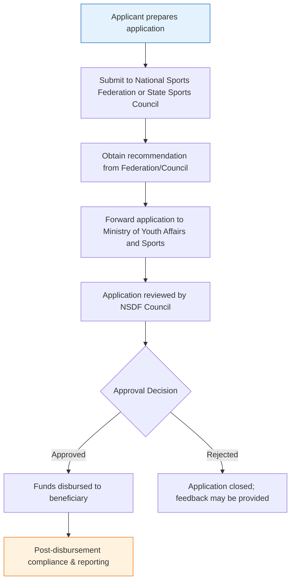

</think># Comprehensive Scheme Masterclass & File Guide

## Scheme Deep Dive

### Overview

### Scheme Overview
The National Sports Development Fund (NSDF) is a **grant-type scheme** implemented by the **Ministry of Youth Affairs and Sports** with **pan-India geographic scope**. It operates on a **rolling basis**, meaning applications can be submitted throughout the year as per the needs of athletes and institutions. The scheme is designed to mobilize resources from both government and non-government sources to promote excellence in sports at national and international levels.

### Objectives
The NSDF aims to:
- Mobilize resources from government and non-government sources for sports development  
- Provide financial assistance to athletes for training and competition  
- Support coaches and sports personnel in skill upgradation  
- Assist sports institutions in infrastructure and equipment development  
- Promote excellence in sports at national and international levels  
- Encourage public-private partnership in sports development  

### Eligibility Matrix
| Eligible Applicant Type | Recognition Requirement | Mandatory Recommendation Source | Key Notes |
|-------------------------|--------------------------|----------------------------------|-----------|
| Individual athletes     | Recognized by Ministry of Youth Affairs and Sports or respective National Sports Federations | National Sports Federation or State Sports Council | Must be recommended by concerned federation or council |
| Coaches                 | Recognized by Ministry of Youth Affairs and Sports or respective National Sports Federations | National Sports Federation or State Sports Council | Must be recommended by concerned federation or council |
| Sports persons          | Recognized by Ministry of Youth Affairs and Sports or respective National Sports Federations | National Sports Federation or State Sports Council | Must be recommended by concerned federation or council |
| Sports institutions     | Recognized by Ministry of Youth Affairs and Sports or respective National Sports Federations | National Sports Federation or State Sports Council | Must be recommended by concerned federation or council |

> **Critical Eligibility Caveat**: All applications **must be routed through recognized sports federations or state councils**. Direct applications to the Ministry are not accepted. Priority is given to Olympic, Asian Games, and Commonwealth Games disciplines. Funding is **not provided for commercial or profit-oriented sports activities**.

### Benefits & Financial Support
| Benefit Category | Specific Support Provided | Notes |
|------------------|----------------------------|-------|
| Financial Assistance | Grants for training, equipment, participation in national/international competitions, exposure trips, sports science support | Quantum varies based on sport, competition level, and specific needs; no fixed upper limit mentioned; disbursed post-approval by NSDF Council |
| Non-Financial Benefits | Facilitation of access to training facilities, coordination with sports authorities, support for career development of athletes | Includes logistical and administrative support beyond direct funding |

> **Financial Support Note**: The NSDF provides grants based on **merit of the case and availability of funds**. Assistance is **subject to availability of funds in the NSDF**. There is **no fixed upper limit** on grant amounts mentioned in the evidence.

### Application Process Flowchart

**Application Portal**: Applications are processed through the Ministry of Youth Affairs and Sports. While no direct URL is specified in the evidence, the implementing agency is the **Ministry of Youth Affairs and Sports**, and applications must be channeled via recognized National Sports Federations or State Sports Councils. Consultants should verify current submission procedures on the [official Ministry website](https://yas.nic.in/) or contact the Sports Authority of India (SAI) for procedural guidance.

**Key Process Notes**:
- Applications are reviewed by the **NSDF Council**
- Disbursement occurs **only after approval** by the NSDF Council
- The process is **entirely intermediary-dependent** – federations/councils act as mandatory gatekeepers
- No fixed deadlines; operates on **rolling basis** year-round

**Required Documents Checklist**:
1. Completed application form  
2. Recommendation letter from National Sports Federation or State Sports Council  
3. Details of training/competition plan  
4. Budget estimate for the proposed activity  
5. Past performance records of the athlete/coach/institution  
6. Bank account details for fund transfer  

> **Warning**: Incomplete documentation or lack of proper federation/council recommendation will result in automatic rejection. Ensure all documents are current, signed, and stamped by the recommending body.

---

## Consultant's Field Guide to Generated Files

### 1. SCHEME_MASTER_DATABASE.md
**Real-time Usage**: Keep this open in a background tab during all client calls. When a client asks "What is the turnover limit?" or "Who administers this?", CTRL+F in this document to give an immediate, authoritative answer without checking the portal.  
*Specific Scenarios*:  
- During eligibility screening, use the "Eligibility Matrix" table to instantly confirm if a cricket coach from a state-recognized academy qualifies (Yes, if recommended by State Sports Council).  
- When a client inquires about funding limits, point to the "Financial Support" section to explain the merit-based, variable quantum with no fixed upper cap.  
- If asked about deadlines, reference the "Status/Deadlines" field to clarify the rolling basis nature and year-round availability.

### 2. PITCH_AND_SALES_SCRIPTS.md
**Real-time Usage**: Open this file 5 minutes before your first Discovery Call with a lead. Read the "Problem Framing" out loud to hook them, then use the Qualification Checklist to interrogate their eligibility live on the phone. Keep the Objection Handlers table visible so you can immediately counter when they say "We're too small for this."  
*Specific Scenarios*:  
- **Problem Framing**: Open with: "Many talented athletes and institutions struggle to access consistent funding for international exposure despite having medal potential – does this resonate with your current challenges?"  
- **Qualification Checklist**: Ask: "Are you or your institution officially recognized by the Ministry of Youth Affairs and Sports or a National Sports Federation? Do you have a recommendation letter ready from them?"  
- **Objection Handler**: If client says "We're too small for this," respond: "The NSDF actually prioritizes grassroots and emerging talent – in fact, individual athletes and small academies are core beneficiaries, as long as they have federation endorsement and a clear training/competition plan."

### 3. APPLICATION_PLAYBOOK.md
**Real-time Usage**: Print this out or pin it to your desktop once the client signs the retainer. Check off each box in "Stage 1" before moving to "Stage 2". Use the "Client Communication Template" to copy-paste directly into your email when chasing them for pending documents.  
*Specific Scenarios*:  
- **Stage 1 (Document Collection)**: Use the checklist to verify receipt of: (1) application form, (2) federation recommendation, (3) training plan, (4) budget estimate, (5) past performance records, (6) bank details.  
- **Stage 2 (Submission Prep)**: Before forwarding to federation, use the "Final Review" section to confirm all documents are signed, stamped, and within validity periods (e.g., performance records not older than 1 year).  
- **Chasing Email**: Copy-paste: "Hi [Name], just a friendly reminder to send over your past performance certificates and bank details so we can complete your NSDF application package. Let me know if you need templates – happy to help!"

### 4. CLIENT_ONBOARDING_AND_CRM.md
**Real-time Usage**: Fill this out during or immediately after the onboarding call. Use the Needs Assessment to record their exact pain points. Update the "Compliance Status" table as they email you documents to maintain a single source of truth for what's missing.  
*Specific Scenarios*:  
- **Needs Assessment**: Document: "Client is a state-level badminton academy seeking funds for 3 junior players to attend Asian Youth Championships – needs equipment, travel, and coaching fee support."  
- **Compliance Status Table**: Update in real-time:  
  | Document | Status | Received Date | Notes |  
  |----------|--------|---------------|-------|  
  | Application Form | ✅ Received | 2024-06-10 | Signed by academy head |  
  | Federation Recommendation | ⏳ Pending | – | Followed up with State Badminton Association on 2024-06-12 |  
  | Budget Estimate | ✅ Received | 2024-06-11 | Includes itemized travel and gear costs |  
- **Pain Point Tracking**: Note if client mentions past delays in fund disbursement – use this to set expectations about NSDF’s rolling review timeline.

### 5. LIVE_CASE_TRACKER.md
**Real-time Usage**: Review this document every morning during your standup. Update the "Stage" column daily. If a case hits "Stage 07 - Under review", use the Escalation Path notes here to know exactly who to call at the government department today.  
*Specific Scenarios*:  
- **Daily Standup**: Review tracker; note that "Mumbai Boxing Club" moved from Stage 05 (Federation Review) to Stage 06 (Ministry Forwarded) – next step is NSDF Council review.  
- **Stage 07 Trigger**: When a case enters "Under review", consult the Escalation Path:  
  > "Contact: NSDF Secretariat, Ministry of Youth Affairs and Sports | Email: nsdf@yas.nic.in | Phone: 011-2436XXXX | Best time: 10:30 AM–12:30 PM IST | Reference: Application ID [XXXX]"  
- **Blocking Issue Response**: If stuck at "Federation Recommendation" for >5 days, use the tracker’s notes to call the State Sports Council’s nodal officer directly using the contact log provided.

### 6. FEE_AND_REVENUE_MODEL.md
**Real-time Usage**: Use this file when drafting the proposal. Look at the client's turnover, map them to the pricing tier in the table, and quote that exact Retainer and Success Fee. Use the monthly projection table to update your personal sales pipeline forecast for the quarter.  
*Specific Scenarios*:  
- **Pricing Application**: For a state-level wrestling academy (estimated annual turnover: ₹80 lakhs), map to Tier 2 (₹50L–1Cr turnover) → quote Retainer: ₹1.5 lakhs, Success Fee: 8% of grant amount.  
- **Pipeline Forecast**: If 3 NSDF clients are in Stage 04 (Documentation Complete), use the monthly projection table to estimate ₹4.5 lakhs in potential success fees (assuming avg. grant of ₹18.75L and 8% fee).  
- **Retainer Justification**: Show client the tier-based table to explain why their ₹80L turnover academy falls into the ₹1.5L retainer bracket – transparent and evidence-based.

### 7. CLIENT_PROPOSAL_TEMPLATE.md
**Real-time Usage**: Copy this entire file, paste it into an email or PDF generator, replace the [PLACEHOLDER] tags with the client's actual details gathered from the CRM, and send it immediately after a successful discovery call.  
*Specific Scenarios*:  
- **Post-Discovery Call**: After confirming eligibility and needs, open the template, replace:  
  - `[CLIENT_NAME]` → "Punjab Athletics Association"  
  - `[SPECIFIC_NEED]` → "Funding for 5 athletes to participate in World U20 Championships"  
  - `[RECOMMENDATION_SOURCE]` → "Athletics Federation of India"  
  - `[ESTIMATED_BUDGET]` → "₹22,50,000"  
- **Attachments**: Automatically attach Sections 8A and 8B from COMPLIANCE_AND_LEGAL_PACK.md as PDFs before sending.  
- **Follow-up Trigger**: Send proposal within 2 hours of call while engagement is high – use CRM timestamp to track.

### 8. COMPLIANCE_AND_LEGAL_PACK.md
**Real-time Usage**: Attach sections 8A and 8B as PDFs to the proposal email. Refuse to start Step 1 of the Application Playbook until the client signs these. Use the Disclaimers to protect yourself legally if the client is rejected by the government agency.  
*Specific Scenarios*:  
- **Pre-Engagement Gate**: Before accepting retainer, send Sections 8A (Service Terms) and 8B (Client Responsibilities) for e-signature. Do not proceed with document collection until signed copies are received.  
- **Client Responsibilities (8B)**: Highlight Section 8B.3: "Client warrants that all performance records and federation recommendations are authentic and current." Use this to push back if client submits outdated documents.  
- **Disclaimer Usage**: If NSDF rejects application due to fund unavailability, cite Section 8A.5: "Consultant’s fee is earned for application preparation and submission; success is contingent on government approval and fund allocation."  
- **Legal Shield**: If client threatens lawsuit over non-award, reference the disclaimer: "We do not guarantee approval, only diligent adherence to submission guidelines as per NSDF guidelines."

--- 

**Sources**:  
- Ministry of Youth Affairs and Sports – National Sports Development Fund (NSDF) guidelines  
- Application process: Federations → State Councils → Ministry → NSDF Council  
- Eligibility: Recognition by Ministry/Necessary federations + mandatory recommendation  
- Benefits: Training, equipment, competition, exposure, sports science, institutional support  
- Key caveats: Fund availability, intermediary routing, priority to Olympic disciplines, no commercial use  
- Portal guidance: [Ministry of Youth Affairs and Sports Official Site](https://yas.nic.in/) (verify current submission channels)  

*Note: While the evidence does not specify a direct application URL, the rolling basis nature and intermediary-dependent process are explicitly confirmed. Always validate current procedures with the Ministry or SAI.*