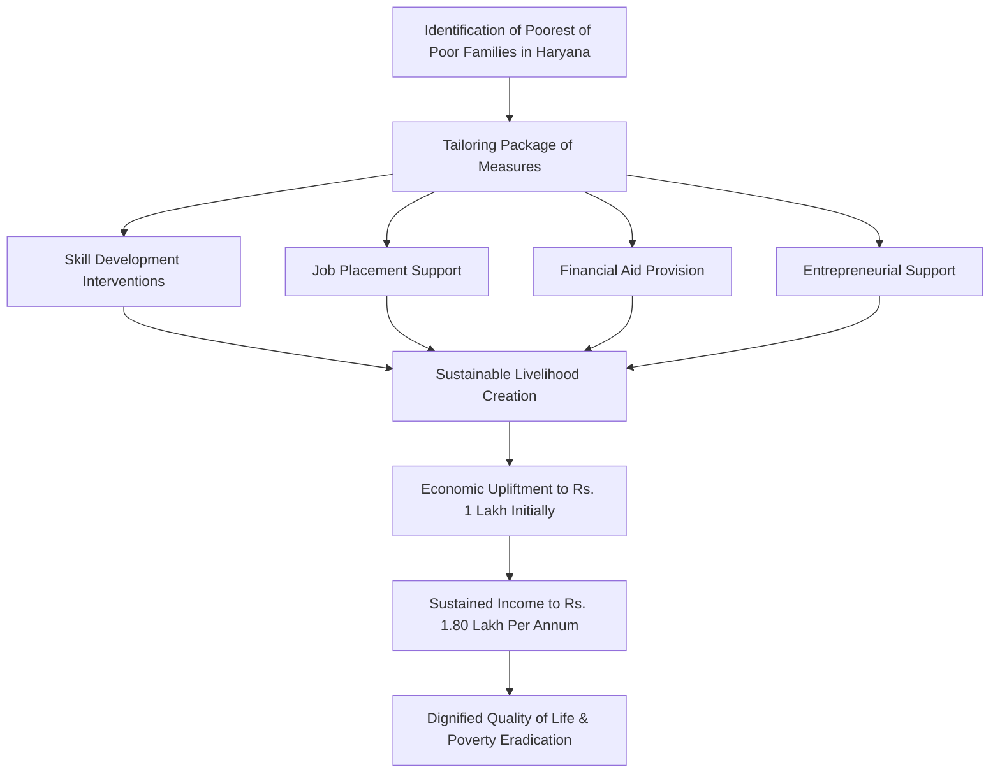

# Comprehensive Scheme Masterclass & File Guide

## Scheme

## Scheme Overview
- **Scheme Name:** Mukhya Mantri Antyodaya Parivar Utthan Yojana (MMAPUY)
- **Scheme ID:** row-3
- **Ministry / Category:** State Level (Haryana)
- **Scheme Type:** other
- **Geographic Scope:** Haryana only
- **Implementing Agency:** Department of Information Technology Electronics & Communication, Haryana
- **Last Updated:** 2021
- **Contact Details:** Email: rosy.gandhi-hry[at]hry.gov.in | Phone: 0172-2748142
- **Application Portal URL:** https://haryanait.gov.in/mukhya-mantri-antyodaya-parivar-utthan-yojana-mmapuy/
- **Confidence:** medium

## Objectives
- Eradicate poverty by raising income levels of economically disadvantaged families in Haryana
- Provide sustainable livelihoods through skill development, job placements, financial aid, and entrepreneurial support
- Ensure a dignified quality of life for underprivileged families
- Foster equitable growth and reduce income disparities across the state
- Identify poorest of the poor families and tailor a package of measures from various welfare schemes for each family
- Reach a minimum economic threshold of Rs. 1 lakh initially and Rs. 1.80 lakh per annum subsequently

## Benefits
- Through targeted interventions like skill development, job placements, financial aid, and entrepreneurial support, the program seeks to provide sustainable livelihoods and ensure a dignified quality of life for underprivileged families.
- The initiative is dedicated to fostering equitable growth and reducing income disparities across the state.
- The scheme provides financial aid as part of a tailored package of measures from various welfare schemes, though specific quantum, type, and mechanism are not detailed in the evidence.

## Eligibility Matrix
| Criteria | Details |
|----------|---------|
| **Target Beneficiaries** | Poorest of the poor families; economically disadvantaged families |
| **Geographic Scope** | Families residing in the State of Haryana only |
| **Identification Basis** | Poorest of the poor families identified in the State of Haryana |
| **Package Tailoring** | A package of measures from various welfare schemes (skill development, wage employment, self-employment etc.) is tailored for each family |
| **Economic Threshold** | Must reach a minimum economic threshold of Rs. 1 lakh initially and Rs. 1.80 lakh per annum subsequently |

## Financial Support
| Aspect | Detail |
|--------|--------|
| **Type** | Financial aid as part of a tailored package of measures from various welfare schemes |
| **Quantum** | Not specified in evidence |
| **Mechanism** | Tailored package per family; not detailed in evidence |
| **Note** | Specific quantum, type, and mechanism are not detailed in the evidence |

## Application Process
> **Warning:** The evidence does not provide a numbered step-by-step application procedure for MMAPUY. The process is described as an umbrella mission identifying families and tailoring welfare scheme packages.

### Mermaid.js Flowchart: Application Process

## Key Takeaways
> The scheme operates as an umbrella mission under the Department of Information Technology Electronics & Communication, Haryana, coordinating multiple welfare schemes to uplift the poorest families through customized interventions targeting skill development, employment, financial support, and entrepreneurship to achieve defined income thresholds.

---

## Consultant's Field Guide to Generated Files

### 1. SCHEME_MASTER_DATABASE.md
**Real-time Usage:** Keep this open in a background tab during all client calls. When a client asks "What is the turnover limit?" or "Who administers this?", CTRL+F in this document to give an immediate, authoritative answer without checking the portal.

### 2. PITCH_AND_SALES_SCRIPTS.md
**Real-time Usage:** Open this file 5 minutes before your first Discovery Call with a lead. Read the "Problem Framing" out loud to hook them, then use the Qualification Checklist to interrogate their eligibility live on the phone. Keep the Objection Handlers table visible so you can immediately counter when they say "We're too small for this."

### 3. APPLICATION_PLAYBOOK.md
**Real-time Usage:** Print this out or pin it to your desktop once the client signs the retainer. Check off each box in "Stage 1" before moving to "Stage 2". Use the "Client Communication Template" to copy-paste directly into your email when chasing them for pending documents.

### 4. CLIENT_ONBOARDING_AND_CRM.md
**Real-time Usage:** Fill this out during or immediately after the onboarding call. Use the Needs Assessment to record their exact pain points. Update the "Compliance Status" table as they email you documents to maintain a single source of truth for what's missing.

### 5. LIVE_CASE_TRACKER.md
**Real-time Usage:** Review this document every morning during your standup. Update the "Stage" column daily. If a case hits "Stage 07 - Under review", use the Escalation Path notes here to know exactly who to call at the government department today.

### 6. FEE_AND_REVENUE_MODEL.md
**Real-time Usage:** Use this file when drafting the proposal. Look at the client's turnover, map them to the pricing tier in the table, and quote that exact Retainer and Success Fee. Use the monthly projection table to update your personal sales pipeline forecast for the quarter.

### 7. CLIENT_PROPOSAL_TEMPLATE.md
**Real-time Usage:** Copy this entire file, paste it into an email or PDF generator, replace the [PLACEHOLDER] tags with the client's actual details gathered from the CRM, and send it immediately after a successful discovery call.

### 8. COMPLIANCE_AND_LEGAL_PACK.md
**Real-time Usage:** Attach sections 8A and 8B as PDFs to the proposal email. Refuse to start Step 1 of the Application Playbook until the client signs these. Use the Disclaimers to protect yourself legally if the client is rejected by the government agency.