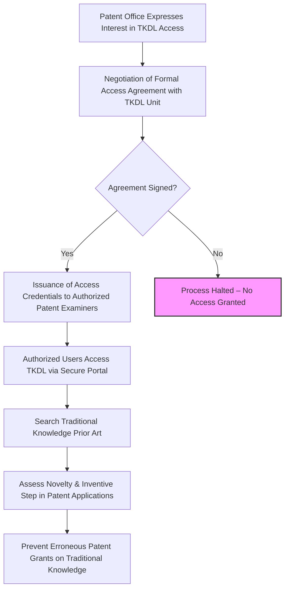

</think># Comprehensive Scheme Masterclass & File Guide

## Scheme Deep Dive

### Overview
The Traditional Knowledge Digital Library (TKDL) is a strategic initiative by the Government of India designed to protect India's traditional knowledge from misappropriation through erroneous patent grants. It functions as a defensive prior art repository, digitizing and transcribing traditional knowledge from ancient Indian texts into multiple international languages for use by patent examiners worldwide. Unlike beneficiary-oriented schemes, TKDL does not provide direct financial support but serves as a critical tool in safeguarding indigenous intellectual property rights on a global scale.

### Objectives
- Prevent the grant of erroneous patents on India's traditional knowledge  
- Provide access to traditional knowledge in patent application languages to international patent offices  
- Digitize and transcribe traditional knowledge from ancient Indian texts  
- Facilitate prior art search for patent examiners worldwide  
- Protect India's traditional knowledge from biopiracy  
- Promote awareness and documentation of traditional knowledge systems  

### Eligibility Matrix
| Eligibility Criteria | Details | Source |
|----------------------|---------|--------|
| **Target Beneficiaries** | Patent examiners; researchers; indigenous communities; government bodies | Key Facts |
| **Access Eligibility** | Patent offices that have signed formal access agreements with TKDL | Key Facts |
| **Geographic Scope** | Pan-India (source of knowledge); Global (access by international patent offices) | Key Facts |
| **Ineligible Entities** | Individuals, private companies, NGOs, and communities seeking direct financial benefits or public access | Key Facts |
| **Access Mechanism** | Execution of formal access agreements between TKDL Unit and patent offices | Key Facts |

> **Important Caveat**: TKDL is not a beneficiary-oriented scheme. It does not provide financial compensation, grants, or direct support to individuals, and benefits to indigenous communities or individuals. Its value lies in defensive protection through prior art disclosure.

### Benefits & Financial Support
| Benefit Category | Specific Benefits | Details | Source |
|------------------|-------------------|---------|--------|
| **Defensive Protection** | Prevention of erroneous patent grants | TKDL provides prior art evidence to patent examiners to assess novelty and inventive step, blocking biopiracy attempts | Key Facts |
| **Legal Support** | Evidence for opposition/revocation | Search results from TKDL are used in legal proceedings to oppose or revoke patents based on traditional knowledge | Key Facts |
| **Global Awareness** | Enhanced documentation | Digitization and transcription of traditional knowledge from ancient texts into multiple languages (e.g., English, Japanese, Spanish, German, French) increases international visibility | Key Facts |
| **Systemic Impact** | Prior art repository | Functions as a searchable database for patent examiners under international agreements, improving patent quality globally | Key Facts |
| **Financial Support** | None | TKDL does not provide direct financial support to any individual, entity, or community. It is funded by the Government of India through CSIR and AYUSH for development, maintenance, and access management. | Key Facts |

> **Critical Note**: The absence of financial support is a defining feature. Consultants must manage client expectations—TKDL is a protective infrastructure, not a funding scheme.

### Application Process (for Patent Offices)
The following Mermaid flowchart illustrates the process for patent offices seeking access to TKDL:

> **Access Portal**: While the exact URL is not publicly disclosed due to security restrictions, access is granted only after signing an agreement with the TKDL Unit. Interested patent offices must contact:  
> **TKDL Unit, Council of Scientific and Industrial Research (CSIR)**  
> Website: [https://www.tkdl.res.in](https://www.tkdl.res.in) (Note: This is the public-facing informational portal; actual access is restricted)  
> Source: Key Facts – Application Process and Access Mechanism  

### Key Caveats
- Access is **strictly limited** to patent offices that have executed formal access agreements with TKDL  
- TKDL **does not offer public access**; the database is not available to researchers, individuals, or the general public  
- TKDL **does not confer intellectual property rights**; it is solely a prior art repository  
- The initiative is **defensive in nature**—its success is measured by patents *prevented*, not grants issued  
- Financial support is **explicitly absent**; all funding comes from government budgetary support to CSIR and AYUSH  

---

## Consultant's Field Guide to Generated Files

### 1. SCHEME_MASTER_DATABASE.md
**Real-time Usage:** Keep this open in a background tab during all client calls. When a client asks "What is the turnover limit?" or "Who administers this?", CTRL+F in this document to give an immediate, authoritative answer without checking the portal.

### 2. PITCH_AND_SALES_SCRIPTS.md
**Real-time Usage:** Open this file 5 minutes before your first Discovery Call with a lead. Read the "Problem Framing" out loud to hook them, then use the Qualification Checklist to interrogate their eligibility live on the phone. Keep the Objection Handlers table visible so you can immediately counter when they say "We're too small for this."

### 3. APPLICATION_PLAYBOOK.md
**Real-time Usage:** Print this out or pin it to your desktop once the client signs the retainer. Check off each box in "Stage 1" before moving to "Stage 2". Use the "Client Communication Template" to copy-paste directly into your email when chasing them for pending documents.

### 4. CLIENT_ONBOARDING_AND_CRM.md
**Real-time Usage:** Fill this out during or immediately after the onboarding call. Use the Needs Assessment to record their exact pain points. Update the "Compliance Status" table as they email you documents to maintain a single source of truth for what's missing.

### 5. LIVE_CASE_TRACKER.md
**Real-time Usage:** Review this document every morning during your standup. Update the "Stage" column daily. If a case hits "Stage 07 - Under review", use the Escalation Path notes here to know exactly who to call at the government department today.

### 6. FEE_AND_REVENUE_MODEL.md
**Real-time Usage:** Use this file when drafting the proposal. Look at the client's turnover, map them to the pricing tier in the table, and quote that exact Retainer and Success Fee. Use the monthly projection table to update your personal sales pipeline forecast for the quarter.

### 7. CLIENT_PROPOSAL_TEMPLATE.md
**Real-time Usage:** Copy this entire file, paste it into an email or PDF generator, replace the [PLACEHOLDER] tags with the client's actual details gathered from the CRM, and send it immediately after a successful discovery call.

### 8. COMPLIANCE_AND_LEGAL_PACK.md
**Real-time Usage:** Attach sections 8A and 8B as PDFs to the proposal email. Refuse to start Step 1 of the Application Playbook until the client signs these. Use the Disclaimers to protect yourself legally if the client is rejected by the government agency.