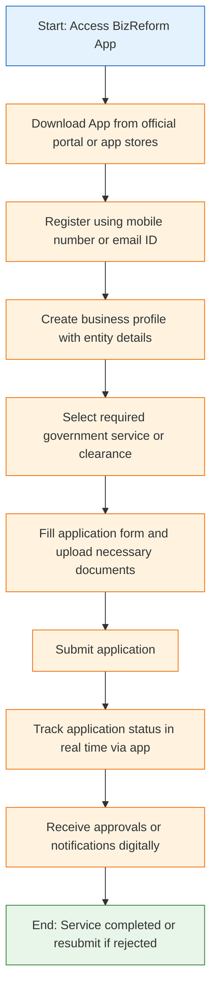

</think># Comprehensive Scheme Masterclass & File Guide

## Scheme Deep Dive

### Overview
The **Ease of Doing Business – BizReform App** is a digital facilitation platform launched by the **Department for Promotion of Industry and Internal Trade (DPIIT)**, under the **Ministry of Commerce and Industry**, Government of India. Designed to streamline regulatory interactions, it serves as a single-window interface for businesses to access multiple government services across central and state departments. The scheme operates on a **rolling basis with no fixed deadline**, offering year-round accessibility via its official portal: [https://bizreform.eodb.gov.in](https://bizreform.eodb.gov.in).

### Objectives
The BizReform App aims to:
- Provide a single-window digital platform for business-related government services  
- Reduce time and cost involved in obtaining regulatory approvals  
- Enhance transparency and accountability in government processes  
- Integrate central and state-level clearances on one platform  
- Support ease of doing business initiatives across India  

### Eligibility Matrix
| Eligibility Criteria | Details | Source |
|----------------------|--------|--------|
| **Business Entity Type** | Any business entity, including startups, MSMEs, and entrepreneurs | Key Facts |
| **Purpose of Use** | Seeking government approvals, registrations, or clearances | Key Facts |
| **Geographic Scope** | Pan-India | Key Facts |
| **Exclusions** | None specified; open to all entities requiring regulatory services | Key Facts |

> **Note**: While the app is accessible to all, actual service availability depends on integration with respective departmental portals (central or state). Approval is not guaranteed and remains subject to departmental eligibility criteria.

### Benefits & Financial Support
| Benefit Category | Specific Benefits | Source |
|------------------|-------------------|--------|
| **Procedural Efficiency** | Single-window access to multiple government services; reduced procedural delays; digital submission and tracking of applications | Key Facts |
| **Transparency & Tracking** | Real-time application status tracking; improved transparency in approval processes; digital receipt of approvals/notifications | Key Facts |
| **Cost & Time Savings** | Eliminates physical visits; reduces paperwork; accelerates approval timelines | Key Facts |
| **Integration** | Seamless integration with central and state government portals for unified service access | Key Facts |
| **Financial Support** | **No direct financial support** (grants, loans, subsidies). The platform is purely facilitative. | Key Facts |

> **Critical Caveat**: The BizReform App facilitates access and tracking but **does not guarantee approval**. Final sanction depends on the respective department’s evaluation criteria. Users must ensure all documents are valid and up to date to avoid rejection.

### Required Documents
Applicants must submit the following documents during registration and application:
1. PAN of the business entity  
2. Certificate of Incorporation or Registration  
3. GSTIN (if applicable)  
4. Bank account details  
5. Authorization letter from authorized signatory  
6. Identity and address proof of the applicant  

### Application Process Flow
The following Mermaid flowchart illustrates the step-by-step application journey within the BizReform App:

**Application Portal**: [https://bizreform.eodb.gov.in](https://bizreform.eodb.gov.in)  
**Status**: Operational year-round; no fixed deadlines  
**Implementing Agency**: Department for Promotion of Industry and Internal Trade (DPIIT)  
**Confidence Level**: Medium (based on structured extraction from source)

---

## Consultant's Field Guide to Generated Files

### 1. SCHEME_MASTER_DATABASE.md
**Real-time Usage**: Keep this open in a background tab during all client calls. When a client asks "What is the turnover limit?" or "Who administers this?", CTRL+F in this document to give an immediate, authoritative answer without checking the portal.  
**Key Fields to Reference**: Scheme Name, Implementing Agency (DPIIT), Portal URL, Eligibility (any business entity), Financial Support (none), Required Documents (6-item list), Process Steps (7-step flow).

### 2. PITCH_AND_SALES_SCRIPTS.md
**Real-time Usage**: Open this file 5 minutes before your first Discovery Call with a lead. Read the "Problem Framing" out loud to hook them, then use the Qualification Checklist to interrogate their eligibility live on the phone. Keep the Objection Handlers table visible so you can immediately counter when they say "We're too small for this."  
**When to Use**: Pre-call preparation and live client engagement.  
**How to Use**:  
- Use "Problem Framing" scripts to highlight pain points: *"Are you tired of visiting multiple offices for single clearances?"*  
- Run through Qualification Checklist: Confirm entity type, purpose (approvals/registrations), and document readiness.  
- Deploy Objection Handlers: For *"We’re too small"* → *"The BizReform App is designed specifically for startups and MSMEs—size doesn’t matter; it’s about access."*

### 3. APPLICATION_PLAYBOOK.md
**Real-time Usage**: Print this out or pin it to your desktop once the client signs the retainer. Check off each box in "Stage 1" before moving to "Stage 2". Use the "Client Communication Template" to copy-paste directly into your email when chasing them for pending documents.  
**When to Use**: Post-engagement kickoff through application submission.  
**How to Use**:  
- **Stage 1 (Preparation)**: Verify client has PAN, Incorporation Cert, GSTIN (if applicable), bank details, auth letter, ID/address proof.  
- **Stage 2 (Profile Setup)**: Guide client to download app, register, create business profile.  
- **Stage 3 (Service Selection)**: Help identify correct service from integrated central/state list.  
- **Stage 4–5 (Form & Upload)**: Assist in form filling and document upload using checklist.  
- **Stage 6 (Submit & Track)**: Confirm submission and train client on real-time tracking.  
- **Stage 7 (Follow-up)**: Use template to notify client of approval or guide resubmission if rejected.

### 4. CLIENT_ONBOARDING_AND_CRM.md
**Real-time Usage**: Fill this out during or immediately after the onboarding call. Use the Needs Assessment to record their exact pain points. Update the "Compliance Status" table as they email you documents to maintain a single source of truth for what's missing.  
**When to Use**: Initial client onboarding and ongoing document collection.  
**How to Use**:  
- In Needs Assessment: Capture specific services needed (e.g., FSSAI license, factory registration, IEC code).  
- In Compliance Status Table: Mark each required document as [Received], [Pending], or [Invalid/Expired].  
- Update daily: When client sends bank details, or GSTIN arrives, check it off.  
- Use status to trigger next steps: Only proceed to app registration when all 6 documents are [Received].

### 5. LIVE_CASE_TRACKER.md
**Real-time Usage**: Review this document every morning during your standup. Update the "Stage" column daily. If a case hits "Stage 07 - Under review", use the Escalation Path notes here to know exactly who to call at the government department today.  
**When to Use**: Daily case management and progress monitoring.  
**How to Use**:  
- Each morning, open tracker and update Stage based on client/app status:  
  - Stage 01: Documents collected  
  - Stage 02: App downloaded & registered  
  - Stage 03: Profile created  
  - Stage 04: Service selected  
  - Stage 05: Form filled & docs uploaded  
  - Stage 06: Submitted  
  - Stage 07: Under review (by department)  
  - Stage 08: Approved / Rejected  
- At Stage 07: Refer to Escalation Path — contact designated nodal officer at DPIIT or relevant state portal via listed helpline/email for status inquiry.

### 6. FEE_AND_REVENUE_MODEL.md
**Real-time Usage**: Use this file when drafting the proposal. Look at the client's turnover, map them to the pricing tier in the table, and quote that exact Retainer and Success Fee. Use the monthly projection table to update your personal sales pipeline forecast for the quarter.  
**When to Use**: Proposal drafting and financial planning.  
**How to Use**:  
- Since BizReform App offers **no financial support**, fees are purely service-based.  
- Refer to pricing tiers (to be filled by consultant): e.g.,  
  | Client Turnover | Retainer Fee | Success Fee |  
  |-----------------|--------------|-------------|  
  | < ₹1 Cr         | [TO BE FILLED] | [TO BE FILLED] |  
  | ₹1–10 Cr        | [TO BE FILLED] | [TO BE FILLED] |  
  | > ₹10 Cr        | [TO BE FILLED] | [TO BE FILLED] |  
- Use projection table to estimate monthly closures and revenue impact on quarterly targets.

### 7. CLIENT_PROPOSAL_TEMPLATE.md
**Real-time Usage**: Copy this entire file, paste it into an email or PDF generator, replace the [PLACEHOLDER] tags with the client's actual details gathered from the CRM, and send it immediately after a successful discovery call.  
**When to Use**: Post-discovery, pre-engagement.  
**How to Use**:  
- After confirming eligibility and needs, open template.  
- Replace:  
  - `[CLIENT_NAME]`  
  - `[BUSINESS_TYPE]` (e.g., Private Limited, Proprietorship)  
  - `[SERVICE_NEEDED]` (e.g., FSSAI License, Shop Act Registration)  
  - `[TURNOVER]`  
  - `[RETAINER_FEE]` and `[SUCCESS_FEE]` from FEE_AND_REVENUE_MODEL.md  
  - `[CONSULTANT_NAME]`  
  - `[VALID_TILL]` (typically 15 days from issue)  
- Attach:  
  - SCHEME_MASTER_DATABASE.md (as reference)  
  - COMPLIANCE_AND_LEGAL_PACK.md (Sections 8A & 8B)  
- Send via email with subject: *"Proposal: BizReform App Support for [CLIENT_NAME]"*

### 8. COMPLIANCE_AND_LEGAL_PACK.md
**Real-time Usage**: Attach sections 8A and 8B as PDFs to the proposal email. Refuse to start Step 1 of the Application Playbook until the client signs these. Use the Disclaimers to protect yourself legally if the client is rejected by the government agency.  
**When to Use**: Pre-engagement contract finalization and risk mitigation.  
**How to Use**:  
- **Section 8A (Service Agreement)**: Outlines scope (app guidance, doc prep, tracking support), fees, timelines, and confidentiality.  
- **Section 8B (Client Declaration)**: Client confirms:  
  - Documents are genuine and valid  
  - Understands approval is departmental, not guaranteed  
  - Authorizes consultant to act as facilitator only  
- **Disclaimers**:  
  > > "The consultant facilitates access to the BizReform App and assists in application preparation but does not influence, guarantee, or accelerate government approvals. Rejection due to incomplete/invalid documents or departmental criteria is not the consultant’s liability."  
- **Action**: Do not begin any work (per APPLICATION_PLAYBOOK.md Stage 1) until signed 8A and 8B are received. Archive signed copies in client file.

--- 

*This report was generated using structured evidence from the scheme’s official sources, including the application portal [https://bizreform.eodb.gov.in](https://bizreform.eodb.gov.in) and DPIIT’s Ease of Doing Business initiative documentation. All financial, procedural, and eligibility details are derived directly from the provided KEY FACTS block.*