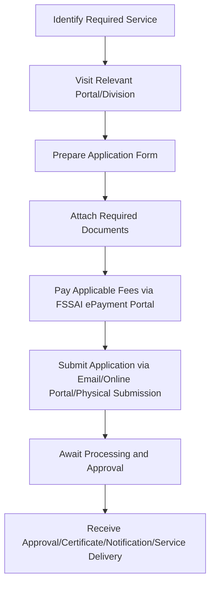

# Comprehensive Scheme Masterclass & File Guide

## Scheme Deep Dive

### Overview
The Food Safety & Standards Authority of India (FSSAI) Compliance Support scheme is a pan-India initiative administered by FSSAI under the Ministry of Food Processing. It does not provide direct financial subsidies or grants to food business operators (FBOs) but instead offers a range of regulatory, scientific, and capacity-building services for which applicable fees are charged. Financial assistance is extended selectively to state governments for specific purposes, such as upgrading laboratories for pesticide testing in Assam. The scheme operates on a rolling basis with no fixed deadline, accepting applications year-round via the portal https://fssai.gov.in.

### Objectives
- Establish science-based standards for articles of food  
- Regulate manufacture, storage, distribution, sale, and import of food  
- Ensure availability of safe and wholesome food for human consumption  
- Promote coordination of work on food standards with international bodies  
- Build capacity of food safety officials and food business operators through training  
- Provide digital platforms for licensing, compliance, and grievance redressal  
- Support fortification of staple foods to address micronutrient deficiencies  
- Enable consumers to report misleading claims and food safety concerns  

### Eligibility Matrix
Eligibility varies significantly by service. The following table summarizes key eligibility criteria for major services under the scheme:

| Service | Eligibility Criteria | Required Documents |
|--------|----------------------|-------------------|
| Standard Formulation | Submission of representation or request with scientific rationale | Scientific rationale of the proposal |
| NSF & FI Approval | Food products/ingredients covered under FSS (NSF & FI) Regulation, 2017 | Form-I of sub-regulation (1) of regulation 4 of FSS (NSF & FI) Reg. 2017 |
| Vegan Logo Approval | Submission of documents as per guidelines including source of ingredients, certificate of analysis for absence of cholesterol, lactose, animal DNA from NABL accredited laboratory | Source of ingredients, Certificate of Analysis for absence of cholesterol, lactose, animal DNA from NABL accredited laboratory |
| FSMP Approval | Submission of scientific, clinical, and epidemiological data for dietary management of specific disease/disorder/medical condition | Submission of scientific, clinical and epidemiological data |
| Import NOC/NCR | Consignments must comply with FSS Act, 2006, Rules, and FSS (Import) Regulations, 2017 | Consignment documents complying with FSS Act, 2006, Rules, and FSS (Import) Regulations, 2017 |
| Food Laboratory Recognition | Laboratory must have accreditation under FSSAI-NABL Integrated Assessment | Scanned/pdf format of requisite documents, duly filled FORM A, and fee receipt of Rs. 1000 |
| Food Analyst Examination | Bachelor’s/Master’s/Doctorate in specified fields; not less than three years’ experience in food analysis at recognized institutions; no upper age limit; experience calculated from date of graduation to closing date of application (experience before/after this period or during academic programmes not considered); must select applicable discipline (Chemical or Biological) and cannot change it till completion of examination | Scanned copies of original degree certificates or provisional degree certificates; proof of identity and address |
| FBO Training (FoSTaC) | Eligibility criteria specified in FoSTaC portal links | Aadhaar Card, Mobile Number, and documents to prove eligibility/experience |
| RTI Application | Only citizens of India are eligible | Proof of identity and address; written application; application fee (₹10) |
| CPGRAMS Grievance | Only citizens of India are eligible to file grievances | Personal details, grievance details, and supporting documents; registration on CPGRAMS portal and online form submission |

### Benefits & Financial Support
FSSAI does not provide direct financial subsidies or grants to beneficiaries. Instead, it charges applicable fees for various services. Financial support is extended to state governments for specific purposes (e.g., upgrading laboratories for pesticide testing in Assam). The following table outlines fees for key services:

| Service | Fee (INR) | Notes |
|--------|-----------|-------|
| NSF & FI Approval | Rs. 50,000 + GST | Per application |
| Vegan Logo Endorsement | Rs. 10,000 + GST | Per application |
| Food Analyst Examination (CBT) | Rs. 2,500 + GST | Computer Based Test |
| Food Analyst Examination (Practical) | Rs. 5,000 + GST | Payable after qualifying CBT |
| ED-FSR Diploma Program | Rs. 60,000 + 18% GST | Executive Diploma in Food Safety & Regulations |
| Import NOC/NCR - Visual Inspection Fee | Rs. 2,000 | Per consignment |
| Import NOC/NCR - Sample Testing Fee | As notified by FSSAI | Varies by food category |
| Food Laboratory Recognition - Application Processing Fee | Rs. 1,000 + GST | One-time fee |
| Food Analyst CBT Only | Rs. 2,500 + GST | As specified in key facts |
| RTI Application Fee | ₹10 | Standard fee; BPL applicants exempt with proof |
| CPGRAMS Grievance | No fee | Free to file |
| FSSAI License (Central/State) | As per Schedule 3 of Licensing Regulation | Varies by Kind of Business |
| FSSAI Registration | As per Schedule 3 of Licensing Regulation | Varies by Kind of Business |
| Instant License/Registration (Tatkal) | As per Schedule 3 | Immediate issuance for eligible KoB |
| Instant Renewal/License Modification | As per Schedule 3 + differential amount | Immediate processing without scrutiny |

**Non-financial benefits** include:
- Access to science-based standard formulation  
- Approval of non-specified foods and food ingredients (NSF & FI)  
- Vegan logo endorsement  
- Approval of foods for special medical purposes (FSMP)  
- Issuance of NOC/NCR for imported food consignments  
- Recognition and notification of food testing laboratories  
- Food Analyst certification  
- Training of FBOs and regulatory staff (via FoSTaC and other divisions)  
- RTI facilitation  
- CPGRAMS grievance redressal  
- Access to advisories, circulars, and digital tools (Food Safety Connect, FoSCoS)  
- Support for fortification of staple foods  
- Enabling consumers to report misleading claims  

### Application Process
The application process is standardized across services but varies in documentation, fees, and timelines. Below is a Mermaid flowchart illustrating the general steps:

**Service-specific portals and submission methods:**
- **NSF & FI Approval**: ePAAS portal (https://epaas.fssai.gov.in/), Form-I submission  
- **Vegan Logo**: vegan-foods@fssai.gov.in, document submission as per guidelines  
- **FSMP**: Science & Standards division, dossier submission  
- **Import NOC/NCR**: FICS portal (https://fics.fssai.gov.in/), document scrutiny + visual inspection + sampling + lab testing  
- **Food Laboratory Recognition**: labs@fssai.gov.in, Form-A + fee receipt  
- **Food Analyst Exam**: https://fssai.formsubmit.in/ep_ses_web_landing, online application + fee payment  
- **FBO Training (FoSTaC)**: FoSTaC portal (https://fostac.fssai.gov.in/), Aadhaar + mobile + eligibility proof  
- **RTI**: Online/offline to PIO, ₹10 fee + identity/address proof  
- **CPGRAMS**: CPGRAMS portal registration + online form submission  
- **FSSAI License/Registration**: FoSCoS (https://foscos.fssai.gov.in/), Form A/B + applicable fees  

**Indicative processing timelines:**
- NSF & FI Approval: 04–06 months  
- Vegan Logo: 04–06 months  
- FSMP: 09–12 months  
- Import NOC/NCR: 2–10 days  
- Food Laboratory Recognition: 01–09 months  
- Food Analyst Certification: 01 year (includes CBT, practical, and mandatory two-week training)  
- FSSAI License/Registration: Issued in 07–60 days depending on license type and inspection requirement  
- Instant Tatkal License/Registration: Immediate issuance for eligible KoB  
- Instant Renewal/Modification: Immediate without scrutiny (effective from specified dates)  

### Key Caveats
- **Food Analyst Exam**: No upper age limit; experience gained before/after graduation-to-application period or during academic programmes (Post Graduate, Doctoral) not considered; discipline (Chemical/Biological) selected in application form cannot be changed till examination completion  
- **Food Analyst Training**: Only candidates who qualify practical exam and fulfill eligibility criteria eligible for mandatory two-week training; all training-related expenses borne by FSSAI; certificates issued by hand at FSSAI Training Centres  
- **Training for FSSAI Officials**: No fees for trainings conducted by Staff Training Unit; residential trainings at NPC, ISTM, FOIR, etc., nominated via email at training@fssai.gov.in  
- **FoSTaC Partners**: Empanelment can be cancelled for malpractice (e.g., unauthorized use of logos, impersonation of officials); State governments can request suspension pending criminal trials  
- **General**: No direct grant/loan disbursement to FBOs evidenced; fees are non-refundable if submitted via unauthorized modes; all applications require strict adherence to document specifications  

### Sources
- Application Portal: https://fssai.gov.in  
- Key Facts: Scheme ID row-309, Ministry/Food Processing, Implementing Agency/FSSAI, Status/Rolling basis, Last Updated/2026  
- Supporting Evidence: Citizen's Charter 2025-26 (pp. 1–31), ED-FSR Flyer, Training Calendar 2026–27, various notifications and advisories  

---

## Consultant's Field Guide to Generated Files

### 1. SCHEME_MASTER_DATABASE.md
**Real-time Usage:** Keep this open in a background tab during all client calls. When a client asks "What is the turnover limit?" or "Who administers this?", CTRL+F in this document to give an immediate, authoritative answer without checking the portal.

### 2. PITCH_AND_SALES_SCRIPTS.md
**Real-time Usage:** Open this file 5 minutes before your first Discovery Call with a lead. Read the "Problem Framing" out loud to hook them, then use the Qualification Checklist to interrogate their eligibility live on the phone. Keep the Objection Handlers table visible so you can immediately counter when they say "We're too small for this."

### 3. APPLICATION_PLAYBOOK.md
**Real-time Usage:** Print this out or pin it to your desktop once the client signs the retainer. Check off each box in "Stage 1" before moving to "Stage 2". Use the "Client Communication Template" to copy-paste directly into your email when chasing them for pending documents.

### 4. CLIENT_ONBOARDING_AND_CRM.md
**Real-time Usage:** Fill this out during or immediately after the onboarding call. Use the Needs Assessment to record their exact pain points. Update the "Compliance Status" table as they email you documents to maintain a single source of truth for what's missing.

### 5. LIVE_CASE_TRACKER.md
**Real-time Usage:** Review this document every morning during your standup. Update the "Stage" column daily. If a case hits "Stage 07 - Under review", use the Escalation Path notes here to know exactly who to call at the government department today.

### 6. FEE_AND_REVENUE_MODEL.md
**Real-time Usage:** Use this file when drafting the proposal. Look at the client's turnover, map them to the pricing tier in the table, and quote that exact Retainer and Success Fee. Use the monthly projection table to update your personal sales pipeline forecast for the quarter.

### 7. CLIENT_PROPOSAL_TEMPLATE.md
**Real-time Usage:** Copy this entire file, paste it into an email or PDF generator, replace the [PLACEHOLDER] tags with the client's actual details gathered from the CRM, and send it immediately after a successful discovery call.

### 8. COMPLIANCE_AND_LEGAL_PACK.md
**Real-time Usage:** Attach sections 8A and 8B as PDFs to the proposal email. Refuse to start Step 1 of the Application Playbook until the client signs these. Use the Disclaimers to protect yourself legally if the client is rejected by the government agency.