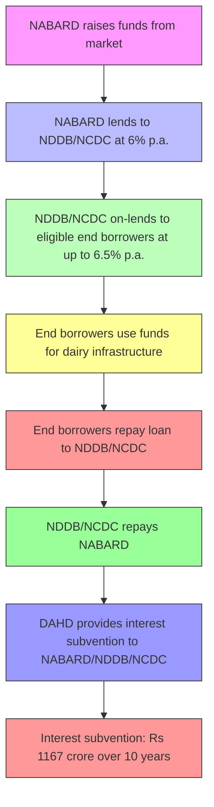

# Comprehensive Scheme Masterclass & File Guide

## Scheme Deep Dive

### Scheme Overview
The **Dairy Processing & Infrastructure Development Fund (DIDF)** is a Central Sector Scheme under the Infrastructure Development Fund (IDF) implemented by the **Department of Animal Husbandry and Dairying (DAHD)**, Government of India. The scheme was last updated in 2020-21 and has a total outlay of **Rs 11184 Crore**. It is a **loan-based** scheme with pan-India geographic scope.

**Implementing Agency**: Department of Animal Husbandry and Dairying (DAHD), Government of India  
**Contact Details**:  
- Email: anand@nddb.coop  
- Telephone: 91-2692-260148, 260149, 260159, 260160  
- Fax: 91-       91-2692-260157, 260159  

**Scheme ID**: row-314  
**Ministry / Category**: Animal Husbandry  
**Scheme Type**: loan  
**Geographic Scope**: Pan-India  
**Last Updated**: 2020-21  

### Objectives
The DIDF aims to:
- Modernize milk processing plants and machinery and create additional infrastructure for processing more milk.
- Create additional milk processing capacity for increased value addition by producing more dairy products.
- Bring efficiency in dairy processing plants/producer-owned and controlled dairy institutions, thereby enabling optimum value of milk to milk producer farmers and supply of quality milk to consumers.
- Help producer-owned and controlled institutions increase their share of milk, providing greater opportunities of ownership, management, and market access to rural milk producers in the organized milk market.
- Help producer-owned and controlled institutions consolidate their position as dominant players in the organized liquid milk market and achieve increased price realization for milk producers.

### Financial Support & Fund Flow
The total outlay for DIDF during 2020-21 is **Rs 11184 Crore**, allocated as follows:
- **Rs 8004 crore**: Loan from National Bank for Agriculture and Rural Development (NABARD) to National Dairy Development Board (NDDB) and National Cooperative Development Cooperation (NCDC) for end borrowers.
- **Rs 2001 crore**: End borrowers' contribution.
- **Rs 12 crore**: NDDB/NCDC's share during 3 years (2018-19 to 2022-23).
- **Rs 1167 crore**: Contributed by DAHD towards interest subvention on repayment for 10 years (2018-19 to 2030-31, with spillover to the first quarter of 2031-32).

**Loan Terms**:
- NABARD extends loan to NDDB and NCDC at **6% per annum**, repayable at quarterly rests.
- Interest rate to end borrower: **up to 6.5% per annum** (charged by NDDB/NCDC), subject to the condition that the difference between NABARD's market borrowing cost and the rate at which NABARD passes the loan to NDDB/NCDC is **not more than 2.5% per annum**.
- Cost of fund to NABARD: Actual cost of borrowing by NABARD (inclusive of interest, taxes, fees, charges) plus fund management cost of **0.60% per annum**.
- In case of any further increase in NABARD's cost of borrowing, the additional cost is borne by the end borrowers.

**Key Caveats**:
> The interest rate on borrowings from market by NABARD shall vary from time to time depending upon rates prevailing at the time of raising funds.  
> In case of any further increase in cost of borrowing of fund by NABARD, the additional cost of fund will be borne by the End Borrowers.  
> The cost of fund to NABARD shall be the actual cost of borrowing by NABARD inclusive of interest, taxes, fees, charges, etc., plus fund management cost of 0.60% per annum.

### Eligibility Criteria
Financial assistance under DIDF is provided to **end borrowers** that are financially viable, willing to avail funds, and fulfill eligibility criteria as per the Operation guidelines of DIDF.

**Eligible Institutions**:
- NDDB and NCDC (using loans from DIDF) lend to:
  - Co-operative milk unions
  - State cooperative dairy federations
  - Multi-state milk cooperatives
  - Milk producer companies
  - NDDB subsidiaries

**Target Beneficiaries**:
> cooperative milk unions; state cooperative dairy federations; multi-state milk cooperatives; milk producer companies; NDDB subsidiaries

**Eligibility Criteria for End Borrowers** (derived from supporting evidence):
- Financially viable and willing to avail funds.
- Positive net worth.
- No defaults to banks/financial institutions.
- Up-to-date audit without adverse observations.
- Outstanding dues to producer members not exceeding four payment periods.
- Must submit audited annual accounts for the last three financial years.
- Must be regular in repayment of loans and interest servicing to financing institutions.
- Must first repay loan installments to avail benefits under the scheme.
- Must pay procurement price to farmers regularly and submit proof of that.
- Must agree to provide monthly reports with day-wise details on opening, addition, reduction, and closing balance of conserved commodities and milk processing/operations reports as required by NDDB.

### Benefits & Financial Support
The scheme provides financial assistance for:
- Modernization and creation of new milk processing facilities.
- Manufacturing facilities for value-added products.
- Milk chilling infrastructure.
- Setting up electronic milk testing equipment.
- Project management and learning.
- Any other activities related to the dairy sector targeted to contribute to DIDF objectives.

**Outcomes**:
- Enables optimum value realization for milk producers.
- Improves supply of quality milk to consumers.
- Strengthens the market position of producer-owned institutions.

### Application Process
The application process is not explicitly detailed in the evidence. However, based on the scheme structure:
1. End borrowers submit proposals through NDDB or NCDC after meeting eligibility criteria.
2. The loan is sanctioned by NABARD to NDDB/NCDC.
3. NDDB/NCDC on-lends to eligible end borrowers.
4. Applications must include:
   - Sanction letter from the bank/financial institution.
   - Copy of loan agreement.
   - Disbursement letter.
   - Audited annual accounts for the last three financial years.
   - Proof of regular payment to farmers.
   - Monthly reports on conserved commodities and operations.

> **Application Portal**: https://nddb.coop/services/dairy-development/didf (Note: Page not found; contact NDDB directly via email/phone for application forms and guidelines.)

### Fund Flow & Process (Mermaid.js Flowchart)

### Timelines
- **Interest Subvention Period**: 2018-19 to 2030-31, with spillover to Q1 2031-32.
- **NDDB/NCDC Share Period**: 2018-19 to 2022-23 (3 years).
- **Loan Tenure**: Not explicitly stated, but repayment period aligns with interest subvention (up to 10+ years).

### Key Sources
- Administrative Approval for DIDF Scheme 2020-21: https://nddb.coop/downloads/administrative-approval-of-didf-scheme-2020-21.pdf
- Addendum dt 26-03-2024 (AHIDF-DIDF merger): https://nddb.coop/downloads/addendum-dt-26-03-2024.pdf
- Contact: anand@nddb.coop | Tel: 91-2692-260148/260149/260159/260160

---

## Consultant's Field Guide to Generated Files

### 1. SCHEME_MASTER_DATABASE.md
**Real-time Usage**: Keep this open in a background tab during all client calls. When a client asks "What is the turnover limit?" or "Who administers this?", CTRL+F in this document to give an immediate, authoritative answer without checking the portal.

### 2. PITCH_AND_SALES_SCRIPTS.md
**Real-time Usage**: Open this file 5 minutes before your first Discovery Call with a lead. Read the "Problem Framing" out loud to hook them, then use the Qualification Checklist to interrogate their eligibility live on the phone. Keep the Objection Handlers table visible so you can immediately counter when they say "We're too small for this."

### 3. APPLICATION_PLAYBOOK.md
**Real-time Usage**: Print this out or pin it to your desktop once the client signs the retainer. Check off each box in "Stage 1" before moving to "Stage 2". Use the "Client Communication Template" to copy-paste directly into your email when chasing them for pending documents.

### 4. CLIENT_ONBOARDING_AND_CRM.md
**Real-time Usage**: Fill this out during or immediately after the onboarding call. Use the Needs Assessment to record their exact pain points. Update the "Compliance Status" table as they email you documents to maintain a single source of truth for what's missing.

### 5. LIVE_CASE_TRACKER.md
**Real-time Usage**: Review this document every morning during your standup. Update the "Stage" column daily. If a case hits "Stage 07 - Under review", use the Escalation Path notes here to know exactly who to call at the government department today.

### 6. FEE_AND_REVENUE_MODEL.md
**Real-time Usage**: Use this file when drafting the proposal. Look at the client's turnover, map them to the pricing tier in the table, and quote that exact Retainer and Success Fee. Use the monthly projection table to update your personal sales pipeline forecast for the quarter.

### 7. CLIENT_PROPOSAL_TEMPLATE.md
**Real-time Usage**: Copy this entire file, paste it into an email or PDF generator, replace the [PLACEHOLDER] tags with the client's actual details gathered from the CRM, and send it immediately after a successful discovery call.

### 8. COMPLIANCE_AND_LEGAL_PACK.md
**Real-time Usage**: Attach sections 8A and 8B as PDFs to the proposal email. Refuse to start Step 1 of the Application Playbook until the client signs these. Use the Disclaimers to protect yourself legally if the client is rejected by the government agency.