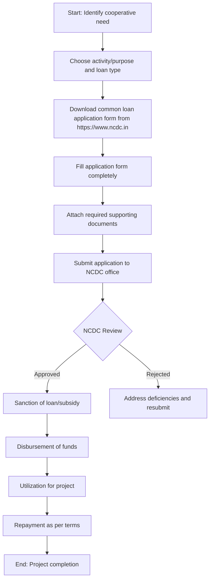

# Comprehensive Scheme Masterclass & File Guide

## Scheme Deep Dive

### Overview
The National Cooperative Development Corporation (NCDC) Grants scheme is a pan-India grant-based financial assistance program implemented by the National Cooperative Development Corporation (NCDC) under the Ministry of Cooperation, Government of India. The scheme operates on a rolling basis with no fixed deadlines and was last updated for the financial year 2024-25. The total fund size allocated under this scheme is ₹2000 crore. The primary application portal is https://www.ncdc.in.

### Objectives
### Objectives
The scheme aims to:
- Promote, strengthen and develop farmer cooperatives for increasing production and productivity
- Institute post-harvest facilities for agricultural produce
- Promote agricultural marketing and inputs, processing, storage and marketing of agriculture produce
- Supply seeds, fertilizers and other agricultural inputs
- Equip cooperatives with facilities to promote income-generating activities, with special focus on weaker sections
- Support cooperative societies in non-farm sectors such as dairy, livestock, handlooms, sericulture, poultry, fishery, scheduled caste & scheduled tribes, women cooperatives
- Function under the overarching principles of Sahakar-22 for a New India and Doubling Farmers' Income
- Provide financial assistance through term loans, investment loans, working capital loans and credit-linked subsidies

### Eligibility Matrix
| Eligibility Criteria | Details |
|----------------------|---------|
| Entity Type | Cooperatives registered or deemed to be registered under the Cooperative Societies Act, 1912 or under the Multi-State Cooperative Societies Act, 1984 or under any other law with respect to cooperative societies for the time being in force in any State |
| Operational History | For direct funding, the cooperative should have been in operation for not less than 3 years |
| Financial Health | Should have positive net worth, not less than 100% paid up share capital (i.e. no erosion in the paid-up share capital) |
| Activity Scope | Engaged in any of the activities mandated to NCDC |
| Target Beneficiaries | Cooperatives; women cooperatives; SC/ST cooperatives; fishery cooperatives; dairy cooperatives; tribal cooperatives; handloom cooperatives; primary agricultural credit societies (PACS); farmer producer organizations (FPO); farmer producer fishery organizations (FFPO) |

### Benefits & Financial Support
NCDC provides financial assistance through:
- Term Loan
- Investment Loan
- Working Capital Loan
- Credit linked Subsidy along with Term Loan and Investment Loan

Assistance is provided under:
- Central Sector Integrated Scheme on Agricultural Cooperation (CSISAC)
- Other Central Sector Schemes (CSS)
- NCDC Sponsored Scheme

Key financial support details:
- Liberal assistance to strengthen and develop cooperatives to the extent of 90-95% of the project cost
- Subsidy component of 15-25% under certain schemes
- Support for infrastructure and business development along with appropriate capacity building interventions
- Special emphasis on the economic development of rural population

### Subsidy Availability
Subsidy is provided subject to availability from the Government of India (GOI); otherwise equivalent amount is provided as loan in lieu of subsidy on the request of the borrower. The subsidy under CSISAC is for agriculture and allied activities.

### Funding Pattern Based on State Categorization
For the purpose of funding under CSISAC, State/Union Territories are divided into three categories:
- Cooperatively Least Developed States
- Cooperatively Under Developed States/UTs
- Cooperatively Developed States/UTs

### Required Documents
1. Certificate of Incorporation / Registration
2. PAN of the entity
3. Project report / Detailed Project Report (DPR)
4. Audited financial statements
5. Bank account details
6. Board resolution for loan application
7. List of promoters/directors
8. Proof of address
9. Net worth certificate
10. Shareholding pattern
11. No objection certificate from concerned authority (if applicable)
12. Land documents / property papers (if applicable)
13. Quotations for machinery/equipment (if applicable)
14. Technical feasibility report (if applicable)
15. Environmental clearance (if applicable)

### Application Process
1. Choose activity/purpose and loan type on the common loan application form
2. Download the form from the NCDC website
3. Fill the form completely
4. Attach required supporting documents
5. Submit the application to the NCDC office

### Key Caveats
- Subsidy is provided subject to availability from the Government of India (GOI); otherwise equivalent amount is provided as loan in lieu of subsidy on the request of the borrower
- For direct funding, the cooperative should have been in operation for not less than 3 years and should have positive net worth, not less than 100% paid up share capital
- No processing fees for sanction of NCDC cash credit product, however legal fees for security documentation, if any, shall be required to be paid by the borrower
- The drawing power shall be assessed on quarterly basis by the concerned Programme Division of the Corporation and the borrower must provide all the requisites
- Any amount within the sanctioned limit may be availed the same working day by intimating prior to 02:00 pm
- The Borrower shall have to intimate 90 days prior to validity of sanction regarding renewal of sanction or closure of loan

### Contact Details
- Email: mail@ncdc.in
- Phone: 011-26962478, 26960796, 26962379, 26569246

### Application Process Flowchart

### Important Notes
> **Warning**: Subsidy availability is contingent on Government of India allocation. If GOI subsidy is not available, the equivalent amount will be provided as a loan. Cooperatives must confirm subsidy availability during application.
> 
> **Critical**: Direct funding requires minimum 3 years of operation and positive net worth with no erosion in paid-up share capital.
> 
> **Tip**: Drawing power is assessed quarterly; ensure timely submission of required documents for assessment.
> 
> **Note**: Amounts within sanctioned limit can be availed same working day if intimated before 02:00 pm.
> 
> **Reminder**: Intimate NCDC 90 days prior to sanction validity for renewal or closure.

### Sources
- Scheme Key Facts: National Cooperative Development Corporation (NCDC) Grants
- Application Portal: https://www.ncdc.in
- Supporting Evidence: NCDC website crawl, Programme of Activities 2024-25 PDF, Citizen Charter PDF, Revised CSR Guidelines PDF

## Consultant's Field Guide to Generated Files

### 1. SCHEME_MASTER_DATABASE.md
**Real-time Usage:** Keep this open in a background tab during all client calls. When a client asks "What is the turnover limit?" or "Who administers this?", CTRL+F in this document to give an immediate, authoritative answer without checking the portal.

### 2. PITCH_AND_SALES_SCRIPTS.md
**Real-time Usage:** Open this file 5 minutes before your first Discovery Call with a lead. Read the "Problem Framing" out loud to hook them, then use the Qualification Checklist to interrogate their eligibility live on the phone. Keep the Objection Handlers table visible so you can immediately counter when they say "We're too small for this."

### 3. APPLICATION_PLAYBOOK.md
**Real-time Usage:** Print this out or pin it to your desktop once the client signs the retainer. Check off each box in "Stage 1" before moving to "Stage 2". Use the "Client Communication Template" to copy-paste directly into your email when chasing them for pending documents.

### 4. CLIENT_ONBOARDING_AND_CRM.md
**Real-time Usage:** Fill this out during or immediately after the onboarding call. Use the Needs Assessment to record their exact pain points. Update the "Compliance Status" table as they email you documents to maintain a single source of truth for what's missing.

### 5. LIVE_CASE_TRACKER.md
**Real-time Usage:** Review this document every morning during your standup. Update the "Stage" column daily. If a case hits "Stage 07 - Under review", use the Escalation Path notes here to know exactly who to call at the government department today.

### 6. FEE_AND_REVENUE_MODEL.md
**Real-time Usage:** Use this file when drafting the proposal. Look at the client's turnover, map them to the pricing tier in the table, and quote that exact Retainer and Success Fee. Use the monthly projection table to update your personal sales pipeline forecast for the quarter.

### 7. CLIENT_PROPOSAL_TEMPLATE.md
**Real-time Usage:** Copy this entire file, paste it into an email or PDF generator, replace the [PLACEHOLDER] tags with the client's actual details gathered from the CRM, and send it immediately after a successful discovery call.

### 8. COMPLIANCE_AND_LEGAL_PACK.md
**Real-time Usage:** Attach sections 8A and 8B as PDFs to the proposal email. Refuse to start Step 1 of the Application Playbook until the client signs these. Use the Disclaimers to protect yourself legally if the client is rejected by the government agency.