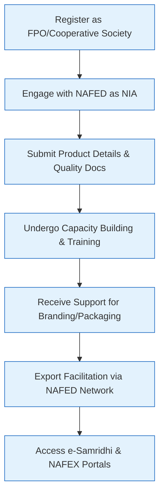

# Comprehensive Scheme Masterclass & File Guide

## Scheme Deep Dive

### Scheme Overview
The **National Cooperative Exports Limited (NCEL) Scheme** (Scheme ID: row-319) is a pan-India initiative implemented by the **National Agricultural Cooperative Marketing Federation of India Ltd. (NAFED)** under the Ministry of Cooperation. The scheme operates on a rolling basis with no fixed deadline, last updated for the 2024-25 financial year. It focuses on promoting cooperative exports through Farmer Producer Organizations (FPOs) and agricultural cooperatives by leveraging convergence with existing government schemes rather than providing direct financial grants.

### Objectives
The NCEL Scheme aims to:
- Promote cooperative exports through Farmer Producer Organizations (FPOs)
- Strengthen market linkages for agricultural cooperatives in international trade
- Support value addition and quality certification for export-oriented produce
- Facilitate access to global markets for small and marginal farmers
- Enhance farmers' income through export opportunities
- Promote sustainable and ethical agricultural practices for global compliance
- Build capacity of cooperatives in export documentation and logistics
- Create brand identity for Indian cooperative products in global markets

### Eligibility Matrix
| Eligibility Criteria | Details | Source |
|----------------------|---------|--------|
| **Beneficiary Type** | Farmer Producer Organizations (FPOs), cooperative societies, and agricultural producer collectives registered under relevant Acts | Key Facts |
| **Primary Activity** | Engaged in production and processing of agricultural commodities for export | Key Facts |
| **Documentation** | Valid documentation and compliance with quality and food safety standards | Key Facts |
| **Registration** | Must be registered as an FPO or cooperative society under the relevant Act | Application Process |
| **NAFED Engagement** | Must engage with NAFED as the National Implementing Agency for export promotion | Application Process |
| **Quality Compliance** | Must submit product details and quality compliance documents | Application Process |
| **Capacity Building** | Must undergo capacity building and training on export procedures | Application Process |
| **Export Licence** | Required if applicable (for regulated commodities) | Required Documents |
| **GST Registration** | Mandatory for all applicants | Required Documents |
| **Bank Account** | Active bank account in the entity's name | Required Documents |
| **Board Resolution** | Authorizing export activity must be submitted | Required Documents |
| **Production Capacity** | Details of production capacity and raw material sourcing required | Required Documents |

> **Warning**: Export benefits are subject to compliance with international quality and phytosanitary standards. Support is contingent on active participation in NAFED-led FPO and cooperative development programs. Financial assistance is routed through converging schemes and not direct grants under NCEL. Benefits may vary based on commodity type and export destination.

### Benefits & Financial Support
The NCEL Scheme does not provide direct financial grants. Instead, it facilitates access to benefits through convergence with existing schemes:

| Benefit Category | Specific Benefits | Supporting Schemes | Source |
|------------------|-------------------|---------------------|--------|
| **Market Access** | Access to international markets, export documentation facilitation, logistics support, market intelligence | e-Samridhi, NAFEX portals | Key Facts |
| **Technical Support** | Technical support for quality compliance, branding and packaging assistance | Formation and Promotion of 10,000 FPOs, MIDH, PSF | Key Facts |
| **Financial Support** | Matching equity, grants for infrastructure, subsidy for certification and branding (quantum not specified) | Formation and Promotion of 10,000 FPOs, MIDH, PSF | Key Facts |
| **Capacity Building** | Training on export procedures, cooperative development programs | NAFED-led FPO promotion initiatives | Key Facts, Application Process |
| **Brand Development** | Brand identity creation for Indian cooperative products in global markets | Convergence with branding subsidies | Key Facts |
| **Institutional Support** | Facilitation through NAFED’s international trade network | NAFED’s global buyer network | Key Facts |

> **Note**: Specific quantum of financial support under NCEL is not detailed in the evidence. Benefits are delivered via convergence with schemes like Formation and Promotion of 10,000 FPOs, Mission for Integrated Development of Horticulture (MIDH), and Price Stabilization Fund (PSF).

### Application Process
The application process involves sequential steps managed through NAFED as the implementing agency:

**Key Process Details**:
1. **Registration**: Entity must be registered under relevant State/Central Cooperative Societies Act or Companies Act (Part IXA)
2. **NAFED Engagement**: Direct interaction with NAFED as National Implementing Agency (contact: mdcell@nafed-india.com, EPABX: 011-26340019)
3. **Documentation Submission**: Includes registration certificate, PAN, bank details, product specs, quality certification, export licence (if applicable), GST registration, board resolution, production capacity details
4. **Capacity Building**: Mandatory training on export procedures, documentation, logistics, and quality standards
5. **Market Linkage**: Access to NAFED’s international trade network and portals (e-Samridhi: https://nafex.in/#/, NAFEX)
6. **Ongoing Support**: Continuous assistance for branding, packaging, quality compliance, and market intelligence

**Required Documents Checklist**:
1. Registration certificate of FPO/cooperative society
2. PAN of the entity
3. Bank account details
4. Product details and quality certification
5. Export licence (if applicable)
6. GST registration
7. Board resolution authorizing export activity
8. Details of production capacity and raw material sourcing

**Portal**: https://nafex.in/#/ (NAFED’s export promotion portal)

### Timeline & Critical Dates
As the scheme operates on a rolling basis:
- **Application Window**: Open throughout the year (no fixed deadlines)
- **Last Scheme Update**: 2024-25 financial year
- **NAFED Establishment**: 2nd October 1958 (Gandhi Jayanti)
- **Current Leadership**: 
  - Chairman: Sh. Jethabhai Ahir
  - Managing Director: Sh. Deepak Agarwal, IAS (Email: mdcell@nafed-india.com)

> **Important**: While applications are accepted year-round, benefits disbursement and scheme convergence depend on budget cycles of linked schemes (e.g., MIDH, PSF, FPO promotion). Consultants should verify current funding availability with NAFED during client onboarding.

## Consultant's Field Guide to Generated Files

### 1. SCHEME_MASTER_DATABASE.md
**Real-time Usage**: Keep this open in a background tab during all client calls. When a client asks "What is the turnover limit?" or "Who administers this?", CTRL+F in this document to give an immediate, authoritative answer without checking the portal.

### 2. PITCH_AND_SALES_SCRIPTS.md
**Real-time Usage**: Open this file 5 minutes before your first Discovery Call with a lead. Read the "Problem Framing" out loud to hook them, then use the Qualification Checklist to interrogate their eligibility live on the phone. Keep the Objection Handlers table visible so you can immediately counter when they say "We're too small for this."

### 3. APPLICATION_PLAYBOOK.md
**Real-time Usage**: Print this out or pin it to your desktop once the client signs the retainer. Check off each box in "Stage 1" before moving to "Stage 2". Use the "Client Communication Template" to copy-paste directly into your email when chasing them for pending documents.

### 4. CLIENT_ONBOARDING_AND_CRM.md
**Real-time Usage**: Fill this out during or immediately after the onboarding call. Use the Needs Assessment to record their exact pain points. Update the "Compliance Status" table as they email you documents to maintain a single source of truth for what's missing.

### 5. LIVE_CASE_TRACKER.md
**Real-time Usage**: Review this document every morning during your standup. Update the "Stage" column daily. If a case hits "Stage 07 - Under review", use the Escalation Path notes here to know exactly who to call at the government department today.

### 6. FEE_AND_REVENUE_MODEL.md
**Real-time Usage**: Use this file when drafting the proposal. Look at the client's turnover, map them to the pricing tier in the table, and quote that exact Retainer and Success Fee. Use the monthly projection table to update your personal sales pipeline forecast for the quarter.

### 7. CLIENT_PROPOSAL_TEMPLATE.md
**Real-time Usage**: Copy this entire file, paste it into an email or PDF generator, replace the [PLACEHOLDER] tags with the client's actual details gathered from the CRM, and send it immediately after a successful discovery call.

### 8. COMPLIANCE_AND_LEGAL_PACK.md
**Real-time Usage**: Attach sections 8A and 8B as PDFs to the proposal email. Refuse to start Step 1 of the Application Playbook until the client signs these. Use the Disclaimers to protect yourself legally if the client is rejected by the government agency.