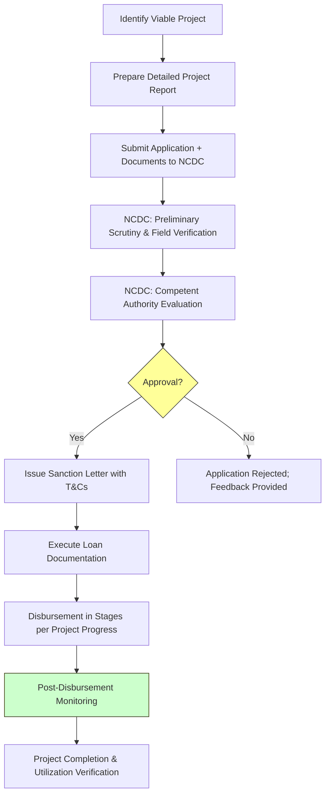

</think># Comprehensive Scheme Masterclass & File Guide

## Scheme Deep Dive

### Overview
The **Multi State Cooperative Societies Development Fund** is a **loan-based scheme** implemented by the **National Cooperative Development Corporation (NCDC)** under the **Ministry of Cooperation**. It operates on a **pan-India geographic scope** with a **rolling basis application status**—applications are accepted throughout the year subject to fund availability. The scheme ID is **row-320**, and it falls under the **Cooperative Sector** category.

### Objectives
The scheme aims to:
- Provide financial assistance for the development of multi-state cooperative societies  
- Support infrastructure development and modernization of cooperative enterprises  
- Promote technology upgradation and adoption of best practices in cooperatives  
- Enhance human resource development and training within cooperative societies  
- Strengthen the financial base and economic viability of multi-state cooperatives  
- Encourage diversification and expansion of cooperative business activities  
- Support risk management and institutional building initiatives  
- Promote inclusive growth and equitable development through cooperative models  

### Eligibility Matrix
| Eligibility Criteria | Details | Source |
|----------------------|---------|--------|
| **Entity Type** | Multi-state cooperative societies registered under the Multi-State Cooperative Societies Act, 2002 | Key Facts |
| **Project Viability** | Must demonstrate viable project proposals with clear developmental objectives and repayment capacity | Key Facts |
| **Priority Sectors** | Preference given to societies working in agriculture, dairy, fisheries, handicrafts, and rural industries | Key Facts |
| **Promoter Contribution** | Minimum promoter's equity required as per NCDC norms (exact % not specified) | Key Facts (Caveats) |
| **Financial Standing** | Societies with outstanding dues to NCDC or other government agencies may be ineligible | Key Facts (Caveats) |
| **Geographic Scope** | Open to eligible societies across all states and union territories of India | Key Facts |

> **Warning**: Eligibility is contingent on fund availability. Applications are accepted year-round but approval depends on remaining budget allocation. Priority is given to thrust sectors and underserved regions.

### Benefits & Financial Support
| Support Type | Details | Terms & Conditions |
|--------------|---------|-------------------|
| **Financial Assistance Form** | Term loans and working capital assistance | Repayable basis (not a grant) |
| **Interest Rate** | Concessional interest rates | Assessed case-to-case by NCDC; exact rate not fixed |
| **Repayment Schedule** | Flexible repayment schedules | Tailored to cash flow patterns of cooperative enterprises |
| **Moratorium Period** | Case-to-case basis | Determined by NCDC during sanction |
| **Loan Quantum** | Based on viability and scale of proposed project | Subject to fund availability and NCDC lending norms |
| **Infrastructure Support** | Construction of godowns, processing units, retail outlets | Must be part of approved project |
| **Technology Upgradation** | Automation, adoption of modern management practices | Requires detailed project report with feasibility |
| **HRD & Training** | Funding for human resource development, training programs, capacity building | Must align with project objectives |
| **Working Capital** | Support for operational needs | Disbursed in stages per project progress |
| **Technical Guidance** | Project formulation assistance from NCDC | Provided during appraisal and monitoring phases |

> **Key Takeaway**: The fund does not specify fixed loan amounts, interest rates, or tenors. All financial terms are determined by NCDC based on project appraisal, ensuring customization but requiring detailed preparation from applicants.

### Application Process Flowchart

### Required Documents
Applicants must submit the following documents with their application:
1. Certificate of Registration under Multi-State Cooperative Societies Act, 2002  
2. Memorandum of Association and Bye-laws of the society  
3. Audited financial statements for the last 3 years  
4. Detailed project report with technical and financial feasibility  
5. Land documents or lease agreement for project site (if applicable)  
6. Cost estimates and quotations for major equipment and civil works  
7. Resolution of the Board of Directors approving the project and loan application  
8. No Objection Certificate from concerned regulatory authorities (if required)  
9. Promoter contribution details and means of finance  
10. Project implementation schedule and timeline  

> **Note**: Incomplete documentation will result in application rejection or return for resubmission. NCDC conducts field verification, so all documents must be accurate and verifiable.

### Key Caveats
- Financial assistance is subject to fund availability under the scheme  
- Priority may be given to projects in identified thrust sectors (agriculture, dairy, fisheries, handicrafts, rural industries) and underserved regions  
- Beneficiary societies must contribute a minimum promoter's equity as per NCDC norms  
- Utilization of funds must be strictly for the approved project purpose  
- Regular monitoring and reporting are mandatory during and after project implementation  
- The fund does not provide grants; assistance is extended on a repayable basis  
- Societies with outstanding dues to NCDC or other government agencies may be ineligible  

### Application Portal & Sources
- **Implementing Agency Portal**: [National Cooperative Development Corporation (NCDC)](https://www.ncdc.in)  
- **Scheme Reference**: Multi State Cooperative Societies Development Fund (Scheme ID: row-320)  
- **Governing Act**: Multi-State Cooperative Societies Act, 2002  
- **Ministry**: Ministry of Cooperation, Government of India  

---

## Consultant's Field Guide to Generated Files

### 1. SCHEME_MASTER_DATABASE.md
**Real-time Usage**: Keep this open in a background tab during all client calls. When a client asks "What is the turnover limit?" or "Who administers this?", CTRL+F in this document to give an immediate, authoritative answer without checking the portal.  
*Example*: If asked about eligibility, search "Multi-State Cooperative Societies Act, 2002" to confirm the registration requirement instantly.

### 2. PITCH_AND_SALES_SCRIPTS.md
**Real-time Usage**: Open this file 5 minutes before your first Discovery Call with a lead. Read the "Problem Framing" out loud to hook them, then use the Qualification Checklist to interrogate their eligibility live on the phone. Keep the Objection Handlers table visible so you can immediately counter when they say "We're too small for this."  
*Example*: Use the script: "Many multi-state co-ops struggle to modernize due to high interest rates—this fund offers concessional loans specifically for societies like yours." Then verify eligibility using the checklist: "Are you registered under the MSCS Act, 2002?"

### 3. APPLICATION_PLAYBOOK.md
**Real-time Usage**: Print this out or pin it to your desktop once the client signs the retainer. Check off each box in "Stage 1" before moving to "Stage 2". Use the "Client Communication Template" to copy-paste directly into your email when chasing them for pending documents.  
*Example*: After signing, verify Stage 1 completion: "Have you provided the Certificate of Registration and audited financials for 3 years?" If not, send the template email requesting those documents.

### 4. CLIENT_ONBOARDING_AND_CRM.md
**Real-time Usage**: Fill this out during or immediately after the onboarding call. Use the Needs Assessment to record their exact pain points. Update the "Compliance Status" table as they email you documents to maintain a single source of truth for what's missing.  
*Example*: During onboarding, note: "Client needs working capital for dairy processing expansion." As they send documents, update the table: "Audited FY2021-23: Received ☑️; Project Report: Pending ☐".

### 5. LIVE_CASE_TRACKER.md
**Real-time Usage**: Review this document every morning during your standup. Update the "Stage" column daily. If a case hits "Stage 07 - Under review", use the Escalation Path notes here to know exactly who to call at the government department today.  
*Example*: See a case at "Stage 07", check escalation path: "Contact Deputy General Manager (Projects) at NCDC HQ via email: projects@ncdc.in with case ID."

### 6. FEE_AND_REVENUE_MODEL.md
**Real-time Usage**: Use this file when drafting the proposal. Look at the client's turnover, map them to the pricing tier in the table, and quote that exact Retainer and Success Fee. Use the monthly projection table to update your personal sales pipeline forecast for the quarter.  
*Example*: Client turnover: ₹50 Cr → Tier 2 → Retainer: ₹1.5 Lakhs, Success Fee: 8%. Add to pipeline: "Expected closure Q3, revenue: ₹1.5L + success fee."

### 7. CLIENT_PROPOSAL_TEMPLATE.md
**Real-time Usage**: Copy this entire file, paste it into an email or PDF generator, replace the [PLACEHOLDER] tags with the client's actual details gathered from the CRM, and send it immediately after a successful discovery call.  
*Example*: After a positive discovery call, replace `[CLIENT_NAME]`, `[PROJECT_DESCRIPTION]`, `[TURNOVER]`, etc., with real data from CRM and send the proposal within 2 hours.

### 8. COMPLIANCE_AND_LEGAL_PACK.md
**Real-time Usage**: Attach sections 8A and 8B as PDFs to the proposal email. Refuse to start Step 1 of the Application Playbook until the client signs these. Use the Disclaimers to protect yourself legally if the client is rejected by the government agency.  
*Example*: Attach NCDC disclaimer and data privacy consent PDFs. Do not proceed with document collection until signed copies are received. If rejected, cite Section 8B: "We advised eligibility based on client disclosures; final approval rests with NCDC."