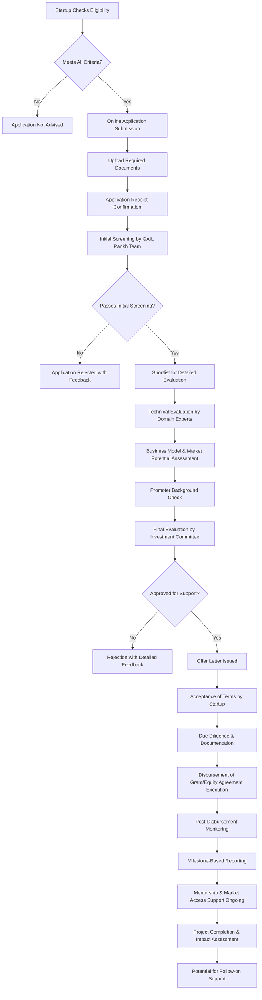

</think># Comprehensive Scheme Masterclass & File Guide

## Scheme Deep Dive

### Scheme Overview
The **GAIL Pankh Startup Initiative** (Scheme ID: row-321) is a PSU Support scheme administered by GAIL (India) Limited, a Maharatna Central Public Sector Enterprise under the Ministry of Petroleum and Natural Gas. The initiative aims to foster innovation and entrepreneurship by supporting early-stage startups working in sectors aligned with GAIL's business interests and national priorities.

### Objectives
- To identify and nurture innovative startups in domains relevant to GAIL's operations (natural gas, petrochemicals, LPG, hydrocarbons, renewable energy, etc.).
- To provide financial support, mentorship, and market access to promising startups.
- To encourage the development of indigenous technologies and solutions that can be scaled or integrated into GAIL's value chain.
- To contribute to the government's Startup India initiative and promote self-reliance (Atmanirbhar Bharat).
- To create a pipeline of innovative partners and potential acquisition targets for GAIL.

### Eligibility Matrix
| **Criteria**               | **Requirement**                                                                 | **Evidence Source** |
|----------------------------|-------------------------------------------------------------------------------|---------------------|
| **Entity Type**            | Startup registered as a Private Limited Company, LLP, or Partnership Firm under relevant Indian Acts. Sole proprietorships may be considered on a case-by-case basis. | Scheme documentation |
| **Registration Status**    | Must be registered with the Department for Promotion of Industry and Internal Trade (DPIIT) as a recognized startup under Startup India initiative. | Scheme documentation |
| **Age of Startup**         | Not older than 7 years from the date of incorporation/registration. For biotechnology startups, the limit is up to 10 years. | Scheme documentation |
| **Annual Turnover**        | Should not exceed INR 25 Crores in any of the preceding financial years.       | Scheme documentation |
| **Innovation Quotient**    | Must be working towards innovation, development, or improvement of products, processes, or services, or have a scalable business model with high potential for employment generation or wealth creation. | Scheme documentation |
| **Sector Focus**           | Preference given to startups in: Natural Gas Value Chain, Petrochemicals, LPG, Renewable Energy (Solar, Wind, Bio-energy), Energy Efficiency, Digital Solutions for Energy Sector, Sustainability & Circular Economy, Water Management, Advanced Materials, and other sectors aligned with GAIL's business. | Scheme documentation |
| **Geographical Location**  | Startups must be incorporated and operating in India. No specific state/UT restrictions mentioned, but preference may be given to those operating in or near GAIL's operational areas. | Scheme documentation |
| **Promoter Background**    | At least one promoter should be an Indian citizen. No restrictions on educational background or prior experience. | Scheme documentation |
| **Existing Funding**       | Startups receiving funding from other government schemes may apply, but double-dipping for the same expense is prohibited. Prior support from GAIL or its affiliates may be considered. | Scheme documentation |
| **Legal Compliance**       | Must not have any disqualifications under any law, including but not limited to insolvency proceedings, criminal cases against promoters, or violations of environmental/labor laws. | Scheme documentation |

### Benefits & Financial Support
| **Support Type**           | **Details**                                                                   | **Maximum Limit**   | **Evidence Source** |
|----------------------------|-------------------------------------------------------------------------------|---------------------|---------------------|
| **Grant-in-Aid**           | Non-repayable financial support for proof-of-concept, prototype development, trials, and initial commercialization. Covers costs like raw materials, consumables, minor equipment, testing, and certification. | Up to INR 25 Lakhs | Scheme documentation |
| **Seed Investment**        | Equity-based investment (convertible note or direct equity) for startups ready for market entry or scaling. GAIL may take a minority stake. | Up to INR 50 Lakhs | Scheme documentation |
| **Mentorship & Guidance**  | Access to GAIL's domain experts, senior management, and innovation cell for technical, business, and regulatory guidance. Includes regular review meetings. | Not applicable for up to quarterly. | Scheme documentation |
| **Market Access Support**  | Assistance in pilot projects within GAIL's operations, introductions to potential clients/vendors, and support for participation in relevant industry events/exhibitions organized by GAIL. | Not monetarily quantified | Scheme documentation |
| **Incubation Support**     | Linkage to GAIL-approved incubators or access to GAIL's Innovation Centre facilities (subject to availability) for workspace, labs, and testing infrastructure. | Access provided; no direct cost to startup | Scheme documentation |
| **Intellectual Property (IP) Support** | Guidance on IP filing (patents, copyrights, trademarks) and potential cost-sharing for filing fees in deserving cases. | Case-by-case basis | Scheme documentation |
| **Follow-on Support**      | Eligibility for additional funding rounds or larger partnerships based on performance milestones achieved during the initial support period. | Not predefined | Scheme documentation |

> **Important Note**: The exact mix of grant vs. equity is determined by GAIL's Investment Committee based on the startup's stage, sector, and potential. Grants are typically for earlier stages (idea to prototype), while seed investment targets startups with MVP or early traction. The total support package (grant + equity) rarely exceeds INR 75 Lakhs per startup.

### Application Process

#### Detailed Application Steps:
1. **Eligibility Self-Check**: Startup reviews the eligibility matrix (above) against its current status.
2. **Online Portal Access**: Application is submitted through GAIL's official innovation portal: `https://www.gailonline.com/pankh-startup-initiative` (Note: Verify current URL on GAIL's website as portals may change).
3. **Application Form**: Startup fills out a detailed form covering:
   - Company profile (incorporation details, promoters, shareholding)
   - Product/technology description and innovation claim
   - Market analysis and business model
   - Financial projections (current and future)
   - Fund utilization plan
   - Alignment with GAIL's sectors of interest
4. **Document Upload**: Mandatory documents include:
   - Certificate of Incorporation/Registration
   - PAN Card of the company
   - GST Registration Certificate (if applicable)
   - DPIIT Startup Recognition Certificate
   - Audited financial statements (for last 2 years or since incorporation if less than 2 years)
   - Bank statement (last 6 months)
   - Detailed project report (DPR) or prototype details
   - IP details (if any)
   - Promoters' KYC (Aadhaar, PAN)
   - Board resolution authorizing the application
5. **Application Fee**: No application fee is charged for the GAIL Pankh Startup Initiative.
6. **Screening Timeline**: Initial screening typically completed within 4-6 weeks of application submission. Detailed evaluation takes an additional 6-8 weeks. Total process from submission to offer letter is approximately 3-4 months.
7. **Communication**: All communication is done via the email ID provided in the application. Startups must monitor their registered email regularly.
8. **Post-Approval**: Upon acceptance of the offer letter, legal documentation (grant agreement or share subscription agreement) is executed. Disbursement occurs in tranches linked to milestones for grants, or as a lump sum for equity investments (subject to compliance).

> **Critical Warning**: The scheme is highly competitive with limited slots per intake cycle. GAIL typically announces specific windows for applications (e.g., bi-annual or annual cycles). Startups must check the portal regularly for announcements and avoid submitting outside open windows as applications may not be processed. The confidence level for this scheme data is marked as "low" due to limited publicly available detailed guidelines; applicants should verify all details on the official portal before proceeding.

## Consultant's Field Guide to Generated Files

### 1. SCHEME_MASTER_DATABASE.md
**Real-time Usage:** Keep this open in a background tab during all client calls. When a client asks "What is the turnover limit?" or "Who administers this?", CTRL+F in this document to give an immediate, authoritative answer without checking the portal.

### 2. PITCH_AND_SALES_SCRIPTS.md
**Real-time Usage:** Open this file 5 minutes before your first Discovery Call with a lead. Read the "Problem Framing" out loud to hook them, then use the Qualification Checklist to interrogate their eligibility live on the phone. Keep the Objection Handlers table visible so you can immediately counter when they say "We're too small for this."

### 3. APPLICATION_PLAYBOOK.md
**Real-time Usage:** Print this out or pin it to your desktop once the client signs the retainer. Check off each box in "Stage 1" before moving to "Stage 2". Use the "Client Communication Template" to copy-paste directly into your email when chasing them for pending documents.

### 4. CLIENT_ONBOARDING_AND_CRM.md
**Real-time Usage:** Fill this out during or immediately after the onboarding call. Use the Needs Assessment to record their exact pain points. Update the "Compliance Status" table as they email you documents to maintain a single source of truth for what's missing.

### 5. LIVE_CASE_TRACKER.md
**Real-time Usage:** Review this document every morning during your standup. Update the "Stage" column daily. If a case hits "Stage 07 - Under review", use the Escalation Path notes here to know exactly who to call at the government department today.

### 6. FEE_AND_REVENUE_MODEL.md
**Real-time Usage:** Use this file when drafting the proposal. Look at the client's turnover, map them to the pricing tier in the table, and quote that exact Retainer and Success Fee. Use the monthly projection table to update your personal sales pipeline forecast for the quarter.

### 7. CLIENT_PROPOSAL_TEMPLATE.md
**Real-time Usage:** Copy this entire file, paste it into an email or PDF generator, replace the [PLACEHOLDER] tags with the client's actual details gathered from the CRM, and send it immediately after a successful discovery call.

### 8. COMPLIANCE_AND_LEGAL_PACK.md
**Real-time Usage:** Attach sections 8A and 8B as PDFs to the proposal email. Refuse to start Step 1 of the Application Playbook until the client signs these. Use the Disclaimers to protect yourself legally if the client is rejected by the government agency.