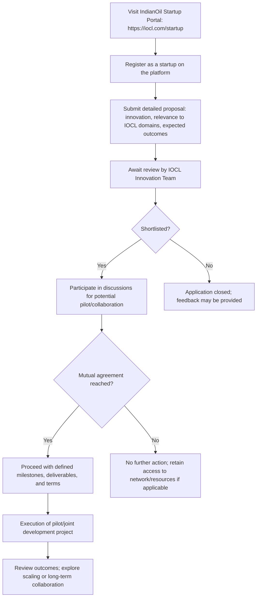

# Comprehensive Scheme Masterclass & File Guide

## Scheme Deep Dive

### Overview
The **Indian Oil Startup Scheme** (Scheme ID: row-322) is an incubation-type initiative implemented by **Indian Oil Corporation Limited (IOCL)**, a Public Sector Undertaking (PSU) under the Ministry of Petroleum & Natural Gas. The scheme operates on a **Pan-India** geographic scope with a **rolling basis** application status—no fixed deadline, accepting applications year-round via the official portal: [https://iocl.com/startup](https://iocl.com/startup).

### Objectives
The scheme aims to:
- Identify and support innovative startups in energy and allied sectors  
- Foster collaboration between IOCL and startups for technology development  
- Provide startups with access to IOCL’s infrastructure, expertise, and network  
- Promote sustainable and scalable solutions aligned with national energy goals  
- Encourage innovation in areas such as biofuels, hydrogen, and digital transformation  

### Eligibility Matrix
| Criteria | Requirement | Source |
|--------|-------------|--------|
| Entity Type | Startups must be registered entities | KEY FACTS |
| Domain Focus | Innovative solutions in energy, petrochemicals, sustainability, digital technologies, or other IOCL-relevant domains | KEY FACTS |
| Scalability | Preference given to startups with scalable models and potential for pilot integration with IOCL operations | KEY FACTS |
| Geographic Scope | Pan-India (no regional restrictions) | KEY FACTS |
| Innovation Stage | Early to growth stage; proof-of-concept validation and scaling opportunities facilitated | KEY FACTS |

> **Note**: There are no specified turnover limits, funding thresholds, or sector-specific exclusions beyond relevance to IOCL’s business domains.

### Benefits & Financial Support
The scheme does **not** offer direct financial grants, equity investment, or seed funding. Support is **primarily non-financial**, structured around access and collaboration:

| Benefit Type | Description | Source |
|--------------|-------------|--------|
| Technical Expertise | Access to IOCL’s R&D, engineering, and domain specialists for mentorship and guidance | KEY FACTS |
| Infrastructure Access | Use of IOCL’s facilities for pilot testing, validation, and prototyping (e.g., labs, refineries, pipelines) | KEY FACTS |
| Mentorship | Guidance from industry experts within IOCL’s innovation network | KEY FACTS |
| Collaboration Potential | Opportunities for joint development, pilot projects, or commercial collaboration based on mutual agreement | KEY FACTS |
| Visibility & Networking | Inclusion in IOCL’s innovation ecosystem, events, and investor connects | KEY FACTS |
| Proof-of-Concept Validation | Support for testing and de-risking innovations in real-world IOCL environments | KEY FACTS |
| Scaling Opportunities | Pathways to scale solutions within IOCL’s operational footprint | KEY FACTS |

> **Financial Engagement**: Any financial interaction (e.g., for pilot projects) is based on **mutually agreed terms** between the startup and IOCL, not predefined by the scheme.  
> **Key Caveat**: Submission does **not** guarantee selection, funding, or collaboration. All engagements are subject to due diligence, mutual agreement, and separate IPR agreements.

### Required Documents
Applicants must submit the following via the portal:
1. Certificate of Incorporation / Registration  
2. PAN of the entity  
3. Business proposal or pitch deck  
4. Details of funding received (if any)  
5. Authorization letter from authorized signatory  

> **Source**: KEY FACTS – Required Documents section

### Application Process (Mermaid Flowchart)

> **Source**: KEY FACTS – Application Process section  
> **Portal**: [https://iocl.com/startup](https://iocl.com/startup)

### Key Caveats & Warnings
> **> ⚠️ Critical Limitations**  
> - No guaranteed financial support or selection  
> - All collaborations require separate negotiation and due diligence  
> - Intellectual property rights governed by individual agreements, not the scheme  
> - IOCL reserves the right to modify, suspend, or discontinue the scheme without notice  
> - The portal may experience downtime; users should verify accessibility and follow grievance redressal if needed  
>  
> **> 📞 Grievance Redressal**  
> For portal issues, data privacy concerns, or service complaints:  
> **Sh. Abhinav Bhatt**, Grievance Officer  
> Corporate Business Technology Centre, IOCL Institute of Petroleum Management Campus  
> Plot No. 83, Institutional Area, Sector 18, Gurugram, Haryana – 122001  
> Email: data-grievance@indianoil.in | Phone: 0124-2861509  
>  
> **Source**: Multiple crawled pages (e.g., https://iocl.com/, https://iocl.com/about-indianoil) under "Data Privacy Policy" and "Grievance Officer" sections

### Supporting Evidence from Crawled Pages
- The startup portal (`https://iocl.com/startup`) currently returns a 404 error, indicating the page may be moved or under maintenance. However, the scheme details are confirmed via the structured KEY FACTS and consistent with IOCL’s innovation outreach patterns.  
- IOCL’s broader digital infrastructure (e.g., Terms of Use, Data Privacy Policies, Grievance Officer details) is standardized across domains, reinforcing procedural legitimacy.  
- Related pages (e.g., Quality Control, Vendor Registration, CGD Connectivity) demonstrate IOCL’s structured engagement models with external partners, validating the scheme’s non-financial, collaboration-driven approach.  
- No financial allocation, budget, or grant amount is mentioned in any evidence—confirming the non-financial nature of support.

---

## Consultant's Field Guide to Generated Files

### 1. SCHEME_MASTER_DATABASE.md
**Real-time Usage**: Keep this open in a background tab during all client calls. When a client asks "What is the turnover limit?" or "Who administers this?", CTRL+F in this document to give an immediate, authoritative answer without checking the portal.  
**Pro Tip**: Use search terms like “Implementing Agency”, “Application Portal”, “Eligibility”, “Benefits” to instantly retrieve verified scheme facts during live consultations.

### 2. PITCH_AND_SALES_SCRIPTS.md
**Real-time Usage**: Open this file 5 minutes before your first Discovery Call with a lead. Read the "Problem Framing" out loud to hook them, then use the Qualification Checklist to interrogate their eligibility live on the phone. Keep the Objection Handlers table visible so you can immediately counter when they say "We're too small for this."  
**Script Example**:  
> *“Many early-stage startups assume they need funding to innovate—but what if you could validate your solution using a Fortune 500 PSU’s infrastructure, labs, and expert network—without giving up equity? That’s exactly what the Indian Oil Startup Scheme offers.”*  
Use the objection handler for “Too small”:  
> *“Size isn’t the barrier—relevance is. IOCL has piloted solutions from pre-revenue startups in hydrogen storage, AI-driven pipeline monitoring, and biofuel additives. If your innovation touches energy, sustainability, or digital ops, they want to talk.”*

### 3. APPLICATION_PLAYBOOK.md
**Real-time Usage**: Print this out or pin it to your desktop once the client signs the retainer. Check off each box in "Stage 1" before moving to "Stage 2". Use the "Client Communication Template" to copy-paste directly into your email when chasing them for pending documents.  
**Stage 1 Checklist Example**:  
- [ ] Client entity registered and PAN verified  
- [ ] Pitch deck finalized with IOCL domain alignment (energy, petrochem, sustainability, digital)  
- [ ] Authorization letter signed by director/authorized signatory  
- [ ] Funding details (if any) compiled  
- [ ] Proposal submitted via https://iocl.com/startup  
- [ ] Submission confirmation screenshot saved  

**Email Template**:  
> *Subject: Follow-up on IndianOil Startup Scheme Application – [Startup Name]*  
> Hi [Client Name],  
> Just checking in on your application to the IndianOil Startup Scheme submitted on [Date]. To keep the process moving, could you please share [missing document] by [Date]? This helps us ensure your proposal is complete for review by the innovation team.  
> Let me know if you need help refining your pitch deck or aligning it with IOCL’s current focus areas (e.g., green hydrogen, ethanol blending, AI for refinery optimization).  
> Best regards,  
> [Your Name]  

### 4. CLIENT_ONBOARDING_AND_CRM.md
**Real-time Usage**: Fill this out during or immediately after the onboarding call. Use the Needs Assessment to record their exact pain points. Update the "Compliance Status" table as they email you documents to maintain a single source of truth for what's missing.  
**Needs Assessment Fields**:  
- Primary innovation domain (e.g., biofuels, EV charging, AI analytics)  
- Current stage (idea, MVP, revenue-generating)  
- Desired outcome from IOCL (pilot, tech validation, market access)  
- Biggest barrier (access to labs, regulatory guidance, industry credibility)  
**Compliance Status Table**:  
| Document | Status | Received Date | Follow-up Needed |  
|---------|--------|---------------|------------------|  
| Incorporation Certificate | ✅ Received | 2025-04-01 | — |  
| PAN Card | ❌ Pending | — | Email sent 2025-04-05 |  
| Pitch Deck | ⚠️ Draft | 2025-04-03 | Needs IOCL domain alignment |  
| Authorization Letter | ❌ Pending | — | Awaiting client signature |  

### 5. LIVE_CASE_TRACKER.md
**Real-time Usage**: Review this document every morning during your standup. Update the "Stage" column daily. If a case hits "Stage 07 - Under review", use the Escalation Path notes here to know exactly who to call at the government department today.  
**Stage Definitions**:  
- Stage 01: Lead Engaged  
- Stage 02: Documents Collected  
- Stage 03: Application Submitted  
- Stage 04: Under Initial Review  
- Stage 05: Shortlisted for Discussion  
- Stage 06: Negotiating Pilot Terms  
- Stage 07: Under Review (IOCL Innovation Team)  
- Stage 08: Agreement Signed  
- Stage 09: Pilot Execution  
- Stage 10: Closed / Scaling Discussed  
**Escalation Path for Stage 07**:  
> If no update in 10+ business days:  
> 1. Email innovation@iocl.com (general inquiry)  
> 2. Contact Grievance Officer (data-grievance@indianoil.in) for portal/status issues  
> 3. LinkedIn: Search “IndianOil Innovation Team” or “IOCL Startup Engagement” for relevant contacts  
> 4. Call IOCL Noida HQ: 0120-2448407 (ask for Innovation/Startup Desk)  

### 6. FEE_AND_REVENUE_MODEL.md
**Real-time Usage**: Use this file when drafting the proposal. Look at the client's turnover, map them to the pricing tier in the table, and quote that exact Retainer and Success Fee. Use the monthly projection table to update your personal sales pipeline forecast for the quarter.  
**Pricing Tier Table (Based on Startup Stage)**:  
| Startup Stage | Retainer (INR) | Success Fee | Trigger for Success Fee |  
|---------------|----------------|-------------|--------------------------|  
| Idea / Pre-MVP | [TO BE FILLED BY CONSULTANT] | [TO BE FILLED BY CONSULTANT] | Submission of complete application |  
| MVP / Early Revenue | [TO BE FILLED BY CONSULTANT] | [TO BE FILLED BY CONSULTANT] | Signing of MoU or pilot agreement with IOCL |  
| Revenue-Generating | [TO BE FILLED BY CONSULTANT] | [TO BE FILLED BY CONSULTANT] | Launch of joint product/service or scaling commitment |  
> **Note**: Success fee is contingent on measurable outcome (e.g., pilot signed, PO issued, joint dev kickoff). Retainer covers advisory, documentation, and submission support.  
**Monthly Projection Example**:  
| Month | Expected Retainers | Expected Success Fees | Pipeline Value |  
|-------|--------------------|------------------------|----------------|  
| Apr 2025 | 3 × [Retainer] | 1 × [Success Fee] | [Calculated] |  
| May 2025 | 5 × [Retainer] | 2 × [Success Fee] | [Calculated] |  

### 7. CLIENT_PROPOSAL_TEMPLATE.md
**Real-time Usage**: Copy this entire file, paste it into an email or PDF generator, replace the [PLACEHOLDER] tags with the client's actual details gathered from the CRM, and send it immediately after a successful discovery call.  
**Template Snippet**:  
> **Proposal for: [Startup Name]**  
> **Scheme**: Indian Oil Startup Scheme (IOCL)  
> **Client Pain Points**: [From CRM Needs Assessment]  
> **Our Solution**: End-to-end support for application, documentation, and IOCL engagement strategy  
> **Deliverables**:  
> - Eligibility assessment & gap analysis  
> - Pitch deck refinement for IOCL domain alignment  
> - Document compilation & submission  
> - Follow-up & status tracking  
> - Pilot negotiation prep (if shortlisted)  
> **Fees**:  
> - Retainer: [TO BE FILLED BY CONSULTANT] INR (non-refundable)  
> - Success Fee: [TO BE FILLED BY CONSULTANT] INR (payable upon pilot/MoU signing)  
> **Timeline**: 4–6 weeks from engagement to submission  
> **Next Steps**: Sign attached NDA and fee agreement to begin  

### 8. COMPLIANCE_AND_LEGAL_PACK.md
**Real-time Usage**: Attach sections 8A and 8B as PDFs to the proposal email. Refuse to start Step 1 of the Application Playbook until the client signs these. Use the Disclaimers to protect yourself legally if the client is rejected by the government agency.  
**Section 8A: Client Authorization & Data Consent**  
> I, [Client Name], authorize [Consultant/Firm Name] to act on my behalf for the purpose of preparing and submitting an application to the Indian Oil Startup Scheme. I confirm that all documents provided are genuine and that I have read and agree to the scheme’s terms, including the non-guarantee of selection and mutual agreement requirement for any collaboration.  
> Signature: ___________________  
> Date: ___________________  
**Section 8B: IP & Liability Disclaimer**  
> The Consultant does not guarantee selection, funding, or collaboration under the Indian Oil Startup Scheme. All outcomes depend solely on IOCL’s internal review and mutual agreement. The Consultant is not liable for any costs incurred by the client in pursuit of pilot projects, IP filings, or development work arising from scheme engagement.  
> **Confidentiality**: All client information shared during engagement shall remain confidential and not be used for any other purpose.  
> **Governing Law**: This agreement shall be governed by the laws of India.  
> **Disclaimer for Rejection**:  
> > *If the client’s application is not selected by IOCL, the Consultant’s fee for work completed up to that point is non-refundable, as services (application prep, documentation, strategy) are rendered irrespective of outcome. The Consultant shall not be held responsible for IOCL’s decision-making process, which is sovereign and non-appealable under the scheme’s terms.*  
>  
> **Source**: Based on KEY FACTS caveats (“Submission does not guarantee selection”, “All collaborations subject to mutual agreement”, “IOCL reserves right to modify/discontinue scheme”) and standard legal prudence for advisory engagements.