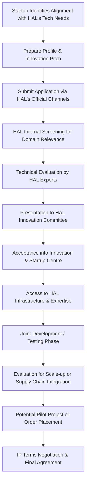

</think># Comprehensive Scheme Masterclass & File Guide

## Scheme Deep Dive

### Scheme Overview
The **HAL Innovation & Startup Centre** is an incubation initiative launched by **Hindustan Aeronautics Limited (HAL)**, a Maharatna Public Sector Undertaking under the Ministry of Defence, Government of India. The scheme is designed to foster innovation in aerospace and defence technologies by providing startups with access to HAL's extensive infrastructure, technical expertise, and testing facilities. It operates on a Pan-India geographic scope and targets startups working in domains aligned with HAL's technological requirements and the Make-in-India initiative.

### Objectives
The primary objectives of the HAL Innovation & Startup Centre are:
- Promote innovation in aerospace and defence technologies
- Support startups developing solutions for HAL's operational needs
- Facilitate technology collaboration between HAL and startups
- Enable testing and validation of startup prototypes in HAL facilities
- Integrate viable startup innovations into HAL's product lifecycle or supply chain

### Eligibility Matrix
| Criteria | Requirement | Source |
|---------|-------------|--------|
| **Target Beneficiaries** | Startups | Key Facts |
| **Domain Focus** | Innovative technologies in aerospace, defence, avionics, materials, MRO, or related domains | Key Facts |
| **Alignment Requirement** | Must align with HAL's technological roadmap and Make-in-India initiatives | Key Facts |
| **Geographic Scope** | Pan-India | Key Facts |
| **Implementing Agency** | Hindustan Aeronautics Limited (HAL) | Key Facts |

> **Important Caveat**: Participation is subject to HAL's internal evaluation and alignment with its technological roadmap. There is no guarantee of funding, order placement, or long-term collaboration. Intellectual property terms are negotiated on a case-by-case basis.

### Benefits & Financial Support
| Benefit Type | Description | Source |
|--------------|-------------|--------|
| **Infrastructure Access** | Access to HAL's physical infrastructure and facilities | Key Facts |
| **Technical Expertise** | Mentorship and guidance from HAL's engineering and technical teams | Key Facts |
| **Testing Facilities** | Use of HAL's testing and validation facilities for prototypes | Key Facts |
| **Technology Collaboration** | Opportunities for joint development projects with HAL | Key Facts |
| **Pilot Projects** | Potential to undertake pilot projects within HAL's ecosystem | Key Facts |
| **Supply Chain Integration** | Possibility of integration into HAL's supply chain or product development programs | Key Facts |
| **Direct Financial Support** | **Not specified** – The scheme does not provide grants, loans, or direct funding quantum | Key Facts |

> **Critical Note**: The HAL Innovation & Startup Centre does **not** offer direct financial assistance. Its value proposition lies in non-monetary support such as infrastructure, expertise, testing, and potential commercial integration.

### Application Process
The evidence does not provide a detailed step-by-step application procedure for the HAL Innovation & Startup Centre. However, based on the implementing agency and scheme type, the general process can be inferred as follows:

**Application Portal**: While no specific portal URL is provided in the evidence, applications are expected to be submitted through **HAL's official website** ([https://hal-india.co.in](https://hal-india.co.in)) or designated innovation engagement channels managed by HAL.

> **Key Takeaway**: Startups must demonstrate clear technological alignment with HAL's current and future needs in aerospace, defence, avionics, materials, or MRO. Success depends on mutual benefit and strategic fit rather than financial incentives.

---

## Consultant's Field Guide to Generated Files

### 1. SCHEME_MASTER_DATABASE.md
**Real-time Usage:** Keep this open in a background tab during all client calls. When a client asks "What is the turnover limit?" or "Who administers this?", CTRL+F in this document to give an immediate, authoritative answer without checking the portal.

### 2. PITCH_AND_SALES_SCRIPTS.md
**Real-time Usage:** Open this file 5 minutes before your first Discovery Call with a lead. Read the "Problem Framing" out loud to hook them, then use the Qualification Checklist to interrogate their eligibility live on the phone. Keep the Objection Handlers table visible so you can immediately counter when they say "We're too small for this."

### 3. APPLICATION_PLAYBOOK.md
**Real-time Usage:** Print this out or pin it to your desktop once the client signs the retainer. Check off each box in "Stage 1" before moving to "Stage 2". Use the "Client Communication Template" to copy-paste directly into your email when chasing them for pending documents.

### 4. CLIENT_ONBOARDING_AND_CRM.md
**Real-time Usage:** Fill this out during or immediately after the onboarding call. Use the Needs Assessment to record their exact pain points. Update the "Compliance Status" table as they email you documents to maintain a single source of truth for what's missing.

### 5. LIVE_CASE_TRACKER.md
**Real-time Usage:** Review this document every morning during your standup. Update the "Stage" column daily. If a case hits "Stage 07 - Under review", use the Escalation Path notes here to know exactly who to call at the government department today.

### 6. FEE_AND_REVENUE_MODEL.md
**Real-time Usage:** Use this file when drafting the proposal. Look at the client's turnover, map them to the pricing tier in the table, and quote that exact Retainer and Success Fee. Use the monthly projection table to update your personal sales pipeline forecast for the quarter.

### 7. CLIENT_PROPOSAL_TEMPLATE.md
**Real-time Usage:** Copy this entire file, paste it into an email or PDF generator, replace the [PLACEHOLDER] tags with the client's actual details gathered from the CRM, and send it immediately after a successful discovery call.

### 8. COMPLIANCE_AND_LEGAL_PACK.md
**Real-time Usage:** Attach sections 8A and 8B as PDFs to the proposal email. Refuse to start Step 1 of the Application Playbook until the client signs these. Use the Disclaimers to protect yourself legally if the client is rejected by the government agency.