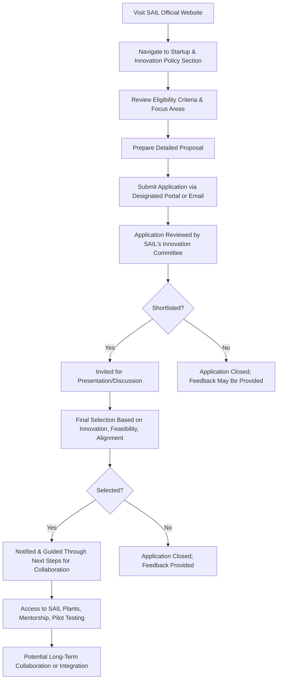

# Comprehensive Scheme Masterclass & File Guide

## Scheme Deep Dive

### Overview
The **SAIL Startup & Innovation Policy** (Scheme ID: row-324) is a pan-India incubation-type scheme implemented by the **Steel Authority of India Limited (SAIL)**, a Maharatna CPSE under the Ministry of Steel. The scheme operates on a **rolling basis with no fixed deadline**, accepting applications year-round-the-year round. It aims to foster innovation in sectors aligned with SAIL’s operations by providing startups with access to infrastructure, technical expertise, and potential collaboration pathways.

### Objectives
- To identify and nurture innovative startups working in areas relevant to SAIL's operations  
- To provide startups with access to SAIL's plants, infrastructure, and technical expertise for pilot projects  
- To foster collaboration between SAIL and startups for developing sustainable and technologically advanced solutions  
- To support innovation in steel manufacturing, digitalization, energy efficiency, and environmental sustainability  
- To create a structured pathway for startups to scale their solutions through potential integration into SAIL's value chain  

### Eligibility Matrix
| Criteria | Requirement | Source |
|--------|-------------|--------|
| Startup Status | Must be registered in India with a valid DPIIT recognition certificate | Key Facts |
| Innovation Focus | Working on innovative products, services, or technologies in domains such as steel processing, automation, AI/IoT, sustainability, waste management, or related industrial applications | Key Facts |
| Product Readiness | Must have a prototype or minimum viable product (MVP) ready for pilot testing | Key Facts |
| Geographic Scope | Pan-India (no regional restrictions) | Key Facts |
| Target Beneficiaries | Startups | Key Facts |

> **> **Note**: Financial support is not guaranteed and is determined on a case-by-case basis. SAIL reserves the right to discontinue engagement if milestones are not met. Intellectual property rights must be clearly defined in any collaboration agreement.**

### Benefits & Financial Support
| Benefit Type | Details | Source |
|-------------|---------|--------|
| Access to Infrastructure | Access to SAIL's manufacturing units for pilot testing | Key Facts |
| Technical Mentorship | Mentorship from SAIL experts | Key Facts |
| Visibility & Networking | Opportunities to present solutions to SAIL's leadership; visibility through SAIL's innovation network | Key Facts |
| Collaboration Potential | Potential for long-term collaboration or integration into SAIL's operations | Key Facts |
| Financial Support | Determined case-by-case for proof-of-concept validation and pilot projects; quantum, type, and mechanism depend on mutual agreement; not standardized | Key Facts |
| Non-Equity/Debt Note | Scheme does not provide equity funding or debt financing as a standard offering | Key Facts |

> **> **Warning**: Financial support is **not guaranteed** and subject to mutual agreement and fund availability. The scheme does not offer standardized grants or loans.**

### Required Documents
1. Certificate of Incorporation / Registration  
2. DPIIT Startup Recognition Certificate  
3. PAN of the entity  
4. Audited financial statements (if available)  
5. Detailed project proposal or pitch deck  
6. Proof of concept or prototype details  
7. Team details and resumes of key founders  
8. Any existing partnerships or pilot project reports  

### Application Process (Mermaid Flowchart)

**Application Portal**: https://sail.co.in (Navigate to Startup & Innovation Policy section)  
**Key Source**: SAIL Official Website – Startup & Innovation Policy details  

### Key Caveats
- Financial support is not guaranteed and subject to mutual agreement and availability of funds  
- Intellectual property rights must be clearly defined in any collaboration agreement  
- SAIL reserves the right to discontinue engagement if milestones are not met  
- The scheme does not provide equity funding or debt financing as a standard offering  
- Applications are accepted on a rolling basis with no fixed deadline  

---

## Consultant's Field Guide to Generated Files

### 1. SCHEME_MASTER_DATABASE.md
**Real-time Usage**: Keep this open in a background tab during all client calls. When a client asks "What is the turnover limit?" or "Who administers this?", CTRL+F in this document to give an immediate, authoritative answer without checking the portal.  
**Example**: If a client asks, "Do I need audited financials?", search "audited financial statements" to confirm it's required only *if available*. If they ask about deadlines, search "rolling basis" to confirm year-round acceptance.

### 2. PITCH_AND_SALES_SCRIPTS.md
**Real-time Usage**: Open this file 5 minutes before your first Discovery Call with a lead. Read the "Problem Framing" out loud to hook them, then use the Qualification Checklist to interrogate their eligibility live on the phone. Keep the Objection Handlers table visible so you can immediately counter when they say "We're too small for this."  
**Example**: Use the script: *"Many startups assume they need revenue to qualify—but SAIL cares about innovation and MVP readiness, not turnover. Let me check if you have a DPIIT certificate and a prototype..."* Then refer to the Objection Handler for *"We're too small"*: *"SAIL specifically targets early-stage startups with MVPs—size isn’t a barrier; relevance to steel, AI, or sustainability is."*

### 3. APPLICATION_PLAYBOOK.md
**Real-time Usage**: Print this out or pin it to your desktop once the client signs the retainer. Check off each box in "Stage 1"Stage 2". Use the "Client Communication Template" to copy-paste directly into your email when chasing them for pending documents.  
**Example**: After signing, use Stage 1: Eligibility & Document Collection` checklist: Verify DPIIT certificate, prototype readiness, and domain alignment. Then, use the template:  
> *Hi [Name],*  
> *Following our call, please send over your DPIIT recognition certificate and a 2-slide overview of your prototype’s application in steel processing. Let me know if you need help refining the pitch deck—we’ll review it together before submission.*  
> *Best,*  
> *[Your Name]*

### 4. CLIENT_ONBOARDING_AND_CRM.md
**Real-time Usage**: Fill this out during or immediately after the onboarding call. Use the Needs Assessment to record their exact pain points. Update the "Compliance Status" table as they email you documents to maintain a single source of truth for what's missing.  
**Example**: During onboarding, log:  
- *Pain Point*: "Struggling to validate AI-based defect detection model in real-time casting environments."  
- *Desired Outcome*: "Access to SAIL’s Bhilai plant for pilot testing on continuous caster."  
Then, as documents arrive, update the CRM:  
| Document | Status | Received Date | Notes |  
|----------|--------|---------------|-------|  
| DPIIT Certificate | ✅ Received | 2025-04-05 | Valid till 2026 |  
| Prototype Details | ⏳ Pending | — | Need video demo + technical spec sheet |  

### 5. LIVE_CASE_TRACKER.md
**Real-time Usage**: Review this document every morning during your standup. Update the "Stage" column daily. If a case hits "Stage 07 - Under review", use the Escalation Path notes here to know exactly who to call at the government department today.  
**Example**:  
| Case ID | Client | Stage | Last Updated | Action Required |  
|---------|--------|-------|--------------|-----------------|  
| SAIL-2025-088 | NanoSteel Innovations | 07 - Under review | 2025-04-05 | Call Innovation Committee Secretary (ext. 2201) at SAIL R&D HQ to check review timeline; escalate to CMO liaison if no update in 48hrs |  

Use the escalation path:  
> *Stage 07 → Contact: Innovation Committee Secretariat (SAIL R&D, Ranchi) → If no response in 24h → Escalate to Joint Director (Innovation & Collaboration), SAIL Corporate Office*

### 6. FEE_AND_REVENUE_MODEL.md
**Real-time Usage**: Use this file when drafting the proposal. Look at the client's turnover, map them to the pricing tier in the table, and quote that exact Retainer and Success Fee. Use the monthly projection table to update your personal sales pipeline forecast for the quarter.  
**Example**:  
| Client Turnover (FY) | Retainer (₹) | Success Fee (% of Support) |  
|----------------------|--------------|----------------------------|  
| < ₹50 Lakhs | 75,000 | 8% |  
| ₹50L – ₹2Cr | 1,50,000 | 6% |  
| > ₹2Cr | 3,00,000 | 4% |  

For a client with ₹1.2Cr turnover: Quote ₹1,50,000 retainer + 6% success fee on any financial support granted.  
Then, update your pipeline:  
### 7. CLIENT_PROPOSAL_TEMPLATE.md
**Real-time Usage**: Copy this entire file, paste it into an email or PDF generator, replace the [PLACEHOLDER] tags with the client's actual details gathered from the CRM, and send it immediately after a successful discovery call.  
**Example**: After a discovery call with *GreenTech Alloys*, replace:  
- `[CLIENT_NAME]` → GreenTech Alloys  
- `[PROBLEM_STATEMENT]` → Lack of access to industrial-scale pilot lines for testing their AI-driven slag optimization model  
- `[SOLUTION_DESCRIPTION]` → Real-time ML model predicting slag composition to reduce flux consumption by 15%  
- `[EXPECTED_OUTCOME]` → Pilot validation at SAIL Durgapur’s blast furnace; potential integration into SAIL’s process control systems  
- `[RETENTION_FEE]` → ₹1,50,000 (per FEE_AND_REVENUE_MODEL.md)  
- `[SUCCESS_FEE]` → 6% of any financial support awarded  
- `[TIMELINE]` → 8–10 weeks from document submission to committee review  

Send as PDF: `Proposal_GreenTechAlloys_SAILStartup_Innovation.pdf`

### 8. COMPLIANCE_AND_LEGAL_PACK.md
**Real-time Usage**: Attach sections 8A and 8B as PDFs to the proposal email. Refuse to start Step 1 of the Application Playbook until the client signs these. Use the Disclaimers to protect yourself legally if the client is rejected by the government agency.  
**Example**:  
- Attach `8A_SAIL_IP_Terms_Template.pdf` and `8B_Consultant_Liability_Disclaimer.pdf` to the proposal.  
- In the email:  
> *Please review and sign the attached IP and compliance documents (8A & 8B) before we proceed with document collection. These protect both your IP and our engagement terms per SAIL’s policy.*  
- If client hesitates:  
> *Per SAIL’s Key Caveats, IP rights must be defined upfront. We cannot submit your application without signed 8A—this is a mandatory gate.*  
- If rejected: Cite Section 8B:  
> *"As disclosed in our disclaimer, scheme acceptance is at SAIL’s sole discretion. Our fee is for application support only; we do not guarantee outcomes."*  

---  
**Application Portal**: https://sail.co.in (Navigate to Startup & Innovation Policy section)  
**Key Sources**: SAIL Official Website, Scheme Key Facts (row-324)  
**Confidence**: Medium (per scheme documentation)