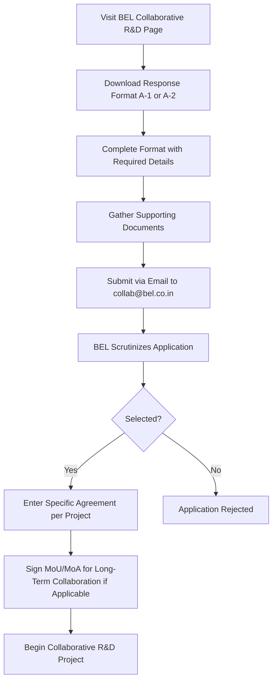

# Comprehensive Scheme Masterclass & File Guide

## Scheme Deep Dive

### Scheme Overview
**Scheme Name:** BEL Innovation & Startup Support  
**Scheme ID:** row-325  
**Ministry / Category:** PSU Support  
**Scheme Type:** other  
**Geographic Scope:** Pan-India  
**Implementing Agency:** Bharat Electronics Limited (BEL), Ministry of Defence, Government of India  
**Application Portal:** https://bel-india.in/collaborative-rd/  
**Status / Deadlines:** Rolling basis — no fixed deadline. Applications are accepted year-round.  
**Last Updated:** 2026  

### Objectives
- To be a customer focussed company providing state-of-the-art products & solutions at competitive prices, meeting the demands of quality, delivery & service.
- To generate internal resources for profitable growth.
- To attain technological leadership in defence electronics through in-house R&D, partnership with defence/research laboratories & academic institutions.
- To give thrust to exports.
- To create a facilitating environment for people to realise their full potential through continuous learning & team work.
- To give value for money to customers & create wealth for shareholders.
- To constantly benchmark company's performance with best-in-class internationally.
- To raise marketing abilities to global standards.
- To strive for self-reliance through indigenisation.

### Eligibility Matrix
| Eligibility Criteria | Details |
|----------------------|---------|
| **Target Beneficiaries** | Startups; MSMEs |
| **Eligible Entities** | Companies (including MSMEs and Start-ups), R&D Institutions (comprising Academia, Research Institutes, R&D organizations and Companies working in niche technologies) in India and abroad, Experts/Consultants working independently or associated with R&D Institutions |
| **Empanelment Criteria for Individual Experts/Consultants** | Qualifications, demonstrated experience, patents granted, papers published, awards received, number of projects completed in the relevant field |
| **Empanelment Criteria for R&D Institutions/Companies** | Type of institution, number of years of operation, available manpower expertise, papers published, patents granted, number of projects/processes licensed and commercialized, total number of projects completed in the relevant field |
| **Geographic Scope** | Pan-India (India and abroad) |

### Benefits & Financial Support
| Benefit Type | Details |
|--------------|---------|
| **Direct Financial Support** | BEL does not provide direct financial support such as grants, loans, or subsidies to startups or MSMEs. |
| **Collaborative R&D Opportunities** | Joint R&D work on assignment or long-term basis through MoUs/long term tie ups; technical consultancy for specific projects; design vetting; design verification; design buying; testing; characterization; specialized engineering software codes; modelling; expert guidance on annual retainership basis. |
| **Access to BEL’s Ecosystem** | Empanelled partners gain access to BEL’s R&D ecosystem, technology modules, subsystems, and support for product development. |
| **Strategic Alignment** | Promotes indigenisation, cost reduction, and support for MSMEs and start-ups in alignment with the national vision of Aatmanirbhar Bharat. |
| **Remuneration Structure** | Payments are made as per agreed terms for services rendered in individual R&D projects. A specific agreement outlining scope of work, time frame, remuneration, deliverables, and ownership of IPRs is executed for each project. |
| **Long-Term Collaboration** | A Memorandum of Understanding (MoU) or Memorandum of Agreement (MoA) may be signed for long-term collaboration. |

### Application Process

#### Detailed Application Steps:
1. Visit the BEL website at https://bel-india.in/collaborative-rd/ to access the Collaborative R&D page.
2. Download the 'Response Format for R&D Institution Empanelment' (A-1) or 'Response Format for Individual Consultant Empanelment' (A-2) by clicking the respective links.
3. Complete the format with required details including qualifications, experience, patents, papers, awards, and project history.
4. Submit the completed format along with other required documents via email to collab [at]bel[dot]co[dot]in.
5. BEL will scrutinize the application based on empanelment criteria.
6. If selected, BEL will enter into a specific agreement outlining scope of work, time frame, remuneration, deliverables, and ownership of IPRs for each individual R&D project.
7. A Memorandum of Understanding (MoU) or Memorandum of Agreement (MoA) may be signed for long-term collaboration.

### Required Documents
1. Completed Response Format for R&D Institution Empanelment (A-1) or Individual Consultant Empanelment (A-2)
2. Details of qualifications and demonstrated experience
3. Information on patents granted
4. List of papers published
5. Records of awards received
6. Details of number of projects completed in the relevant field
7. For institutions: Type of institution, number of years of operation, available manpower expertise
8. For institutions: Details of papers published, patents granted, number of projects/processes licensed and commercialized
9. For institutions: Total number of projects completed in the relevant field

### Key Caveats
> **Warning:** Empanelment does not guarantee project allocation; BEL reserves the sole right to decide on empanelment and project assignment.
>
> **Note:** A Non-Disclosure Agreement (NDA) may be required on a case-by-case basis before collaboration begins.
>
> **Important:** All statutory procedures and formalities (e.g., Excise duty, Sales Tax) must be complied with in material transactions.
>
> **Caution:** BEL may seek additional information or details before finalizing empanelment.
>
> **Reminder:** Collaborative R&D projects are subject to the terms of individual agreements covering scope, time frame, remuneration, deliverables, and IPR ownership.

### Contact Details
- **Email:** collab [at]bel[dot]co[dot]in

---

## Consultant's Field Guide to Generated Files

### 1. SCHEME_MASTER_DATABASE.md
**Real-time Usage:** Keep this open in a background tab during all client calls. When a client asks "What is the turnover limit?" or "Who administers this?", CTRL+F in this document to give an immediate, authoritative answer without checking the portal.

### 2. PITCH_AND_SALES_SCRIPTS.md
**Real-time Usage:** Open this file 5 minutes before your first Discovery Call with a lead. Read the "Problem Framing" out loud to hook them, then use the Qualification Checklist to interrogate their eligibility live on the phone. Keep the Objection Handlers table visible so you can immediately counter when they say "We're too small for this."

### 3. APPLICATION_PLAYBOOK.md
**Real-time Usage:** Print this out or pin it to your desktop once the client signs the retainer. Check off each box in "Stage 1" before moving to "Stage 2". Use the "Client Communication Template" to copy-paste directly into your email when chasing them for pending documents.

### 4. CLIENT_ONBOARDING_AND_CRM.md
**Real-time Usage:** Fill this out during or immediately after the onboarding call. Use the Needs Assessment to record their exact pain points. Update the "Compliance Status" table as they email you documents to maintain a single source of truth for what's missing.

### 5. LIVE_CASE_TRACKER.md
**Real-time Usage:** Review this document every morning during your standup. Update the "Stage" column daily. If a case hits "Stage 07 - Under review", use the Escalation Path notes here to know exactly who to call at the government department today.

### 6. FEE_AND_REVENUE_MODEL.md
**Real-time Usage:** Use this file when drafting the proposal. Look at the client's turnover, map them to the pricing tier in the table, and quote that exact Retainer and Success Fee. Use the monthly projection table to update your personal sales pipeline forecast for the quarter.

### 7. CLIENT_PROPOSAL_TEMPLATE.md
**Real-time Usage:** Copy this entire file, paste it into an email or PDF generator, replace the [PLACEHOLDER] tags with the client's actual details gathered from the CRM, and send it immediately after a successful discovery call.

### 8. COMPLIANCE_AND_LEGAL_PACK.md
**Real-time Usage:** Attach sections 8A and 8B as PDFs to the proposal email. Refuse to start Step 1 of the Application Playbook until the client signs these. Use the Disclaimers to protect yourself legally if the client is rejected by the government agency.