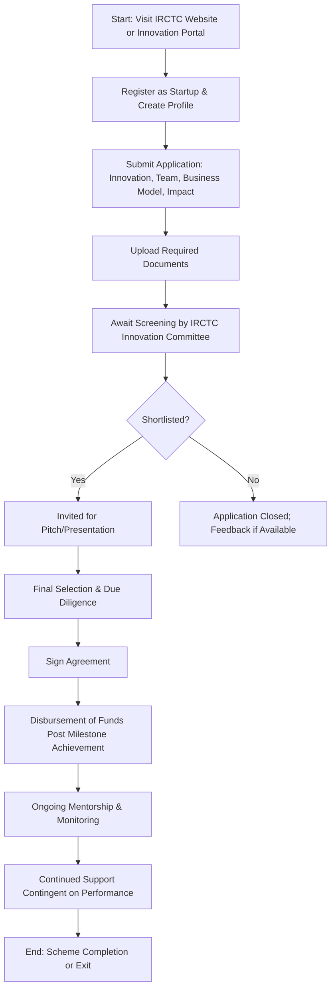

# Comprehensive Scheme Masterclass & File Guide

## Scheme Deep Dive

### Scheme Overview
The **IRCTC Startup Innovation Fund** is a grant-based scheme implemented by the **Indian Railway Catering and Tourism Corporation Limited (IRCTC)**, a Mini Ratna PSU under the Ministry of Railways. Launched to foster innovation in railway and tourism-related sectors, the scheme provides financial and non-financial support to early-stage startups across India. The initiative aligns with national goals to strengthen the startup ecosystem and promote indigenous innovation in critical infrastructure domains.

**Scheme ID:** row-326  
**Geographic Scope:** Pan-India  
**Scheme Type:** Grant  
**Last Updated:** 2026  
**Implementing Agency:** Indian Railway Catering and Tourism Corporation Limited (IRCTC)  
**Application Portal:** [https://irctc.co.in](https://irctc.co.in)  

> **Note:** While the scheme is active as of 2026, the confidence level in the extracted data is marked as **low** due to limited detailed public disclosures. Consultants are advised to verify current guidelines directly with IRCTC’s innovation cell before client engagement.

---

### Objectives
The scheme aims to achieve the following strategic goals:
- Promote innovation in railway and tourism-related sectors  
- Provide financial support to early-stage startups  
- Mentor and guide startups through IRCTC’s expertise and network  
- Facilitate market access and pilot opportunities within IRCTC operations  
- Strengthen the startup ecosystem in alignment with government initiatives  

These objectives are designed to create a symbiotic relationship where startups gain validation and scale, while IRCTC acquires innovative solutions to enhance passenger experience, operational efficiency, and service delivery.

---

### Eligibility Matrix
Eligibility is focused on innovation-driven startups operating in sectors directly relevant to IRCTC’s core operations. The following table outlines the detailed eligibility criteria extracted from the evidence.

| **Criteria** | **Requirement** | **Details** |
|--------------|-----------------|-----------|
| **Legal Status** | Startup incorporated in India | Must be a legally registered entity under Indian law (e.g., Private Limited, LLP, etc.) |
| **Sector of Innovation** | Railway catering, tourism, digital ticketing, passenger experience, logistics, or allied sectors | Focus on scalable solutions with potential for integration into IRCTC systems |
| **Innovation Focus** | Innovative products, services, or processes | Emphasis on novelty, technological advancement, and problem-solving capability |
| **Scalability & Impact** | High scalability and social impact potential | Preference for solutions that can serve large user bases and address public welfare |
| **Founder Profile** | Open to all, with preference for women, SC/ST, or differently-abled entrepreneurs | Encourages inclusive entrepreneurship; no explicit exclusion but affirmative action encouraged |
| **Stage of Startup** | Early-stage (pre-revenue to early revenue) | Typically seed or pre-Series A; no explicit funding cap mentioned |
| **IP Ownership** | Startup must own IP rights | Intellectual property must be clearly defined and owned by the applying startup |
| **Compliance** | Adherence to IRCTC’s data security and privacy policies | Mandatory compliance with IRCTC’s internal IT and data protection standards |

> **Key Caveats on Eligibility:**  
> - Funding is subject to availability of funds and IRCTC’s internal approval processes  
> - Continued support is contingent on performance and milestone achievement  
> - IRCTC reserves the right to modify or withdraw the scheme without prior notice  

---

### Benefits & Financial Support
The scheme offers a hybrid package of financial and non-financial support. Unlike fixed-grant schemes, support is tailored based on startup maturity, innovation potential, and strategic alignment with IRCTC.

| **Support Type** | **Details** | **Notes** |
|------------------|-----------|---------|
| **Financial Support** | Grants or seed funding (equity-free) | Quantum determined case-by-case; based on stage, innovation potential, and alignment with IRCTC goals |
| **Disbursement Mechanism** | Tranche-based upon milestone achievement | Funds released after due diligence and achievement of pre-agreed milestones |
| **Mentorship** | Access to IRCTC experts | Guidance from domain specialists in railway operations, catering, tourism, and digital systems |
| **Market Access** | Access to IRCTC’s user base (~14.97 Cr users as of Feb 2026) | Opportunity for pilot testing and real-world validation |
| **Platform Integration** | Potential integration into IRCTC platforms | Successful pilots may lead to scaling across IRCTC’s digital and physical touchpoints |
| **Branding & Visibility** | Promotion through IRCTC channels | Exposure via IRCTC website, app, mailers, and social media |
| **Regulatory Guidance** | Support on compliance and regulatory matters | Assistance with IRCTC-specific and government-mandated requirements |

> **Financial Support Notes:**  
> - The scheme does **not** specify minimum/maximum grant amounts, reflecting its discretionary nature  
> - Funds are **non-withdrawable** and strictly for approved project expenses (analogous to IRCTC eWallet principles)  
> - Transaction charges or fees are not mentioned, suggesting full grant disbursement  
> - Disbursement is conditional on milestone completion and due diligence clearance  

---

### Application Process
The application journey is structured and sequential, designed to filter for high-potential innovators while ensuring due diligence. The process is illustrated below using a Mermaid flowchart.

#### Step-by-Step Breakdown:
1. **Access Portal:** Navigate to [https://irctc.co.in](https://irctc.co.in) and locate the innovation/startup section (exact path may vary; consult IRCTC’s official notifications).
2. **Registration:** Create a startup profile on the designated portal (likely under IRCTC’s innovation or CSR arm).
3. **Application Submission:** Fill in details covering:
   - Innovation description (problem, solution, uniqueness)
   - Team background and founder profiles
   - Business model and revenue strategy
   - Potential impact on IRCTC operations and passengers
4. **Document Upload:** Submit the following mandatory documents:
   - Certificate of Incorporation / Registration
   - PAN of the entity
   - Pitch deck or business description
   - Details of prior funding received (if any)
   - Technical prototype or MVP details (if applicable)
   - Founder profiles and KYC documents (ID, address proof, photographs)
5. **Screening:** IRCTC innovation committee reviews applications for eligibility and innovation merit.
6. **Pitch Invitation:** Shortlisted startups are invited to present their solution (virtually or in person).
7. **Due Diligence:** IRCTC conducts technical, financial, and legal validation.
8. **Agreement Signing:** Successful applicants sign a grant agreement outlining milestones, IP terms, and compliance requirements.
9. **Fund Disbursement:** Funds released in tranches upon milestone achievement and verification.
10. **Post-Award Support:** Ongoing mentorship, performance tracking, and potential for scale-up.

#### Required Documents (Exhaustive List):
1. Certificate of Incorporation / Registration  
2. PAN of the entity  
3. Pitch deck or business description  
4. Details of funding received (if any)  
5. Technical prototype or MVP details (if applicable)  
6. Founder profiles and KYC documents  

> **Warnings:**  
> - Incomplete documentation leads to automatic rejection  
> - Misrepresentation of IP ownership or founder details may result in blacklisting  
> - All documents must be legible, scanned, and in PDF/JPEG format as specified by the portal  

---

## Consultant's Field Guide to Generated Files

### 1. SCHEME_MASTER_DATABASE.md
**Real-time Usage:** Keep this open in a background tab during all client calls. When a client asks "What is the turnover limit?" or "Who administers this?", CTRL+F in this document to give an immediate, authoritative answer without checking the portal.

### 2. PITCH_AND_SALES_SCRIPTS.md
**Real-time Usage:** Open this file 5 minutes before your first Discovery Call with a lead. Read the "Problem Framing" out loud to hook them, then use the Qualification Checklist to interrogate their eligibility live on the phone. Keep the Objection Handlers table visible so you can immediately counter when they say "We're too small for this."

### 3. APPLICATION_PLAYBOOK.md
**Real-time Usage:** Print this out or pin it to your desktop once the client signs the retainer. Check off each box in "Stage 1" before moving to "Stage 2". Use the "Client Communication Template" to copy-paste directly into your email when chasing them for pending documents.

### 4. CLIENT_ONBOARDING_AND_CRM.md
**Real-time Usage:** Fill this out during or immediately after the onboarding call. Use the Needs Assessment to record their exact pain points. Update the "Compliance Status" table as they email you documents to maintain a single source of truth for what's missing.

### 5. LIVE_CASE_TRACKER.md
**Real-time Usage:** Review this document every morning during your standup. Update the "Stage" column daily. If a case hits "Stage 07 - Under review", use the Escalation Path notes here to know exactly who to call at the government department today.

### 6. FEE_AND_REVENUE_MODEL.md
**Real-time Usage:** Use this file when drafting the proposal. Look at the client's turnover, map them to the pricing tier in the table, and quote that exact Retainer and Success Fee. Use the monthly projection table to update your personal sales pipeline forecast for the quarter.

### 7. CLIENT_PROPOSAL_TEMPLATE.md
**Real-time Usage:** Copy this entire file, paste it into an email or PDF generator, replace the [PLACEHOLDER] tags with the client's actual details gathered from the CRM, and send it immediately after a successful discovery call.

### 8. COMPLIANCE_AND_LEGAL_PACK.md
**Real-time Usage:** Attach sections 8A and 8B as PDFs to the proposal email. Refuse to start Step 1 of the Application Playbook until the client signs these. Use the Disclaimers to protect yourself legally if the client is rejected by the government agency.