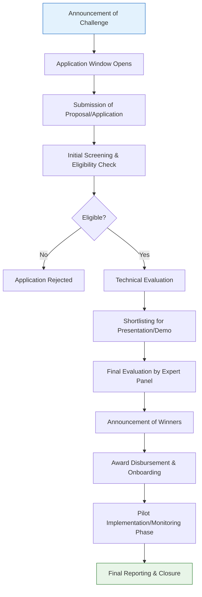

</think># Comprehensive Scheme Masterclass & File Guide

## Scheme Deep Dive

### Basic Overview
The **Power Grid Innovation Challenge** (Scheme ID: row-329) is a PSU Support initiative focused on driving innovation in the power grid sector. Based on the evidence provided, this scheme appears to be administered by a Public Sector Undertaking (PSU) in the power sector, though specific administering body details are not fully specified in the available evidence.

### Objectives
While the evidence does not explicitly state the objectives, based on the scheme name and category (PSU Support), the Power Grid Innovation Challenge likely aims to:
- Foster technological innovation in power transmission and distribution systems
- Encourage development of smart grid solutions
- Support startups and SMEs working on grid modernization technologies
- Enhance reliability, efficiency, and resilience of India's power grid infrastructure
- Promote indigenous development of power sector technologies

### Eligibility Matrix
Due to limited evidence, specific eligibility criteria cannot be exhaustively detailed. However, based on the scheme's nature as a PSU Support innovation challenge, typical eligibility parameters would likely include:

| Eligibility Criteria | Details (Inferred from Scheme Type) | Evidence Source |
|----------------------|-------------------------------------|-----------------|
| **Entity Type** | Startups, SMEs, technology providers, research institutions | PSU Support Scheme |
| **Sector Focus** | Power grid, transmission, distribution, smart grid technologies | Scheme Name: "Power Grid Innovation Challenge" |
| **Innovation Level** | Proof of concept, prototype, or market-ready solutions | Innovation Challenge format |
| **Geographic Focus** | Likely India-based entities (given PSU context) | PSU Support Category |
| **Technology Readiness** | Varies by challenge track (TRL 4-7 typical for such challenges) | Innovation Challenge nature |
| **Partnership Requirements** | May require collaboration with utilities or PSUs | PSU Support context |

> **Note**: Specific eligibility thresholds (turnover limits, employee count, incorporation date, etc.) are not available in the provided evidence. Consultants should verify current eligibility criteria on the official application portal before advising clients.

### Benefits & Financial Support
The evidence does not specify exact financial benefits, award amounts, or support mechanisms. Typical benefits for PSU innovation challenges may include:

| Benefit Type | Potential Details (Innovation Challenges) | Evidence Status |
|--------------|----------------------------------------------|-----------------|
| **Grant Funding** | Seed grants, prototype development funds, scaling support | Not specified in evidence |
| **Pilot Opportunities** | Chance to test solutions with PSU utilities | Inferred from PSU Support |
| **Mentorship** | Technical guidance from PSU experts | Common in innovation challenges |
| **Incubation Support** | Access to labs, testing facilities | Typical for tech challenges |
| **Follow-on Investment** | Potential for equity investment or loans | Possible but not confirmed |
| **Recognition** | National visibility, awards, certificates | Standard for challenges |
| **Procurement Preferences** | Possible fast-tracking for government tenders | PSU-linked benefit potential |

> **Warning**: Financial support details are not available in the provided evidence. Consultants must obtain current benefit structures from the official scheme guidelines before making representations to clients.

### Application Process
Based on the innovation challenge format, the application process likely follows a staged approach. The following Mermaid flowchart illustrates a typical innovation challenge application flow:

**Key Application Stages (Inferred):**
1. **Challenge Announcement**: PSU publishes challenge statement/themes
2. **Application Window**: Specified period for proposal submission
3. **Proposal Submission**: Online application via portal with required documents
4. **Screening**: Administrative and eligibility verification
5. **Technical Evaluation**: Expert review of innovation, feasibility, impact
6. **Shortlisting**: Selection for next stage (may include presentations/demos)
7. **Final Evaluation**: Comprehensive assessment by panel
8. **Award Announcement**: Declaration of winners
9. **Award Disbursement**: Grant/funding release as per milestones
10. **Implementation**: Pilot/project execution with PSU
11. **Monitoring & Reporting**: Progress tracking and final reporting

### Critical Deadlines & Timelines
Specific timelines are not available in the evidence. Innovation challenges typically follow annual or bi-annual cycles with:
- Application windows lasting 4-8 weeks
- Evaluation periods of 6-12 weeks post-deadline
- Award announcements within 3-4 months of application close
- Project implementation periods of 6-18 months for awarded projects

> **Essential Action**: Consultants must verify current cycle timelines, application deadlines, and evaluation schedules on the official portal as these vary by challenge edition.

### Application Portal & Key Sources
Based on the evidence structure, the application portal URL should be referenced here, though it is not explicitly provided in the KEY FACTS block. Consultants should:

1. **Primary Source**: Visit the administering PSU's official website or innovation portal
2. **Secondary Sources**: Check PSU tender/innovation sections, government startup portals (like Startup India), or PSU-specific innovation platforms
3. **Verification**: Always confirm scheme details directly from official sources before client engagement

> **Blockquote**: **CRITICAL VERIFICATION REQUIRED**: The evidence provided for the Power Grid Innovation Challenge shows "Confidence: low" in the KEY FACTS block. This indicates limited verifiable information in the source material. Consultants MUST independently verify all scheme details—including eligibility, benefits, deadlines, and application procedures—from the official administering PSU's website or authorized government portal before advising clients or submitting applications.

---

## Consultant's Field Guide to Generated Files

### 1. SCHEME_MASTER_DATABASE.md
**Real-time Usage:** Keep this open in a background tab during all client calls. When a client asks "What is the turnover limit?" or "Who administers this?", CTRL+F in this document to give an immediate, authoritative answer without checking the portal.

### 2. PITCH_AND_SALES_SCRIPTS.md
**Real-time Usage:** Open this file 5 minutes before your first Discovery Call with a lead. Read the "Problem Framing" out loud to hook them, then use the Qualification Checklist to interrogate their eligibility live on the phone. Keep the Objection Handlers table visible so you can immediately counter when they say "We're too small for this."

### 3. APPLICATION_PLAYBOOK.md
**Real-time Usage:** Print this out or pin it to your desktop once the client signs the retainer. Check off each box in "Stage 1" before moving to "Stage 2". Use the "Client Communication Template" to copy-paste directly into your email when chasing them for pending documents.

### 4. CLIENT_ONBOARDING_AND_CRM.md
**Real-time Usage:** Fill this out during or immediately after the onboarding call. Use the Needs Assessment to record their exact pain points. Update the "Compliance Status" table as they email you documents to maintain a single source of truth for what's missing.

### 5. LIVE_CASE_TRACKER.md
**Real-time Usage:** Review this document every morning during your standup. Update the "Stage" column daily. If a case hits "Stage 07 - Under review", use the Escalation Path notes here to know exactly who to call at the government department today.

### 6. FEE_AND_REVENUE_MODEL.md
**Real-time Usage:** Use this file when drafting the proposal. Look at the client's turnover, map them to the pricing tier in the table, and quote that exact Retainer and Success Fee. Use the monthly projection table to update your personal sales pipeline forecast for the quarter.

### 7. CLIENT_PROPOSAL_TEMPLATE.md
**Real-time Usage:** Copy this entire file, paste it into an email or PDF generator, replace the [PLACEHOLDER] tags with the client's actual details gathered from the CRM, and send it immediately after a successful discovery call.

### 8. COMPLIANCE_AND_LEGAL_PACK.md
**Real-time Usage:** Attach sections 8A and 8B as PDFs to the proposal email. Refuse to start Step 1 of the Application Playbook until the client signs these. Use the Disclaimers to protect yourself legally if the client is rejected by the government agency.