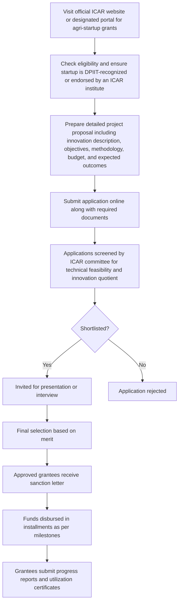

# Comprehensive Scheme Masterclass & File Guide

## Scheme Deep Dive

### Overview
The ICAR – Agri Startup Grants scheme is a grant-based financial support program implemented by the Indian Council of Agricultural Research (ICAR), Ministry of Agriculture and Farmers Welfare, targeting agri-startups across India. The scheme aims to promote innovation and entrepreneurship in agriculture and allied sectors by providing financial grants for prototype development, field trials, and market validation, along with access to ICAR’s research facilities, expert mentorship, and commercialization support. The scheme was last updated in 2026 and operates on a pan-India geographic scope.

### Objectives
- Promote innovation and entrepreneurship in agriculture and allied sectors  
- Support early-stage agri-startups with financial grants for product development and validation  
- Strengthen the linkage between research institutions and agri-based startups  
- Encourage development of sustainable and scalable agri-tech solutions  
- Facilitate technology transfer from ICAR laboratories to the field through startup incubation  
- Enhance income and livelihood opportunities for farmers through startup-led innovations  

### Eligibility Matrix
| Eligibility Criteria | Details |
|----------------------|---------|
| Startup Incorporation | Must be incorporated in India |
| Sector Focus | Working in agriculture and allied sectors (crop improvement, animal husbandry, fisheries, natural resource management, agri-processing) |
| Innovation Requirement | Must have innovative ideas or prototypes |
| Recognition | Must be recognized by DPIIT or recommended by an ICAR institute |
| Prior Funding Limit | Should not have received more than a specified limit of funding from other government sources |
| Preference Criteria | Preference given to startups led by women, SC/ST, or those working in aspirational districts |
| Target Beneficiaries | Agri-startups, startups, entrepreneurs |

### Benefits & Financial Support
| Benefit Category | Details |
|------------------|---------|
| Financial Support | Grant-based support for prototype development, field trials, and market validation; quantum determined by project proposal and innovation stage; disbursed in milestones upon achievement of predefined deliverables; released directly to startup’s account after appraisal and approval by ICAR screening committee |
| Research Facilities | Access to ICAR’s research facilities, laboratories, and expert mentorship |
| Collaboration | Opportunity to collaborate with ICAR scientists and KVKs for validation |
| IPR Assistance | Assistance in intellectual property rights (IPR) filing and technology commercialization |
| Networking | Networking with investors, incubators, and agri-industry partners |
| Visibility | Visibility through ICAR’s platforms and events |

### Application Process

### Required Documents
1. Certificate of Incorporation / Registration  
2. DPIIT startup recognition certificate (if available)  
3. Detailed project proposal  
4. Budget breakdown and utilization plan  
5. Proof of concept or prototype details  
6. PAN card of the startup  
7. Bank account details  
8. Authorization letter from the signatory  
9. Any prior funding or award details  
10. Recommendation letter from an ICAR institute or KVK (if applicable)  

### Key Caveats
> - Grants are subject to technical feasibility and innovation assessment by ICAR  
> - Funds must be utilized strictly for the approved project objectives  
> - Grantees must submit periodic progress reports and utilization certificates  
> - Intellectual property arising from the project may be subject to ICAR’s IPR policy  
> - The scheme does not support pure trading or non-innovative agri-business activities  

### Application Portal
Official ICAR website: https://icar.org.in  

### Sources
- Scheme Key Facts (extracted structured data)  
- Supporting evidence from crawled web pages (https://icar.org.in)  

---

## Consultant's Field Guide to Generated Files

### 1. SCHEME_MASTER_DATABASE.md
**Real-time Usage:** Keep this open in a background tab during all client calls. When a client asks "What is the turnover limit?" or "Who administers this?", CTRL+F in this document to give an immediate, authoritative answer without checking the portal.

### 2. PITCH_AND_SALES_SCRIPTS.md
**Real-time Usage:** Open this file 5 minutes before your first Discovery Call with a lead. Read the "Problem Framing" out loud to hook them, then use the Qualification Checklist to interrogate their eligibility live on the phone. Keep the Objection Handlers table visible so you can immediately counter when they say "We're too small for this."

### 3. APPLICATION_PLAYBOOK.md
**Real-time Usage:** Print this out or pin it to your desktop once the client signs the retainer. Check off each box in "Stage 1" before moving to "Stage 2". Use the "Client Communication Template" to copy-paste directly into your email when chasing them for pending documents.

### 4. CLIENT_ONBOARDING_AND_CRM.md
**Real-time Usage:** Fill this out during or immediately after the onboarding call. Use the Needs Assessment to record their exact pain points. Update the "Compliance Status" table as they email you documents to maintain a single source of truth for what's missing.

### 5. LIVE_CASE_TRACKER.md
**Real-time Usage:** Review this document every morning during your standup. Update the "Stage" column daily. If a case hits "Stage 07 - Under review", use the Escalation Path notes here to know exactly who to call at the government department today.

### 6. FEE_AND_REVENUE_MODEL.md
**Real-time Usage:** Use this file when drafting the proposal. Look at the client's turnover, map them to the pricing tier in the table, and quote that exact Retainer and Success Fee. Use the monthly projection table to update your personal sales pipeline forecast for the quarter.

### 7. CLIENT_PROPOSAL_TEMPLATE.md
**Real-time Usage:** Copy this entire file, paste it into an email or PDF generator, replace the [PLACEHOLDER] tags with the client's actual details gathered from the CRM, and send it immediately after a successful discovery call.

### 8. COMPLIANCE_AND_LEGAL_PACK.md
**Real-time Usage:** Attach sections 8A and 8B as PDFs to the proposal email. Refuse to start Step 1 of the Application Playbook until the client signs these. Use the Disclaimers to protect yourself legally if the client is rejected by the government agency.