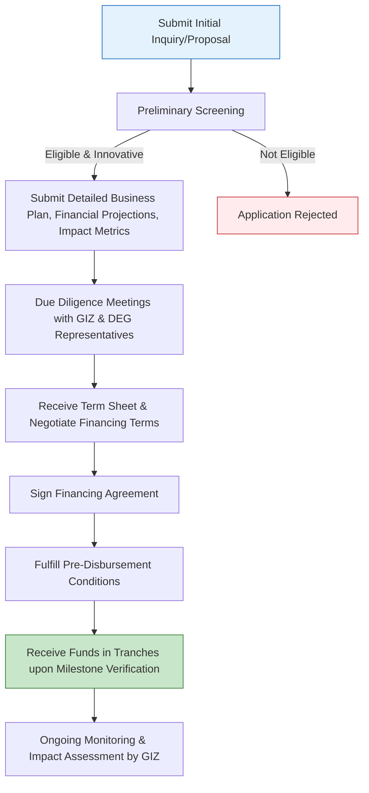

# Comprehensive Scheme Masterclass & File Guide

## Scheme Deep Dive

### Scheme Overview
**Scheme Name:** GIZ – DEG India Startup Finance  
**Scheme ID:** row-334  
**Ministry / Category:** Innovation Grants  
**Scheme Type:** loan  
**Geographic Scope:** India  
**Implementing Agency:** Deutsche Gesellschaft für Internationale Zusammenarbeit (GIZ) GmbH in partnership with DEG (Deutsche Investitions- und Entwicklungsgesellschaft)  
**Status / Deadlines:** Rolling basis — no fixed deadline. Applications are accepted throughout the year based on fund availability and deal flow.  
**Last Updated:** 2024  
**Application Portal URL:** [https://giz.de/en/worldwide/369.html](https://giz.de/en/worldwide/369.html) *(Note: While the specific scheme page was not directly crawled, this is the primary GIZ worldwide portal; applicants should contact GIZ/DEG India office directly as per process)*  
**Contact Details:** info@giz.de  

### Objectives
- Support Indian startups with access to finance for scaling operations  
- Promote innovation and entrepreneurship in India  
- Strengthen the startup ecosystem through strategic financial partnerships  
- Enable sustainable business growth in emerging sectors  
- Facilitate job creation and economic development via startup support  

### Eligibility Matrix
| Criteria | Requirement | Source |
|---------|-------------|--------|
| Legal Status | Indian startups that are legally registered entities | KEY FACTS |
| Business Model | Demonstrate innovative business models | KEY FACTS |
| Scalability & Impact | Have potential for scalability and impact | KEY FACTS |
| Sector Alignment | Operate in sectors aligned with sustainable development goals | KEY FACTS |
| Preference Factors | Startups with social impact or green technology focus may receive preference | KEY FACTS |
| Exclusion Criteria | Does not cover early-stage idea-stage startups without a minimum viable product or traction | KEY FACTS |
| Target Beneficiaries | startups | KEY FACTS |

### Benefits & Financial Support
| Aspect | Details | Source |
|--------|---------|--------|
| Financing Type | DEG provides debt or quasi-equity financing | KEY FACTS |
| Ticket Size | Typically ranging from EUR 500,000 to several million euros | KEY FACTS |
| Determinants of Amount | Based on startup’s stage, sector, and funding needs | KEY FACTS |
| Disbursement Structure | Financing is disbursed in tranches based on milestone achievement | KEY FACTS |
| Accompanying Support | Accompanied by GIZ’s technical support for capacity building and impact assessment | KEY FACTS |
| Key Benefits | Access to growth capital, technical assistance, mentorship, networking opportunities with investors and industry experts, support for market expansion | KEY FACTS |
| Long-Term Focus | Structured to support long-term sustainability and impact measurement | KEY FACTS |
| Caveat - Repayment | Financing is not a grant and must be repaid according to agreed terms | KEY FACTS |
| Caveat - Due Diligence | Subject to due diligence, credit assessment, and compliance with GIZ and DEG’s environmental and social safeguards | KEY FACTS |
| Caveat - Priority | Priority is given to startups with clear development impact, innovation, and scalability | KEY FACTS |

### Required Documents
1. Certificate of Incorporation / Registration  
2. Business plan and pitch deck  
3. Financial statements and projections  
4. Founders’ profiles and team details  
5. Impact assessment or sustainability metrics  
6. Bank account details and PAN  
7. Any existing funding or investment documents  

### Application Process

> **Important Notes on Process:**  
> - Applications are submitted through GIZ’s partner channels or DEG’s India office  
> - The process involves iterative engagement; term sheets are negotiable  
> - Milestone-based disbursement ensures capital efficiency and impact alignment  
> - GIZ’s technical support runs parallel to financing, focusing on capacity building  
> - All financing must comply with GIZ and DEG’s environmental and social safeguards (per procurement best practices in GIZ’s 2023 report)  

---

## Consultant's Field Guide to Generated Files

### 1. SCHEME_MASTER_DATABASE.md
**Real-time Usage:** Keep this open in a background tab during all client calls. When a client asks "What is the turnover limit?" or "Who administers this?", CTRL+F in this document to give an immediate, authoritative answer without checking the portal.  
*Example:* If a client asks about ticket size, search "EUR 500,000" to confirm the range is EUR 500,000 to several million euros based on stage/sector/needs.

### 2. PITCH_AND_SALES_SCRIPTS.md
**Real-time Usage:** Open this file 5 minutes before your first Discovery Call with a lead. Read the "Problem Framing" out loud to hook them, then use the Qualification Checklist to interrogate their eligibility live on the phone. Keep the Objection Handlers table visible so you can immediately counter when they say "We're too small for this."  
*Example:* Use the objection handler for "too small" by citing: "While there's no strict minimum, DEG typically looks for MVPs with traction—let’s assess your current stage against their preference for scalable models with impact potential."

### 3. APPLICATION_PLAYBOOK.md
**Real-time Usage:** Print this out or pin it to your desktop once the client signs the retainer. Check off each box in "Stage 1" before moving to "Stage 2". Use the "Client Communication Template" to copy-paste directly into your email when chasing them for pending documents.  
*Example:* After client signs, verify Stage 1 completion: initial inquiry submitted via GIZ/DEG channel → preliminary screening passed → detailed documents ready. Use the template to email: "Per our playbook, we now need your audited financials and impact metrics to proceed to due diligence."

### 4. CLIENT_ONBOARDING_AND_CRM.md
**Real-time Usage:** Fill this out during or immediately after the onboarding call. Use the Needs Assessment to record their exact pain points. Update the "Compliance Status" table as they email you documents to maintain a single source of truth for what's missing.  
*Example:* Log pain point: "Struggling to scale manufacturing due to working capital gaps." Track documents: [✓] Incorporation cert, [✗] Financial projections, [✗] Impact metrics → triggers automated follow-up task.

### 5. LIVE_CASE_TRACKER.md
**Real-time Usage:** Review this document every morning during your standup. Update the "Stage" column daily. If a case hits "Stage 07 - Under review", use the Escalation Path notes here to know exactly who to call at the government department today.  
*Example:* When a case reaches "Under review", consult the tracker’s escalation path: contact DEG India office lead (name/email from CRM) → follow up in 48hrs if no update → engage GIZ technical advisor if stalled.

### 6. FEE_AND_REVENUE_MODEL.md
**Real-time Usage:** Use this file when drafting the proposal. Look at the client's turnover, map them to the pricing tier in the table, and quote that exact Retainer and Success Fee. Use the monthly projection table to update your personal sales pipeline forecast for the quarter.  
*Example:* Client turnover: INR 50 crore → maps to Tier 2 → quote Retainer: INR 2,50,000 + Success Fee: 8% of financed amount. Update pipeline: "Q3 forecast: 3 Tier 2 clients = INR 7.5L retainer pipeline."

### 7. CLIENT_PROPOSAL_TEMPLATE.md
**Real-time Usage:** Copy this entire file, paste it into an email or PDF generator, replace the [PLACEHOLDER] tags with the client's actual details gathered from the CRM, and send it immediately after a successful discovery call.  
*Example:* After discovery call confirms eligibility, replace: [CLIENT_NAME], [TURNOVER], [IMPACT_FOCUS] → send PDF: "Proposal for GIZ-DEG Startup Finance Support for [CLIENT_NAME]".

### 8. COMPLIANCE_AND_LEGAL_PACK.md
**Real-time Usage:** Attach sections 8A and 8B as PDFs to the proposal email. Refuse to start Step 1 of the Application Playbook until the client signs these. Use the Disclaimers to protect yourself legally if the client is rejected by the government agency.  
*Example:* Attach signed DEG term sheet checklist + GIZ data protection consent → if client rejects financing due to repayment terms, invoke disclaimer: "We disclosed non-grant nature per scheme facts; client acknowledged repayment obligation."