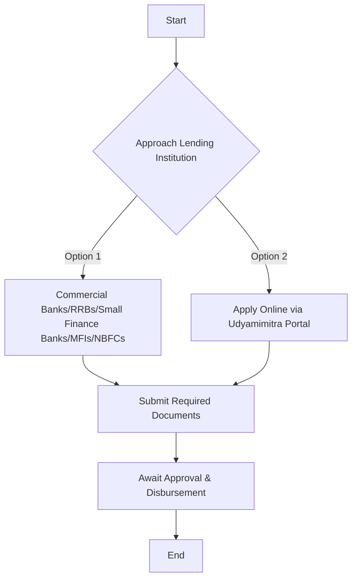

# Comprehensive Scheme Masterclass & File Guide

## Scheme Deep Dive

### Scheme Overview
**Scheme Name:** Mudra Shishu Loans for Women (Under PMMY)  
**Scheme ID:** row-335  
**Ministry / Category:** Women Entrepreneurship  
**Scheme Type:** loan  
**Geographic Scope:** Pan-India  
**Implementing Agency:** Micro Units Development & Refinance Agency Ltd. (MUDRA)  
**Application Portal:** https://www.udyamimitra.in  
**Status / Deadlines:** Rolling basis  
**Last Updated:** 2026  
**Max Per Entity:** Up to ₹50,000  

### Objectives
- To create an inclusive, sustainable and value-based entrepreneurial culture  
- To provide funding support to the non-corporate small business sector through last-mile financial institutions  
- To extend refinance support to Banks, NBFCs, and MFIs for lending to micro units  
- To monitor the implementation of PMMY through a dedicated portal  
- To facilitate credit access for women entrepreneurs and weaker sections (SC/ST/OBC)  
- To promote financial inclusion and livelihood generation at the grassroots level  

### Eligibility Matrix
| Criteria | Details |
|---------|---------|
| **Target Beneficiaries** | Women entrepreneurs; micro enterprises; small businesses; non-corporate entities |
| **Eligibility** | Any Indian Citizen who has a business plan for a non-farm income generating activity such as manufacturing, processing, trading or service sector whose credit need is up to 20 lakh can approach either a Bank, MFI or NBFC for availing of MUDRA loans under PMMY. The usual terms and conditions of the lending agency may have to be followed for availing of loans under PMMY. |
| **Loan Categories** | Shishu (up to ₹50,000), Kishor (above ₹50,000 and up to ₹5 lakh), Tarun (above ₹5 lakh and up to ₹10 lakh), Tarun Plus (above ₹10 lakh and up to ₹20 lakh) |
| **Restrictions** | Loans are restricted to non-farm income generating activities |
| **Special Focus** | Shishu category covers loans up to ₹50,000 only; interest subvention schemes for specific categories (e.g., 2% for Shishu loans under Aatmanirbhar Bharat Package) |

### Benefits & Financial Support
| Benefit Type | Details |
|--------------|---------|
| **Financial Support** | MUDRA provides refinance support to Banks/NBFCs/MFIs for lending to micro units having loan requirements up to ₹20 lakh. The refinance is available for term loan and working capital loan up to an amount of ₹20 lakh per unit. MUDRA does not exceed the sanctioned limit. |
| **Max Loan Amount** | Up to ₹20 lakh per unit under PMMY (Shishu category: up to ₹50,000) |
| **Access Channels** | Through Banks, NBFCs, and MFIs; online application via Udyamimitra portal |
| **No Middlemen** | No agents or middlemen engaged by MUDRA for availing of Mudra Loans |
| **Interest Subvention** | 2% for Shishu loans under Aatmanirbhar Bharat Package |
| **Eligible Sectors** | Manufacturing, processing, trading, service, and agri-allied sectors |
| **Collateral** | Collateral-free loans |
| **Additional Support** | MUDRA Card (debit card against MUDRA loan account for working capital portion) |

### Application Process

**Required Documents:**
1. Certificate of Incorporation / Registration  
2. PAN of the entity  
3. Pitch deck or business description  
4. Authorization letter from authorized signatory  
5. Details of funding received (if any)  

**Key Caveats:**
- MUDRA does not lend directly to micro entrepreneurs/individuals; it provides refinance to lending institutions  
- There are no agents or middlemen engaged by MUDRA for availing of Mudra Loans  
- Borrowers are advised to keep away from persons posing as Agents/facilitators of MUDRA/PMMY  
- Loans are restricted to non-farm income generating activities  
- The Shishu category covers loans up to ₹50,000 only  

### Performance Data (FY 2022-23)
- **Total Disbursement:** ₹4.50 lakh crore  
- **Total Loan Accounts:** 6.23 crore  
- **Average Loan Size:** ₹72,286.85  
- **Women Beneficiaries:** 71.03% of accounts, 47.74% of disbursed amount  
- **Weaker Sections (SC/ST/OBC):** 50.48% of accounts, 36.41% of disbursed amount  
- **New Entrepreneur Accounts:** 16.16% of accounts, 28.73% of disbursed amount  

> **> Important:** The scheme operates on a rolling basis with no fixed deadlines. Applications are processed continuously throughout the year.

## Consultant's Field Guide to Generated Files

### 1. SCHEME_MASTER_DATABASE.md
**Real-time Usage:** Keep this open in a background tab during all client calls. When a client asks "What is the turnover limit?" or "Who administers this?", CTRL+F in this document to give an immediate, authoritative answer without checking the portal.

### 2. PITCH_AND_SALES_SCRIPTS.md
**Real-time Usage:** Open this file 5 minutes before your first Discovery Call with a lead. Read the "Problem Framing" out loud to hook them, then use the Qualification Checklist to interrogate their eligibility live on the phone. Keep the Objection Handlers table visible so you can immediately counter when they say "We're too small for this."

### 3. APPLICATION_PLAYBOOK.md
**Real-time Usage:** Print this out or pin it to your desktop once the client signs the retainer. Check off each box in "Stage 1" before moving to "Stage 2". Use the "Client Communication Template" to copy-paste directly into your email when chasing them for pending documents.

### 4. CLIENT_ONBOARDING_AND_CRM.md
**Real-time Usage:** Fill this out during or immediately after the onboarding call. Use the Needs Assessment to record their exact pain points. Update the "Compliance Status" table as they email you documents to maintain a single source of truth for what's missing.

### 5. LIVE_CASE_TRACKER.md
**Real-time Usage:** Review this document every morning during your standup. Update the "Stage" column daily. If a case hits "Stage 07 - Under review", use the Escalation Path notes here to know exactly who to call at the government department today.

### 6. FEE_AND_REVENUE_MODEL.md
**Real-time Usage:** Use this file when drafting the proposal. Look at the client's turnover, map them to the pricing tier in the table, and quote that exact Retainer and Success Fee. Use the monthly projection table to update your personal sales pipeline forecast for the quarter.

### 7. CLIENT_PROPOSAL_TEMPLATE.md
**Real-time Usage:** Copy this entire file, paste it into an email or PDF generator, replace the [PLACEHOLDER] tags with the client's actual details gathered from the CRM, and send it immediately after a successful discovery call.

### 8. COMPLIANCE_AND_LEGAL_PACK.md
**Real-time Usage:** Attach sections 8A and 8B as PDFs to the proposal email. Refuse to start Step 1 of the Application Playbook until the client signs these. Use the Disclaimers to protect yourself legally if the client is rejected by the government agency.